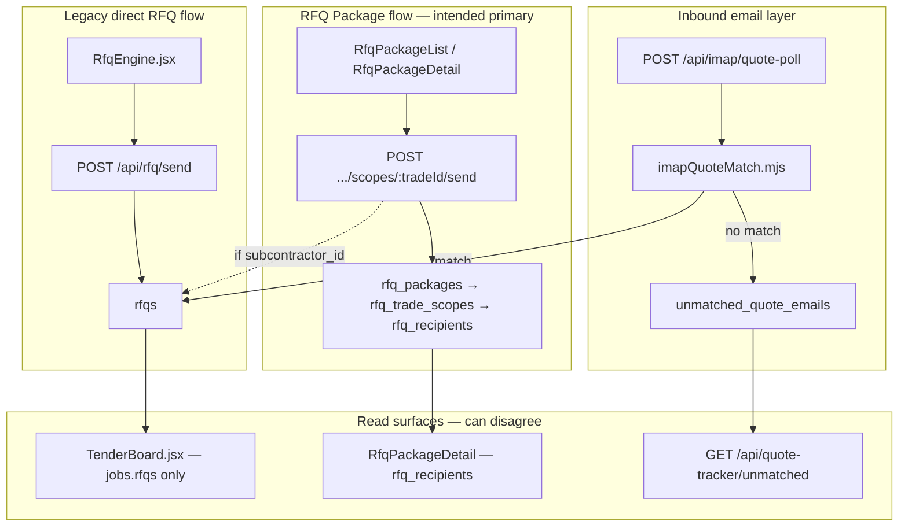
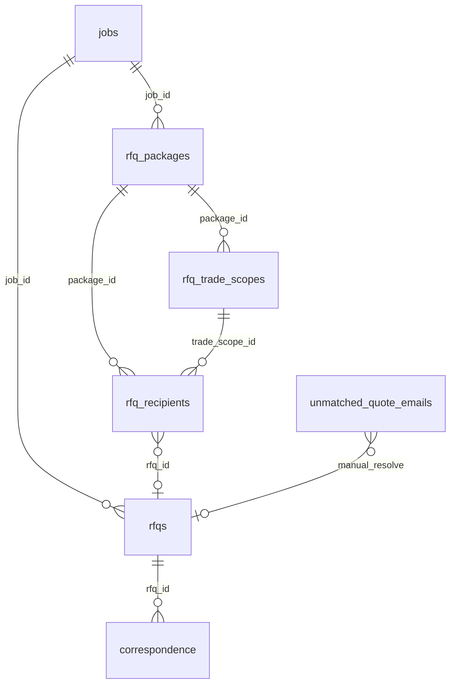

# Blue Leaf Hub — 30-Day Hardening Roadmap (RFQ/Tendering Focus)

**Sources:** External review (2026-06-24), user source-of-truth model, existing [docs/qa/](docs/qa/)  
**Principle:** Declare ownership, enforce with tests, smallest-safe fixes only. **No rewrite.**

**Current phase:** Batch A P0 complete · Batch B W06 mapped (mapping only — **stop after W06**)

**Batch B gate:** [BATCH_A_HARDENING_RESULT.md](docs/qa/BATCH_A_HARDENING_RESULT.md) §9 satisfied 2026-06-25. **No Batch B implementation.** No P1/P2. No Tender Board redesign.

**Batch B mapping priority (refined 2026-06-25):**

1. W06 — confirm API/UI package shape (W06-DRIFT-001 camelCase visibility)
2. Do not attempt matcher fixes until W06 package visibility proven
3. W07 — transport + Message-ID + reply matching (W07-DRIFT-001–005)
4. W08 — quote acceptance grounded in W07 state
5. W09 — win handoff

**Pre-confirmed parking lot (code-verified):** [BUG_REGISTER.md](docs/qa/BUG_REGISTER.md) § Batch B parking lot

| ID | Status in current repo |
|----|------------------------|
| W06-DRIFT-001 camelCase vs snake_case | **confirmed** |
| W06-DRIFT-002 package after send | **confirmed** |
| W07-DRIFT-001 package `sent_message_id` | **partially fixed** (rfqPackageRoutes; Resend/email-only gaps) |
| W07-DRIFT-002 email-only recipients | **confirmed** |
| W07-DRIFT-003 inbound → package propagation | **partially fixed** (`applyInboundQuoteToWorkflow` when linked) |
| W07-DRIFT-004 Resend no mailbox Sent | **confirmed** |
| W07-DRIFT-005 Resend strips Message-ID | **confirmed** |

**Start command (mapping):** `/harden map W06` — stop after W06. Next: `/harden map W07` only after W06 review.

**Control doc:** [docs/qa/30_DAY_HARDENING_TRACKER.md](docs/qa/30_DAY_HARDENING_TRACKER.md) — mapping/tests/fixes/release readiness by workflow. **Not permission to code.**

**Execution rhythm (Days 1–30):**

| Days | Focus | Code? |
|------|-------|-------|
| 1–5 | Batch A mapping W01–W05 | No product code |
| 6–8 | Batch A review; P0 fixes approved; W01–W05 test skeletons | Tests only if approved |
| 9–14 | Batch B mapping W06–W07; RFQ email baseline tests | No fixes until Batch B reviewed |
| 15–20 | RFQ/tender P0 fixes | Approved P0 only |
| 21–25 | Procurement, schedule, finance/portal smoke | P1 as approved |
| 26–30 | Regression, security sweep, release readiness | As approved |

---

## Executive diagnosis (RFQ-specific)

The RFQ/tendering pain is **not one isolated matcher bug**. Three overlapping systems share the same domain without a enforced write path:



### Code-verified drift risks (document in Phase 1)

| Risk | Evidence | Impact |
|------|----------|--------|
| **Package send lacks `sent_message_id`** | [rfqPackageRoutes.mjs](server/lib/rfqPackageRoutes.mjs) `scopes/:tradeId/send` calls `sendPlainMail` without `Message-ID` header; `rfqs` insert has no `sent_message_id` | IMAP `matchBySentMessageId` cannot match package sends — **primary miss cause** |
| **Legacy send sets `sent_message_id`** | [dev-api.mjs](server/dev-api.mjs) `POST /api/rfq/send` uses `generateOutboundMessageId()` + updates `rfqs.sent_message_id` | Old RfqEngine path matchable; package path often not |
| **IMAP match updates `rfqs` only** | [dev-api.mjs](server/dev-api.mjs) `processIncomingQuoteMessage` updates `rfqs` + `correspondence`; **no** `rfq_recipients` / scope / package rollup | Quote "received" on Tender Board but not on Package Detail |
| **Email-only recipients have no `rfqs` row** | Package send comment H1: ad-hoc emails tracked via `rfq_recipients` only | Invisible to IMAP candidate query (`fetchOpenRfqCandidates` reads `rfqs` only) |
| **Manual resolve updates `rfqs` only** | [jobsApiRoutes.mjs](server/lib/jobsApiRoutes.mjs) `POST /api/unmatched-quotes/resolve` | Package UI stale after manual match |
| **TenderBoard reads `jobs.rfqs` only** | [TenderBoard.jsx](src/pages/TenderBoard.jsx) nested `rfqs` select | Package-only progress invisible on board |
| **Two entry UIs** | [RfqEngine.jsx](src/pages/RfqEngine.jsx) creates package then navigates OR sends via `/api/rfq/send` | Staff may use either path inconsistently |

---

## Source-of-truth model (declared ownership)

| Table | Owns | Does NOT own |
|-------|------|--------------|
| **`jobs`** | Tender/project record: address, client, `status` (tendering/won/lost), won/lost lifecycle | Per-trade scope text, per-recipient send state |
| **`rfq_packages`** | Tender RFQ package: package status, `tender_deadline`, extraction/PDF metadata, coverage score | Individual email bodies, quote amounts |
| **`rfq_trade_scopes`** | Trade scope: inclusions/exclusions/questions, scope `status`, `due_date` | Outbound Message-ID, attachment storage |
| **`rfq_recipients`** | Invitation + response: subcontractor, sent/quoted/accepted status, `quote_amount`, link to `rfqs` via `rfq_id` | Canonical job address (read from package/job) |
| **`rfqs`** | Email/quote **transaction layer**: `sent_message_id`, IMAP matching, `quoted_amount`, PDF paths, `correspondence` link | Package structure, trade scope bullets |
| **`unmatched_quote_emails`** | Safety-net queue for inbound emails without confident match — **normal workflow**, not error state | Long-term quote storage (resolves into `rfqs`) |

**Required principle:**

- **`rfq_packages` + children = main workflow UI**
- **`rfqs` = email/quote transaction layer** (must stay in sync on every inbound/outbound event)
- **`TenderBoard` = job-level overview** (aggregates from `rfqs` today — document whether it should also rollup packages)
- **`unmatched_quote_emails` = first-class queue**

---

## RFQ/Tendering hardening — 7 phases (sequential gate)

### Phase 1 — Document before any code (IMMEDIATE NEXT TASK)

**Gate:** No app logic edits until [docs/qa/RFQ_TENDER_WORKFLOW_SOURCE_OF_TRUTH.md](docs/qa/RFQ_TENDER_WORKFLOW_SOURCE_OF_TRUTH.md) exists and is reviewed.

Create/update in [docs/qa/](docs/qa/):

| File | Contents |
|------|----------|
| **`RFQ_TENDER_WORKFLOW_SOURCE_OF_TRUTH.md`** (new, primary) | See outline below |
| [TENDER_EMAIL_TEST_PLAN.md](docs/qa/TENDER_EMAIL_TEST_PLAN.md) | 20 scenarios with expected behaviour column |
| [WORKFLOW_TEST_MATRIX.md](docs/qa/WORKFLOW_TEST_MATRIX.md) | RFQ rows: flow → screen → route → test → status |
| [BUG_REGISTER.md](docs/qa/BUG_REGISTER.md) | Pre-register drift items (DRIFT-001..n) from table above |

**`RFQ_TENDER_WORKFLOW_SOURCE_OF_TRUTH.md` required sections:**

1. **What the code currently does** — three flows with file/route citations
2. **What the workflow should be** — package-primary, rfqs as transaction layer
3. **Table ownership** — model above + schema refs ([030_rfq_packages.sql](supabase/migrations/030_rfq_packages.sql), `rfq_recipients.rfq_id`)
4. **Screen ownership**

   | Screen | Primary tables | Send route | Read route |
   |--------|----------------|------------|------------|
   | [RfqEngine.jsx](src/pages/RfqEngine.jsx) | `rfqs`, creates `rfq_packages` | `/api/rfq/send`, `/api/rfq-packages` POST | `/api/rfq/extract` |
   | [RfqPackageList/Detail](src/pages/RfqPackageDetail.jsx) | package tables | `/api/rfq-packages/:id/scopes/:tradeId/send` | `/api/rfq-packages/:id` |
   | [TenderBoard.jsx](src/pages/TenderBoard.jsx) | `jobs` + `rfqs` | — | Supabase direct |
   | [TenderDetail.jsx](src/pages/TenderDetail.jsx) | `jobs`, `rfqs` | accept/notify via package + module routes | mixed |
   | Unmatched UI | `unmatched_quote_emails` | — | `GET /api/quote-tracker/unmatched` |

5. **Route ownership**

   | Route | Owner file | Auth | Writes |
   |-------|------------|------|--------|
   | `POST /api/rfq/send` | [dev-api.mjs](server/dev-api.mjs) | requireAuth | `rfqs`, `correspondence` |
   | `POST /api/rfq-packages/*` | [rfqPackageRoutes.mjs](server/lib/rfqPackageRoutes.mjs) | requireAuth | package tables, optional `rfqs` |
   | `POST /api/imap/quote-poll` | [dev-api.mjs](server/dev-api.mjs) | admin | `rfqs`, `correspondence`, `unmatched_quote_emails` |
   | `POST /api/unmatched-quotes/resolve` | [jobsApiRoutes.mjs](server/lib/jobsApiRoutes.mjs) | requireAuth | `rfqs`, deletes unmatched |
   | `GET /api/quote-tracker/unmatched` | dev-api.mjs | **needs auth** | read |

6. **Known drift risks** — table above + relationship diagram
7. **Tests required before fixes** — Phases 3, 5, 7 acceptance list
8. **Smallest safe fix proposal** (no implementation yet):
   - **DRIFT-001:** Package send must stamp `sent_message_id` on `rfqs` (same as legacy send)
   - **DRIFT-002:** `processIncomingQuoteMessage` must call shared `applyInboundQuoteToWorkflow(rfqId, payload)` updating `rfqs` + linked `rfq_recipients` + scope/package rollup
   - **DRIFT-003:** `unmatched-quotes/resolve` must use same helper
   - **DRIFT-004:** Document email-only recipients: matcher cannot auto-match without `rfqs` row — queue or create stub `rfqs` on send (decision required)

**Relationship diagram to include:**



---

### Phase 2 — Diagnostic tracing (before matcher logic changes)

Add structured trace logging (not `console.log` soup) for:

- `POST /api/imap/quote-poll` → per message in [dev-api.mjs](server/dev-api.mjs) `processIncomingQuoteMessage`
- [imapQuoteMatch.mjs](server/lib/imapQuoteMatch.mjs) `resolveInboundRfqMatch`

**Trace object fields (JSON, one line per email):**

```
email_uid, from_email, subject, message_id, in_reply_to, references,
attachment_count, attachment_types,
candidate_rfq_count, candidate_rfq_ids,
linked_recipient_id, linked_package_id (if resolvable via rfq_recipients.rfq_id),
match_method, match_reason, confidence,
result: matched|unmatched|duplicate|parse_failed,
rows_updated: { rfqs, rfq_recipients, rfq_trade_scopes, rfq_packages, correspondence, unmatched }
```

Env flag: `RFQ_MATCH_DEBUG=true` (default off in prod). Optional: persist to `trade_communication_log` or new `rfq_match_traces` table — **decide in Phase 1 doc**, default to structured logs first.

---

### Phase 3 — Unit tests before logic changes

**File:** [scripts/test-imap-quote-match.mjs](scripts/test-imap-quote-match.mjs) (Node script, no live IMAP)

| # | Scenario | Define expected in TENDER_EMAIL_TEST_PLAN |
|---|----------|----------------------------------------|
| 1 | Exact In-Reply-To → `sent_message_id` | match `in_reply_to` |
| 2 | References chain | match `in_reply_to` |
| 3 | Subject contains project address | `subject_address` |
| 4 | Sender = subcontractor email | `sender_subcontractor` |
| 5 | Supplier replies from admin/account email | **document:** match or unmatched |
| 6 | Forwarded quote, changed subject | likely unmatched |
| 7 | Quote PDF, no RFQ ID in subject | fuzzy or unmatched |
| 8 | Revised quote same thread | In-Reply-To |
| 9 | Multiple RFQs same supplier | collision — best score wins |
| 10 | Multiple suppliers same trade | pick correct job+trade |
| 11 | Wrong project address | **must not match** |
| 12 | No confident match | null → unmatched queue |
| 13 | Manual resolve | integration: updates correct `rfqs` (+ recipients after Phase 4) |
| 14 | Duplicate `message_id` | skip idempotent |
| 15 | Poll re-run | idempotent |
| 16 | Failed PDF parse | rfq still `received`, amount null, reason logged |
| 17 | Attachment present, extraction fails | partial update |
| 18 | Different email thread | unmatched |
| 19 | Paul/Sam separate sender variants | document business rule |
| 20 | Same project name two jobs | **must not cross-match** |

**Rule:** Do not force all 20 to pass. Record `expected | actual | gap` in WORKFLOW_TEST_MATRIX.

---

### Phase 4 — Fix data drift (smallest safe, after Phase 1 map + Phase 3 baseline)

**Gate:** Regression test proving cross-screen consistency before merge.

When inbound quote is processed (auto-match or manual resolve), **one write helper** must update:

1. `rfqs` (status, amounts, PDF, `received_at`) — already done
2. `rfq_recipients` where `rfq_id = rfq.id` (status `received`, `quote_amount`, `quote_received_at`, `quote_pdf_path`)
3. `rfq_trade_scopes.status` rollup if all recipients quoted
4. `rfq_packages` coverage/status via existing `recomputePackageCoverage` in [rfqPackageRoutes.mjs](server/lib/rfqPackageRoutes.mjs)
5. TenderBoard-visible `rfqs` state (already if step 1 works)

**Schema check before coding:**

- Confirm `rfq_recipients.rfq_id` populated on all package sends with `subcontractor_id` ([rfqPackageRoutes.mjs:702](server/lib/rfqPackageRoutes.mjs))
- Confirm no missing migration for `sent_message_id` on package-created `rfqs`
- **Do not add columns** until registered in fact dictionary if canonical — prefer linking existing `rfq_id`

**Package send fix (DRIFT-001):** Mirror legacy send — `generateOutboundMessageId()`, set header on mail, store on `rfqs.sent_message_id` at insert/update.

---

### Phase 5 — Unmatched queue as first-class workflow (high priority E2E)

**Tests** ([e2e/tests/workflows/unmatched-quote-resolve.spec.js](e2e/tests/workflows/unmatched-quote-resolve.spec.js) + API):

1. Email cannot be confidently matched → row in `unmatched_quote_emails`
2. Appears in `GET /api/quote-tracker/unmatched` (admin auth)
3. Admin assigns to correct `rfqId` (+ package/recipient when Phase 4 lands)
4. Quote status/amount on `rfqs`
5. `rfq_recipients` updated (Phase 4)
6. TenderBoard count updates
7. Unmatched row resolved/deleted
8. Action auditable (correspondence `logged_by: manual-match` today; consider `resolved_at` column vs delete — **document in Phase 1**)

Seed: extend [scripts/seed-rfq-tender.mjs](scripts/seed-rfq-tender.mjs) with unmatched row + sent RFQ with `sent_message_id`.

---

### Phase 6 — No god-file splits this month

**Allowed:** targeted fixes, tests, logs, docs, auth, linking, safer matching  
**Not allowed:** redesign RFQ UI, rename routes/tables, rebuild tender module, large abstractions

Deferred splits (post-acceptance): [RfqEngine.jsx](src/pages/RfqEngine.jsx), [TenderDetail.jsx](src/pages/TenderDetail.jsx), route file extraction to `server/lib/rfq/*Service.mjs`

---

### Phase 7 — RFQ/tender acceptance criteria

**"Stable enough" only when all true:**

1. RFQ package creatable (API seed + UI smoke)
2. Trade scopes addable
3. Recipients selectable
4. RFQ send works (package path)
5. Outbound email creates reliable matching metadata (`sent_message_id`)
6. Matched inbound updates **all** relevant records (Phase 4)
7. Unmatched appears in queue (not silent loss)
8. Manual resolve works end-to-end
9. TenderBoard reflects quote status
10. Accepted quote available for procurement handover
11. Tests exist for 1–10
12. BUG_REGISTER records remaining gaps with regression test IDs

---

## 30-day calendar (RFQ-first)

### Week 1 — RFQ Phases 1–3 + parallel hygiene/security

| Days | RFQ track | Parallel |
|------|-----------|----------|
| 1–2 | **Phase 1:** `RFQ_TENDER_WORKFLOW_SOURCE_OF_TRUTH.md` + matrix/register | Root artifacts → `archive/` |
| 2–3 | **Phase 2:** Match trace logging | Tier-0 auth fixes ([ADVERSARIAL_AUDIT](docs/qa/ADVERSARIAL_AUDIT_2026-06-23.md)) |
| 3–5 | **Phase 3:** `test-imap-quote-match.mjs` + seed-rfq-tender | ENDPOINT_OWNERSHIP, DEBUGGING_RULES |

### Week 2 — RFQ Phases 4–5 + procurement

| Days | Work |
|------|------|
| 6–8 | **Phase 4:** Verify W07-DRIFT-001/003 partial fixes + W06-DRIFT-001 UI camelCase (after W06/W07 maps) |
| 8–10 | **Phase 5:** Unmatched E2E + cross-screen regression test |
| 10–12 | Accepted quote → procurement item → draft PO (blocked on RFQ acceptance items 9–10) |

### Week 3 — Finance, portal, CI

- Finance/progress claims, portal variation lifecycle
- Staff role boundary tests
- CI: unit matcher + adversarial + Playwright RFQ specs

### Week 4 — WHS/workforce + Phase 7 sign-off

- WHS/workforce/carpentry smoke (unchanged from prior plan)
- **Phase 7** acceptance review → [RELEASE_READINESS.md](docs/qa/RELEASE_READINESS.md)
- Update [e2e-test-report.md](docs/qa/e2e-test-report.md) — honest pass/fail/missing

---

## Operating rules

1. **Phase 1 doc is a hard gate** — no RFQ code until written
2. Tests before matcher changes; trace before guessing
3. No bug closed without regression test in BUG_REGISTER
4. Smallest safe fix — one drift item per PR where possible
5. Uncertain → log finding, stop

---

## Success metrics (day 30)

| Metric | Target |
|--------|--------|
| `RFQ_TENDER_WORKFLOW_SOURCE_OF_TRUTH.md` | Complete, reviewed |
| DRIFT-001 (package `sent_message_id`) | Partially fixed — verify Resend + email-only gaps (W07-DRIFT-001/005) |
| DRIFT-002 (inbound rollup) | Partially fixed — verify unlinked recipients (W07-DRIFT-003) |
| 20 matcher scenarios | All defined; gaps logged |
| Unmatched workflow tests | 8/8 implemented |
| Phase 7 acceptance | ≥10/12 with remainder in BUG_REGISTER |
| God-file splits | 0 |
| New product features | 0 |

---

## Immediate next action (when execution approved)

**Batch A:** Complete — see [BATCH_A_HARDENING_RESULT.md](docs/qa/BATCH_A_HARDENING_RESULT.md).

**Batch B (mapping only):** Review W06 map → `/harden map W07` when approved. **No fixes.**

Pre-tracker code already landed (verify during W07 map):

- [`rfqPackageRoutes.mjs`](server/lib/rfqPackageRoutes.mjs) — package send stores `sent_message_id` when rfqs row created
- [`rfqQuotePropagation.mjs`](server/lib/rfqQuotePropagation.mjs) — `applyInboundQuoteToWorkflow` on IMAP match
- [`resendSend.mjs`](server/lib/resendSend.mjs) — strips Message-ID (W07-DRIFT-005)

Then Phase 2 tracing and Phase 3 unit tests before any matcher changes.
