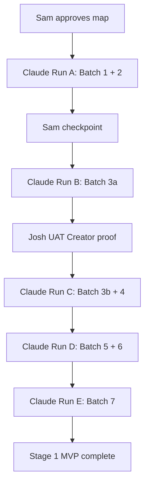

# Marketing Command Centre — End-to-End Rebuild Map

> **Migration file banner:** Do not create `111_*.sql` or `122_*.sql` **during hardening freeze**. Marketing MVP migration = planned `122_marketing_command_centre_mvp.sql` **when Run A reopens** — re-check next available number.

> **HARDENING FREEZE:** Run A **parked** until post P0/P1 hardening. Planned, not cancelled. See [SAM-MKT-001](../qa/SAM_DECISION_LOG.md) · [MARKETING_RUN_A_FREEZE_PARKING_RESULT.md](./MARKETING_RUN_A_FREEZE_PARKING_RESULT.md).

**Map ID:** MARKETING-END-TO-END-REBUILD-MAP-01  
**Date:** 2026-06-22  
**Author:** Cursor (product architect / system mapper)  
**Status:** **PARKED** — no implementation during Go-Live P0/P1 hardening freeze  
**Mode:** Planning only — **no implementation approved during freeze**

**Parent documents:**

- [MARKETING_COMMAND_CENTRE_REBUILD_PLAN.md](./MARKETING_COMMAND_CENTRE_REBUILD_PLAN.md) — direction accepted, not build-approved
- [MARKETING_CONTENT_CREATOR_UX_REDESIGN.md](./MARKETING_CONTENT_CREATOR_UX_REDESIGN.md) — direction accepted, not build-approved

**Implementation status:** **All batches parked** during hardening freeze. Claude must not start Run A until Sam reopens after P0/P1 checkpoints ([SAM-MKT-001](../qa/SAM_DECISION_LOG.md)).

---

## 1. Executive decision state

### 1.1 Approved as direction (not build approval)

| Item | Status |
|---|---|
| Product = **Marketing Command Centre** (not generic AI writer) | Direction accepted |
| Core UX principle: **“The asset is the brief.”** | Direction accepted |
| Media-first Creator as primary Content Studio | Direction accepted |
| Secondary **Create from idea** path | Direction accepted |
| Three-column Creator layout (asset · decisions · package) | Direction accepted |
| Angle cards, Josh labels, content packages | Direction accepted |
| Batch split: 3a proof + 3b full package | Direction accepted |
| Batch 1 routing: `/marketing/studio` = shell; `/marketing/studio/legacy` = `ContentGenerator` | Direction accepted |
| Stages 2–6 power features (automation, publish API, paid, drone advanced, video editor) | Planned, not discarded |
| Preserve existing marketing code until Creator ships | Direction accepted |

### 1.2 Not approved for implementation

| Item | Status |
|---|---|
| Batch 1 — Command Centre + Creator shell | **Not approved** |
| Batch 2 — Weekly Planner + templates | **Not approved** |
| Batch 3a / 3b — Content Creator | **Not approved** |
| Batches 4–7 | **Not approved** |
| Marketing MVP migration (`122`) land | **Not approved** |
| Any product code changes | **Not approved** |
| Any schema / route changes | **Not approved** |
| Commits / deploys | **Not approved** |

### 1.3 Blocked until resolved

- Sam review and approval of **this map**
- Josh role decision (admin vs dedicated marketing role)
- Sam approval policy for client-facing content
- MVP channel set (IG+FB primary?)
- Marketing MVP migration stub-table strategy confirmation
- Legacy routing regression test plan before Batch 1 code

### 1.4 What Claude must NOT build yet

- Auto-posting / platform API publish (Stage 3)
- Paid ad optimisation (Stage 4)
- GPS / waypoint drone automation (Stage 5 later)
- Timeline video editor (Stage 6)
- Full automation hub (Stage 2)
- Any W17 / W18 product changes
- Dropping legacy `ContentGenerator` before Batch 3b complete

---

## 2. Product vision and operating principles

### 2.1 Vision

The **Blue Leaf Marketing Command Centre** is Josh’s weekly marketing operating system: proof-based content from real projects, AI-assisted decisions, human approval, campaign rhythm, evergreen library, intelligence feedback, and lead quality improvement — without black-box automation.

### 2.2 Operating principles

| Principle | Meaning |
|---|---|
| **Proof-based** | Real photos, drone footage, progress, details, transformations |
| **Media-first default** | Asset drives angles, campaign fit, and drafts |
| **Idea-first allowed** | Educational topics without media; attach proof before approve/schedule |
| **AI assists, humans control** | No auto-post in Stage 1; Josh/Sam approve external content |
| **Transparent** | Why, risk, source asset, audience, campaign always visible |
| **Professional UX** | Guided, not dumbed down; not a generic AI writer |
| **Weekly rhythm** | ≤30 min/week target once Stage 1 complete |
| **Lead quality** | Content tied to attribution and qualifying topics |
| **Future-ready** | Schema and routes reserve Stages 2–6 without building them now |

### 2.3 Operating loop

```
Capture → Sort → Generate → Review → Schedule → Publish → Measure → Learn → Recommend
```

### 2.4 Staged power features (planned, not discarded)

| Stage | Capability |
|---|---|
| 1 | MVP / Josh adoption |
| 2 | Controlled automation (drafts, calendar fill, evergreen recycle) |
| 3 | Platform publishing automation |
| 4 | Paid growth optimisation |
| 5 | Advanced Drone Studio |
| 6 | Video Editing Studio |

---

## 3. Current-state code inventory

### 3.1 Frontend

| File | Lines (approx) | Disposition | Risk | Downstream |
|---|---|---|---|---|
| `src/pages/Marketing.jsx` | ~90 | **Refactor** — route shell, Command Centre default | Medium | All marketing nav |
| `src/components/marketing/ContentGenerator.jsx` | ~594 | **Keep → Legacy** at `/marketing/studio/legacy` until 3b | Low | Generate/stream/save |
| `src/components/marketing/BatchGenerator.jsx` | ~388 | **Merge** into `ContentCreator` package gen (3b); retire auto-run | Medium | all-save API |
| `src/components/marketing/ReviewPanel.jsx` | ~228 | **Wrap** → `ReviewSummary` Josh-first | Low | runReviewChecks |
| `src/components/marketing/ContentLibrary.jsx` | ~660 | **Split** — archive vs Approval Queue | Medium | content CRUD |
| `src/components/marketing/CampaignManager.jsx` | ~1400 | **Split** — templates/planner vs slot detail | High | campaigns/slots |
| `src/components/marketing/MediaUpload.jsx` | ~1036 | **Split** → MediaVault + picker modal | High | media APIs |
| `src/components/marketing/VideoReview.jsx` | ~324 | **Wrap** in DroneStudio drawer | Medium | story-sequence |
| `src/components/marketing/FinalAssembly.jsx` | ~250 | **Keep** — Stage 5/6 export path | Low | assemble/export |
| `src/components/marketing/MarketingIntelligence.jsx` | large | **Split** — basic vs admin sync | Medium | intelligence APIs |
| `src/components/marketing/MusicLibrarySettings.jsx` | — | **Defer nav** → Brand Rules subsection | Low | music admin API |
| `src/components/crm/MailingLists.jsx` | — | **Keep** — link from Command Centre | Low | crmRoutes lists |

### 3.2 Backend

| File | Lines (approx) | Disposition | Risk | Downstream |
|---|---|---|---|---|
| `server/lib/marketingRoutes.mjs` | ~1491 | **Split** into domain route modules | **High** | All marketing API |
| `server/lib/marketingAgent.mjs` | ~444 | **Extend** — angles, labels; keep runReviewChecks | Medium | generate, analyse |
| `server/lib/marketingPrompts.mjs` | — | **Extend** — package/angle prompts | Medium | AI output shape |
| `server/lib/marketingMedia.mjs` | — | **Keep** — pipeline helpers | Medium | upload/analyse |
| `server/lib/videoIntelligence.mjs` | ~618 | **Keep** — Drone Stage 1–2 | Medium | clip scores, story |
| `server/lib/marketingIntelligenceRoutes.mjs` | ~1700+ | **Keep** — trim MVP surface | Medium | intel + publishes |
| `server/lib/crmRoutes.mjs` | — | **Keep** — mailing lists | Low | lists/sends |
| `server/lib/aiGateway.mjs` | — | **Keep** | Low | All AI calls |
| `server/lib/brandingAssets.mjs` | — | **Keep** — Brand Rules / email logos | Low | branding bucket |

### 3.3 Migrations (marketing-related)

| Migration | Contents | Disposition |
|---|---|---|
| **046** | `marketing_campaigns`, `marketing_content_items`, `marketing_media_assets`, `marketing_media_exports`, `marketing_music_library` | **Keep** — extend columns in marketing MVP migration (122) |
| **047** | Storage RLS `marketing-media` | **Keep** |
| **049** | Campaign intelligence fields, `campaign_schedule_slots` | **Keep** — planner/calendar backbone |
| **050** | Campaign metrics columns | **Keep** |
| **051** | `video_clip_scores` | **Keep** — Drone V1 |
| **052** | `story_sequence` on exports | **Keep** — Stage 5/6 |
| **053** | `analysis_status` on media | **Keep** |
| **054** | Nullable `storage_path` | **Keep** |
| **061** | CRM + `mailing_lists`, members, sends | **Keep** |
| **062** | Intelligence tables, lead attribution fields | **Keep** |

**Proposed (not landed):** marketing MVP migration (`122_*.sql`) + later stage migrations per §12.

**Current frontend routing (pre–Run A):** `App.jsx` — `/marketing` and `/marketing/:tab` only. `/marketing/studio/legacy` requires nested route restructure in Run A.

### 3.4 SOPs

| Folder | Files | Disposition |
|---|---|---|
| `docs/sops/18_marketing_agent/` | 7 SOPs | **Rewrite** after IA — TC failures on tabs/roles |
| `docs/sops/19_marketing_intelligence/` | 8 SOPs | **Update** cross-links to Command Centre |
| `docs/sops/17_crm_mailing_list/` | 4 SOPs | **Keep** — surface from Marketing nav |

---

## 4. Target sitemap and routes

| Route | Purpose | User | Component | Data deps | Stage | MVP? | Permission |
|---|---|---|---|---|---|---|---|
| `/marketing` | Command Centre home | Josh | `MarketingCommandCentre` | content counts, slots, media | Batch 1 | Yes | admin (Stage 1) |
| `/marketing/planner` | Weekly plan | Josh | `WeeklyPlanner` | campaigns, templates, slots | Batch 2 | Yes | admin |
| `/marketing/studio` | Media-first Creator | Josh | `ContentCreatorShell` → `ContentCreator` | media, packages, angles | B1 shell / 3a+ | Yes | admin |
| `/marketing/studio/legacy` | Legacy prompt-first generator | Josh | `ContentGenerator` | generate APIs | Batch 1 | Yes (temp) | admin |
| `/marketing/queue` | Approval Queue | Josh/Sam | `ApprovalQueue` | content items, packages, labels | Batch 3b | Yes | admin |
| `/marketing/calendar` | Cross-campaign schedule | Josh | `MarketingCalendar` | schedule_slots | Batch 4 | Yes | admin |
| `/marketing/campaigns` | Campaign list + templates | Josh | `CampaignManager` (split) | campaigns, templates | Batch 2 | Yes | admin |
| `/marketing/media` | Media Vault | Josh | `MediaVault` | media_assets | Batch 5 | Yes | admin |
| `/marketing/media/drone` | Drone Studio V1 | Josh | `DroneStudio` | video_clip_scores | Batch 5 | Yes | admin |
| `/marketing/library` | Content archive / evergreen | Josh | `ContentLibrary` | content_items | Batch 6 | Yes | admin |
| `/marketing/intelligence` | Marketing dashboard | Sam/Josh | `MarketingIntelligence` (trimmed) | snapshots | Batch 7 | Partial | admin |
| `/marketing/leads` | Lead attribution | Sam/Josh | `LeadsAttribution` | leads, attribution_events | Batch 7 | Partial | admin |
| `/marketing/lists` | Mailing lists | Josh | `MailingLists` | mailing_lists | Existing | Yes | admin |
| `/marketing/brand` | Brand rules + music | Sam | `BrandRules` | prompts, music | Batch 7+ | Partial | admin |
| `/marketing/automation` | Stage 2 hub | — | `AutomationHub` stub | — | Stage 2 | Future | admin |
| `/marketing/publishing` | Stage 3 console | — | `PublishingConsole` stub | publish_jobs | Stage 3 | Future | admin |
| `/marketing/paid` | Stage 4 dashboard | — | `PaidGrowthDashboard` stub | paid_campaigns | Stage 4 | Future | admin |
| `/marketing/video-studio` | Stage 6 editor | — | `VideoStudio` stub | editor_project | Stage 6 | Future | admin |

**Legacy redirects:** `/marketing/create` → `/marketing/studio`; old tab URLs → new routes (1 sprint).

**Run A routing restructure (required):** Either `App.jsx` gains `/marketing/*` nested child routes **or** `Marketing.jsx` owns internal `<Routes>`. Two-segment paths like `/marketing/studio/legacy` do **not** match current `:tab` router.

**Asset seeding (Run A):** Replace parent `seedAsset` state with query params — `/marketing/studio/legacy?asset_id=<uuid>` and `/marketing/studio?asset_id=<uuid>`. MediaUpload → “Open in Content Studio”. DB column `analysis` (not `photo_analysis`).

---

## 5. Full screen-by-screen UX map

### 5.1 Command Centre

| Aspect | Detail |
|---|---|
| **Purpose** | Weekly snapshot — what needs action this week |
| **Actions** | Open planner; Create from media; view queue count; see new media |
| **Empty** | “Plan your first week” + template CTA |
| **Loaded** | Counts: in_review, needs_photo, slots empty, published this month |
| **Error** | API fail → retry banner |
| **Components** | `MarketingCommandCentre` |
| **APIs** | `GET /api/marketing/command-centre` |
| **Data** | Aggregates from content, slots, media, publishes |
| **Security** | admin only Stage 1 |
| **Tests** | TC-01; Playwright smoke |

### 5.2 Weekly Planner

| Aspect | Detail |
|---|---|
| **Purpose** | Plan week from campaign template |
| **Actions** | Pick template; accept slots; **Create from media** per slot |
| **Empty** | Template picker |
| **Loaded** | Week grid, slot statuses, campaign context |
| **Error** | No campaign / template fail |
| **Components** | `WeeklyPlanner`, `CampaignTemplatePicker` |
| **APIs** | `GET /api/marketing/planner`, templates, from-template |
| **Tests** | TC-02 |

### 5.3 Content Studio — media-first Creator

| Aspect | Detail |
|---|---|
| **Purpose** | Primary content creation — asset is the brief |
| **Layout** | Left: media/consent · Middle: analysis/angles · Right: package drafts |
| **Primary flow** | Media → analyse → angles → targeting → generate → review |
| **Secondary** | “Create from idea” tab/link → angles without media; Needs photo nudge |
| **Components** | `ContentCreator`, `MediaColumn`, `DecisionColumn`, `PackageColumn`, `AngleCards`, etc. |
| **APIs** | analyse, packages/generate, content CRUD |
| **Tests** | TC-03, TC-03a (idea-first), media-first walkthrough |

### 5.4 Legacy Studio

| Aspect | Detail |
|---|---|
| **Purpose** | Temporary prompt-first generator |
| **Actions** | Same as today ContentGenerator |
| **Label** | “Legacy Studio (temporary)” |
| **Route** | `/marketing/studio/legacy` |
| **Tests** | Regression: generate, save, stream |

### 5.5 Approval Queue

| Aspect | Detail |
|---|---|
| **Purpose** | Items needing Josh/Sam action |
| **Actions** | Approve; send to Sam; edit; regenerate |
| **Labels** | Ready for Josh review, Safe to post, Needs Sam approval, etc. |
| **APIs** | `GET /api/marketing/queue`, content PATCH |
| **Tests** | TC-04, TC-09 |

### 5.6 Calendar

| Aspect | Detail |
|---|---|
| **Purpose** | Cross-campaign week view |
| **Actions** | Assign content to slot; mark planned |
| **APIs** | `GET /api/marketing/calendar`, slot PUT |
| **Tests** | Batch 4 acceptance |

### 5.7 Campaigns

| Aspect | Detail |
|---|---|
| **Purpose** | Campaign CRUD + template instantiate |
| **Reuse** | `CampaignManager` split |
| **APIs** | campaigns CRUD, slots, preload |

### 5.8 Media Vault / Drone Studio V1

| Aspect | Detail |
|---|---|
| **Purpose** | Upload, tag, browse; drone clip review |
| **Reuse** | `MediaUpload` split, `VideoReview` embedded |
| **APIs** | media upload, analyse, story-sequence |

### 5.9 Content Library

| Aspect | Detail |
|---|---|
| **Purpose** | Archive, search, evergreen filter |
| **Split from** | Approval Queue |

### 5.10 Intelligence / Leads & Attribution / Mailing Lists / Brand Rules

| Screen | MVP scope |
|---|---|
| Intelligence | Published count, basic dashboard; sync admin-only |
| Leads & Attribution | first/last touch, manual notes |
| Mailing Lists | Existing component, nav link |
| Brand Rules | Read-only banned phrases; music admin |

### 5.11 Future screens (stub only Batch 1)

Automation Hub, Publishing Console, Paid Growth, Video Studio — route shell, `available: false` API pattern.

---

## 6. Full workflow map

### 6.1 Weekly marketing routine (~30 min)

| Step | Trigger | User | Screens | APIs | Tables | Pass | Control point |
|---|---|---|---|---|---|---|---|
| 1 | Monday | Josh | Command Centre | command-centre | content, slots | Loads summary | — |
| 2 | Plan week | Josh | Planner | planner, templates | campaigns, slots | Template applied | Josh confirms |
| 3 | Create | Josh | Studio | packages/generate | content, packages | Drafts created | Angle pick |
| 4 | Review | Josh | Queue | queue, content PUT | content_items | Labels set | Josh approve |
| 5 | Schedule | Josh | Calendar | calendar, slots | schedule_slots | Assigned | Manual |
| 6 | Publish log | Josh | Calendar/Library | publishes POST | social_post_publishes | Logged | External post first |

### 6.2 Create from media

**Trigger:** Command Centre / Planner / Vault → Studio  
**Flow:** Select media → `POST .../analyse` → angle cards → audience/campaign → `packages/generate` → review → save/queue  
**Tables:** `marketing_media_assets`, `marketing_content_items`, `marketing_content_packages` (3b)  
**Pass:** Drafts with source media + why + labels  
**Future auto:** Stage 2 draft pre-generation

### 6.3 Create from idea

**Trigger:** Studio “Create from idea”  
**Flow:** Topic → AI angles (no vision) → targeting → generate → **Needs photo** if no media → attach before approve  
**Pass:** Draft saved with operational label Needs photo until media linked

### 6.4 Create from planner slot

**Trigger:** Planner “Create from media” with `?campaign_id=&week_start=`  
**Flow:** Same as 6.2 with campaign pre-selected

### 6.5 Multi-photo carousel (post-MVP / Batch 3.5)

**Trigger:** Multi-select in vault  
**API:** `POST /api/marketing/media/analyse-set` (proposed)  
**Output:** Carousel caption + per-slide alt text

### 6.6 Drone / video content

**Trigger:** Vault drone upload  
**Flow:** Upload → pipeline → clip scores → story type cards → package + optional FinalAssembly  
**APIs:** upload-video, analyse, story-sequence, assemble

### 6.7 Approve / Sam approval

**Trigger:** Queue action  
**Rules:** High privacy / client visible → Needs Sam approval; APB block → hard stop  
**API:** content PUT status approved; stamp approved_by/at

### 6.8 Manual publish log

**Trigger:** After external post  
**API:** `POST /api/marketing/publishes`  
**Fields:** publish_mode=manual, platform_post_id optional

### 6.9 Evergreen store / reuse

**Trigger:** Library tag “High value evergreen”  
**Future:** Stage 2 auto-recycle suggestions

### 6.10 Future workflows (map only)

| Workflow | Stage |
|---|---|
| Auto-draft weekly | 2 |
| Auto-publish | 3 |
| Paid growth loop | 4 |
| GPS drone loop | 5 |
| Video editing loop | 6 |

---

## 7. Full data model map

### 7.1 Existing tables

| Table | Purpose | Key fields | Owner module | RLS | Stage |
|---|---|---|---|---|---|
| `marketing_campaigns` | Campaign container | name, goal, audience, content_mix, ai_rules, approval_mode | Marketing | auth_users | Live |
| `marketing_content_items` | Content drafts | channel, pillar, status, review_scores, media_source_id | Marketing | auth_users | Live |
| `marketing_media_assets` | Photos/video/drone | media_type, storage_path, analysis jsonb, consent | Marketing | auth_users | Live |
| `marketing_media_exports` | Video exports | story_sequence, format | Marketing | auth_users | Live |
| `marketing_music_library` | Background music | mood, storage_path | Marketing | auth_users | Live |
| `campaign_schedule_slots` | Calendar slots | slot_date, channel, content_item_id, status | Marketing | auth_users | Live |
| `video_clip_scores` | Frame scores | frame_index, scores, narrative_position | Marketing | auth_users | Live |
| `mailing_lists` | Email lists | name, members count | CRM | auth_users | Live |
| `mailing_list_members` | List members | contact_id, status | CRM | auth_users | Live |
| `email_sends` | Campaign sends | list_id, status | CRM | auth_users | Live |
| `social_post_publishes` | Publish log | content_item_id, platform, published_at | Intelligence | auth_users | Live |
| `attribution_events` | Touch events | lead_id, source, utm | Intelligence | service + public insert | Live |
| `enquiry_attribution` | Enquiry link | lead_id, content_item_id | Intelligence | auth_users | Live |
| Intelligence snapshots | GSC, GA4, GBP, Meta | snapshot_date, metrics | Intelligence | auth_users | Live |

### 7.2 Proposed tables (marketing MVP migration — `122_*.sql`)

| Table | Purpose | Stage | Active/stub |
|---|---|---|---|
| `marketing_campaign_templates` | 7 seeded templates | Batch 2 | Active |
| `marketing_content_packages` | Multi-channel bundle | Batch 3b | Active |
| `marketing_weekly_plans` | Week plan record | Batch 2 optional | Active |
| `drone_shot_plans` | Repeatable shots | Batch 5 / stub in 122 | Stub then active |
| `marketing_paid_campaigns` | Paid growth | Stage 4 | Stub in 122 |
| `marketing_publish_jobs` | Scheduled publish | Stage 3 | Stub in 122 |

### 7.3 Key column additions (122 — IF NOT EXISTS only)

**`marketing_content_items`:** package_id, operational_labels[], risk_level, approval_required_from, scheduled_at, evergreen_score, generation_metadata jsonb — **skip** reviewed_by, approved_at, published_at (exist)

**`marketing_content_packages`:** angle_payload jsonb, source_asset_ids[], audience[], campaign_id, status

**`marketing_media_assets`:** capture_source, route_notes, takeoff_point, altitude_m, shot_type, safety_notes, sequence_group_id, suggested_uses, evergreen_score — **skip** capture_date, stage_detected, analysis, analysis_status (exist); **do not add** stage_tag, photo_analysis, pipeline_status, captured_at

**`marketing_campaigns`:** template_key, weekly_target_posts — **skip** audience, content_mix, ai_rules, approval_mode (049)

**`social_post_publishes`:** publish_mode, publish_status, failed_reason, rollback_status, scheduled_at, approval_status — **skip** published_at, published_by (062)

### 7.4 Avoid duplicate facts

- Project address → read via `project_id` / `job_id` join  
- Funnel rates → generated from leads/jobs, not stored on content  
- All fact writes follow Canonical Data Law when facts service lands

---

## 8. API / backend map

### 8.1 Existing endpoints (live)

| Method | Path | Purpose | Effective guard | File | Stage |
|---|---|---|---|---|---|
| POST | `/api/marketing/generate` | Single draft | **admin** (blanket + requireAuth) | marketingRoutes | Live |
| POST | `/api/marketing/generate/stream` | Stream draft | **admin** | marketingRoutes | Live |
| POST | `/api/marketing/generate/all-save` | Batch save | **admin** | marketingRoutes | Live |
| CRUD | `/api/marketing/content*` | Content items | **admin** | marketingRoutes | Live |
| CRUD | `/api/marketing/campaigns*` | Campaigns + slots | **admin** | marketingRoutes | Live |
| * | `/api/marketing/media*` | Media vault | **admin** | marketingRoutes | Live |
| * | `/api/marketing/music*` | Music admin | **admin** | marketingRoutes | Live |
| POST | `/api/marketing/assemble` | Video assemble | **admin** | marketingRoutes | Live |
| POST/GET | `/api/marketing/publishes` | Publish log | **admin** | marketingIntelligenceRoutes | Live |
| GET | `/api/intelligence/dashboard` | Intel dashboard | **admin** | marketingIntelligenceRoutes | Live |
| POST | `/api/intelligence/sync/*` | External sync | **admin** | marketingIntelligenceRoutes | Live |
| * | `/api/crm/lists*` | Mailing lists | requireAuth | crmRoutes | Live |
| POST | `/api/public/attribution` | Public touch | no-auth | marketingIntelligenceRoutes | Live |

**Security (corrected 2026-06-22; freeze 2026-06-27):** `dev-api.mjs` blanket `requireRole("admin")` on `/api/marketing` + `/api/intelligence`. Run A security workstream **superseded by QA-001** during freeze — future Run A cites `npm run test:qa-sec-baseline` only. **Do not** bulk-edit route guards or `dev-api.mjs` during freeze.

### 8.2 Proposed endpoints

| Method | Path | Batch | Proposed file |
|---|---|---|---|
| GET | `/api/marketing/command-centre` | 1 | marketingCommandRoutes.mjs |
| GET | `/api/marketing/planner` | 2 | marketingCampaignRoutes.mjs |
| GET | `/api/marketing/templates` | 2 | marketingCampaignRoutes.mjs |
| POST | `/api/marketing/campaigns/from-template` | 2 | marketingCampaignRoutes.mjs |
| POST | `/api/marketing/packages/generate` | 3b | marketingPackageRoutes.mjs |
| PATCH | `/api/marketing/packages/:id/approve` | 3b | marketingPackageRoutes.mjs |
| GET | `/api/marketing/queue` | 3b | marketingContentRoutes.mjs |
| GET | `/api/marketing/calendar` | 4 | marketingCampaignRoutes.mjs |
| POST | `/api/marketing/media/analyse-set` | 3.5 | marketingMediaRoutes.mjs |
| GET | `/api/marketing/media/recommendations` | 3a | marketingMediaRoutes.mjs |
| * | `/api/marketing/automation/*` | Stage 2 stub | Batch 1 register 501 |
| * | `/api/marketing/publish/*` | Stage 3 stub | Batch 1 register 501 |
| * | `/api/marketing/paid/*` | Stage 4 stub | Batch 1 register 501 |
| * | `/api/marketing/video/editor/*` | Stage 6 stub | Batch 1 register 501 |

### 8.3 Response standards

All new endpoints: `ok`/`err` from `apiResponse.mjs`; camelCase entities; plural collection keys.

---

## 9. AI / prompt map

| Use case | Model | Function / file | Input | Output | Guardrails | User-visible |
|---|---|---|---|---|---|---|
| Photo analysis | Vision + Sonnet | `PHOTO_ANALYSIS_*` marketingAgent | Image base64 | JSON facts, opportunities, hook, pillar | No invent specs | Analysis panel |
| Suggested angles | Sonnet | **NEW** `ANGLE_GENERATION` | Analysis JSON | `suggested_angles[]` | 5–8 options, no auto-select | Angle cards |
| Platform draft | Sonnet | `generateMarketingContent` | angle, audience, channel | title, body, hashtags | runReviewChecks | Draft preview |
| Review checks | Rules + scores | `runReviewChecks` | draft text | scores, labels, block | APB hard block | ReviewSummary |
| Josh labels | Derived | map from review + policy | scores, privacy | operational_labels[] | — | Badges |
| WhyThisPanel | Template + AI metadata | generation_metadata | angle.why | plain text | — | Why line |
| Video clip score | Haiku | videoIntelligence | frame images | 5-dimension scores | cap frames | Clip list |
| Story sequence | Sonnet | generateStorySequence | clips, objective | story_sequence jsonb | — | VideoReview |
| Idea-first angles | Sonnet | ANGLE_GENERATION (no vision) | topic text | angles[] | Same shape | Angle cards |
| Future auto-draft | — | Stage 2 | planner context | drafts | — | Automation hub |
| Future strategy | — | `/api/intelligence/strategy-suggestions` | snapshots | suggestions | — | Command Centre |
| Future paid rec | — | Stage 4 | ROI data | budget/audience | — | Paid Growth |

**Hallucination risk:** Photo analysis + specs — warn on invented measurements; human confirm tier for client-facing.

---

## 10. Permissions and security map

### 10.1 Roles

| Role | Marketing Stage 1 | Long-term |
|---|---|---|
| **admin (Sam)** | Full access | Full + sync + brand |
| **Josh (marketing operator)** | **Decision pending** — admin OK for MVP | Dedicated `marketing` role recommended |
| **supervisor** | **Denied** UI + API | Denied |
| **employee** | Denied | Denied |
| **client** | Portal only | Portal only |
| **no-auth** | Public attribution/enquiry only | Rate-limited |

### 10.2 Batch 1 security requirements

- Audit all `/api/marketing/*` and `/api/intelligence/*` — add `requireRole("admin")` OR new marketing role  
- Marketing API already admin-gated via `dev-api.mjs` blanket middleware — Run A security **superseded by QA-001 during freeze**  
- RLS: align when marketing role lands; document server-mediated access until then  
- Audit fields: reviewed_by, approved_by, approved_at, published_by on all approval/publish paths

### 10.3 Route guard matrix (target)

| API group | Read | Write |
|---|---|---|
| command-centre, planner, studio packages | marketing/admin | marketing/admin |
| intelligence sync | admin | admin |
| intelligence dashboard | marketing/admin | — |
| public attribution | no-auth POST | — |
| music | admin | admin |

---

## 11. Component architecture map

| Component | Props (key) | Route | Batch | Depends on |
|---|---|---|---|---|
| `MarketingCommandCentre` | weekStart? | `/marketing` | 1 | command-centre API |
| `ContentCreatorShell` | campaignId?, weekStart? | `/marketing/studio` | 1 | — (static) |
| `ContentCreator` | assetId?, idea?, campaignId? | `/marketing/studio` | 3a/3b | packages, analyse |
| `MediaColumn` | assets[], consent | Studio | 3a | media APIs |
| `DecisionColumn` | analysis, angles, audience | Studio | 3a | angles API |
| `PackageColumn` | package, drafts[] | Studio | 3b | packages API |
| `MediaPickerModal` | filters, onSelect | Studio | 3a | media list |
| `AngleCards` | angles[], onSelect | Studio | 3a | — |
| `AudienceChips` | selected[], onChange | Studio | 3a | — |
| `CampaignRecommendation` | campaigns[], suggested | Studio | 3a | campaigns |
| `PlatformSelector` | platforms[], onChange | Studio | 3a | — |
| `ReviewSummary` | scores, labels, why | Studio, Queue | 3a | ReviewPanel inner |
| `ApprovalQueue` | filters | `/marketing/queue` | 3b | queue API |
| `WeeklyPlanner` | weekStart | `/marketing/planner` | 2 | planner API |
| `MarketingCalendar` | from, to | `/marketing/calendar` | 4 | calendar API |
| `MediaVault` | — | `/marketing/media` | 5 | MediaUpload split |
| `DroneStudio` | assetId | `/marketing/media/drone` | 5 | VideoReview |
| `LeadsAttribution` | — | `/marketing/leads` | 7 | attribution API |
| `BrandRules` | — | `/marketing/brand` | 7+ | marketingAgent patterns |
| `ContentGenerator` | `?asset_id=` query param | `/marketing/studio/legacy` | 1 legacy | generate APIs |

**Retire after 3b:** Legacy Studio route (when Josh confidence met — Sam decision).

**Testing:** Component-level manual TC; Playwright per batch smoke paths.

---

## 12. Migration and rollout plan

| Migration | Batch | Tables/columns | Active/stub | Risk |
|---|---|---|---|---|
| **122** | 2 (Run A) | templates, packages stub cols, media cols, publish cols, **stub tables** | Mixed | Medium |
| — | — | weekly_plans in 122 if needed (**112 taken** by document_templates) | Active | Low |
| **114** | Stage 2 | automation flags | Future | Low |
| **115** | Stage 3 | publish_jobs workflow | Future | Medium |
| **116** | Stage 4 | paid_campaigns fields | Future | Medium |
| **117** | Stage 5 | drone_shot_plans active | Future | Medium |
| **118** | Stage 6 | editor_project jsonb | Future | Low |

**Rollout:** Migrations via Supabase SQL editor in order; no destructive drops; backward-compatible nullable columns first.

**Test data:** Seed 7 templates in 122; use demo project photos for UAT.

**Rollback:** Batch-level — revert routes before dropping columns; legacy generator remains fallback.

---

## 13. Build stages and approval gates

### 13.1 Product stages

| Stage | Name | Build batches |
|---|---|---|
| 0 | End-to-end map + audit | This document |
| 1 | MVP / Josh adoption | Batches 1–7 |
| 2 | Controlled automation | Future batch |
| 3 | Platform publishing | Future batch |
| 4 | Paid growth | Future batch |
| 5 | Advanced Drone | Future batch |
| 6 | Video Editing Studio | Future batch |

### 13.2 Implementation batches

| Batch | Scope | Out of scope | Schema | Sam gate before next |
|---|---|---|---|---|
| **1** | Command Centre, Creator shell, legacy route + nested routing, command-centre API, route stubs, security confirmation audit | Creator logic, 122 land | Draft 122 plan only | Sam approves map + Batch 1 |
| **2** | Planner, templates, 122 land | Package generate | 122 active | Sam approves Batch 2 |
| **3a** | ContentCreator proof, angles, 1–2 drafts, ReviewSummary | packages table | Partial | Sam approves 3a |
| **3b** | Full package, Approval Queue, packages API | Calendar | packages active | Sam approves 3b |
| **4** | Calendar, publish polish | Drone split | publish cols | Sam approves 4 |
| **5** | Media Vault, Drone V1 | Shot plans UI | media cols | Sam approves 5 |
| **6** | Evergreen library refactor | — | evergreen indexes | Sam approves 6 |
| **7** | Intelligence + Leads tab | Full sync requirement | — | Sam approves 7 |

### 13.3 Batch 1 done criteria (from approved direction)

1. `/marketing` = Command Centre  
2. `/marketing/studio` = shell (not legacy form)  
3. `/marketing/studio/legacy` = ContentGenerator works  
4. Command Centre links to studio  
5. Legacy labelled temporary  
6. No Batch 3 logic  
7. command-centre API live  
8. Reserved stubs registered  
9. Security audit documented  

---

## 14. Testing strategy

| Layer | Tool | When |
|---|---|---|
| API assertions | Script / manual checklist | Each batch |
| Role/security | API calls as non-admin | Batch 1 |
| Playwright smoke | e2e/marketing/*.spec.js | Batch 1+ |
| AI output validation | Section 14 SOP scripts | Batch 3a+ |
| Media upload | Manual + script | Batch 5 |
| Package tests | TC-03 | Batch 3b |
| Publish log | TC-06 | Batch 4 |
| Migration | verify_migrations.mjs pattern | Batch 2 |
| Regression | Legacy generator path | Every batch |

**Minimum gate per batch:** All batch done criteria + no regression on legacy generate/save + lint + build.

---

## 15. Screenshot / UI review plan

**Save to:** `docs/ui-review/marketing/screenshots/`

| Screen | When | Viewports |
|---|---|---|
| Command Centre | Batch 1 | desktop, tablet, mobile |
| Studio shell | Batch 1 | desktop |
| Legacy Studio | Batch 1 | desktop |
| Creator mock (static) | Before 3a optional | desktop |
| Planner | Batch 2 | desktop |
| Creator 3a | Batch 3a | desktop |
| Approval Queue | Batch 3b | desktop |
| Calendar | Batch 4 | desktop |
| Media Vault / Drone | Batch 5 | desktop |
| Content Library | Batch 6 | desktop |
| Intelligence | Batch 7 | desktop |

**Reviewers:** Sam + Josh sign-off before each batch merge to main.

---

## 16. Claude implementation handoff structure

### 16.1 Global rules for Claude

1. Read this map + both parent planning docs before any batch  
2. **One batch per PR** — no scope creep  
3. Use `apiFetch.js`, `apiResponse.mjs`, `constants.js` — no exceptions  
4. Never remove legacy generator until Batch 3b complete + Sam sign-off  
5. No auto-post, no migration without approval, no W17/W18  
6. SOP Section 14 tests for every touched module  
7. Report format: done criteria checklist + screenshots + regressions

### 16.2 Source-of-truth read order

1. `MARKETING_END_TO_END_REBUILD_MAP.md` (this file)  
2. `MARKETING_COMMAND_CENTRE_REBUILD_PLAN.md`  
3. `MARKETING_CONTENT_CREATOR_UX_REDESIGN.md`  
4. Relevant SOPs in `docs/sops/18_marketing_agent/`  
5. `CLAUDE.md` standards

### 16.3 Batch prompt template (do not execute until approved)

```
Batch: [N] — [name]
Read: MARKETING_END_TO_END_REBUILD_MAP.md §13.2 Batch [N]
Scope: [paste scope table]
Out of scope: [paste]
Files allowed: [list]
Done criteria: [paste]
Verify: npm run lint && npm run build
Report: checklist + screenshots paths
```

### 16.4 No-go zones

- W17 / W18 product code  
- Stage 2–6 features unless batch explicitly includes them  
- Dropping ContentGenerator before 3b  
- Raw Supabase errors to browser  
- authFetch in new page components  

---

## 17. Risk register

| Risk | Impact | Mitigation |
|---|---|---|
| Josh adoption | High | Media-first UX, Josh labels, weekly Command Centre |
| AI trust | High | WhyThisPanel, no auto-post, legacy fallback |
| Route security | **Controlled today** | Blanket admin gate; Run A security parked — QA-001 during freeze |
| Schema overbuild | Medium | Stubs nullable; active UI only when needed |
| Content quality | Medium | runReviewChecks + Sam gate |
| Media privacy | High | Consent gate, privacy_risk, Needs Sam approval |
| Client consent | High | consent_for_marketing before generate from photo |
| Scope creep auto-post | High | Stage 3 explicit gate; publish_mode=manual Stage 1 |
| Video pipeline perf | Medium | Frame cap exists; show progress |
| API publish tokens later | Medium | Stage 3 isolated module |
| Paid ad compliance later | Medium | Stage 4 legal review |
| CampaignManager refactor | Medium | Keep slot API stable |
| Media seed → legacy break | Medium | Test `?asset_id=` deep link after nested routing |

---

## 18. Decisions required from Sam/Josh

| # | Decision | Options | Map recommendation |
|---|---|---|---|
| D1 | Josh role | Admin vs marketing role | Admin MVP; marketing role Batch 2+ |
| D2 | Weekly post target | 2 / 3 / 5 | 3 |
| D3 | MVP channels | IG+FB vs more | IG+FB + optional website snippet |
| D4 | Sam approval policy | All client vs flagged | Flagged only |
| D5 | Idea-first boundaries | Block approve without media? | Warn + Needs photo; allow draft |
| D6 | Drone MVP | Tags only vs clip review | Clip review (code exists) |
| D7 | Stub tables in marketing MVP migration | Land in Batch 1 draft vs Batch 2 | Draft Batch 1; land Batch 2 in `122_*.sql` |
| D8 | LinkedIn | Template copy vs publish | Copy in template 6 |
| D9 | Intelligence sync | MVP manual vs Meta sync | Manual count MVP |
| D10 | Auto-post threshold | When Stage 3 | 4+ weeks consistent Stage 1 |
| D11 | Paid growth direction | Stage 4 confirm | Map only until approved |
| D12 | Video editor depth | Assembly vs NLE | Assembly + trim Stage 6; not full NLE |
| D13 | Studio routing | Approved | shell + legacy |
| D14 | **This map approval** | Approve / amend / reject | Required before Batch 1 |
| D15 | Static UI mock before 3a | Yes / no | Recommended optional |

---

## 19. Final recommended next action

**Run A is parked during Go-Live P0/P1 hardening.** Sam continues hardening; no Marketing Claude runs until explicit reopen.

When reopening (future):

1. P0/P1 hardening checkpoints complete; shared files committed and quiet  
2. Clean branch from correct base  
3. Sam explicitly approves Marketing Run A start phase  
4. Re-check highest migration number (122 may no longer be next)  
5. Security scope = `test:qa-sec-baseline` verification only  
6. Then hand corrected docs to Claude for Run A  

**Claude Run A:** **NOT approved during freeze.**

---

## 20. Grouped build runs evaluation (Stage 1 MVP)

Sam asked whether Stage 1 can ship as **two grouped Claude runs** instead of seven individual batches.

### 20.0 Sam decision (2026-06-22) — approved execution plan

**Decision:** Accept grouped-run assessment in principle. **Do not** run Stage 1 as two large Claude runs. **Do not** prepare Group 2 as one monolithic run. **Batch 3a remains separate** from Run A.

| Run | Batches | Scope |
|---|---|---|
| **A** | 1 + 2 | Command Centre shell, Studio shell, legacy route + **nested routing restructure**, API/security **confirmation** audit, marketing MVP migration (`122`), Weekly Planner, campaign templates, **query-param asset seeding** |
| **B** | 3a | Media-first Creator proof: media select/upload, analysis, angle cards, 1–2 drafts, ReviewSummary, idea-first path, save to library |
| **C** | 3b + 4 | Full content packages, Approval Queue, package approval, Calendar, manual publish logging |
| **D** | 5 + 6 | Media Vault, Drone Studio V1, Evergreen Content Library |
| **E** | 7 | Intelligence, Leads & Attribution |

**Handoff readiness (Run A + Run B):** [MARKETING_RUN_A_B_HANDOFF_READINESS.md](./MARKETING_RUN_A_B_HANDOFF_READINESS.md) — migration 122 SQL plan, angle JSON schema, ANGLE_GENERATION prompt. **Doc corrections:** [MARKETING_RUN_A_DOC_CORRECTION_RESULT.md](./MARKETING_RUN_A_DOC_CORRECTION_RESULT.md)

**Next safe action:** Sam continues Go-Live P0/P1 hardening. Run A **parked** ([SAM-MKT-001](../qa/SAM_DECISION_LOG.md)).

### 20.1 Proposed grouping (superseded by §20.0 for execution)

| Group | Batches | Nickname |
|---|---|---|
| **Group 1** | 1 + 2 + 3a | Foundation + operating spine |
| **Group 2** | 3b + 4 + 5 + 6 + 7 | Full Stage 1 MVP completion |

### 20.2 Default recommendation (Cursor)

| Question | Recommendation |
|---|---|
| Group batches at all? | **Conditional yes** — only after map approved + §20.5 pre-requisites met |
| Group 1 as one Claude run? | **Conditional yes** — prefer **checkpoint after Batch 2** before starting 3a in same run |
| Keep Batch 3a separate? | **Yes** — per Sam decision; 122 SQL + angle spec + routing decided |
| Group 2 as one Claude run? | **No** — too large; split into **Group 2a (3b+4)** and **Group 2b (5+6+7)** or run batches individually |
| Any batch must always stay separate? | **Batch 3a** (highest AI/UX risk); **Batch 2** (122 land) should not merge with 3b without 3a validated |

**Summary:** Safe path is **three Claude runs**: `(1+2)` → `(3a)` → `(3b+4)` → `(5+6+7)` or four runs if 3a stays isolated after 1+2.

---

### 20.3 Group 1 — Foundation + operating spine (Batches 1, 2, 3a)

#### Scope

| Batch | In scope |
|---|---|
| **1** | Command Centre, `/marketing/studio` shell, `/marketing/studio/legacy`, command-centre API, route stubs, security audit doc, SOP 18-01 draft |
| **2** | Marketing MVP migration **`122`** land, 7 campaign templates, Weekly Planner, planner/templates APIs, “Create from media” CTA with query params |
| **3a** | `ContentCreator.jsx` proof: media picker, extended analyse + **angle cards**, 1–2 draft generate, ReviewSummary, idea-first secondary path, save to library |

**Group 1 outcome:** Josh can open Command Centre → plan a week → create content from a photo with angles (without Legacy Studio).

#### Out of scope

- `marketing_content_packages` full entity (3b)
- Approval Queue grouping (3b)
- Calendar (4), Media Vault split (5), evergreen refactor (6), Leads tab (7)
- Auto-post, paid ads, GPS, video editor
- W17 / W18

#### Files touched (expected)

| Layer | Files |
|---|---|
| **Frontend** | `Marketing.jsx`, `App.jsx`, `MarketingCommandCentre.jsx`, `ContentCreatorShell.jsx`, `ContentCreator.jsx`, `MediaColumn.jsx`, `DecisionColumn.jsx`, `PackageColumn.jsx` (partial), `MediaPickerModal.jsx`, `AngleCards.jsx`, `AudienceChips.jsx`, `CampaignRecommendation.jsx`, `PlatformSelector.jsx`, `ReviewSummary.jsx`, `WeeklyPlanner.jsx`, `CampaignTemplatePicker.jsx`, `AppShell.jsx` (nav) |
| **Backend** | `marketingRoutes.mjs` (split start), new `marketingCommandRoutes.mjs`, `marketingCampaignRoutes.mjs`, `marketingAgent.mjs`, `marketingPrompts.mjs`, optional `marketingAnalysis.mjs`, `dev-api.mjs` |
| **Schema** | `supabase/migrations/122_marketing_command_centre_mvp.sql` |
| **Docs/SOPs** | `docs/sops/18_marketing_agent/18-01_*`, security audit note |
| **Tests** | `e2e/tests/marketing/group1-smoke.spec.js` (proposed) |

#### Migration risk

| Risk | Level | Mitigation |
|---|---|---|
| 122 lands mid-group (Batch 2) | **Medium–High** | Run 122 in dev/staging first; idempotent SQL; stub tables empty; no DROP |
| Template seed drift | Low | Seed in migration file, verify count=7 |
| Forward-compat columns unused | Low | All nullable; no CHECK on empty stubs |
| Rollback of 122 after 3a live | **High** | Do not rollback 122 once 3a writes angle metadata — forward-only |

#### Route / security risk

| Risk | Level | Mitigation |
|---|---|---|
| `/marketing` default change breaks bookmarks | Medium | Redirects from old tab URLs |
| Nested `/marketing/studio/legacy` | **High** | Requires routing restructure; test `?asset_id=` seed |
| API vs UI parity | **Controlled** | Blanket admin gate; no Run A security edits during freeze |
| Partial Creator on `/marketing/studio` | Low | Shell replaced incrementally; feature-flag 3a UI |

#### Test gate (Group 1 complete)

- [ ] All Batch 1 acceptance criteria (9 items, rebuild plan §22)  
- [ ] Batch 2: template → campaign + slots; planner CTA opens studio with params  
- [ ] Batch 3a: photo → angles → IG+FB drafts → Josh labels → save  
- [ ] Idea-first: draft without media shows Needs photo  
- [ ] Legacy Studio still generates/saves  
- [ ] `npm run lint` + `npm run build` clean  
- [ ] Role test: non-admin blocked on new marketing write routes  
- [ ] Playwright smoke: Command Centre → Planner → Studio → save  

#### Rollback strategy

1. **Routes only:** Revert routing; keep 122 data (harmless)  
2. **Before 122:** Git revert Run A commit; no schema rollback needed  
3. **After 122, before 3a:** Keep 122; revert 3a frontend/backend; studio shows shell  
4. **Legacy fallback:** Always keep `/marketing/studio/legacy` until Sam retires it post-3b  

#### Sam approval gate

| Gate | Required |
|---|---|
| Approve end-to-end map (D14) | **Before Group 1 starts** |
| Approve Group 1 scope | **Before Claude run** |
| Josh role decision (D1) | Before Batch 1 code |
| Marketing MVP migration sign-off (D7) | Before Batch 2 land (`122_*.sql`) |
| **Checkpoint:** approve 3a start | **Before 3a in same run** (if grouped) |
| Josh UAT on Creator proof | **Before Group 2 starts** |

#### Can Claude build Group 1 as one run?

| Condition | Verdict |
|---|---|
| Map approved + D1/D4/D7 resolved + 122 SQL written + angle JSON spec in UX doc appendix | **Yes, with checkpoint after Batch 2** |
| Map approved but 122 / angles not fully specified | **No — run Batch 1+2 only, then separate 3a** |
| Uncertain on security model | **No — Batch 1 alone first** |

#### Must any batch stay separate within Group 1?

| Batch | Separate? | Reason |
|---|---|---|
| **1** | Can merge with 2 | Low risk together |
| **2** | **Checkpoint before 3a** | Migration + planner should stabilise before AI Creator |
| **3a** | **Recommended separate run** unless pre-requisites met | AI prompts, UX complexity, highest Josh-adoption validation |

---

### 20.4 Group 2 — Full Stage 1 MVP (Batches 3b, 4, 5, 6, 7)

#### Scope

| Batch | In scope |
|---|---|
| **3b** | `marketing_content_packages`, packages/generate, Approval Queue, multi-platform package, Sam gates |
| **4** | Cross-campaign Calendar, publish log polish, schedule from queue |
| **5** | Media Vault + Drone Studio V1, media metadata cols, clip review path |
| **6** | Content Library evergreen refactor, reuse tags |
| **7** | Intelligence trim + Leads & Attribution tab, basic widgets |

**Group 2 outcome:** Full Stage 1 MVP — weekly loop complete with queue, calendar, vault, library, basic intelligence.

#### Out of scope

- Stages 2–6 power features (automation, API publish, paid, GPS, timeline editor)
- Retiring Legacy Studio (optional Sam decision after Josh confidence)
- W17 / W18

#### Files touched (expected)

| Layer | Files |
|---|---|
| **Frontend** | `ContentCreator.jsx` (package completion), `ApprovalQueue.jsx`, `MarketingCalendar.jsx`, `MediaVault.jsx`, `DroneStudio.jsx`, `ContentLibrary.jsx`, `MarketingIntelligence.jsx`, `LeadsAttribution.jsx`, `MediaUpload.jsx` (split), `JoshLabelBadge.jsx`, `WhyThisPanel.jsx`, `ContentLibrary` publish modal |
| **Backend** | `marketingPackageRoutes.mjs`, `marketingContentRoutes.mjs`, `marketingCampaignRoutes.mjs`, `marketingMediaRoutes.mjs`, publish log extensions |
| **Schema** | 122 additions if not in Run A (package cols active), media column activation |
| **SOPs** | 18-02 through 18-06 updates, 19-01 cross-links |

#### Migration risk

| Risk | Level | Mitigation |
|---|---|---|
| Package tables + content FK | Medium | Add nullable package_id first; backfill optional |
| Publish log column extensions | Low | Additive only |
| Media metadata columns | Low | Nullable; UI in Batch 5 only |

#### Route / security risk

| Risk | Level | Mitigation |
|---|---|---|
| Queue + calendar assign race | Medium | Server-side slot status checks |
| MediaUpload split breaks upload | **High** | Regression test upload/analyse/consent |
| `/marketing/studio` replaces shell with full Creator | Medium | Feature parity with 3a before switch |

#### Test gate (Group 2 complete)

- [ ] Batch 3b: package generate → queue → Safe to post  
- [ ] Batch 4: calendar assign + manual publish log  
- [ ] Batch 5: drone upload → clip scores  
- [ ] Batch 6: evergreen filter  
- [ ] Batch 7: attribution summary visible  
- [ ] Full 30-minute weekly script (rebuild plan §9.1)  
- [ ] Playwright marketing suite green  

#### Rollback strategy

- **Per-batch revert** preferred — do not monolith revert Group 2  
- 3b rollback: keep content items; drop package grouping UI; queue hidden  
- 4 rollback: calendar hidden; slots still in campaign detail  
- 5 rollback: revert to monolithic MediaUpload tab  
- Legacy Studio remains until explicit Sam retirement  

#### Sam approval gate

| Gate | Required |
|---|---|
| Group 1 / 3a UAT passed | **Before Group 2 starts** |
| Approve Group 2 scope (or sub-groups) | Before Claude run |
| Approve 3b package model | Before 3b |
| Josh weekly script UAT | **Before production deploy of Group 2** |

#### Can Claude build Group 2 as one run?

**No — not recommended as a single run.**

| Sub-group | Batches | One run? |
|---|---|---|
| **Group 2a** | 3b + 4 | **Yes** — tightly coupled (queue → calendar → publish) |
| **Group 2b** | 5 + 6 | **Conditional yes** — both touch media/library |
| **Group 2c** | 7 | **Yes** — isolated intelligence/leads |

Five batches in one run exceeds safe review surface (~15+ components, multiple migrations, MediaUpload split).

#### Must any batch stay separate within Group 2?

| Batch | Separate? | Reason |
|---|---|---|
| **3b** | **Yes from 5** | Package/queue must stabilise before MediaUpload refactor |
| **4** | Pair with 3b | Natural unit |
| **5** | **Separate from 3b/4** | High refactor risk on MediaUpload |
| **6** | Pair with 5 or 7 | Low risk with 5 |
| **7** | Can run last alone | Optional for MVP launch; can ship after 3b+4+5 |

---

### 20.5 Pre-requisites for safe grouping

All must be true before **Group 1 as one Claude run**:

| # | Pre-requisite | Status |
|---|---|---|
| P1 | End-to-end map approved (D14) | Pending Sam |
| P2 | Route/security: admin-only OR marketing role documented | Pending D1 |
| P3 | Marketing MVP migration **precise SQL** drafted (122, idempotent) | **Done** — see handoff §3 + correction result |
| P4 | `suggested_angles[]` JSON schema in UX doc or map §9 | **Partial** — needs appendix |
| P5 | ANGLE_GENERATION prompt outline in map | **Partial** |
| P6 | Legacy routing regression test plan | In map §20.3 |
| P7 | Sam approval policy for Sam gate (D4) | Pending |

All must be true before **Group 2a (3b+4) as one run**:

| # | Pre-requisite |
|---|---|
| P8 | Group 1 / 3a UAT sign-off |
| P9 | Package API contract documented (request/response) |
| P10 | Queue status transitions defined |

---

### 20.6 Recommended Claude execution plan



| Run | Scope | Alternative if pre-requisites fail |
|---|---|---|
| **A** | Batch 1 + 2 | Batch 1 alone first |
| **B** | Batch 3a | Do not start until P3–P5 complete |
| **C** | Batch 3b + 4 | Split if queue/calendar issues |
| **D** | Batch 5 + 6 | Separate if MediaUpload split risky |
| **E** | Batch 7 | Defer post-launch if needed |

**If Sam insists on exactly two runs:** Run **Group 1 = A + B** (with checkpoint between 2 and 3a); Run **Group 2 = C + D + E** only after UAT — **not** a single monolithic Group 2 run.

---

## Appendix A — File split plan (marketingRoutes.mjs)

| Proposed module | Endpoints |
|---|---|
| `marketingCommandRoutes.mjs` | command-centre |
| `marketingContentRoutes.mjs` | content CRUD, queue, generate |
| `marketingCampaignRoutes.mjs` | campaigns, slots, planner, templates, calendar |
| `marketingPackageRoutes.mjs` | packages/* |
| `marketingMediaRoutes.mjs` | media/*, assemble |
| `marketingMusicRoutes.mjs` | music/* (admin) |
| `marketingRoutes.mjs` | registerMarketingRoutes aggregator |

---

## Appendix B — Campaign templates (seed)

1. better_built_renovations  
2. trust_the_process  
3. high_performance_homes  
4. craftsmanship_in_detail  
5. project_transformation  
6. architect_partner  
7. behind_the_build  

(Full seed spec in rebuild plan §10.3.)

---

Next safe action:  
Sam continues Go-Live P0/P1 hardening. Marketing Run A remains parked until Sam explicitly reopens it after hardening.

Blocked by:  
Current feature freeze, dirty shared files, active P0/P1 hardening, uncommitted tree, or lack of explicit Sam Run A approval.

Code changed: no  
Tests changed: no  
Docs changed: yes
