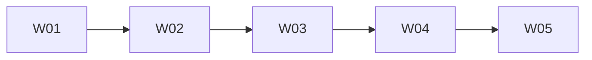

# Batch A Review Pack

**Status:** 2026-06-24 — Batch A mapping **accepted**; **review mode** (Days 6–8)  
**Purpose:** Turn completed Batch A mapping (W01–W05) into an actionable review pack for Sam. **Candidates only — nothing implemented until explicit approval.**

**Related:** [BATCH_A_HARDENING_RESULT.md](./BATCH_A_HARDENING_RESULT.md), [BATCH_A_SALES_TO_TENDER_SUMMARY.md](./BATCH_A_SALES_TO_TENDER_SUMMARY.md), [30_DAY_HARDENING_TRACKER.md](./30_DAY_HARDENING_TRACKER.md), [WORKFLOW_TEST_MATRIX.md](./WORKFLOW_TEST_MATRIX.md), [BUG_REGISTER.md](./BUG_REGISTER.md), [SAM_DECISION_LOG.md](./SAM_DECISION_LOG.md)

---

## 1. Batch A status

| Item | Status |
|------|--------|
| **Mapping W01–W05** | Complete — all accepted |
| **Review pack** | Approved 2026-06-24 |
| **Sam decisions §7** | **Decided** (SAM-W02-002, SAM-W03-001, SAM-W04-001, SAM-W05-003, SAM-W05-006) |
| **P0 approved** | P0-A1 through P0-A6 (fix order A5→A6→A3→A4→A1→A2) |
| **P0-A5** | **Complete** — test baseline; current behaviour documented; **no product fix** |
| **P0-A3** | **Complete** — 409 `JOB_ADDRESS_PENDING` before RFQ package/send |
| **P0-A4** | **Complete** — lead linkage at extraction job create + POST `/api/jobs` stamp |
| **P0-A1+** | **Block 3 complete** (A1 displayLeadName, A2 unified activities) |
| **Stable enough** | **No** (all five workflows) |
| **Batch B** | **Not started** — blocked until §10 stop gate |
| **Current mode** | **Batch A P0 complete** — regression verified 2026-06-25 |
| **Regression** | `test:batch-a` 14✓ · `test:batch-a:write` 22✓ · E2E 4✓/1✗ |

---

## 2. Source-of-truth summary

| Workflow | Expected SoT | Confirmed | Top mismatch |
|----------|--------------|-----------|--------------|
| **W01** | `leads` = opportunity; `crm_contacts` = relationship; `lead_activities` = timeline | All paths write `leads`; **all create paths** write `lead_activities`; `displayLeadName()` for website `name` | **P0-A1/A2 fixed** — regression pass |
| **W02** | `leads` = qualify fields/stage/score; activities + conversations | `/8` generated score; gates UI-only | Gate bypass; no won/lost stamps |
| **W03** | Track A: `fee_proposals`; Track B: `leads` PTSA | Dual tracks; mark-signed sole PTSA writer | Direct Supabase wizard; weak W04 handoff |
| **W04** | `jobs` = tender spine; `buildexact_estimates` = imports | Three job-create paths; BX links only | persistRfqs bypass; late lead link; Address pending |
| **W05** | `jobs` status; `rfqs` board progress; `projects` on win | Board = jobs+rfqs; win-finalize → project | rfq_packages invisible; job-delete gap; phase model too blunt |

Detail: [WORKFLOW_OWNERSHIP_MATRIX.md](./WORKFLOW_OWNERSHIP_MATRIX.md), [SOURCE_OF_TRUTH.md](../agent_knowledge/SOURCE_OF_TRUTH.md)

---

## 3. Handoff chain risks

| Handoff | Risk | Drift / ID |
|---------|------|------------|
| W01 → W02 | ~~Blank name~~; ~~missing create activity~~ | W01-DRIFT-001/002 **fixed** |
| W02 → W03 | Stage skipped via kanban/API | W01-DRIFT-003 + W02-DRIFT-006 |
| W03 → W04 | PTSA signed without job; no `fee_proposal_id` on lead | W03-DRIFT-002, W03-DRIFT-008 |
| W04 → W05 | Address pending job; extraction job without `lead_id` | W04-DRIFT-005, W04-DRIFT-007 |
| W05 → Ops | Win creates project but lead stale; ops readiness unproven | W05-DRIFT-004, W05-DRIFT-009 |
| W05 → Batch B | Package-only jobs show 0% on board | W05-DRIFT-003 |

**Critical rule:** W03/W04 → W05 requires real `site_address` and linked `jobs` row ([WORKFLOW_MAP_MASTER.md](./WORKFLOW_MAP_MASTER.md)).

---

## 4. P0 fix candidates

**Candidates only. Do not implement until Sam approves each item and linked tests exist.**

| ID | Candidate | Maps to | Notes |
|----|-----------|---------|-------|
| **P0-A1** | `displayLeadName()` helper so website leads do not appear blank on pipeline | W01-DRIFT-002 | SAM-W01-002 aligned; UI + list endpoints |
| **P0-A2** | Unified `lead_activities` "Lead created" on manual, website enquiry, CRM convert | W01-DRIFT-001 | SAM-W01-001 |
| **P0-A3** | Block or hard-warn missing `site_address` / `"Address pending"` before RFQ/tender handoff | W04-DRIFT-005 | **Done** — `jobGuards.mjs`; SAM-W04-001 |
| **P0-A4** | RFQ extraction-created jobs preserve `lead_id` / `leads.job_id` | W04-DRIFT-007 | **Done** — RfqEngine + POST `/api/jobs` |
| **P0-A5** | Document/test TenderBoard **rfqs-only** limitation before any board UI work | W05-DRIFT-003, W05-STRUCTURAL-001 | **Done** — baseline complete; redesign still blocked |
| **P0-A6** | Block `job-delete` where `rfq_packages` or `rfqs` exist | W05-DRIFT-008 | **Done** — 409 + archive message; SAM-W05-003 |

Also mapped in summary Phase 1 but **not** in Sam's P0-A list (defer unless Sam promotes):
- W04-DRIFT-001 — persistRfqs via POST `/api/jobs`
- W03-DRIFT-002 hard warning — overlaps P1 PTSA warning below

---

## 5. P1 / P2 deferred fixes

### P1 candidates (post-P0, after decisions)

| Candidate | Workflow | Drift / decision |
|-----------|----------|------------------|
| Advisory + diagnostic logging for stage gate bypass | W02 | W02-DRIFT-006, SAM-W02-002 |
| Lost/won stamping on lead stage movement | W02 | W02-DRIFT-001 |
| Hard warning when PTSA signed but `job_id` / `site_address` missing | W03 | W03-DRIFT-002, SAM-W03-001 |
| Write `leads.fee_proposal_id` on wizard save | W03 | W03-DRIFT-008 |
| Lead sync on win/lose | W05 | W05-DRIFT-004, SAM-W05-004 |
| Archive via API with audit trail | W05 | W05-DRIFT-002, SAM-W05-002 |

### P2 deferred (explicitly not Days 6–8)

- W04-DRIFT-001 — persistRfqs server path (unless promoted)
- W03 fee proposal API-only CRUD (SAM-W03-002)
- W05 batch PO `projectId` (W05-DRIFT-005)
- Template consolidation (SAM-W03-003)
- Tender Board phase model / UI redesign (W05-STRUCTURAL-001 / SAM-W05-006)
- Server-enforce stage gates (contradicts SAM-W02-002 during hardening)

---

## 6. Required test skeletons (Days 6–8)

**Plan skeletons only.** Skeleton files created 2026-06-24 — run before P0 fixes.

| Test ID | Purpose | Test file | Status |
|---------|---------|-----------|--------|
| **W01-API-01** | Manual lead create creates activity | `scripts/batch-a/w01-leads.mjs` | **pass** (`--write`) |
| **W01-API-02** | Website enquiry activity behaviour | same | **pass** (`--write`) |
| **W01-E2E-02** | Pipeline display name fallback | `e2e/tests/workflows/batch-a/w01-pipeline-display.spec.js` | **pass** |
| **W01-SEC-03** | Public enquiry spam/rate-limit | `w01-leads.mjs` | skeleton gap-documented |
| **W02-API-03** | Stage gate bypass diagnostic | `scripts/batch-a/w02-qualification.mjs` | skeleton gap-documented |
| **W02-API-04** | Lost/won stamping current gap | same | skeleton gap-documented |
| **W03-API-05** | PTSA mark-signed job link behaviour | `scripts/batch-a/w03-fee-proposal.mjs` | **pass** (`--write`) |
| **W03-API-07** | PTSA signed without site_address handoff | same | skeleton gap-documented |
| **W03-UI-03** | PTSA block visibility at `fee_proposal` stage | `e2e/.../w03-ptsa-visibility.spec.js` | skeleton + fixme |
| **W04-API-01** | convert-to-job happy path | `scripts/batch-a/w04-job-setup.mjs` | skeleton (`--write`) |
| **W04-API-05** | Address pending blocked/warned before RFQ | same | **pass** (409) |
| **W04-API-06** | RFQ extraction preserves lead linkage | same | **pass** |
| **W05-API-05** | job-delete with linked rfq_packages rule | `scripts/batch-a/w05-tender-board.mjs` | **baseline complete** | P0-A6; `--write`; 409 block |
| **W05-UI-02** | Board rfqs-only progress documented | same + `w05-tender-board.spec.js` | **partial** | API/write pass; E2E package-only fail (W05-TEST-001) |
| **W05-API-08** | Package-only vs rfqs progress on board | `w05-tender-board.mjs` | **baseline complete** | P0-A5; `--write` for DB fixtures |
| **W05-E2E-01** | Tender Board → Detail → win → Operations smoke | `w05-tender-board.spec.js` | skeleton (partial skip) | win path deferred |

**Run:** `npm run test:batch-a` (read-only baselines) · `npm run test:batch-a:write` (fixtures) · `npm run test:e2e -- e2e/tests/workflows/batch-a`

---

## 7. Sam decisions required before fixes

These must be **decided** (or explicitly confirmed at recommended default) before implementation:

| ID | Decision | Recommended default | Blocks |
|----|----------|---------------------|--------|
| **SAM-W02-002** | Stage gates remain advisory + diagnostic logging during hardening? | **Yes — B** | P1 gate logging; no hard-block |
| **SAM-W03-001** | PTSA signed allowed if job creation fails? | **Signed stored; hard warning; block tender handoff** | P1 PTSA warning; W03-DRIFT-002 |
| **SAM-W04-001** | Address pending jobs blocked before RFQ package/tender board? | **Yes — block** | **P0-A3** |
| **SAM-W05-003** | Delete rule for tenders with RFQs/packages? | **Archive preferred; hard delete draft/test only** | **P0-A6** |
| **SAM-W05-006** | Simple `jobs.status` board vs future `tender_phase`? | **Future tender_phase; no redesign now** | Any major Tender Board UI |

Also open but **not** in mandatory pre-fix list (decide before P1):
- SAM-W01-001 (P0-A2), SAM-W01-002 (P0-A1), SAM-W05-004 (lead sync), SAM-W05-001 (board aggregation)

Log decisions in [SAM_DECISION_LOG.md](./SAM_DECISION_LOG.md) with `Status = decided`.

---

## 8. Tender Board structural warning

> **Tender Board should not be redesigned during Days 6–8.**
>
> **W05-STRUCTURAL-001** / **SAM-W05-006** must be decided before major Tender Board workflow changes. Until then, **only test and patch current behaviour.**
>
> The board is a `jobs` + `rfqs` cockpit. Real tender work spans more phases than `jobs.status` represents. RFQ package progress (`rfq_packages` / `rfq_trade_scopes` / `rfq_recipients`) is not on the progress ring.
>
> **Allowed in Days 6–8:** documentation tests, rfqs-only limitation tests, job-delete rule tests, smallest-safe patches tied to P0-A5/A6.  
> **Not allowed:** new tender phase UI, board redesign, merging Quote Tracker into board, `tender_phase` schema.

See [workflows/05_TENDER_BOARD_LIFECYCLE.md](./workflows/05_TENDER_BOARD_LIFECYCLE.md) §16 (W05-STRUCTURAL-001).

---

## 9. Recommended Days 6–8 execution plan

| Day | Focus | Output | Code? |
|-----|-------|--------|-------|
| **6** | Sam reviews this pack + confirms P0-A1–A6 subset and §7 decisions | Decisions logged; P0 approval list | **No** |
| **6–7** | Write **test skeletons** for §6 list (skipped/placeholder OK documenting current gap) | Skeleton files if Sam approves | Test files only |
| **7** | Implement **approved P0 fixes only** — one at a time with regression test | BUG_REGISTER + tracker updates | **Yes — P0 only** |
| **8** | Run skeleton tests against dev; fix test harness only; `/harden review` draft | Release readiness notes | No new features |

**Order if all P0 approved:**
1. P0-A5 + P0-A6 (document/test — lowest blast radius)
2. P0-A3 (Address pending gate)
3. P0-A4 (lead linkage at extraction)
4. P0-A1 + P0-A2 (W01 display + activities)

**Explicitly out of scope Days 6–8:** Batch B mapping, Tender Board redesign, server-enforced gates, RFQ matcher changes.

---

## 10. Stop gate before Batch B

**Batch B mapping may proceed** — stop gate satisfied 2026-06-25 except optional SAM-W01-001/002 formal `decided` log. Do **not** start Batch B **fixes** until Batch B mapped and reviewed. Original gate checklist:

- [x] Sam has approved a P0 fix list (P0-A1–A6 implemented)
- [x] Mandatory decisions §7 marked `decided` (SAM-W02-002, W03-001, W04-001, W05-003, W05-006)
- [x] Test skeletons exist; regression run 2026-06-25 (1 E2E locator debt)
- [x] W04→W05 handoff verified — P0-A3 + P0-A4 pass in `--write` run
- [x] W05-STRUCTURAL-001 acknowledged — SAM-W05-006 decided
- [x] Tracker updated — Batch A P0 complete; regression logged

**Batch B remains:** RFQ package, send/match, quote accept, tender win handoff — separate mapping lane; pre-tracker RFQ code is **not** fully hardened.

---

## 11. Batch B parking lot (pre-confirmed — no implementation)

**Gate:** Batch A hardening result complete ([BATCH_A_HARDENING_RESULT.md](./BATCH_A_HARDENING_RESULT.md) §9). **Do not implement.** W06 mapped 2026-06-25; W07–W09 not mapped.

| ID | Finding | Severity | Repo check |
|----|---------|----------|------------|
| **W06-DRIFT-001** | API camelCase vs UI snake_case on package nested keys | High | **confirmed** |
| **W06-DRIFT-002** | Engine sends first; package created after — finalize failure splits tracking | High | **confirmed** |
| **W07-DRIFT-001** | Package send `sent_message_id` | High | **partially fixed** (rfqs path; Resend/email-only gaps remain) |
| **W07-DRIFT-002** | Email-only recipients not IMAP-matchable | High | **confirmed** |
| **W07-DRIFT-003** | Inbound quote → package table propagation | High | **partially fixed** (`applyInboundQuoteToWorkflow` when `rfq_id` linked) |
| **W07-DRIFT-004** | Resend sends do not appear in mailbox Sent | Medium | **confirmed** |
| **W07-DRIFT-005** | Resend strips custom Message-ID | High | **confirmed** |
| **SAM-W07-001** | Correspondence SoT vs mailbox Sent | — | open — **rec: Hub correspondence SoT** |

**Mapping priority when Batch B continues:** W06 → W07 → W08 → W09. Do not attempt matcher fixes until W06 package visibility proven.

Detail: [BUG_REGISTER.md](./BUG_REGISTER.md) § Batch B parking lot

---

## 12. Regression run (2026-06-25)

| Suite | Result |
|-------|--------|
| `npm run test:batch-a` | 14 passed · 0 failed · 13 skipped · 10 gap-documented |
| `npm run test:batch-a:write` | 22 passed · 0 failed · 6 gap-documented |
| `npm run test:e2e -- e2e/tests/workflows/batch-a` | 4 passed · **1 failed** · 2 skipped |

**Website enquiry chain:** W01-API-02 ✅ · W01-E2E-02 ✅ (enquiry → visible in pipeline → activity timeline).

**Known E2E failure:** W05-UI-02 package-only `0%` subtest — Playwright strict-mode locator (W05-TEST-001); product behaviour confirmed via API/write baselines.

**Note:** Playwright may log `EADDRINUSE :8787` if API already running — use existing server or `E2E_SKIP_WEBSERVER=true`.

---

## Document history

| Date | Change |
|------|--------|
| 2026-06-25 | Batch B parking lot refined (code-verified W06/W07 findings) |
| 2026-06-24 | Block 2 (P0-A3+A4) complete |
| 2026-06-24 | Block 1 (P0-A5+A6) complete; P0-A6 patch documented |
| 2026-06-24 | P0-A5 baseline complete; Batch B W07 parking lot added |
| 2026-06-24 | Initial Batch A Review Pack — mapping accepted; review mode |
