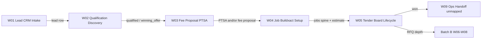

# Batch A — Sales to Tender Setup (Summary)

**Status:** 2026-06-24 — documentation only; mapping complete (W01–W05)  
**Purpose:** Single review artifact after Batch A workflow mapping. **No product code was changed.**

**Related:** [WORKFLOW_MAP_MASTER.md](./WORKFLOW_MAP_MASTER.md), [30_DAY_HARDENING_TRACKER.md](./30_DAY_HARDENING_TRACKER.md), [BUG_REGISTER.md](./BUG_REGISTER.md), [WORKFLOW_TEST_MATRIX.md](./WORKFLOW_TEST_MATRIX.md), [SAM_DECISION_LOG.md](./SAM_DECISION_LOG.md)

---

## 1. Executive summary

Batch A maps the **Sales → Tender Setup** spine: from first lead contact through qualification, fee proposal/PTSA, job/estimate setup, and tender board lifecycle.

**Outcome:** Five workflow docs (23 sections each), **40+ drift items** registered, **80+ planned tests**, **20+ Sam decisions** logged. All workflows remain **not stable enough for unfixed production reliance** — mapping and test planning only.

**Key themes:**
- **Multiple job-creation paths** with inconsistent dedup, fact provenance, and lead linkage (W04)
- **UI-only stage gates** with shared root cause across W01/W02 (SAM-W02-002: advisory during hardening)
- **Two parallel pre-tender tracks:** Track A Fee Proposal vs Track B PTSA (W03)
- **Tender Board reads legacy `rfqs` only** — package path invisible (W05 / SAM-W05-001)
- **Win ≠ full operations handoff** — project row created; W09+ unmapped (W05-DRIFT-009)
- **Tender Board structurally under-modelled** — `jobs.status` too coarse for real tender phases (W05-STRUCTURAL-001 / SAM-W05-006)

> **Structural note:** Tender Board appears structurally under-modelled. It should **not** be treated as fully designed just because bugs are mapped. Before major Tender Board fixes, confirm whether Blue Leaf wants a **simple status board** or a **true tender phase board**. Immediate hardening: map current behaviour, test current behaviour, avoid building more workflow logic into the wrong surface.

---

## 2. Workflow chain W01 → W05

| # | Workflow | Doc | Gate |
|---|----------|-----|------|
| W01 | Lead / Enquiry / CRM Intake | [workflows/01_LEAD_CRM_INTAKE.md](./workflows/01_LEAD_CRM_INTAKE.md) | Accepted |
| W02 | Lead Qualification / Discovery | [workflows/02_LEAD_QUALIFICATION_DISCOVERY.md](./workflows/02_LEAD_QUALIFICATION_DISCOVERY.md) | Accepted |
| W03 | Fee Proposal / PTSA | [workflows/03_FEE_PROPOSAL_PTSA.md](./workflows/03_FEE_PROPOSAL_PTSA.md) | Accepted |
| W04 | Estimate / Buildxact / Job Setup | [workflows/04_ESTIMATE_BUILDXACT_TENDER_SETUP.md](./workflows/04_ESTIMATE_BUILDXACT_TENDER_SETUP.md) | Accepted |
| W05 | Tender Board / Lifecycle | [workflows/05_TENDER_BOARD_LIFECYCLE.md](./workflows/05_TENDER_BOARD_LIFECYCLE.md) | Accepted |

---

## 3. Source-of-truth table by workflow

| Workflow | Primary SoT (expected) | Confirmed in code | Known mismatch |
|----------|------------------------|-------------------|----------------|
| **W01** | `leads` = active opportunity; `crm_contacts` = relationship; `lead_activities` = timeline | All creation paths write `leads`; only manual path writes `lead_activities`; website uses `name` not first/last | Unequal audit trail (W01-DRIFT-001/002) |
| **W02** | `leads` = qualification fields/stage/score; `lead_activities` = timeline; `lead_conversations` = transcript record | Generated `/8` score; gates UI-only; PATCH ungated | Gates bypass (W01-DRIFT-003 + W02-DRIFT-006); no outcome stamps (W02-DRIFT-001) |
| **W03** | Track A: `fee_proposals`; Track B: `leads` PTSA fields | Dual tracks confirmed; PTSA signed only via mark-signed API | Wizard direct Supabase (W03-DRIFT-003); weak W04 handoff (W03-DRIFT-008) |
| **W04** | `jobs` = tender spine; `buildexact_estimates` = import rows | Three job-create paths; Buildxact links, does not create jobs | persistRfqs bypass (W04-DRIFT-001); late lead link (W04-DRIFT-007); Address pending (W04-DRIFT-005) |
| **W05** | `jobs` = lifecycle status; `rfqs` = board progress; `projects` on win | Board reads jobs+rfqs; win-finalize enriches projects | Ignores rfq_packages (W05-DRIFT-003); job-delete gap (W05-DRIFT-008); win ≠ full ops (W05-DRIFT-009) |

Full ownership detail: [WORKFLOW_OWNERSHIP_MATRIX.md](./WORKFLOW_OWNERSHIP_MATRIX.md)

---

## 4. Handoff points and failure risks

| From → To | Required data | Top failure risks |
|-----------|---------------|-------------------|
| **W01 → W02** | Lead row, minimum contact | Blank pipeline names for website leads (W01-DRIFT-002) |
| **W02 → W03** | Stage ≥ winning_offer; gates advisory | Stage skipped via kanban (W02-DRIFT-006) |
| **W03 → W04** | `site_address`; PTSA and/or fee proposal progress | PTSA signed without job (W03-DRIFT-002); `fee_proposal_id` never set (W03-DRIFT-008) |
| **W04 → W05** | Real `jobs.address`; `jobs.id`; optional `lead_id` | Address pending jobs (W04-DRIFT-005); extraction job without lead link (W04-DRIFT-007) |
| **W05 → W09 / Ops** | Win + `projects` row | Lead stage stale (W05-DRIFT-004); ops readiness unproven (W05-DRIFT-009) |
| **W05 → Batch B** | RFQs or packages on job | Board shows 0% for package-only jobs (W05-DRIFT-003) |

**Critical link (documented in WORKFLOW_MAP_MASTER):** W03/W04 → W05 requires real `site_address` and linked `jobs` row before tender work is meaningful.

---

## 5. Highest-risk drift items

| Priority | ID | Workflow | Issue | Severity |
|----------|-----|----------|-------|----------|
| P0 | W04-DRIFT-001 | W04 | persistRfqs bypasses POST `/api/jobs` | High |
| P0 | W04-DRIFT-005 | W04 | Address pending allowed in RFQ | High |
| P0 | W05-STRUCTURAL-001 | W05 | Tender Board phase model too blunt | High (design) |
| P0 | W05-DRIFT-008 | W05 | job-delete vs rfq_packages NOT NULL conflict | High |
| P0 | W03-DRIFT-002 | W03 | PTSA signed without job when no address | High |
| P0 | W05-DRIFT-003 | W05 | Board ignores rfq_packages | High |
| P1 | W04-DRIFT-007 | W04 | Extraction job may lack lead_id until persistRfqs | Medium |
| P1 | W02-DRIFT-006 | W02 | Stage gate bypass (shared with W01-DRIFT-003) | High |
| P1 | W05-DRIFT-004 | W05 | Win/lose does not sync leads | Medium |
| P1 | W01-DRIFT-001 | W01 | Unequal creation audit trail | High |
| P2 | W03-DRIFT-003 | W03 | FeeProposalWizard direct Supabase | Medium |

Full register: [BUG_REGISTER.md](./BUG_REGISTER.md)

---

## 6. Required Sam decisions

| ID | Topic | Recommended default | Blocks |
|----|-------|---------------------|--------|
| SAM-W02-002 | Stage gates advisory vs enforce | **B — advisory + logging during hardening** | Gate fix approach |
| SAM-W03-001 | PTSA signed without job | **B — allow signed; block tender handoff** | W03-DRIFT-002 fix |
| SAM-W04-001 | Address pending in RFQ | **A — block before RFQ package** | W04-DRIFT-005 |
| SAM-W05-001 | Board rfqs vs rfq_packages | **Document first; aggregate both eventually** | W05-DRIFT-003 |
| SAM-W05-003 | Delete with packages | **Admin-only; prefer archive** | W05-DRIFT-008 |
| SAM-W05-004 | Lead sync on win/lose | **Yes eventually; document gap first** | W05-DRIFT-004 |
| SAM-W05-005 | Min ops handoff after win | **Project + readiness checklist** | W05-DRIFT-009 |
| SAM-W05-006 | Simple status board vs tender phase board | **B — tender_phase later; no redesign in hardening** | W05-STRUCTURAL-001 |

**Proposed future tender phases (not implemented):** `lead_accepted` → `tender_setup` → `documents_ready` → `rfq_packages_preparing` → `rfqs_sent` → `quotes_receiving` → `quote_review` → `price_finalisation` → `submitted_waiting` → `won` / `lost` / `archived`. See [workflows/05_TENDER_BOARD_LIFECYCLE.md](./workflows/05_TENDER_BOARD_LIFECYCLE.md).

All decisions: [SAM_DECISION_LOG.md](./SAM_DECISION_LOG.md) (W01–W05 + cross-cutting)

---

## 7. Required tests

Tests are **planned only** — none written in Batch A mapping phase.

| Workflow | Planned test IDs (sample) | Matrix section |
|----------|---------------------------|----------------|
| W01 | W01-API-01..08, W01-E2E-01..03, W01-SEC-01..03 | WORKFLOW_TEST_MATRIX § W01 |
| W02 | W02-API-01..07, W02-UI-01..02 | § W02 |
| W03 | W03-API-01..07, W03-UI-01..03, W03-SEC-01 | § W03 |
| W04 | W04-API-01..06, W04-UI-01..02, W04-SEC-01 | § W04 |
| W05 | W05-UI-01..03, W05-API-01..08, W05-E2E-01, W05-SEC-01 | § W05 |

**Batch A review rhythm (Days 6–8):** Sam approves P0 fixes only; then API/E2E **test skeletons** — not full implementation.

---

## 8. Smallest-safe fix order

**No fixes until Sam approves P0 list after this summary.**

### Phase 1 — Handoff blockers (P0)

1. **W04-DRIFT-005** — Block/warn Address pending before RFQ package (SAM-W04-001)
2. **W04-DRIFT-001** — Route persistRfqs job create through POST `/api/jobs`
3. **W04-DRIFT-007** — Pass `lead_id` at extraction job create when prefill context exists
4. **W03-DRIFT-002** — Hard warning when PTSA signed without job/address (SAM-W03-001)
5. **W05-DRIFT-008** — Document/block job-delete when rfq_packages linked (SAM-W05-003)

### Phase 2 — Consistency (P1)

6. **W01-DRIFT-003 + W02-DRIFT-006** — Diagnostic logging on gate bypass (SAM-W02-002); single fix
7. **W05-DRIFT-003** — Document rfqs-only board; plan package merge (SAM-W05-001)
8. **W05-DRIFT-004** — Lead stage sync on win/lose (SAM-W05-004)
9. **W01-DRIFT-001** — Unified lead_activities on all creation paths (SAM-W01-001)

### Phase 3 — Quality / deferred (P2)

10. W03 Fee proposal API-only CRUD (SAM-W03-002)
11. W05 archive API + audit (SAM-W05-002)
12. W05 batch PO projectId (W05-DRIFT-005)
13. Template consolidation (SAM-W03-003) — deferred

Each fix requires: regression test from matrix → BUG_REGISTER update → tracker update.

---

## 9. What was not changed

- **No product code** — no routes, UI, schema, or refactors
- **No automated tests written** — matrix rows only
- **No bug fixes applied** — drift registered only
- **Batch B not started** — W06–W09 mapping deferred
- **RELEASE_READINESS.md** not created yet — `/harden review` after Batch A fix approval
- **Pre-tracker RFQ fixes** (DRIFT-001/002/003/009/012) remain **not fully hardened** until Batch B tests complete

---

## 10. Recommendation before Batch B

1. **Sam review this summary** and confirm P0 fix list (§8 Phase 1).
2. **Decide open SAM-W05-* items** — especially delete vs archive (W05-DRIFT-008), board aggregation (SAM-W05-001), and **board model** (SAM-W05-006 / W05-STRUCTURAL-001).
3. **Do not treat Tender Board as fully designed** — confirm simple status board vs tender phase board before major UI investment.
4. **Days 6–8:** Approve P0 fixes only; add **test skeletons** for W01–W05 P0 paths — no broad refactors and **no Tender Board redesign**.
5. **Do not start Batch B (W06–W07)** until Batch A P0 tests exist and at least one handoff fix (W04→W05 lead link or Address pending block) is verified.
6. **Treat win-finalize as partial handoff** — map W09 before claiming operations-ready (W05-DRIFT-009).
7. **RFQ pre-tracker work:** Continue to reference [RFQ_TENDER_WORKFLOW_SOURCE_OF_TRUTH.md](./RFQ_TENDER_WORKFLOW_SOURCE_OF_TRUTH.md) but do not assume RFQ is hardened until W06–W07 mapped and regression tests pass.

---

## Document history

| Date | Change |
|------|--------|
| 2026-06-24 | W05-STRUCTURAL-001; SAM-W05-006; structural note in §1 and §10 |
| 2026-06-24 | Initial Batch A summary after W01–W05 mapping complete |
