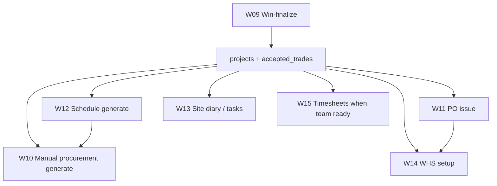

# Batch C Review Pack — Operations (W10–W15)

**Date:** 2026-06-25  
**Status:** Mapping complete — **no fixes until Sam approves P0-C order**  
**Prerequisite:** Batch B P0 complete (P0-B1–B5 shipped/closed)

**Workflow docs:** [W10](./workflows/10_PROCUREMENT_PLANNING_REGISTER.md) · [W11](./workflows/11_PURCHASE_ORDERS_SUPPLIER_COMMITMENTS.md) · [W12](./workflows/12_SCHEDULING_CRITICAL_PATH_EOT.md) · [W13](./workflows/13_SITE_OPERATIONS_DIARY_MEDIA.md) · [W14](./workflows/14_WHS_INDUCTIONS_SWMS_INCIDENTS.md) · [W15](./workflows/15_WORKFORCE_TIMESHEETS_BUILDXACT_WORK_ORDERS.md)

---

## 1. Executive summary

Batch C maps **Operations execution** after W09 win handoff: materials procurement, subcontractor POs, scheduling, site diary/media, WHS, and workforce/timesheets.

**Verified pattern across W10–W15:** Win-finalize creates the **`projects` spine** and snapshots accepted trades, but **does not auto-seed** procurement, schedule, WHS, diary, or timesheets. Staff must run manual setup steps — P0-B5 ops readiness checklist (shipped) surfaces these gaps.

**Highest-impact confirmed gaps:**
1. **W11-DRIFT-001** — TenderDetail batch PO passes empty `projectId` (Operations PO path works).
2. **W12-DRIFT-002** — Schedule write APIs lack role gate (employee can mutate via API).
3. **W15-DRIFT-001** — Supervisor approve UI/API mismatch; Deputy replacement not E2E-verified.
4. **W10/W12-DRIFT-007** — Dual procurement SSoT (register vs legacy schedule fields).
5. **W14-DRIFT-002** — WHS engine 1/N templates wired.

**Batch C is map-ready, not fix-ready.** Zero dedicated E2E tests exist for W10–W15.

---

## 2. Current verified status (W10–W15)

| Workflow | Mapped | Implemented | Tested | Stable enough |
|----------|--------|-------------|--------|---------------|
| **W10** Procurement | ✅ | ✅ partial | ❌ | No — manual generate only |
| **W11** PO / commitments | ✅ | ✅ partial | ❌ gap | No — batch PO broken |
| **W12** Scheduling / EOT | ✅ | ✅ | ❌ | No — auth + ripple drift |
| **W13** Site diary / media | ✅ | ✅ partial | ❌ | No — media silos |
| **W14** WHS | ✅ | ✅ partial (Phase 1) | ❌ | No — template coverage |
| **W15** Workforce / BX WO | ✅ | ✅ | ❌ NO-GO | No — Deputy cutover unverified |

---

## 3. Table ownership (Batch C spine)

| Table | Primary workflow | Key spine |
|-------|------------------|-----------|
| `procurement_items` | W10 | `job_id`, `project_id` |
| `purchase_orders` | W11 (+ W10 materials) | `project_id`, `job_id`, `rfq_id` |
| `schedule_tasks` | W12 | `project_id` |
| `schedule_eot` | W12 | `project_id` |
| `site_diary` | W13 | `project_id` |
| `site_tasks` | W13 / W15 | `project_id` XOR `carpentry_job_id` |
| `whs_site_profiles` | W14 | `project_id` |
| `site_inductions` | W14 | `project_id` |
| `site_reports` | W14 | `project_id` |
| `timesheets` | W15 | `project_id`, `carpentry_job_id` |
| `projects` | W09 (handoff) | `job_id`, `accepted_trades` |

---

## 4. Source-of-truth model

| Domain | SoT | Not SoT |
|--------|-----|---------|
| Materials register | `procurement_items` | `schedule_tasks.procurement_*` (legacy) |
| Subcontractor PO | `purchase_orders` via `/api/po/issue` | Batch UI broken path |
| Schedule tasks & deps | `schedule_tasks.task_dependencies` JSONB | Legacy `depends_on` only (server cascade) |
| Order-by (materials) | GENERATED on `procurement_items` | Schedule task order-by columns |
| Site diary | `site_diary` | — |
| Worker photos | `site-media` bucket paths | `site_diary.photo_paths` (unused) |
| WHS profile | `whs_site_profiles` | — |
| Approved labour | `timesheets` + BX Work Order | Deputy (retired) |

---

## 5. Cross-module handoffs from W09

**W09 creates:** `projects`, `accepted_trades`, optional `cost_intelligence`, contract value carry.  
**W09 does not create:** anything in W10–W15 tables (except PO if staff immediately issues from Ops path).

---

## 6. Open drifts grouped by priority

### P0 candidates (fix only after tests)

| ID | Workflow | Issue |
|----|----------|-------|
| **W11-DRIFT-001** | W11 | Batch PO empty `projectId` |
| **W12-DRIFT-002** | W12 | Schedule API missing role gate — **fixed P0-C2** |
| **W15-DRIFT-001** | W15 | Supervisor approve UI/API mismatch — **fixed P0-C3 Option B** |
| **W10-DRIFT-001** | W10 | No register on win — **confirmed intentional** (W10-API-06); manual generate only |

### P1

| ID | Workflow | Issue |
|----|----------|-------|
| **W12-DRIFT-004** | W12 | Typed deps ignored on server cascade |
| **W10-DRIFT-002** | W10 | Dual procurement SSoT |
| **W13-DRIFT-003** | W13 | Three media silos |
| **W14-DRIFT-002** | W14 | WHS engine template coverage |
| **W15-DRIFT-003** | W15 | No E2E; Deputy NO-GO |

### P2

| ID | Workflow | Issue |
|----|----------|-------|
| **W12-DRIFT-005** | W12 | Blunt EOT apply |
| **W12-DRIFT-006** | W12 | Dual critical path |
| **W11-DRIFT-004** | W11 | BX PO complete not called |
| **W13-DRIFT-001** | W13 | Unused diary photo_paths |

---

## 7. Tests needed before fixes

| Priority | Test IDs | Blocker for |
|----------|----------|-------------|
| P0-C1 | W11-API-01/02/03 | Batch PO projectId fix |
| P0-C2 | W12-SEC-01, W12-API-01 | Schedule role gate — **shipped** |
| P0-C3 | W15-SEC-01–04, W15-API-01–04 | Supervisor approve — **shipped Option B** |
| P0-C4 | W10-API-01–06 | Procurement generate baseline — **shipped** |
| P0-C5 | W14-API-01–03, W14-SEC-01–03, W14-API-05 | WHS profile + induction + SEC gaps — **shipped** |
| Cross | W09-API-07 (shipped P0-B5) | Ops readiness regression |

**No E2E exists for W10–W15** — plan `e2e/tests/workflows/batch-c/` after API skeletons.

---

## 8. Sam decisions needed

| ID | Question | Recommended |
|----|----------|-------------|
| **SAM-W09-001** | Ops readiness checklist | **Decided B — shipped P0-B5** |
| **SAM-W10-001** | Auto-generate procurement on win? | **No** |
| **SAM-W11-001** | Fix batch PO projectId now? | **Yes — P0-C1** |
| **SAM-W11-002** | Admin-only on `/api/po/issue`? | **Yes** |
| **SAM-W12-001** | Auto-generate schedule on win? | **No** |
| **SAM-W14-001** | Auto WHS profile on win? | **No** |
| **SAM-W15-001** | Supervisor approve? | **Document admin-only OR fix API** |
| **SAM-W15-002** | Deputy cutover criteria? | **E2E + parallel run** |

---

## 9. Recommended P0-C order

| Order | Item | Workflow | Why first |
|-------|------|----------|-----------|
| **P0-C1** | Batch PO `projectId` + full PO issue | W11 | **closed 2026-06-25** |
| **P0-C2** | Schedule write role gate + W12-SEC-01/02 | W12 | **closed 2026-06-25** — `test:w12-schedule-auth:write` |
| **P0-C3** | W15 approve permission alignment | W15 | Security — adversarial audit |
| **P0-C4** | W10 procurement baseline | W10 | **closed** — `test:w10-procurement-baseline:write` |
| **P0-C5** | W14 profile + induction + SEC gaps | W14 | **closed** — `test:w14-whs-baseline:write` 15/15 |

**Explicitly not P0-C:** Auto-seed procurement/schedule/WHS on win; WHS template pack expansion; media pipeline merge; ripple/critical-path refactors.

---

## 10. Explicitly out of scope (Batch C hardening)

1. Auto-generate procurement, schedule, WHS, portal on win.
2. Procurement engine redesign or accepted-trades → register link.
3. Merge RFQ/sub PO path with materials PO path.
4. WHS engine full template rollout (24 templates).
5. Marketing-media ↔ site-media unification.
6. Deputy/Xero new integrations.
7. Navigation redesign; new modules.
8. God-file splits without regression tests.

---

## 11. Next safe action

**Batch C correction pass complete** — cleanup legacy matchers, `save-analysis-pdf` role gate, W11-DRIFT-009 logged. Create **corrected** Batch C review zip (include `public/brand/`) for ChatGPT, then **P0-C3 planning only** if approved.

### Schedule auxiliary routes (Batch C correction — route classification)

| Route | Type | Role gate | Notes |
|-------|------|-----------|-------|
| `POST /api/schedule/analyse` | AI/token — reads tasks, no DB mutation | `requireAuth` only | P1/SAM: AI cost control gate optional |
| `POST /api/schedule/save-analysis-pdf` | External file write (Dropbox via `fileJobRecord`) | **`requireScheduleWrite`** (admin/supervisor) | Batch C correction |
| `POST /api/schedule/export-gantt-pdf` | Download response only — no persisted file | `requireAuth` only | — |
| `POST /api/schedule/task-advice` | AI/token — no DB mutation | `requireAuth` only | P1/SAM: AI cost control gate optional |

### Review zip packaging (future exports)

Always include `public/brand/logo-black.png` and `public/brand/icon-blue.png` in ChatGPT review zips. Include synthetic sample PDFs (e.g. `scripts/output/w11-po-sample.pdf`) only when BLH TEST / no real-client data; otherwise report local path only.

**Corrected zip (2026-06-25):** `blue-leaf-hub-hardening-update-batch-c-corrected-2026-06-25.zip`

### Test artifact naming (approved rule)

- **New write tests:** **`BLH TEST`** only — use `buildTestJobAddress()`
- **Do not use for new tests:** `__BATCH_A__`, `BATCHA`, `BATCH A`, `__E2E__`, `DEBUG`, `DEBUG2`, `__DRYRUN`, `__DEMO`
- **Legacy names:** cleanup detection / review only — require `--include-legacy-test-names --confirm-legacy "DELETE LEGACY TEST FOLDERS"` to delete
- **Do not create** new underscore-based Dropbox test folders

---

## Document history

| Date | Change |
|------|--------|
| 2026-06-25 | **Cleanup doc prefix correction** — `BLH TEST` approved for new write tests; legacy prefixes detection-only |
| 2026-06-25 | **P0-C2 closed** — W12-DRIFT-002 schedule write role gate; `test:w12-schedule-auth:write` |
| 2026-06-25 | **W11 PO refine closed** — W11-DRIFT-007 watermark + W11-DRIFT-008 quote email attach; W11-API-05/06/07; combined PDF deferred |
| 2026-06-25 | **PO PDF + quote attach** — W11-DRIFT-007; append combined PDF deferred |
| 2026-06-25 | **P0-C1 closed** — correction: poPdfKit italic 502 fixed (W11-DRIFT-006); `test:w11-batch-po:write` 12 pass |
| 2026-06-25 | **P0-C1 shipped** — W11-DRIFT-001 / W09-DRIFT-006 projectId fix; `test:w11-batch-po:write` |
| 2026-06-25 | Batch C review pack created — W10–W15 mapped |
