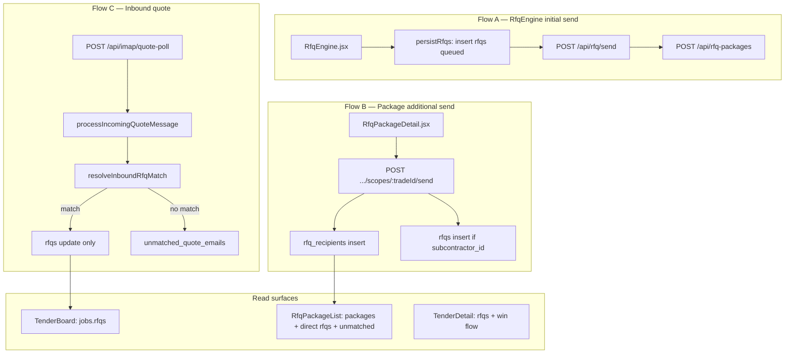
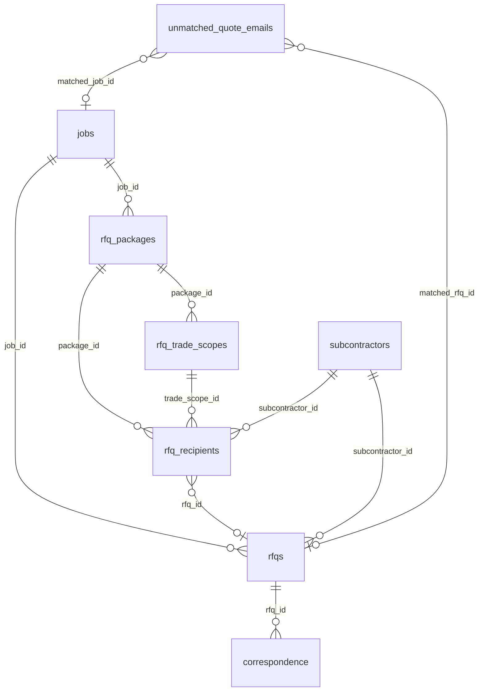

# RFQ / Tender Workflow — Source of Truth

**Status:** Phase 1 documentation (2026-06-22)  
**Gate:** No RFQ/tender app logic changes until this document is reviewed.  
**Related:** [TENDER_EMAIL_TEST_PLAN.md](./TENDER_EMAIL_TEST_PLAN.md), [WORKFLOW_TEST_MATRIX.md](./WORKFLOW_TEST_MATRIX.md), [BUG_REGISTER.md](./BUG_REGISTER.md)

---

## Purpose

Blue Leaf Hub has **three overlapping RFQ/tendering systems** that share domain concepts but do not share a single enforced write path. This document declares the intended ownership model, maps what the code actually does today, and defines the smallest safe fixes — without a module rewrite.

**Core principle:**

| Layer | Role |
|-------|------|
| `rfq_packages` (+ scopes + recipients) | **Main workflow** — tender package structure, per-trade scope, per-recipient status |
| `rfqs` | **Email/quote transaction layer** — outbound Message-ID, IMAP matching, PDF/amount storage |
| `jobs` | **Tender/project record** — address, client, won/lost/archive lifecycle |
| `unmatched_quote_emails` | **Normal safety-net queue** — inbound quotes that could not be confidently auto-matched |
| `TenderBoard` | **Job-level overview** — quote progress ring from `jobs.rfqs` |

---

## 1. What the code currently does

### 1.1 Three overlapping flows



#### Flow A — RfqEngine → legacy send → package snapshot

**Entry:** `/tender-manager/rfq-engine` ([`src/pages/RfqEngine.jsx`](../../src/pages/RfqEngine.jsx))

1. Staff uploads tender PDF → `POST /api/rfq/extract` (Claude scope extraction).
2. Staff selects trades, recipients, composes emails.
3. **`persistRfqs`** (client Supabase): inserts `rfqs` rows with `status: "queued"`, `email_body`, `deadline`.
4. **`sendOneRow`** per message: `POST /api/rfq/send` with `{ jobId, rfqId, to, subject, body, attachments? }`.
5. Server sets `rfqs.sent_message_id`, `status: "sent"`, `sent_at`; inserts outbound `correspondence`.
6. Client redundantly re-updates `rfqs` to `sent` (lines ~2165–2169).
7. When all rows sent, **`finalizeAllSentPackage`**: `POST /api/rfq-packages` snapshots `rfq_packages`, `rfq_trade_scopes`, `rfq_recipients` (with `rfq_id` from engine).
8. Navigates to `/tender-manager/rfq-packages/:packageId`.

**Failure mode:** If step 7 fails after emails sent, `rfqs` exist but no package — tracking splits across Direct RFQs tab vs Packages tab.

#### Flow B — Package Detail additional send

**Entry:** `/tender-manager/rfq-packages/:packageId` ([`src/pages/RfqPackageDetail.jsx`](../../src/pages/RfqPackageDetail.jsx))

`POST /api/rfq-packages/:packageId/scopes/:tradeId/send` ([`server/lib/rfqPackageRoutes.mjs`](../../server/lib/rfqPackageRoutes.mjs) ~638–732):

1. `sendPlainMail({ to, subject, text })` — **no `Message-ID` header**.
2. Inserts `rfq_recipients` (`status: "sent"`).
3. If `job_id` **and** `subcontractor_id`: inserts `rfqs` row, links `rfq_recipients.rfq_id`.
4. Email-only recipients (no `subcontractor_id`): **no `rfqs` row** — tracked in `rfq_recipients` only.
5. Updates `rfq_trade_scopes.status` → `"sent"` if all sends OK.
6. Calls `recomputePackageCoverage` (scope-count / 32 formula).

**Does not call** `/api/rfq/send`. **Does not set** `sent_message_id`.

#### Flow C — Inbound quote (IMAP)

**Trigger:** Background poll (`IMAP_POLL_ENABLED`) or manual `POST /api/imap/quote-poll` (admin auth).

[`processIncomingQuoteMessage`](../../server/dev-api.mjs) (~310–458):

1. Parse MIME; dedupe by `correspondence.message_id`.
2. `resolveInboundRfqMatch(parsed, rfqRows)` against `fetchOpenRfqCandidates()` — reads **`rfqs` only** (status `sent|reminded|received|accepted`, limit 1200).
3. **On match:** upload PDF to Dropbox, AI-extract amount, insert inbound `correspondence`, **UPDATE `rfqs` only** (`status: "received"`, amounts, PDF URLs), optional `job_knowledge`.
4. **On no match:** insert `unmatched_quote_emails`, insert orphan inbound `correspondence` (`logged_by: "imap-unmatched"`).

**Does not update** `rfq_recipients`, `rfq_trade_scopes`, or `rfq_packages`.

#### Flow D — Manual unmatched resolve

`POST /api/unmatched-quotes/resolve` ([`server/lib/jobsApiRoutes.mjs`](../../server/lib/jobsApiRoutes.mjs) ~206–250):

1. Loads `unmatched_quote_emails` + target `rfqs`.
2. Inserts `correspondence` (`logged_by: "manual-match"`) — no PDF, no `message_id`.
3. Updates `rfqs` → `status: "received"`, `received_at`.
4. **Deletes** unmatched row (does not set `resolved_at`).

**Does not update** package tables. **Does not set** `quoted_amount`.

#### Flow E — Tender win / accept

**TenderBoard** ([`src/pages/TenderBoard.jsx`](../../src/pages/TenderBoard.jsx)): reads `jobs` + nested `rfqs` via Supabase; quote ring = `received|accepted` / total.

**TenderDetail** ([`src/pages/TenderDetail.jsx`](../../src/pages/TenderDetail.jsx)):

- Per-RFQ: `PATCH /api/rfq/:id` for amount, accept/decline.
- Win flow: `POST /api/tender/win-finalize` + `POST /api/tender/outcome-mails`.
- Query follow-up: `POST /api/rfq/send` with `force: true`.

**Package recipient PATCH** ([`rfqPackageRoutes.mjs`](../../server/lib/rfqPackageRoutes.mjs) ~736–788): mirrors `status` + `quote_amount` to linked `rfqs`; propagates `received` to parent `rfq_trade_scopes`. **This mirror path exists for manual UI edits but not for IMAP inbound.**

---

## 2. What the workflow should be

### Intended mental model

1. Staff creates a **tender job** (`jobs.status = tendering`).
2. Staff builds an **RFQ package** (`rfq_packages`) with trade scopes and recipients.
3. Each outbound RFQ email creates or updates an **`rfqs` transaction row** with reliable threading metadata (`sent_message_id`).
4. Each recipient invitation is tracked in **`rfq_recipients`**, linked via `rfq_id`.
5. Inbound supplier replies are matched to **`rfqs`**, then **propagated** to `rfq_recipients` → scope → package rollups.
6. Unmatched inbound mail goes to **`unmatched_quote_emails`**; staff resolves manually; same propagation applies.
7. **TenderBoard** shows job-level quote progress from `rfqs` (aggregated).
8. **Accepted quotes** feed procurement / operations handover.

### Write-path rule (target state)

```
Outbound send  → rfqs (transaction) + rfq_recipients (invitation) + correspondence
Inbound match  → rfqs + rfq_recipients + rfq_trade_scopes (rollup) + rfq_packages (coverage)
Manual resolve → same as inbound match
Manual UI edit → already mirrors rfqs ↔ rfq_recipients (package PATCH)
```

One shared server helper (`applyInboundQuoteToWorkflow`) should implement steps 2–3 for IMAP match and manual resolve — **not built yet**; see §8.

---

## 3. Table ownership

| Table | Owns | Does NOT own |
|-------|------|--------------|
| **`jobs`** | Project address, client contact fields, `status` (`tendering`, `won`, `lost`, `archived`), `won_at`/`lost_at`, Dropbox links | Trade scope bullets, per-recipient send state, email Message-IDs |
| **`rfq_packages`** | Package-level tender session: `project_address`, `tender_deadline`, `extraction_data`, `pdf_meta`, `coverage_score`, `suggested_trades`, `trade_coverage`, `status` | Individual email bodies, `sent_message_id`, quote PDF storage |
| **`rfq_trade_scopes`** | Per-trade: `trade_id`, `trade_label`, inclusions/exclusions/questions, `due_date`, scope `status` | Subcontractor email, IMAP matching |
| **`rfq_recipients`** | Invitation + response: `subcontractor_id`, `email`, `status`, `quote_amount`, `quote_received_at`, `quote_pdf_path`, link `rfq_id` | Canonical job address (read from package/job) |
| **`rfqs`** | Email transaction: `sent_message_id`, `resend_email_id`, `email_body`, `status`, `quoted_amount`/`quote_amount`, PDF URLs, `received_at`, IMAP matching target | Package structure, scope text |
| **`unmatched_quote_emails`** | Inbound queue: `from_email`, `subject`, `body_preview`, `external_id`, resolution audit (`resolved_at`, `matched_*` — intended) | Long-term quote storage |
| **`correspondence`** | Email audit trail (inbound/outbound), `message_id`, attachments JSON | Business status rollups |
| **`subcontractors`** | Business contact directory | Per-job quote state |

### Schema relationships



**Key link field:** `rfq_recipients.rfq_id` → `rfqs.id` ([`030_rfq_packages.sql`](../../supabase/migrations/030_rfq_packages.sql) line 58).

**Populated when:**
- RfqEngine finalize: recipient snapshot includes `rfq_id` from engine send.
- Package additional send: set after `rfqs` insert when `subcontractor_id` present.
- **Not populated:** email-only recipients; IMAP match (no reverse lookup today).

### Status vocabulary drift

| Surface | Status values |
|---------|---------------|
| `rfqs` (DB CHECK, migration 009) | `queued`, `sent`, `reminded`, `received`, `accepted`, `declined`, `not_required` |
| `rfq_recipients` (no CHECK) | `not_sent`, `sent`, `followed_up`, `received`, `accepted`, `declined`, … |
| `rfq_trade_scopes` | `draft`, `sent`, `received`, … |

`reconcilePackageTradeCoverage` treats recipient `status === "quoted"` as sent-like, but package routes never set `"quoted"` — they use `"received"`.

---

## 4. Screen ownership

| Screen | Route | Primary data | Send path | Inbound / resolve |
|--------|-------|--------------|-----------|-------------------|
| **RfqEngine** | `/tender-manager/rfq-engine` | Creates `rfqs`, then `rfq_packages` | `/api/rfq/send` | — |
| **RfqPackageList** | `/tender-manager/rfq-packages` | 3 tabs: Packages API, Direct `rfqs` Supabase, Unmatched API | — | Unmatched tab → `/api/unmatched-quotes/resolve` |
| **RfqPackageDetail** | `/tender-manager/rfq-packages/:id` | `GET /api/rfq-packages/:id` | `POST .../scopes/:tradeId/send` | Recipient PATCH mirrors to `rfqs` |
| **TenderBoard** | `/tender-manager/board` | Supabase `jobs` + `rfqs` | — | — |
| **TenderDetail** | `/tender-manager/board/:jobId` | Supabase `jobs`, `rfqs`, `correspondence` | `/api/rfq/send` (query), win mails | `POST /api/imap/quote-poll` |
| **QuoteTracker** (redirect) | → `rfq-packages` unmatched tab | `GET /api/quote-tracker/unmatched` | — | resolve POST |

### UI routing ([`src/App.jsx`](../../src/App.jsx))

```
/tender-manager/rfq-engine      → RfqEngine
/tender-manager/rfq-packages    → RfqPackageList (+ unmatched)
/tender-manager/rfq-packages/:id → RfqPackageDetail
/tender-manager/board           → TenderBoard
/tender-manager/board/:jobId    → TenderDetail
```

---

## 5. Route ownership

### Outbound / package

| Method | Route | Owner file | Auth | Writes |
|--------|-------|------------|------|--------|
| POST | `/api/rfq/send` | [`dev-api.mjs`](../../server/dev-api.mjs) ~1873 | `requireAuth` | `rfqs` (`sent_message_id`, `sent`), `correspondence` |
| POST | `/api/rfq/extract` | [`module4Routes.mjs`](../../server/lib/module4Routes.mjs) | `requireAuth` | — (Claude extraction) |
| POST | `/api/rfq-packages` | [`rfqPackageRoutes.mjs`](../../server/lib/rfqPackageRoutes.mjs) ~415 | `requireAuth` | `rfq_packages`, scopes, recipients; `reconcilePackageTradeCoverage` |
| GET | `/api/rfq-packages` | rfqPackageRoutes ~391 | `requireAuth` | read |
| GET | `/api/rfq-packages/:id` | rfqPackageRoutes ~505 | `requireAuth` | read + **side-effect** `reconcilePackageTradeCoverage` |
| POST | `/api/rfq-packages/:id/scopes/:tradeId/send` | rfqPackageRoutes ~638 | `requireAuth` | `rfq_recipients`, optional `rfqs`, scope status |
| PATCH | `/api/rfq-packages/:id/recipients/:id` | rfqPackageRoutes ~736 | `requireAuth` | `rfq_recipients`, mirror `rfqs`, scope rollup |
| POST | `/api/rfq-packages/:id/follow-up` | rfqPackageRoutes ~798 | `requireAuth` | `rfq_recipients` (`followed_up`) |
| POST | `/api/rfq-packages/:id/addenda` | rfqPackageRoutes ~851 | `requireAuth` | `rfq_addenda` |
| PATCH | `/api/rfq/:id` | module4 / dev-api | `requireAuth` | `rfqs` (amount, status) |

### Inbound / unmatched

| Method | Route | Owner file | Auth | Writes |
|--------|-------|------------|------|--------|
| POST | `/api/imap/quote-poll` | dev-api.mjs ~2207 | `requireAuth` + admin | via `processIncomingQuoteMessage` |
| GET | `/api/quote-tracker/unmatched` | dev-api.mjs ~1851 | **none today** | read `unmatched_quote_emails` |
| POST | `/api/unmatched-quotes/resolve` | [`jobsApiRoutes.mjs`](../../server/lib/jobsApiRoutes.mjs) ~206 | `requireAuth` | `rfqs`, `correspondence`, DELETE unmatched |

### Tender lifecycle

| Method | Route | Owner | Writes |
|--------|-------|-------|--------|
| POST | `/api/tender/win-finalize` | jobs/tender routes | `jobs`, `rfqs`, `cost_intelligence`, `projects`, … |
| POST | `/api/tender/job-delete` | jobsApiRoutes ~180 | cascades incl. unmatched by `matched_job_id` |
| POST | `/api/rfq/:id/reextract-amount` | dev-api.mjs | `rfqs` quote fields |

### IMAP matcher ([`imapQuoteMatch.mjs`](../../server/lib/imapQuoteMatch.mjs))

`resolveInboundRfqMatch` priority:

1. **`matchBySentMessageId`** — `In-Reply-To` / `References` vs `rfqs.sent_message_id` → reason `"in_reply_to"`
2. **`matchBySubjectAddress`** — fuzzy address in subject vs `jobs.address`, trade bonus → `"subject_address"` (score ≥ 4)
3. **`matchBySenderSubcontractor`** — `from` email vs `subcontractors.email` → `"sender_subcontractor"`

Returns `{ rfq, reason }` — no numeric confidence field.

---

## 6. Known drift risks

| ID | Risk | Evidence | User-visible symptom |
|----|------|----------|----------------------|
| **DRIFT-001** | Package additional send lacks `sent_message_id` | [`rfqPackageRoutes.mjs:666–698`](../../server/lib/rfqPackageRoutes.mjs) — `sendPlainMail` without Message-ID; `rfqs` insert has no `sent_message_id` | Supplier reply not matched by thread; falls back to fuzzy heuristics |
| **DRIFT-002** | IMAP match updates `rfqs` only | [`dev-api.mjs:424–441`](../../server/dev-api.mjs) | Quote "received" on Tender Board / Direct RFQs; Package Detail recipient still `sent` |
| **DRIFT-003** | Manual resolve updates `rfqs` only | [`jobsApiRoutes.mjs:239–245`](../../server/lib/jobsApiRoutes.mjs) | Same as DRIFT-002 after manual match |
| **DRIFT-004** | Email-only recipients have no `rfqs` row | [`rfqPackageRoutes.mjs:681–684`](../../server/lib/rfqPackageRoutes.mjs) | Invisible to IMAP candidate query; no TenderBoard ring entry |
| **DRIFT-005** | Two outbound send paths | RfqEngine → `/api/rfq/send`; Package → `send-scope` | Inconsistent threading metadata depending on which UI staff used |
| **DRIFT-006** | Package create after send can fail | [`RfqEngine.jsx` finalize ~1948–2014](](../../src/pages/RfqEngine.jsx) | Emails sent, no package record |
| **DRIFT-007** | Dual coverage calculators | `recomputePackageCoverage` (count/32) vs `reconcilePackageTradeCoverage` (intel) | Coverage % differs after additional send vs GET package |
| **DRIFT-008** | API camelCase vs UI snake_case | Server `rowToCamel`; UI reads `pkg.rfq_trade_scopes` | Package stats may silently empty if keys mismatch |
| **DRIFT-009** | `resolved_at` never set; row deleted | Schema [`003_integrations.sql:29`](../../supabase/migrations/003_integrations.sql); resolve deletes row | Audit trail lost; `matched_job_id`/`matched_rfq_id` unused |
| **DRIFT-010** | Sender-email match ambiguous | [`imapQuoteMatch.mjs:118–127`](../../server/lib/imapQuoteMatch.mjs) — first RFQ wins | Wrong job if same sub on multiple tenders |
| **DRIFT-011** | First IMAP poll skips backlog | dev-api.mjs poll sets cursor to current UID without processing | Historical inbox quotes missed on first deploy |
| **DRIFT-012** | `GET /api/quote-tracker/unmatched` unauthenticated | dev-api.mjs ~1851 | Security gap (see adversarial audit) |
| **DRIFT-013** | Manual resolve: no PDF/amount | jobsApiRoutes resolve — metadata only | Staff must re-enter amount in TenderDetail |
| **DRIFT-014** | Accept button needs `quote_amount` not `quoted_amount` | TenderDetail `canToggle` | IMAP-extracted `quoted_amount` alone doesn't enable Accept until copied |

---

## 7. Tests required before fixes

### Phase 2 — Diagnostic tracing (before matcher changes)

Structured log per inbound email: sender, subject, message-id, in-reply-to, references, attachments, candidates, match method, result, rows updated. Env: `RFQ_MATCH_DEBUG=true`.

### Phase 3 — Unit tests (`scripts/test-imap-quote-match.mjs`)

20 scenarios in [TENDER_EMAIL_TEST_PLAN.md](./TENDER_EMAIL_TEST_PLAN.md). Define expected behaviour first; log gaps where current code fails.

### Phase 4 — Cross-screen regression (before drift fixes merge)

**Required proof:** After simulated inbound match (or manual resolve), assert:

- `rfqs.status === 'received'`
- Linked `rfq_recipients.status === 'received'` (when `rfq_id` set)
- Parent `rfq_trade_scopes` rolled up
- TenderBoard quote ring updates
- Package Detail shows received quote

### Phase 5 — Unmatched workflow E2E (highest priority)

1. No confident match → `unmatched_quote_emails` row
2. Appears in unmatched queue (admin)
3. Manual assign to correct `rfqId`
4. `rfqs` updated with quote status
5. `rfq_recipients` updated (after Phase 4 fix)
6. TenderBoard count updates
7. Unmatched row resolved (audit decision: delete vs `resolved_at`)
8. Action auditable in `correspondence`

### Acceptance criteria (Phase 7 — "stable enough")

1. RFQ package creatable  
2. Trade scopes addable  
3. Recipients selectable  
4. RFQ send works (both paths stamp `sent_message_id`)  
5. Outbound email creates reliable matching metadata  
6. Matched inbound updates all relevant records  
7. Unmatched appears in queue  
8. Manual resolve works end-to-end  
9. TenderBoard reflects quote status  
10. Accepted quote available for procurement  
11. Tests exist for above  
12. [BUG_REGISTER.md](./BUG_REGISTER.md) records remaining gaps  

---

## 8. Smallest safe fix proposal

**Do not implement until Phases 2–3 complete.** Order by impact:

### Fix 1 — DRIFT-001: Package send threading (small, high impact)

In `POST .../scopes/:tradeId/send`, mirror legacy send:

```js
import { generateOutboundMessageId } from "./imapQuoteMatch.mjs";
const messageId = generateOutboundMessageId();
await sendPlainMail({ to, subject, text, headers: { "Message-ID": messageId } });
// rfqs insert/update: sent_message_id: messageId
```

Also insert outbound `correspondence` with `message_id` for audit parity.

### Fix 2 — DRIFT-002/003: Shared inbound propagation helper

New `server/lib/rfqQuotePropagation.mjs`:

```js
export async function applyInboundQuoteToWorkflow(sb, rfqId, payload) {
  // 1. Update rfqs (existing fields)
  // 2. Find rfq_recipients WHERE rfq_id = rfqId → update status, quote_amount, quote_received_at, quote_pdf_path
  // 3. Roll up rfq_trade_scopes if all recipients received
  // 4. Call reconcilePackageTradeCoverage(packageId) if recipient found
}
```

Call from:
- `processIncomingQuoteMessage` (after rfqs update)
- `POST /api/unmatched-quotes/resolve` (after rfqs update)

**No new columns required** — `rfq_recipients.rfq_id` already exists. Gap: recipients without `rfq_id` need decision in Fix 3.

### Fix 3 — DRIFT-004: Email-only recipients (CLOSED as accepted gap 2026-06-27)

**Decision (SAM-W07-002 = Option C — manual-resolve only):**
Email-only recipients are tracked in `rfq_recipients` only; they have no `rfqs` row and are invisible to the IMAP auto-matcher. Staff must use the Hub Correspondence tab (unmatched quote queue + manual resolve flow) to link inbound quotes from email-only senders. The IMAP matcher is NOT extended to `rfq_recipients` during the 30-day hardening sprint.

**Closed as:** accepted operational gap. No code change needed. SOP must document manual-resolve path for email-only recipients.

**Post-hardening candidate:** Option B (extend matcher) — evaluate after SOP is bedded in and matching reliability is measured.

### Fix 4 — DRIFT-009: Unmatched resolve audit

Instead of DELETE, set `resolved_at`, `matched_rfq_id`, `matched_job_id`. Keeps GET filter working. Small migration not required — columns exist.

### Fix 5 — DRIFT-012: Auth on unmatched GET

Add `requireAuth` + `requireRole("admin")` to `GET /api/quote-tracker/unmatched`.

### Explicitly NOT in scope this month

- Splitting `RfqEngine.jsx`, `TenderDetail.jsx`, or route god-files
- Renaming routes or tables
- RFQ UI redesign
- Merging Flow A and Flow B into one send endpoint (future)

---

## 9. Current vs intended — quick reference

| Event | Current writes | Intended writes |
|-------|----------------|-----------------|
| RfqEngine send | `rfqs` + `correspondence` → package snapshot | Same (OK) |
| Package additional send | `rfq_recipients` + optional `rfqs` (no Message-ID) | + `sent_message_id`, outbound `correspondence` |
| IMAP auto-match | `rfqs`, `correspondence`, `job_knowledge` | + `rfq_recipients`, scope/package rollup |
| Manual resolve | `rfqs`, `correspondence`, DELETE unmatched | + recipient rollup; soft-resolve unmatched |
| Package recipient PATCH | `rfq_recipients` → mirror `rfqs` → scope | Same (reference implementation for propagation) |

---

## Document history

| Date | Change |
|------|--------|
| 2026-06-22 | Phase 1 initial — code audit, ownership model, drift register |
