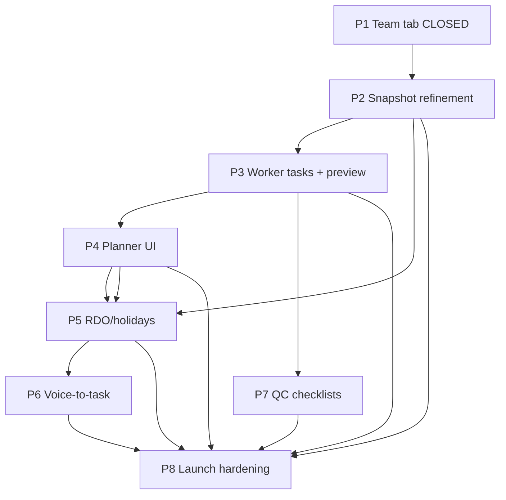

# W17 — Workforce Remaining Phase Plans

**Date:** 2026-06-26  
**Status:** Planning pack — **W17-P1 closed**; P2–P8 ready for sequential approval  
**Mode:** `/harden plan W17-workforce-remaining-phase-plans`  
**Sources:** [W17_P0B_ORIGINAL_WORKFORCE_REQUIREMENTS_FIT.md](./W17_P0B_ORIGINAL_WORKFORCE_REQUIREMENTS_FIT.md), [W17_WORKFORCE_REBUILD_PLAN.md](./W17_WORKFORCE_REBUILD_PLAN.md), [W16_WORKFORCE_CURRENT_CODE_ALIGNMENT_PLAN.md](./W16_WORKFORCE_CURRENT_CODE_ALIGNMENT_PLAN.md)

**Product principle:** Workers stay simple. Admin gets planning/control. Buildxact sync stays protected. Allocations are advisory.

**Verification (planning pass 2026-06-26):** W16 **14/14**, W15 **19/19**, build **pass**, cleanup **dry-run only** (nothing deleted).

---

## 1. Executive summary

The Workforce rebuild is a **restrained Deputy-replacement path**, not a rewrite. The timesheet + Buildxact foundation is working (W15/W16 baselines green). W17-P1 (Team tab) is **already shipped and closed**.

Remaining work is ordered for **launch readiness**:

1. **P2 Snapshot** — make the existing weekly grid the office review screen (status clarity + hours + previous-week default).
2. **P3 Worker tasks** — fix preview, category filter, `task_audience` enforcement (field ops blocker).
3. **P4 Planner** — advisory allocation UI on W16 backend (no new routes).
4. **P5 RDO/holidays** — display-only calendar layer (no accrual, no Xero sync).
5. **P6 Voice-to-task** — paste Plaud transcript (carpentry exists; extend to building).
6. **P7 QC v1** — leading-hand checklists via `site_tasks` (not a QC engine).
7. **P8 Launch hardening** — end-to-end smoke + full regression.

**Do not revert to Planner-first** without Sam approval and a documented blocker.

---

## 2. Approved revised phase order

> **RECONCILE 2026-07-19:** P2–P5 all SHIPPED (Snapshot review, Worker task/job/category, Planner + drag/ripple redesign, RDO/holiday display — see the Workforce memories + build log). P6 (voice-to-task) delivered ad hoc. Genuinely open: **P7** (leading-hand QC v1) and **P8** (deputy-replacement hardening / final launch gate), plus the optional P5b snapshot grey-overlay follow-on.

| # | Phase | Status | Next action |
|---|-------|--------|-------------|
| 1 | W17-P1 Team tab | **Closed** 2026-06-26 | — |
| 2 | W17-P2 Snapshot weekly review | **Shipped** | — |
| 3 | W17-P3 Worker task/job/category + preview | **Shipped** | — |
| 4 | W17-P4 Planner UI minimum | **Shipped** (+ P4b/c redesign) | — |
| 5 | W17-P5 RDO/public holiday display | **Shipped** | — |
| 6 | W17-P6 Voice-to-task transcript import | **Delivered ad hoc** | Close formally if desired |
| 7 | W17-P7 Leading-hand QC v1 | **Planned** (open) | After `task_audience` fix |
| 8 | W17-P8 Deputy replacement hardening | **Planned** (open, final gate) | Final gate |

---

## 3. Phase dependency map



**Hard dependencies:**
- P7 requires P3 (`task_audience` server filter + leading-hand visibility).
- P5 Snapshot grey cells require P2 Snapshot API shape stable (extend once for hours/status; add RDO/holiday overlay in P5).
- P8 requires all prior phases or explicit gap acceptance.

**W16 allocation backend:** Ready for P4 — no P4 blocker.

---

## 4. P1 — Team tab (CLOSED)

### What was done (verified from code)

| Item | Evidence |
|------|----------|
| `Team` in `TABS` | `Workforce.jsx` — `["Approvals", "Snapshot", "Mass Fill", "History", "Team"]` |
| Embedded Team | `<WorkforceTeam embedded />` in Team tab |
| Route compat | `App.jsx` — `/workforce/team` → `/workforce?tab=Team` (Option A redirect) |
| Employee CRUD unchanged | Logic in `WorkforceTeam.jsx` |
| Worker-link unchanged | `POST /api/workforce/employees/:id/worker-link` admin-only |
| Tests | `test:w17-team-tab-baseline:write` **13/13 pass** |

### Residual note (optional P1.1 — not required for close)

- `AppShell.jsx` still lists sidebar sub-link `{ to: "/workforce/team", label: "Team" }` — redirects safely; demote sidebar link in a future polish pass if Sam wants Team tab-only access.

---

## 5. P2 — Snapshot weekly timesheet review

### Business goal

Office reviews **previous week** timesheet completion: who logged, who is missing, submitted vs approved, hours per day.

### Current state (verified from code)

**API:** `GET /api/workforce/completion-snapshot?weekStart=` — `workforceRoutes.mjs` ~578–626  
- Returns `week_start`, `week_end`, `dates` (working days from `workforce_settings.working_days`), `employees[]` with `days[date]` as string state.
- States today: `done` (submitted|approved combined), `returned` (rejected), `missing`, `na`, or raw status char.
- **No hours** — only `timesheets.status`, not `timesheet_entries.hours`.

**UI:** `SnapshotTab` in `Workforce.jsx` ~741–808  
- Employee rows × working-day columns; week ←/→ navigation.
- Defaults to **current week** (`weekStart` empty → API uses `todayYmd()`).
- Missing count column present.

### Planned changes

| Change | Layer | Notes |
|--------|-------|-------|
| Default **previous week** on Monday–Wednesday | UI | Open decision: Mon–Wed show prior week; else current. Configurable constant. |
| **Submitted vs approved** distinct | API + UI | Extend `days[d]` to object: `{ state, status, hours }` |
| **Hours per day** | API + UI | Sum `timesheet_entries.hours` for employee+date; show in tooltip or sub-label |
| Rejected visual | UI | Keep ↩ amber (already exists) |
| RDO/holiday grey cells | **Deferred to P5** | Snapshot reads overlay table in P5 |

### API extension (smallest safe)

Extend `completion-snapshot` only — **read path, no timesheet writes:**

```js
// Per employee/day (proposed response shape)
days: {
  "2026-06-16": { state: "approved", status: "approved", hours: 8 },
  "2026-06-17": { state: "submitted", status: "submitted", hours: 7.5 },
  "2026-06-18": { state: "missing", status: null, hours: 0 },
}
```

Implementation: second query or join — `timesheets` + `timesheet_entries` aggregated by employee_id+date.

### UI cell colours (proposed)

| State | Visual |
|-------|--------|
| `approved` | Green ✓ |
| `submitted` | Blue ○ (pending approval) |
| `rejected` | Amber ↩ |
| `missing` | Red · |
| `na` | Grey – |
| `rdo` / `holiday` | Grey PH/RDO (P5) |

### Files likely touched

- `server/lib/workforceRoutes.mjs` — completion-snapshot read extension only
- `src/pages/Workforce.jsx` — `SnapshotTab` only

### Do not touch

Timesheet approve/sync, Buildxact, worker routes, Mass Fill, Approvals.

---

## 6. P3 — Worker task/job/category + preview fix

### Business goal

Worker selects job (building or carpentry) → sees tasks; category filter; admin preview matches real worker view; QC tasks hidden from normal workers.

### Current state (verified from code)

**WorkerTasks.jsx:**
- Job picker via `GET /api/worker/jobs` — building + carpentry, active + recent 90d timesheets.
- Tasks via `GET /api/worker/tasks?jobId&type&category`.
- Filters: All / My tasks / Urgent / Done — **no category dropdown**.

**Worker GET `/api/worker/tasks`** (~1622–1666):
- Filters by `project_id` or `carpentry_job_id`.
- Filters assignment: unassigned OR assigned to self (+ done tasks).
- **`task_audience` NOT filtered** — supervisor QC tasks leak to all workers (ADVERSARIAL_AUDIT D3).
- `SITE_TASK_CATEGORIES` whitelist: `general, defect, safety, materials, inspection` — **does not include carpentry labour categories** from mig 114 (`first_fix_framing`, etc.) — category filter would fail for carpentry tasks if added without widening whitelist.

**Preview broken (root cause — verified):**
- `WorkforceTeam.jsx` opens `/worker?preview=true&employeeId=${id}`.
- **`preview` and `employeeId` query params are never read** by worker app or backend.
- Admin preview uses `authFetch` → resolves **admin's** employee record, not target worker.
- **Why carpentry task didn't show in preview:** (1) wrong employee context, (2) job not selected with `jobType=carpentry`, (3) inactive job not in `workerVisibleJobs`, (4) task assigned to another employee.

### Planned changes

| # | Change | Layer |
|---|--------|-------|
| 1 | **Admin preview** — smallest: `GET /api/workforce/employees/:id/preview-context` returns read-only worker context OR workerAuth accepts `?previewEmployeeId=` gated to admin/supervisor | API + `WorkforceTeam.jsx` |
| 2 | **Category filter UI** on WorkerTasks | UI |
| 3 | Widen `SITE_TASK_CATEGORIES` in worker GET to match mig 114 labour categories | API |
| 4 | **`task_audience` filter:** workers see `worker` only; `is_leading_hand` sees `worker` + `supervisor` | API |
| 5 | Block complete on supervisor-only tasks for non-leading-hand (403 on POST complete) | API |

### Preview design options

| Option | Risk | Recommendation |
|--------|------|----------------|
| A: Admin opens real worker magic link (copy from Team) | Low | Document as manual smoke; keep preview button → open link |
| B: `?previewEmployeeId=` on worker routes, admin auth | Medium | **Recommended for P3** — read-only impersonation for tasks/jobs/me |
| C: Separate admin preview page duplicating worker UI | High | Avoid |

### Files likely touched

- `server/lib/workforceRoutes.mjs` — worker tasks GET, optional preview query, complete POST gate
- `src/pages/worker/WorkerTasks.jsx` — category dropdown only (no Log Hours changes)
- `src/pages/WorkforceTeam.jsx` — preview button behaviour
- `src/lib/workerFetch.js` — **only if** preview passes impersonation header (minimal)

### Do not touch

`WorkerLogHours.jsx` submit flow, worker token capture, timesheet routes.

---

## 7. P4 — Planner UI minimum

### Business goal

Admin/supervisor plans who is on which site each day — advisory only, not timesheets.

### Current state

- W16-A1 **closed** — migration 117, allocation CRUD routes, worker read routes.
- **No Planner tab** in UI yet.
- Mass Fill pattern proves fetch reuse: employees, operations projects, carpentry jobs.

### Planned scope

| In scope | Out of scope |
|----------|--------------|
| Add `Planner` tab to Workforce | Drag/drop, copy week |
| Week view: employees × Mon–Sun | RDO calendar |
| Create/edit/delete one allocation per employee per day | Worker prefill / WorkerHome card |
| Project XOR carpentry job picker | Schedule writes |
| 409 DUPLICATE_ALLOCATION visible | Cost forecasting |
| Reuse W16 APIs | New backend routes |

### Data fetch (parallel on mount)

- `GET /api/workforce/employees`
- `GET /api/operations/projects` — filter `status === "active"` client-side
- `GET /api/carpentry/jobs?status=active`
- `GET /api/workforce/allocations?from=&to=` (week bounds)

### Writes

- `POST/PUT/DELETE /api/workforce/allocations` — existing W16 routes

### Files likely touched

- `src/pages/Workforce.jsx` — add Planner tab
- `src/pages/workforce/WorkforcePlannerTab.jsx` — **new file**

### Schema / API changes

**None.**

---

## 8. P5 — RDO/public holiday display model

### Business goal

Display RDOs and public holidays in Snapshot/Planner without payroll accrual or Xero integration.

### Current state

- **No RDO or public holiday tables** (verified — grep finds no workforce RDO implementation).
- `workforce_settings.working_days` — global Mon–Fri default only.
- `docs/SCOPE_OF_WORKS` claimed RDO "done" — **mismatch; not in codebase**.

### Planned schema (new migration — e.g. 118)

```sql
-- workforce_public_holidays
--   id, holiday_date date UNIQUE, name text, state text DEFAULT 'SA'

-- workforce_employee_rdo_dates
--   id, employee_id uuid FK, rdo_date date, notes text
--   UNIQUE (employee_id, rdo_date)
```

### Rules

- RDO/holiday days → Snapshot cell state `rdo` or `holiday` — **do not count as missing**.
- No accrual calculation; Xero remains leave source of truth; webhook deferred.
- Planner may show grey/non-assignable cells (read-only overlay).
- **No impact** on timesheets, Buildxact, or finance labour reads.

### API (new, minimal)

- `GET/POST/DELETE /api/workforce/public-holidays` — admin
- `GET/POST/DELETE /api/workforce/employees/:id/rdo-dates` — admin/supervisor

### UI

- Team employee panel: RDO date list (add/remove)
- Settings or Workforce admin section: public holidays
- Snapshot + Planner: grey PH/RDO cells (depends on P2 object shape)

---

## 9. P6 — Voice-to-task transcript import

### Business goal

Paste Plaud site-walk transcript → draft tasks → review → save to `site_tasks`.

### Current state

- **Carpentry:** `POST /api/carpentry/jobs/:id/tasks/from-transcript` — returns `{ tasks, draft: true }` — creates nothing until UI posts keepers (`CarpentryJobDetail.jsx`).
- **AI:** `server/lib/voiceTasks.mjs` — Haiku, token-capped.
- **Whisper:** `POST /api/transcribe` — optional; not required for v1.
- **Building projects:** no `from-transcript` route on `/api/projects/:id/site-tasks`.

### V1 flow

1. Admin/supervisor selects job (building or carpentry).
2. Paste transcript (Plaud export).
3. `POST .../tasks/from-transcript` → draft list.
4. Review/edit/dedupe in UI.
5. Bulk save via existing `POST .../tasks` or `bulk` with `createdVia: "ai_extraction"`.
6. Store short summary on batch if needed — not full transcript on every row.

### Option comparison

| Option | v1? |
|--------|-----|
| A: Paste Plaud transcript | **Yes** |
| B: Plaud API direct | No — defer |
| C: Browser voice → Whisper → extract | Optional v2 |

### Files likely touched

- `server/lib/workforceRoutes.mjs` or `siteDiaryRoutes.mjs` — add building `from-transcript` (mirror carpentry)
- Shared component or `OperationsProjectDetail.jsx` — transcript paste UI (mirror `CarpentryJobDetail`)

---

## 10. P7 — Leading-hand QC checklist v1

### Business goal

Leading hand completes QC checklists per carpentry category before handover — visible warnings, not hard blocks.

### Current state

- `site_tasks` with `task_audience` (`worker`|`supervisor`) — mig 115.
- `employees.is_leading_hand` flag.
- Carpentry default stage checklists in `carpentryRoutes.mjs` `SITE_TASK_STAGES` with `category: "inspection"`.
- CarpentryJobDetail splits worker vs supervisor tasks client-side.
- Worker API does not enforce audience (fixed in P3).

### QC category mapping

| Sam category | `site_tasks.category` | `task_audience` |
|--------------|----------------------|-----------------|
| First fix / framing | `first_fix_framing` | `supervisor` |
| Roof / trusses | `first_fix_framing` or `roof_trusses`* | `supervisor` |
| Box gutter framing | `first_fix_framing` | `supervisor` |
| External cladding | `cladding` | `supervisor` |
| Fixing / second fix | `second_fix` | `supervisor` |
| Decking / external works | `outdoor_works` | `supervisor` |
| Defects / handover | `defect` + `inspection` | `supervisor` |

\*Add `roof_trusses` to category CHECK only if not mappable to existing — prefer reuse.

### Planned scope

- `POST /api/carpentry/jobs/:id/tasks/apply-qc-template` — seed QC rows per category (idempotent).
- Leading hand sees QC section in WorkerTasks when `is_leading_hand`.
- Photo/note required for `inspection` category completion (extend complete validation lightly).
- Incomplete QC → warning badge on carpentry job summary (admin) — not blocking timesheet/BX.

### Enforcement

- Warning only — no hard block on timesheet or Buildxact sync.

---

## 11. P8 — Deputy replacement hardening

### Launch readiness checklist

- [ ] Worker magic link → Log Hours → submit timesheet
- [ ] Worker My Week shows recent timesheets
- [ ] Worker selects job → sees tasks (building + carpentry)
- [ ] Leading hand sees QC tasks; normal worker does not
- [ ] Office Snapshot: previous week, statuses, hours, missing visible
- [ ] Team tab: employees, worker links, invites
- [ ] Planner: weekly allocations (advisory)
- [ ] RDO/holidays visible in Snapshot
- [ ] Voice-to-task paste works (both job types)
- [ ] Buildxact sync unchanged — W15/W16 baselines pass
- [ ] Full regression: W17 + W16 + W15 + build

### P8 deliverables

- `scripts/batch-a/w17-launch-readiness.mjs` — orchestrated smoke
- Manual smoke script in this doc (section 14)
- Update `RELEASE_READINESS.md` Workforce section

---

## 12. Protected paths

**No phase may modify without Sam approval + failing regression:**

| Path | Location |
|------|----------|
| `syncTimesheetToBuildexact()` | `workforceRoutes.mjs` ~231 |
| `approveSingleTimesheet()` | `workforceRoutes.mjs` ~412 |
| `POST /api/workforce/timesheets/:id/approve` | ~786 |
| `POST /api/workforce/timesheets/:id/sync` | ~803 |
| `POST /api/workforce/timesheets/sync-pending` | ~826 |
| `POST/GET /api/worker/timesheets*` | worker block |
| `WorkerLogHours.jsx` core submit | worker PWA |
| `workerFetch.js` token flow | `src/lib/workerFetch.js` |
| `POST /api/workforce/employees/:id/worker-link` | ~1269 |

---

## 13. Required tests by phase

### Cross-phase regression (after every implementation phase)

```bash
npm run test:w16-allocation-baseline:write
npm run test:w15-timesheet-auth:write
npm run build
npm run test:cleanup-artifacts   # dry-run only
```

### Test matrix

| ID | Phase | Type | Script (planned) |
|----|-------|------|------------------|
| W17-REQ-TEAM-01 | P1 | static/UI | `w17-team-tab-baseline.mjs` ✅ |
| W17-REQ-TEAM-02 | P1 | static | same ✅ |
| W17-REQ-TS-01 | P2 | API | `w17-snapshot-baseline.mjs` |
| W17-REQ-TS-02 | P2 | API | same |
| W17-REQ-TS-03 | P2 | API + static | same |
| W17-REQ-TS-04 | P2 | API | same |
| W17-REQ-TASK-01 | P3 | API write | `w17-worker-tasks-baseline.mjs` |
| W17-REQ-TASK-02 | P3 | API write | same |
| W17-REQ-TASK-03 | P3 | API write | same |
| W17-REQ-TASK-04 | P3 | API write | same |
| W17-REQ-TASK-05 | P3 | security | same |
| W17-REQ-TASK-06 | P3 | security | same |
| W17-REQ-PLAN-01 | P4 | static/UI | `w17-planner-baseline.mjs` |
| W17-REQ-PLAN-02 | P4 | API write | same |
| W17-REQ-PLAN-03 | P4 | API write | same |
| W17-REQ-PLAN-04 | P4 | API write | same |
| W17-REQ-RDO-01 | P5 | API write | `w17-rdo-baseline.mjs` |
| W17-REQ-RDO-02 | P5 | API + UI | same |
| W17-REQ-VOICE-01 | P6 | API | `w17-voice-tasks-baseline.mjs` |
| W17-REQ-VOICE-02 | P6 | API write | same |
| W17-REQ-VOICE-03 | P6 | API write | same |
| W17-REQ-QC-01 | P7 | API write | `w17-qc-baseline.mjs` |
| W17-REQ-QC-02 | P7 | security | same |
| W17-REQ-QC-03 | P7 | API write | same |
| W17-REQ-LAUNCH-01 | P8 | integration | `w17-launch-readiness.mjs` |
| W17-REQ-LAUNCH-02 | P8 | integration | same |
| W17-REQ-LAUNCH-03 | P8 | regression | W15 + W16 + static guard |

**Artifact rule:** all write tests use `BLH TEST` + `buildTestJobAddress()`.

---

## 14. Manual smoke tests by phase

### P1 (closed)

1. `/workforce` → tabs include Team  
2. Team tab → employee list loads  
3. Admin → worker-link flow present  
4. `/workforce/team` → lands on Team tab  
5. Other tabs unchanged  

### P2

1. Open Snapshot → defaults to **previous week** (Mon–Wed) or current  
2. Full-time employee with approved timesheet → green ✓  
3. Submitted-only → blue ○  
4. Rejected → amber ↩  
5. Missing day → red ·  
6. Hover/tooltip shows hours  
7. Missing count column accurate  

### P3

1. Worker link → Tasks → pick carpentry job → see carpentry task added in admin  
2. Category filter narrows list  
3. Normal worker does not see supervisor QC task  
4. Leading hand sees supervisor tasks  
5. Admin preview (fixed) shows same tasks as worker for selected employee  

### P4

1. Planner tab → week grid loads  
2. Create allocation → cell shows address  
3. Duplicate same employee+date → 409 message  
4. Edit/delete works  
5. Approvals/Snapshot/Mass Fill/History/Team still load  

### P5

1. Add public holiday → Snapshot shows grey PH  
2. Add employee RDO → not counted as missing  
3. Timesheet missing logic unchanged for normal days  

### P6

1. Carpentry job → paste transcript → drafts appear → save → worker sees tasks  
2. Building project → same flow after route added  

### P7

1. Apply QC template on carpentry job  
2. Leading hand completes inspection task with photo  
3. Normal worker cannot complete supervisor QC  

### P8

Full Deputy replacement walkthrough — office + field + BX sync spot-check.

---

## 15. Data model changes by phase

| Phase | Schema change |
|-------|---------------|
| P1 | None |
| P2 | None (read extension only) |
| P3 | None |
| P4 | None (uses mig 117) |
| P5 | **New:** `workforce_public_holidays`, `workforce_employee_rdo_dates` |
| P6 | None (optional batch summary table — defer) |
| P7 | None (uses `site_tasks`; optional seed JSON) |
| P8 | None |

---

## 16. Route/API changes by phase

| Phase | New/changed routes |
|-------|-------------------|
| P1 | Redirect only — **done** |
| P2 | Extend `GET /api/workforce/completion-snapshot` response |
| P3 | Extend `GET /api/worker/tasks`; optional preview impersonation; gate `POST .../complete` |
| P4 | None |
| P5 | CRUD public holidays + employee RDO dates |
| P6 | `POST /api/projects/:id/site-tasks/from-transcript` |
| P7 | `POST /api/carpentry/jobs/:id/tasks/apply-qc-template` (or extend apply-template) |
| P8 | None |

---

## 17. UI files likely touched by phase

| Phase | Files |
|-------|-------|
| P1 ✅ | `Workforce.jsx`, `WorkforceTeam.jsx`, `App.jsx` |
| P2 | `Workforce.jsx` (`SnapshotTab` only) |
| P3 | `WorkerTasks.jsx`, `WorkforceTeam.jsx`, optionally `workerFetch.js` |
| P4 | `Workforce.jsx`, new `WorkforcePlannerTab.jsx` |
| P5 | `WorkforceTeam.jsx`, Snapshot/Planner cells, new small admin components |
| P6 | `CarpentryJobDetail.jsx`, `OperationsProjectDetail.jsx` or shared import component |
| P7 | `WorkerTasks.jsx`, `CarpentryJobDetail.jsx` |
| P8 | Docs + test scripts only |

**Never in any phase:** `WorkerLogHours.jsx` core submit, `WorkerHome.jsx` (unless P8 explicit card — deferred).

---

## 18. Risk register

| ID | Risk | Phase | Mitigation |
|----|------|-------|------------|
| W17-RISK-01 | Accidental edit to BX sync during Workforce UI work | All | Static guard in every W17 test suite; protected path list |
| W17-RISK-02 | Snapshot API change breaks Mass Fill/Approvals | P2 | Extend response only; keep string fallback or version field |
| W17-RISK-03 | Preview impersonation security hole | P3 | Admin/supervisor only; read-only for worker routes; audit log defer |
| W17-RISK-04 | Category whitelist mismatch (mig 114) | P3 | Align `SITE_TASK_CATEGORIES` with carpentry CHECK |
| W17-RISK-05 | RDO scope doc vs code mismatch | P5 | This plan; no false "done" claims |
| W17-RISK-06 | Planner confused with timesheets | P4 | UI copy: "planning only — does not log hours" |
| W17-RISK-07 | Voice-to-task saves without review | P6 | Draft endpoint creates nothing; UI gate |
| W17-RISK-08 | QC hard-block breaks field flow | P7 | Warning only |
| W17-RISK-09 | Sidebar Team link duplicates tab | P1 | Redirect works; optional AppShell demote in polish |

---

## 19. Exact implementation prompt — W17-P1 (CLOSED)

```text
W17-P1 is CLOSED (2026-06-26). Do not re-implement unless regression fails.

Verification:
  npm run test:w17-team-tab-baseline:write   # 13/13
  npm run test:w16-allocation-baseline:write
  npm run test:w15-timesheet-auth:write
  npm run build
  npm run test:cleanup-artifacts  # dry-run only
```

---

## 20. Future implementation prompts (P2–P8 drafts)

### W17-P2 — Snapshot weekly review

```text
Implement W17-P2 Snapshot refinement only.

Scope:
- Extend GET /api/workforce/completion-snapshot to return per-day { state, status, hours }.
- Update SnapshotTab: distinct submitted (blue) vs approved (green); rejected (amber); missing (red).
- Default week: previous week when today is Mon–Wed (constant at top of SnapshotTab).
- Show hours in cell title/tooltip.
- Do NOT touch timesheet write paths, Buildxact, worker app, other tabs.

Tests: scripts/batch-a/w17-snapshot-baseline.mjs (W17-REQ-TS-01–04).
Regression: W17 team, W16, W15, build, cleanup dry-run.
Artifacts: BLH TEST + buildTestJobAddress().
```

### W17-P3 — Worker tasks + preview

```text
Implement W17-P3 Worker task/job/category + preview fix only.

Scope:
- Add category filter dropdown to WorkerTasks.jsx (use API ?category=).
- Widen SITE_TASK_CATEGORIES in worker GET to include mig 114 labour categories.
- Filter task_audience: workers see worker only; is_leading_hand sees supervisor too.
- Gate POST /api/worker/tasks/:id/complete for supervisor tasks (non-leading-hand → 403).
- Fix admin preview: admin/supervisor ?previewEmployeeId= on worker GET routes OR dedicated preview-context endpoint.
- Do NOT change WorkerLogHours, worker token flow, timesheet routes.

Tests: w17-worker-tasks-baseline.mjs (W17-REQ-TASK-01–06).
```

### W17-P4 — Planner UI minimum

```text
Implement W17-P4 Planner UI minimum only.

Scope:
- Add Planner tab to Workforce.jsx; new WorkforcePlannerTab.jsx.
- Week grid; CRUD via existing /api/workforce/allocations.
- Fetch employees, operations/projects (active filter), carpentry/jobs?status=active.
- Show DUPLICATE_ALLOCATION (409) on conflict.
- No drag/drop, RDO, worker prefill, schedule writes, new backend routes.

Tests: w17-planner-baseline.mjs (W17-REQ-PLAN-01–04 + REG tabs).
```

### W17-P5 — RDO/public holidays

```text
Implement W17-P5 RDO/public holiday display model only.

Scope:
- Migration: workforce_public_holidays, workforce_employee_rdo_dates.
- CRUD routes (admin/supervisor as appropriate).
- Team UI: employee RDO dates; admin public holidays list.
- Snapshot (+ Planner when exists): grey PH/RDO cells; exclude from missing count.
- No accrual, no Xero webhook, no timesheet/BX changes.

Tests: w17-rdo-baseline.mjs (W17-REQ-RDO-01–02).
```

### W17-P6 — Voice-to-task

```text
Implement W17-P6 Voice-to-task transcript import only.

Scope:
- POST /api/projects/:id/site-tasks/from-transcript (mirror carpentry; reuse voiceTasks.mjs).
- UI on OperationsProjectDetail (or shared component) — paste → draft → review → save.
- Draft endpoint creates nothing until explicit save.
- Carpentry path unchanged (regression test).

Tests: w17-voice-tasks-baseline.mjs (W17-REQ-VOICE-01–03).
```

### W17-P7 — Leading-hand QC v1

```text
Implement W17-P7 Leading-hand QC checklist v1 only.

Scope:
- QC template apply per carpentry job (7 Sam categories → site_tasks rows, task_audience=supervisor).
- Leading hand QC view in WorkerTasks (requires P3 audience filter).
- Photo/note required for inspection category completion where practical.
- Incomplete QC warning on CarpentryJobDetail — not hard block.

Tests: w17-qc-baseline.mjs (W17-REQ-QC-01–03).
Depends on: P3 task_audience enforcement.
```

### W17-P8 — Launch hardening

```text
Implement W17-P8 Deputy replacement launch hardening.

Scope:
- scripts/batch-a/w17-launch-readiness.mjs orchestrating worker + office + BX regression smokes.
- Manual smoke checklist execution; update RELEASE_READINESS.md.
- No new product features unless gap found in smoke.
- Full regression: all W17 phase tests + W16 + W15 + build.

Tests: W17-REQ-LAUNCH-01–03.
```

---

## Document history

| Date | Change |
|------|--------|
| 2026-06-27 | **W17-P5b → P8 build push complete.** **P5b:** Snapshot greys RDO/holiday cells + excludes them from the displayed "missing" count (client overlay via `non-working-days`). **P6 voice-to-tasks:** new `POST /api/projects/:id/site-tasks/from-transcript` (mirror of carpentry — draft tasks, creates nothing) + paste/review/save panel in `OperationsProjectDetail`; saves via the existing `/bulk` (`ai_extraction`). **P7 leading-hand QC:** new `POST /api/projects/:id/site-tasks/apply-qc-template` (7 supervisor-audience inspection tasks, idempotent by title) + Operations "+ QC checklist" button + incomplete-QC warning + a worker-view **QC** badge; the P3 audience gate (leading-hand-only visibility + completion) already enforces access. **P8 deputy-replacement gate:** new `test:w17-workforce-gate` runs the whole surface (W15 + W16 + W17 P1–P7) in one pass. **Migrations 118 + 119 now applied** — colour/board/days-off persistence + SA seed + RDO pattern-expansion verified live. Gate **137/137, 0 gaps**. Protected sync/timesheet/Buildxact + allocation routes untouched. New tests `w17-voice-tasks`, `w17-qc`, the gate runner; new package scripts. Manual smoke (pointer DnD + AI extraction) recommended. |
| 2026-06-27 | Planner **duplicate-downwards** (Sam ask) — a second fill handle on the **bottom** edge of a shift chip: drag **down the day-column** to copy that job to other workers on the same day (drag back up = deduct), mirroring the horizontal across-days fill. Frontend-only (reuses allocation create/delete — no migration, no backend, no protected-path change). Tests `w17-planner-dnd` **21/21 + 2 gaps** (added W17-REQ-PLAN-DnD-12: wiring + same-job-multiple-workers-one-day, no false 409); baseline 12/12 + rdo 11/11+2 + W16 14/14 + W15 19/19 + build + lint clean. Manual smoke (pointer drag) required. |
| 2026-06-27 | **W17-P5 RDO + public-holiday DISPLAY model** shipped (Sam-approved: RDO = both manual dates + recurring patterns · seed SA holidays + manual edit · display-only marker). New **migration 119** (3 isolated deny-all tables: `workforce_public_holidays`, `workforce_employee_rdo_dates`, `workforce_rdo_patterns`) + additive admin/supervisor routes (holidays CRUD + **computus-based `seed-sa`**, RDO dates CRUD, RDO patterns CRUD, combined `GET /api/workforce/non-working-days` with **week-aligned pattern expansion**). Planner greys/badges non-working cells (still allocatable) + a **"Days off"** management panel. **Display-only** — no accrual/Xero/Buildxact/timesheet; advisory; admin/supervisor only; W16 allocation routes untouched. Tests `w17-rdo-holiday` **11/11 + 2 gaps** (SA-seed + pattern-expand gap-document until mig 119; computus + fortnightly math independently verified); planner-dnd 19/19 + baseline 12/12 + W16 14/14 + W15 19/19 + build + lint clean. **Snapshot grey-overlay deferred** to a small P5b follow-on. |
| 2026-06-27 | **W17-P4b + P4c Planner drag-drop + colour + board curation** shipped (Sam-approved). **P4b:** @dnd-kit drag — legend→cell assign, chip→cell move, swap-on-occupied, drag-across fill/deduct, ×/notes-popover, per-job colour (palette + pick-and-save). **P4c:** opt-in **board curation** (Add-jobs picker; legend = on_board ∪ allocated-this-week), **global**, + **seamless moves** (optimistic local update + silent reconcile — no reload-to-top). New isolated **migration 118** `workforce_planner_jobs` (colour + on_board; deny-all RLS); +2 additive routes `GET/PUT /api/workforce/planner-jobs` (graceful 503 `MIGRATION_PENDING` until applied). Reuses W16 allocation routes unchanged; advisory-only; admin/supervisor only; protected sync/timesheet/Buildxact untouched. Tests `w17-planner-dnd` **19/19 + 2 gaps** (colour + board persist gap-document until mig 118 applied); baseline 12/12 + W16 14/14 + W15 19/19 + build + lint clean. |
| 2026-06-26 | **W17-P4 Planner UI minimum** shipped (Sam-approved: new tab · employee-first grid · new component). `src/pages/workforce/WorkforcePlannerTab.jsx` = employee×Mon–Sun week grid on the existing W16 allocation routes — create/edit-by-replace/delete per cell, project XOR carpentry picker, optional notes, duplicate employee/date = **hard 409**, **advisory-only** (no timesheet/approve/sync/Buildxact). Admin/supervisor only (gated in `Workforce.jsx` + `requireRole`). No backend/schema change. Tests `w17-planner-baseline` **12/12** (W17-REQ-PLAN-01..06); W15 19/19 + W16 14/14 + build + lint clean. Files: `Workforce.jsx`, new `WorkforcePlannerTab.jsx`, `w17-planner-baseline(.mjs/run-)`, `package.json`, docs. |
| 2026-06-26 | W17-P3 preview panel **finalised to Option-B spec** — converted from modal to an **inline Team-tab panel** (table hides while previewing), Sam's read-only banner wording, employee+job pickers + selected-worker/job summary + Today summary + enriched task rows (priority/category/status/assigned/QC). Tests `w17-worker-tasks` **22/22** (W17-REQ-PREVIEW-01/02/03 + AUTHZ/JOBS); W15 19/19 + W16 14/14 + build + lint clean. Only `WorkforceTeam.jsx` + test touched. |
| 2026-06-26 | **W17-P3 Product UI complete** (Sam Option B) — read-only "Preview as worker" panel added in WorkforceTeam (employee + job pickers side-by-side, Today summary + Tasks); the old broken `/worker?preview` button repointed to it; preview route now also returns the worker's visible jobs for the picker. Tests `w17-worker-tasks` **21/21** (+W17-REQ-PREVIEW-UI/-03); W15 19/19 + W16 14/14 + build + lint clean. Protected paths untouched. |
| 2026-06-26 | **W17-P3 Worker tasks/job/category + preview SHIPPED** — server-side `task_audience` filter on `/api/worker/tasks` (closes the D3 leak: normal workers no longer see supervisor/QC tasks; leading hands do); category dropdown widened to mig-114 labour streams; read-only console preview route `GET /api/workforce/employees/:id/task-preview` (admin/supervisor); QC complete-gated to leading hands. Tests `w17-worker-tasks` 19/19; W15 19/19 + W16 14/14 + build green. Protected sync/approve/WorkerLogHours untouched. **Pending:** admin "preview as worker" UI button (WorkforceTeam — out of P3 allowed files; follow-up). |
| 2026-06-26 | **W17-P2 Snapshot weekly review SHIPPED** — `completion-snapshot` per-day value now `{state,status,hours}` (read-only); `SnapshotTab` refined (prev-week default Mon–Wed, approved/submitted/rejected/missing/na, hours/day, string+object tolerant). Tests `w17-snapshot-review` 17/17; W15 19/19 + W16 14/14 + build green. Protected sync/approve/worker untouched. |
| 2026-06-26 | Initial remaining phase plans — P1 closed; P2–P8 detailed; verification green |
