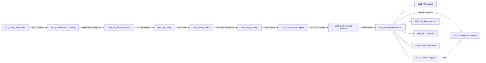

# Workflow Map Master

**Status:** 2026-06-22  
**Purpose:** Index of mapped end-to-end workflows under the 30-day hardening program. Each workflow has a dedicated doc in `docs/qa/workflows/` before code fixes.

**Rules:** No rewrite, no new modules, no UI redesign, no route/table renames, no god-file splits. Map → tests → smallest-safe fixes.

---

## Mapped workflows

| # | Workflow | Doc | Status | Priority |
|---|----------|-----|--------|----------|
| 01 | Lead / Enquiry / CRM Intake | [workflows/01_LEAD_CRM_INTAKE.md](./workflows/01_LEAD_CRM_INTAKE.md) | **Mapped** | P0 |
| 02 | Lead Qualification / Discovery | [workflows/02_LEAD_QUALIFICATION_DISCOVERY.md](./workflows/02_LEAD_QUALIFICATION_DISCOVERY.md) | **Mapped** | P0 |
| 03 | Fee Proposal / PTSA | [workflows/03_FEE_PROPOSAL_PTSA.md](./workflows/03_FEE_PROPOSAL_PTSA.md) | **Mapped** | P1 |
| 04 | Estimate / Buildxact / Job Setup | [workflows/04_ESTIMATE_BUILDXACT_TENDER_SETUP.md](./workflows/04_ESTIMATE_BUILDXACT_TENDER_SETUP.md) | **Mapped** | P1 |
| 05 | Tender Board / Lifecycle | [workflows/05_TENDER_BOARD_LIFECYCLE.md](./workflows/05_TENDER_BOARD_LIFECYCLE.md) | **Mapped** | P1 |
| 06 | RFQ Package / Scope Extraction | [workflows/06_RFQ_PACKAGE_SCOPE_EXTRACTION.md](./workflows/06_RFQ_PACKAGE_SCOPE_EXTRACTION.md) | **Mapped** | P0 |
| 07 | RFQ Send / Quote Matching | [workflows/07_RFQ_SEND_QUOTE_MATCHING.md](./workflows/07_RFQ_SEND_QUOTE_MATCHING.md) | **Mapped** | P0 |
| 08 | Quote Comparison / Accept Quote | [workflows/08_QUOTE_COMPARISON_ACCEPT_QUOTE.md](./workflows/08_QUOTE_COMPARISON_ACCEPT_QUOTE.md) | **Mapped** | P0 |
| 09 | Tender Win / Operations Handoff | [workflows/09_TENDER_WIN_OPERATIONS_HANDOFF.md](./workflows/09_TENDER_WIN_OPERATIONS_HANDOFF.md) | **Mapped** | P0 |
| 10 | Procurement Planning / Register | [workflows/10_PROCUREMENT_PLANNING_REGISTER.md](./workflows/10_PROCUREMENT_PLANNING_REGISTER.md) | **Mapped** | P1 |
| 11 | Purchase Orders / Supplier Commitments | [workflows/11_PURCHASE_ORDERS_SUPPLIER_COMMITMENTS.md](./workflows/11_PURCHASE_ORDERS_SUPPLIER_COMMITMENTS.md) | **Mapped** | P1 |
| 12 | Scheduling / Critical Path / EOT | [workflows/12_SCHEDULING_CRITICAL_PATH_EOT.md](./workflows/12_SCHEDULING_CRITICAL_PATH_EOT.md) | **Mapped** | P1 |
| 13 | Site Operations / Diary / Media | [workflows/13_SITE_OPERATIONS_DIARY_MEDIA.md](./workflows/13_SITE_OPERATIONS_DIARY_MEDIA.md) | **Mapped** | P2 |
| 14 | WHS / Inductions / SWMS / Incidents | [workflows/14_WHS_INDUCTIONS_SWMS_INCIDENTS.md](./workflows/14_WHS_INDUCTIONS_SWMS_INCIDENTS.md) | **Mapped** | P1 |
| 15 | Workforce / Timesheets / Buildxact WO | [workflows/15_WORKFORCE_TIMESHEETS_BUILDXACT_WORK_ORDERS.md](./workflows/15_WORKFORCE_TIMESHEETS_BUILDXACT_WORK_ORDERS.md) | **Mapped** | P1 |
| 18 | Client Portal / Client Actions | [workflows/18_CLIENT_PORTAL_LIFECYCLE.md](./workflows/18_CLIENT_PORTAL_LIFECYCLE.md) | **Mapped** | P1 |

**Not indexed here (scout note 2026-06-27):** W16 Finance, W17 Job Command Centre — mapped elsewhere or Claude-owned; add index rows when Sam approves scope.

---

## Cross-workflow handoffs

**Critical link W01 → W02:** Lead row exists with minimum contact and project context for qualification — does **not** require `job_id` or `site_address`.

**Critical link W04/W05 → W06:** Real `jobs.address` (P0-A3); `job_id` on package; extraction or prefill from lead.

**Critical link W03/W04 → W05:** Before RFQ Engine / Tender Board treat the opportunity as a tender job, the lead must have a real `site_address` and a valid linked `jobs` row.

**RFQ / Tender — Batch B cross-cutting reference:** [RFQ_TENDER_WORKFLOW_SOURCE_OF_TRUTH.md](./RFQ_TENDER_WORKFLOW_SOURCE_OF_TRUTH.md) (not a numbered workflow; see W06–W09).

**Batch B mapping priority (2026-06-25):** W06 ✅ → W07 ✅ → W08 ✅ → W09 ✅ — **Batch B P0 complete.**

**Batch C mapping (2026-06-25):** W10–W15 ✅ — review: [BATCH_C_REVIEW_PACK.md](./BATCH_C_REVIEW_PACK.md). **No fixes until Sam approves P0-C order.**

**Batch E mapping (2026-06-28):** W22 ✅ CRM / Mailing List — [22_CRM_RELATIONSHIPS_MAILING_LIST.md](./workflows/22_CRM_RELATIONSHIPS_MAILING_LIST.md); SAM-W22-001 decided (global unsubscribe suppression); **W22-SEC-001 fix shipped** (Sam-approved, pending staging run). **W23 / W24 / W25 still to map** (W23-DRIFT-001 + W24-DRIFT-001 registered, map-gated).

**W07 runtime note (2026-06-25):** Active mail transport **Resend** (`GET /api/integrations/status` → `mail.transport: "resend"`). Hub `correspondence` is outbound/inbound SoT; mailbox Sent not guaranteed.

---

## Related docs

| Doc | Role |
|-----|------|
| [COMPREHENSIVE_HARDENING_MASTER_PLAN.md](./COMPREHENSIVE_HARDENING_MASTER_PLAN.md) | **Autonomous hardening machine — constitution** (loop, agents, gates, handoff in [hardening_loop/](./hardening_loop/)) |
| [BATCH_C_REVIEW_PACK.md](./BATCH_C_REVIEW_PACK.md) | Batch C review — P0-C candidates (W10–W15) |
| [BATCH_B_REVIEW_PACK.md](./BATCH_B_REVIEW_PACK.md) | Batch B review — P0-B1–B5 candidates (W06–W09) |
| [BATCH_A_REVIEW_PACK.md](./BATCH_A_REVIEW_PACK.md) | Days 6–8 actionable review (P0 candidates, tests, decisions) |
| [BATCH_A_HARDENING_RESULT.md](./BATCH_A_HARDENING_RESULT.md) | Batch A P0 hardening result (post-fix) |
| [BATCH_A_SALES_TO_TENDER_SUMMARY.md](./BATCH_A_SALES_TO_TENDER_SUMMARY.md) | Batch A mapping summary (W01–W05) |
| [WORKFLOW_OWNERSHIP_MATRIX.md](./WORKFLOW_OWNERSHIP_MATRIX.md) | Table/route/screen ownership per workflow |
| [WORKFLOW_TEST_MATRIX.md](./WORKFLOW_TEST_MATRIX.md) | Test ID → status |
| [BUG_REGISTER.md](./BUG_REGISTER.md) | Drift and bugs with regression IDs |
| [SAM_DECISION_LOG.md](./SAM_DECISION_LOG.md) | Business decisions pending Sam approval |
| [30_DAY_HARDENING_TRACKER.md](./30_DAY_HARDENING_TRACKER.md) | Sprint progress, lanes, rhythm |
| [MODULE_BOUNDARIES.md](./MODULE_BOUNDARIES.md) | Module → pages → routes |
| [E2E_TESTING_MASTER_PLAN.md](./E2E_TESTING_MASTER_PLAN.md) | Playwright / CI strategy |

---

## Legacy reference

Older narrative workflow descriptions remain in [docs/agent_knowledge/WORKFLOW_MAP.md](../agent_knowledge/WORKFLOW_MAP.md) (2026-05-21). **QA workflow docs in `docs/qa/workflows/` supersede for hardening** when they conflict.

---

## Document history

| Date | Change |
|------|--------|
| 2026-06-28 | W22 mapped (Batch E started) — CRM/Mailing List; SAM-W22-001 decided; W22-SEC-001 fix shipped |
| 2026-06-25 | W10–W15 mapped — Batch C complete; BATCH_C_REVIEW_PACK.md |
| 2026-06-25 | BATCH_B_REVIEW_PACK.md linked |
| 2026-06-25 | W09 mapped — tender win / operations handoff; Batch B mapping complete |
| 2026-06-25 | W08 accepted — SAM-W08-001–003 decided |
| 2026-06-25 | W08 mapped — quote accept, amount fields, win handoff gaps |
| 2026-06-25 | W07 accepted — SAM-W07-001–004 decided |
| 2026-06-25 | W07 mapped — RFQ send, IMAP match, Resend transport |
| 2026-06-25 | Batch B parking lot refined; mapping priority W06→W07→W08→W09 |
| 2026-06-25 | W06 mapped — Batch B started |
| 2026-06-24 | BATCH_A_SALES_TO_TENDER_SUMMARY.md linked |
| 2026-06-24 | W05 mapped — Batch A mapping complete |
| 2026-06-24 | W04 mapped; W03 accepted after track naming + DRIFT-009 |
| 2026-06-24 | W03 mapped; W01→W02 / W03–W05 handoff wording; RFQ as Batch B reference |
| 2026-06-22 | Workflow 01 + RFQ index |
