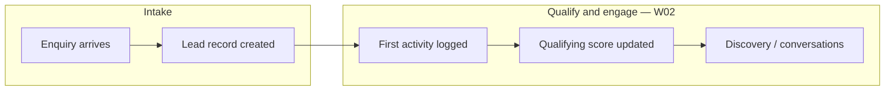

# Workflow 01 — Lead / Enquiry / CRM Intake

**Status:** Upgraded (2026-06-22) — Batch A mapping; no product code changes  
**Gate:** Sam review before implementation  
**Related:** [WORKFLOW_MAP_MASTER.md](../WORKFLOW_MAP_MASTER.md), [WORKFLOW_TEST_MATRIX.md](../WORKFLOW_TEST_MATRIX.md), [BUG_REGISTER.md](../BUG_REGISTER.md), [SAM_DECISION_LOG.md](../SAM_DECISION_LOG.md)

**Hands off to:** [Workflow 02 — Lead Qualification / Discovery](./02_LEAD_QUALIFICATION_DISCOVERY.md) (not yet created)

---

## Evidence standards (used in this document)

| Label | Meaning |
|-------|---------|
| **Verified from code** | Confirmed in repo file, route, table, or migration |
| **Verified from SOP/docs** | Stated in SOP or agent knowledge doc |
| **Inferred from behaviour** | Logical conclusion from code paths; not directly asserted in docs |
| **Unconfirmed / needs testing** | Plausible but not proven by read-only audit |
| **Open decision for Sam** | Business rule choice — see [SAM_DECISION_LOG.md](../SAM_DECISION_LOG.md) |

---

## 1. Business intent

Blue Leaf needs every enquiry — phone, email, website form, referral, architect tender, or CRM contact — captured once, with enough detail to qualify, follow up, and move toward discovery, fee proposal, tender, and eventual job conversion.

**Verified from SOP/docs:** SOP 02-01 (create lead) — same-day capture; manual path requires first/last name and starts at Enquiry.

**Inferred from behaviour:** Tender/RFQ work should not start until a real `site_address` exists on the lead and a `jobs` row is linked — enforced later at convert-to-job (W04), not at intake.

---

## 2. Start trigger

| Trigger | Evidence |
|---------|----------|
| Staff opens Sales Pipeline and creates a lead | **Verified from code:** `SalesPipeline.jsx` → `POST /api/sales/leads` |
| Website visitor submits enquiry form | **Verified from code:** `POST /api/public/enquiry` in `marketingIntelligenceRoutes.mjs:245` |
| Staff converts CRM contact to lead | **Verified from code:** `POST /api/crm/contacts/:id/convert` in `crmRoutes.mjs` |
| Architect tender fast-track drawer | **Verified from code:** `SalesPipeline.jsx` posts `lead_type: "architect_tender"`, `stage: "accepted"` |
| E2E seed / scripts direct DB insert | **Verified from code:** `scripts/seed-e2e-suite.mjs` — bypasses API audit |

---

## 3. End / handoff

**End state:** Lead row exists in pipeline with minimum contact + project context; ideally first audit entry on timeline.

**Hands off to Workflow 02** when staff begin qualification, discovery, or stage progression beyond raw intake.

**Verified from code:** Lead Detail and pipeline are the primary surfaces for W02 work; no server workflow state machine gates intake → qualification.

---

## 4. Main users

| User | Role | Evidence |
|------|------|----------|
| Sam / Josh | Directors — pipeline oversight | **Verified from SOP/docs:** Sales SOPs owner Admin |
| Sales / admin staff | Manual lead entry, CRM convert | **Verified from code:** `/sales/*` requires `admin` via `RoleRoute` in `App.jsx` |
| Website visitors | Public enquiry only | **Verified from code:** `POST /api/public/enquiry` has no `requireAuth` |
| Marketing attribution | Session UTM on website path | **Verified from code:** `attribution_events` + `enquiry_attribution` when `session_id` present |

---

## 5. Blue Leaf business workflow



Plain-English path (W01 scope only):

1. **Enquiry arrives** — phone/email/form/referral/CRM.
2. **Lead record created** — name, contact, suburb, project type, description, source.
3. **Optional first contact logged** — call, email, meeting (W02 continues here).
4. **Handoff** — lead visible on pipeline; staff can open Lead Detail for qualification.

**Verified from SOP/docs:** SOP 02-01 — capture same day; SOP 02-03 — log activity after meaningful contact.

---

## 6. Hub workflow target

The Hub should:

1. Create `leads` row from every intake path with consistent field mapping.
2. Record creation audit in `lead_activities` for every path (**Open decision:** [SAM-W01-001](../SAM_DECISION_LOG.md)).
3. Display lead name consistently on pipeline cards (**Open decision:** [SAM-W01-002](../SAM_DECISION_LOG.md)).
4. Capture `lead_source` and UTM attribution for website enquiries.
5. Link CRM contact via `converted_lead_id` on convert.
6. Restrict staff intake UI to authenticated admin users.
7. Accept public enquiries without auth but with validation and abuse controls (**Unconfirmed:** rate limiting — see §17).

---

## 7. SOP interpretation

| SOP | What it says | Code alignment |
|-----|--------------|----------------|
| [sales_create_new_lead.md](../../sops/02_sales/sales_create_new_lead.md) | Manual `+ New lead`; first/last name; stage Enquiry | **Verified from code:** `POST /api/sales/leads` defaults stage |
| [02-02_move_lead_through_stages.md](../../sops/02_sales/02-02_move_lead_through_stages.md) | Do not move speculatively; stage change records activity | **Partial drift:** pipeline bypasses gates (W02) |
| [02-03_log_activity.md](../../sops/02_sales/02-03_log_activity.md) | Log calls/meetings on timeline | **Verified from code:** `POST .../activities` |
| [02-04_qualifying_score.md](../../sops/02_sales/02-04_qualifying_score.md) | Score shown as **percentage** | **Verified drift:** UI shows `/8` — [SAM-W02-001](../SAM_DECISION_LOG.md) |
| [02-05_blueprint_insight.md](../../sops/02_sales/02-05_blueprint_insight.md) | AI coaching panel | W02 scope |
| [02-06_transcript_analysis.md](../../sops/02_sales/02-06_transcript_analysis.md) | Transcript → analyse → apply | W02 scope |
| [02-07_conversations.md](../../sops/02_sales/02-07_conversations.md) | `lead_conversations` storage | W02 scope |

**Verified from SOP/docs:** Gate intent in 02-02 — meaningful event before stage move (enforced in LeadDetail only, not pipeline).

---

## 8. Code interpretation

### 8.1 Lead creation paths

| Path | Route / function | `lead_activities` on create? | Evidence |
|------|------------------|------------------------------|----------|
| Manual | `POST /api/sales/leads` — `salesRoutes.mjs` ~538 | **Yes** — `"Lead created"` | **Verified from code** |
| Website | `POST /api/public/enquiry` — `marketingIntelligenceRoutes.mjs:259–268` | **No** | **Verified from code** |
| CRM convert | `POST /api/crm/contacts/:id/convert` — `crmRoutes.mjs:586–610` | **No** | **Verified from code** |
| Architect tender | Same as manual via `SalesPipeline.jsx` | **Yes** (uses sales POST) | **Verified from code** |
| E2E seed | Direct Supabase insert | **No** | **Verified from code** |

**Open decision for Sam:** [SAM-W01-001](../SAM_DECISION_LOG.md) — unify creation audit.

### 8.2 Name field model

**Verified from code:**
- Migration `063_leads_website_fields.sql` adds `leads.name`; makes `first_name` nullable.
- Website insert sets `name` only (`marketingIntelligenceRoutes.mjs:259–268`).
- Manual insert sets `first_name`, `last_name` (`salesRoutes.mjs` POST handler).

**Verified from code:**
- `SalesPipeline.jsx:97–98` renders `{lead.first_name} {lead.last_name}` only — website leads can show blank cards.

**Open decision for Sam:** [SAM-W01-002](../SAM_DECISION_LOG.md).

### 8.3 Public enquiry body handling

**Verified from code:** `POST /api/public/enquiry` destructures only:
`name`, `email`, `phone`, `project_type`, `suburb`, `project_description`, `session_id`, UTM fields — not a full `req.body` spread into `leads`.

**Inferred from behaviour:** Arbitrary internal lead fields (e.g. `stage`, `job_id`) are not accepted from public body via named destructuring — **Unconfirmed / needs testing:** whether extra JSON keys could be passed if insert were changed to spread (current code does not).

### 8.4 Parallel record stores (intake-relevant)

| Store | Table | Created at intake? | Evidence |
|-------|-------|-------------------|----------|
| Timeline | `lead_activities` | Manual only | **Verified from code** |
| Notes | `lead_notes` | No | W02 |
| Conversations | `lead_conversations` | No | W02 |
| CRM touchpoints | `crm_interactions` | No (convert creates lead, not interaction) | **Verified from code** |

### 8.5 Access control

**Verified from code:** `/sales/*` wrapped in `RoleRoute` requiring `admin` in `App.jsx`.

**Verified from code:** `POST /api/public/enquiry` has no `requireAuth` — **expected** for public website forms (not a bug by itself).

---

## 9. Entry points

| # | Entry | Mechanism | Default stage | Key fields | Evidence |
|---|-------|-----------|---------------|------------|----------|
| E1 | Manual new lead | `SalesPipeline` → `POST /api/sales/leads` | `enquiry` | `first_name`, `last_name`, suburb | **Verified from code** |
| E2 | Architect tender | `SalesPipeline` architect drawer → same POST | `accepted` | `site_address`, `lead_type: architect_tender` | **Verified from code** |
| E3 | Website enquiry | `POST /api/public/enquiry` | DB default `enquiry` | `name`, `email`, `project_description`, UTM | **Verified from code** |
| E4 | CRM contact convert | `POST /api/crm/contacts/:id/convert` | `enquiry` | from `crm_contacts` | **Verified from code** |
| E5 | E2E / scripts | `seed-e2e-suite.mjs` direct insert | varies | bypasses API | **Verified from code** |

---

## 10. Exit points

| Exit | Condition | Next workflow | Evidence |
|------|-----------|---------------|----------|
| **Primary** | Lead row exists; staff opens Lead Detail or moves stage | W02 Qualification / Discovery | **Inferred from behaviour** |
| **Fast-track** | Architect tender at `accepted` | W03 Fee proposal / PTSA (may skip W02 gates) | **Verified from code:** `lead_type: architect_tender` |
| **Blocked downstream** | No `site_address` at convert (W04) | W04 fails — not W01 exit | **Verified from code:** `convertLeadToJob` in `salesRoutes.mjs:240–245` |

---

## 11. Screens involved

| Screen | Route | W01 responsibility | Evidence |
|--------|-------|-------------------|----------|
| **SalesPipeline** | `/sales` | Create lead; list/kanban display | **Verified from code** |
| **LeadDetail** | `/sales/:leadId` | View/edit lead after creation | **Verified from code** |
| **SalesManager** | `/sales`, `/sales/dashboard`, `/sales/contacts` | Tab shell | **Verified from code** |
| **CrmContacts** / **ContactDrawer** | `/sales/contacts` | CRM convert to lead | **Verified from code** |
| Public marketing site | (external) | Website enquiry form | **Verified from code:** public API |

---

## 12. Routes involved

### Sales — `server/lib/salesRoutes.mjs`

| Method | Route | Auth | W01 writes | Evidence |
|--------|-------|------|------------|----------|
| POST | `/api/sales/leads` | `requireAuth` | `leads`, `lead_activities` | **Verified from code** |
| GET | `/api/sales/leads` | `requireAuth` | — | **Verified from code** |
| GET | `/api/sales/leads/:id` | `requireAuth` | — | **Verified from code** |

### CRM — `server/lib/crmRoutes.mjs`

| Method | Route | W01 writes | Evidence |
|--------|-------|------------|----------|
| POST | `/api/crm/contacts/:id/convert` | `leads`, `crm_contacts.converted_lead_id` | **Verified from code** |

### Public — `server/lib/marketingIntelligenceRoutes.mjs`

| Method | Route | Auth | W01 writes | Evidence |
|--------|-------|------|------------|----------|
| POST | `/api/public/enquiry` | none (expected) | `leads`, optional `attribution_events`, `enquiry_attribution` | **Verified from code** |

Registration: `registerSalesRoutes`, `registerCrmRoutes`, `registerMarketingIntelligenceRoutes` from `dev-api.mjs`.

---

## 13. Database ownership

### Source of truth (W01 scope)

#### `leads`

**Owns (intake):** identity (`first_name`, `last_name`, `name`, `email`, `phone`), `suburb`, `project_type`, `project_description`, `lead_source`, UTM fields, initial `stage`, `stage_entered_at` (if set on create).

**Does not own at intake:** `site_address` (often added in W02/W03), `job_id` (W04), operational job facts.

**Verified from migrations:** 016 (core), 063 (`name`), 061 (CRM link fields).

#### `lead_activities`

**Owns:** Append-only timeline — creation, stage changes (W02), logged activities.

**Verified from code:** Only manual POST creates "Lead created" today.

#### `crm_contacts`

**Owns:** `converted_lead_id` after convert.

#### `attribution_events` / `enquiry_attribution`

**Owns:** Marketing attribution for website path when `session_id` provided.

**Verified from code:** `marketingIntelligenceRoutes.mjs:274–305`.

### Key relationships

```
crm_contacts --converted_lead_id--> leads
leads --job_id--> jobs  (set at W04 convert, not W01)
```

---

## 14. External integrations

| Integration | W01 role | Evidence |
|-------------|----------|----------|
| Marketing website form | Calls `POST /api/public/enquiry` | **Verified from code** |
| UTM / session attribution | `attribution_events` chain | **Verified from code** |
| Dropbox | Not at intake | N/A |
| Buildxact | Not at intake | N/A |
| Gmail | Not at intake | N/A |

---

## 15. Existing tests

| Test | Location | W01 coverage | Evidence |
|------|----------|--------------|----------|
| Auth redirect `/sales` | `e2e/tests/auth/route-protection.spec.js` | Login required | **Verified from code** |
| Admin pipeline load | `e2e/tests/workflows/admin-readonly.spec.js` | Page loads; GET leads | **Verified from code** |
| GET leads 401 | `e2e/tests/smoke/api-health.spec.js` | Unauthenticated blocked | **Verified from code** |
| POST lead | `scripts/test-critical-paths.mjs` | Uses non-standard field names — **Unconfirmed** if reflects real API | **Verified from code** (script exists) |
| E2E seed lead | `scripts/seed-e2e-suite.mjs` | Direct DB; not intake path | **Verified from code** |
| `01-lead-crm-intake.spec.js` | — | **Missing** | **Verified from code** (file not present) |

---

## 16. Drift risks

### W01-DRIFT-001 — Unequal creation audit trail

| | |
|--|--|
| **Evidence** | **Verified from code:** only `salesRoutes.mjs:538` inserts `lead_activities` on create |
| **Impact** | Website/CRM leads lack "Lead created" timeline row |
| **Decision** | [SAM-W01-001](../SAM_DECISION_LOG.md) |
| **Test** | W01-API-01, W01-API-02, W01-API-03 |

### W01-DRIFT-002 — Pipeline ignores `leads.name`

| | |
|--|--|
| **Evidence** | **Verified from code:** `SalesPipeline.jsx:97–98`; website sets `name` only |
| **Impact** | Blank pipeline cards for website leads |
| **Decision** | [SAM-W01-002](../SAM_DECISION_LOG.md) |
| **Test** | W01-E2E-02 |

### W01-DRIFT-003 — Stage rules UI-only (intake / pipeline level)

| | |
|--|--|
| **Evidence** | **Verified from code:** pipeline `moveStage()` has no gates; PATCH accepts any stage |
| **Impact** | Intake/pipeline-level stage movement can bypass gates |
| **Related** | [W02-DRIFT-006](./02_LEAD_QUALIFICATION_DISCOVERY.md) — qualification-specific consequences. **Single fix — do not patch twice** |
| **Decision** | [SAM-W02-002](../SAM_DECISION_LOG.md) — advisory + logging during hardening |

### W01-DRIFT-004 — Qualifying score language (superseded → W02)

| | |
|--|--|
| **Evidence** | Qualification score drift owned by W02-DRIFT-002, W02-DRIFT-003, W02-DRIFT-008 |
| **Impact** | W01 only captures fields that later feed qualification |
| **Status** | **Superseded** — see [BUG_REGISTER](../BUG_REGISTER.md) W01-DRIFT-004 |

### W01-DRIFT-005 — Convert-to-job `site_address` undertested at intake UX

| | |
|--|--|
| **Evidence** | **Verified from code:** server requires `site_address` at convert; manual create captures `suburb` not `site_address` |
| **Impact** | Handoff to W04 can fail without clear intake-time warning |
| **Test** | W01-API-08 |

### W01-DRIFT-006 — Four parallel interaction stores

| | |
|--|--|
| **Evidence** | **Verified from code:** `lead_activities`, `lead_notes`, `lead_conversations`, `crm_interactions` |
| **Impact** | CRM touchpoints not on lead timeline |
| **Decision** | [SAM-W01-004](../SAM_DECISION_LOG.md) |

### W01-DRIFT-007 — AI transcript updates lead fields (W02 overlap)

| | |
|--|--|
| **Evidence** | **Verified from code:** `salesRoutes.mjs:863–884` |
| **Impact** | No provenance on lead table for AI-applied fields |

### W01-DRIFT-008 — `LEAD_STAGES` constant unused

| | |
|--|--|
| **Evidence** | **Verified from code:** `constants.js:20–43` not imported by sales UI/server |
| **Impact** | Stage string drift risk across files |

---

## 17. Security / role risks

### Expected public surface

**Verified from code:** `POST /api/public/enquiry` is unauthenticated — **this is expected** for website visitors. Do not register as QA-001-style unsecured admin route bug.

### Public enquiry protections audit

| Control | Status | Evidence |
|---------|--------|----------|
| Required field validation | **Present** — `name` and `email` required (`marketingIntelligenceRoutes.mjs:256`) | **Verified from code** |
| Allowed fields only | **Present** — named destructuring, not body spread | **Verified from code** |
| Role escalation | **Not observed** — public route does not issue tokens | **Verified from code** |
| Spam protection / honeypot | **Not found** in `marketingIntelligenceRoutes.mjs` | **Unconfirmed / needs testing** |
| Rate limiting | **Not found** on public enquiry route | **Unconfirmed / needs testing** |
| CAPTCHA | **Not found** | **Unconfirmed / needs testing** |

**Open decision for Sam:** [SAM-W01-003](../SAM_DECISION_LOG.md).

### Staff routes

**Verified from code:** `/sales/*` admin-only; `GET /api/sales/leads` uses `requireAuth`.

**Register security risk only if** spam/rate-limit gaps are accepted as open items (documented above), not because the route is public.

---

## 18. Required handoff data

**Minimum before Workflow 02 (Qualification / Discovery) can proceed safely:**

| Field / record | Required? | Source table | Notes |
|----------------|-----------|--------------|-------|
| `lead_id` | **Yes** | `leads` | Primary key |
| Client/contact name | **Yes** | `leads.first_name`+`last_name` OR `leads.name` | Website may have `name` only |
| Phone or email | **Yes** (email for website) | `leads` | **Verified from code:** public requires email |
| `lead_source` | **Recommended** | `leads.lead_source` | Website sets from UTM or `"website"` |
| Project suburb or rough location | **Recommended** | `leads.suburb` | Not same as `site_address` |
| Project type / scope note | **Recommended** | `leads.project_type`, `project_description` | |
| Current `stage` | **Yes** | `leads.stage` | Default `enquiry` |
| Owner / assignee | **Optional** | — | **Unconfirmed:** no assignee column found at intake |
| First activity / audit entry | **Recommended** | `lead_activities` | **Verified gap:** missing for website/CRM — [SAM-W01-001](../SAM_DECISION_LOG.md) |

---

## 19. Handoff failure risks

| If missing at W01 → W02 handoff | What breaks downstream |
|--------------------------------|------------------------|
| No contact name (blank `first_name`/`last_name` and no `name`) | Pipeline cards blank; staff cannot identify lead (**Verified:** W01-DRIFT-002) |
| No email or phone | Cannot follow up; website path always has email |
| No `lead_activities` creation row | Timeline appears empty; reporting on time-to-first-touch wrong (**Verified:** W01-DRIFT-001) |
| No `lead_source` | Marketing attribution incomplete; harder to score channel ROI |
| Architect fast-track without real `site_address` | W03 PTSA / W04 convert may fail or create weak job (**Inferred:** depends on drawer validation) |

**Cross-workflow (W01 → W04, documented for context):**

| If missing | What breaks |
|------------|-------------|
| No `site_address` on lead | `convertLeadToJob` returns 400 (**Verified from code:** `salesRoutes.mjs:240–245`) |
| No `job_id` after expected convert | RFQ Engine / Tender Board have no job spine (**Verified from code:** tender handoff checks `job_id`) |

---

## 20. Workflow acceptance criteria

Workflow 01 mapping is **complete** when:

1. All creation paths documented with evidence labels ✓
2. Handoff data and failure risks declared ✓
3. Tests planned in matrix (§21)
4. Sam decisions logged in [SAM_DECISION_LOG.md](../SAM_DECISION_LOG.md) ✓
5. **Stable enough for fixes (post-review):** tests prove or gap-document creation audit, name display, public enquiry validation

---

## 21. Required tests

Add to [WORKFLOW_TEST_MATRIX.md](../WORKFLOW_TEST_MATRIX.md):

| ID | Scenario | Assert | Evidence basis |
|----|----------|--------|----------------|
| W01-API-01 | Manual `POST /api/sales/leads` | `stage=enquiry`, `lead_activities` "Lead created" | **Verified expected from code** |
| W01-API-02 | `POST /api/public/enquiry` | `name`, email preserved; document activity gap | **Verified from code** |
| W01-API-03 | CRM convert | lead + `converted_lead_id`; document activity gap | **Verified from code** |
| W01-API-04 | PATCH stage | `lead_activities` stage_change | W02 overlap |
| W01-API-05 | POST activity | activity row + `last_activity_at` | W02 overlap |
| W01-API-06 | PATCH qualify | `qualify_score` 0–8 | W02 overlap |
| W01-API-07 | POST conversation apply | selected fields only | W02 overlap |
| W01-API-08 | convert-to-job | 400 without `site_address` | **Verified from code** |
| W01-E2E-01 | Full intake UI smoke | `e2e/tests/workflows/01-lead-crm-intake.spec.js` | **Missing** |
| W01-E2E-02 | Pipeline display `name`-only lead | Card shows display name | W01-DRIFT-002 |
| W01-SEC-01 | Public enquiry validation | 400 without name/email | **Verified from code** |
| W01-SEC-02 | Public enquiry ignores internal fields | `stage`/`job_id` not set from body | **Unconfirmed — needs test** |
| W01-SEC-03 | Public enquiry anti-spam | Rate limit / honeypot / CAPTCHA documented or tested | W01-SEC-003; SAM-W01-003 |

---

## 22. Open decisions for Sam

See [SAM_DECISION_LOG.md](../SAM_DECISION_LOG.md):

| ID | Topic |
|----|-------|
| SAM-W01-001 | Unified creation `lead_activities` |
| SAM-W01-002 | `name` vs first/last + display helper |
| SAM-W01-003 | Public enquiry spam/rate limiting |
| SAM-W01-004 | CRM interactions on lead timeline |

---

## 23. Smallest safe fix plan

**No implementation until Sam approves.** Priority order per Batch A amendment 9:

### P0 (post-review)

| Fix | Workflow | Tests first |
|-----|----------|-------------|
| `displayLeadName(lead)` helper | W01 | W01-E2E-02 |
| Unified `lead_activities` on all creation paths | W01 | W01-API-02, W01-API-03 |
| Block or warn missing `site_address` before convert/tender/RFQ | W04 | W01-API-08 (handoff) |
| Document and test TenderBoard vs RFQ package progress drift | W05 | W05-API-01 |

### P1

| Fix | Workflow |
|-----|----------|
| Stage movement diagnostic logging | W02 |
| `lost_at` / `won_at` / `lost_reason` stamping on stage move | W02 |
| PTSA signed without job — warning + block tender handoff | W03 |
| Remove RFQ direct job insert or route through `POST /api/jobs` | W04 |

### P2

| Fix | Workflow |
|-----|----------|
| Proposal template consolidation | W03 |
| Win-finalize package recipient sync | W05 |
| Canonical `LEAD_STAGES` usage | All |
| Public enquiry rate limit / honeypot | W01 — [SAM-W01-003](../SAM_DECISION_LOG.md) |

### Deferred

- Server-enforce stage gates — [SAM-W02-002](../SAM_DECISION_LOG.md)
- AI field provenance table — facts service alignment
- Rewrite SalesPipeline / LeadDetail

---

## Source-of-truth check

**Expected:** `leads` owns active sales opportunity; `crm_contacts` owns relationship record; `lead_activities` owns timeline.

**Confirmed:** Manual lead, website enquiry, and CRM conversion all write `leads`. Only manual creation writes `lead_activities`. CRM conversion links `crm_contacts.converted_lead_id`. Website enquiry writes `name` rather than `first_name`/`last_name`.

**Mismatch:** Lead creation paths do not produce equivalent audit/display data.

---

## Document history

| Date | Change |
|------|--------|
| 2026-06-24 | Source-of-truth check; W01-DRIFT-003/004 cross-ref cleanup; W01-SEC-003 |
| 2026-06-22 | Initial map |
| 2026-06-22 | Batch A upgrade — evidence standards, handoff sections, 23-section format, SAM decision log links |
