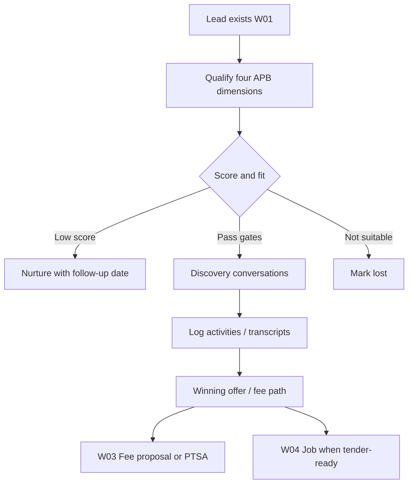

# Workflow 02 — Lead Qualification / Discovery / Client Fit

**Status:** Mapped (2026-06-22) — documentation only; no product code changes  
**Gate:** Sam review before W03  
**Related:** [01_LEAD_CRM_INTAKE.md](./01_LEAD_CRM_INTAKE.md), [WORKFLOW_TEST_MATRIX.md](../WORKFLOW_TEST_MATRIX.md), [BUG_REGISTER.md](../BUG_REGISTER.md), [SAM_DECISION_LOG.md](../SAM_DECISION_LOG.md), [30_DAY_HARDENING_TRACKER.md](../30_DAY_HARDENING_TRACKER.md)

**Starts after:** W01 — lead row exists  
**Hands off to:** W03 (Fee Proposal / PTSA), W04 (Job/Tender setup), or off-pipeline (`nurture` / `lost`)

---

## Evidence standards (used in this document)

| Label | Meaning |
|-------|---------|
| **Verified from code** | Confirmed in repo file, route, table, or migration |
| **Verified from SOP/docs** | Stated in SOP or agent knowledge doc |
| **Inferred from behaviour** | Logical conclusion from code paths |
| **Unconfirmed / needs testing** | Plausible but not proven by read-only audit |
| **Open decision for Sam** | Business rule — [SAM_DECISION_LOG.md](../SAM_DECISION_LOG.md) |

---

## 1. Business intent

After intake (W01), Blue Leaf must decide whether an enquiry is worth director time: qualify the opportunity (APB four dimensions), run discovery, coach next steps with Blueprint, log meaningful contact, and advance or exit the pipeline deliberately.

**Verified from SOP/docs:** SOP 02-02 — do not move stages speculatively; SOP 02-04 — update qualifying score after meaningful conversations.

**Inferred from behaviour:** Low qualify score (&lt;5) should trigger nurture rather than discovery investment — UI warns in LeadDetail (`LeadDetail.jsx:1276–1279`).

---

## 2. Start trigger

| Trigger | Evidence |
|---------|----------|
| Lead exists from any W01 path | **Verified from code:** `leads` row with default or set `stage` |
| Staff opens Lead Detail or moves lead on pipeline | **Verified from code:** `/sales/:leadId`, `/sales` kanban |
| Architect tender fast-track at `accepted` | **Verified from code:** `lead_type: "architect_tender"` skips qualify UI block (`LeadDetail.jsx:1209–1211`) |

---

## 3. End / handoff

Workflow 02 ends when the lead reaches one of:

| End state | Typical `leads.stage` | Next workflow |
|-----------|----------------------|---------------|
| Ready for fee proposal / PTSA | `winning_offer`, `fee_proposal` | **W03** |
| Ready for tender / job setup | `accepted`, `tender` (with `job_id` for tender gate) | **W04** / W05 |
| Nurture | `nurture` | Re-entry to W02 when reactivated |
| Not suitable / lost | `lost` | Terminal (unless manually moved back) |

**Verified from code:** `STAGE_ORDER` in `LeadDetail.jsx:39` defines linear advance path; `nurture` and `lost` are separate actions, not in `STAGE_ORDER`.

---

## 4. Main users

| User | Role | Evidence |
|------|------|----------|
| Sam / Josh | Directors — discovery, winning offer | **Verified from SOP/docs** |
| Admin / sales staff | Qualify score, activities, stage moves | **Verified from code:** `/sales/*` admin-only (`App.jsx:231–250`) |
| Blueprint AI | Coaching + transcript extraction | **Verified from code:** `/api/blueprint/chat`, `/api/sales/leads/:id/conversations/analyse` |

---

## 5. Blue Leaf business workflow



Plain-English (W02 scope):

1. Review and score budget, timeframe, site, decision-maker (0–2 each).
2. Log calls, emails, meetings on lead timeline.
3. Run discovery — notes, design stage, desired start date.
4. Use Blueprint Insight and transcript analysis for coaching and structured updates.
5. Advance stage only when checklist gates pass (Lead Detail) or via pipeline (ungated).
6. Nurture or mark lost when not a fit.

**Verified from SOP/docs:** 02-03 log activity; 02-05 Blueprint Insight; 02-06/02-07 conversations.

---

## 6. Hub workflow target

The Hub should:

1. Store qualification in `leads.qualify_*` with generated `qualify_score` (0–8).
2. Enforce or visibly gate stage progression per APB rules.
3. Record all stage changes in `lead_activities`.
4. Stamp `won_at` / `lost_at` / `lost_reason` on outcome moves (**Open decision:** not implemented today).
5. Keep transcript + applied suggestions in `lead_conversations` with audit trail.
6. Separate timeline (`lead_activities`) from editable notes (`lead_notes`).
7. Show weighted pipeline KPIs separately from per-lead qualify score.

---

## 7. SOP interpretation

| SOP | What it says | Code alignment |
|-----|--------------|----------------|
| [02-02_move_lead_through_stages.md](../../sops/02_sales/02-02_move_lead_through_stages.md) | Meaningful event before move; records activity | **Partial:** PATCH records `stage_change`; gates UI-only on Lead Detail |
| [02-03_log_activity.md](../../sops/02_sales/02-03_log_activity.md) | Log contact on timeline | **Verified from code:** `POST .../activities` |
| [02-04_qualifying_score.md](../../sops/02_sales/02-04_qualifying_score.md) | Four fields 0–2; pipeline shows **percentage** 0–100% | **Verified drift:** UI shows `/8`; scorecard uses stage probability not qualify score |
| [02-05_blueprint_insight.md](../../sops/02_sales/02-05_blueprint_insight.md) | Conversational APB coaching | **Verified from code:** `POST /api/blueprint/chat` |
| [02-06_transcript_analysis.md](../../sops/02_sales/02-06_transcript_analysis.md) | Analyse → review → apply | **Verified from code:** analyse + conversations POST |
| [02-07_conversations.md](../../sops/02_sales/02-07_conversations.md) | Store transcript + applied suggestions | **Verified from code:** `lead_conversations` table |

**Verified from SOP/docs:** SOP 02-04 §6 — score 0–8 expressed as percentage; §7 describes scorecard dashboard (conflates qualify score with weighted pipeline).

---

## 8. Code interpretation

### 8.1 Stage model and gates

**Verified from code:** `LeadDetail.jsx:65–77` — `GATE_REQUIREMENTS`:

| Target stage | Requirements |
|--------------|--------------|
| `discovery` | `qualify_score >= 5` |
| `winning_offer` | `discovery_notes`, `design_stage`, `desired_start_date` |
| `fee_proposal` | `preconstruction_fee` set |
| `tender` | `job_id` present |

**Verified from code:** `advanceStage()` (`LeadDetail.jsx:1189–1197`) PATCHes `{ stage: next }` only when `gatePass` true (button disabled otherwise).

**Verified from code:** `SalesPipeline.jsx:602–608` — `moveStage()` PATCHes any stage with **no gate checks**.

**Verified from code:** `salesRoutes.mjs:542–567` — PATCH accepts any `stage` string; on change sets `stage_entered_at`, `last_activity_at`, inserts `lead_activities` `stage_change`; **does not** set `won_at`, `lost_at`, or `lost_reason`.

### 8.2 Qualifying score

**Verified from code:** Migration `016_sales_manager.sql:22–25`:

```sql
qualify_score integer GENERATED ALWAYS AS (
  COALESCE(qualify_budget,0) + COALESCE(qualify_timeframe,0) +
  COALESCE(qualify_site,0) + COALESCE(qualify_decision_maker,0)
) STORED
```

**Verified from code:** Unset dimensions contribute **0**, not NULL — partial completion can read as low score (W02-DRIFT-003).

**Verified from code:** UI displays `{qualify_score}/8` (`LeadDetail.jsx:1266–1267`, pipeline `ScoreBadge`).

**Verified from code:** Scorecard API `GET /api/sales/scorecard` (`salesRoutes.mjs:376–400`) uses `STAGE_PROB[stage] × estimated_value` — **not** `qualify_score`.

### 8.3 Outcome stamping (won / lost / nurture)

**Verified from code:** Columns exist — `lost_reason` (016), `won_at`/`lost_at` (021).

**Verified from code:** `Mark Lost` button (`LeadDetail.jsx:1231`) — `patch({ stage: "lost" })` only; no `lost_reason` or `lost_at`.

**Verified from code:** `→ Nurture` button (`LeadDetail.jsx:1230`) — `patch({ stage: "nurture" })` only; nurture fields edited separately (`nurture_follow_up_date`, `nurture_notes`).

**Unconfirmed / needs testing:** Whether any code path ever sets `won_at` on `leads` when stage → `won` (scorecard has fallback to `stage_entered_at` — `salesRoutes.mjs:413–415`).

### 8.4 Activities and notes

**Verified from code:** `POST /api/sales/leads/:id/activities` (`salesRoutes.mjs:765–778`) — inserts `lead_activities`, updates `last_activity_at`, optional `next_action`.

**Verified from code:** `lead_notes` CRUD does not create `lead_activities` (W01-DRIFT-006).

### 8.5 Conversations and transcript apply

**Verified from code:** Analyse — `POST .../conversations/analyse` → JSON suggestions only (`salesRoutes.mjs:819–832`).

**Verified from code:** Save — `POST .../conversations` (`salesRoutes.mjs:836–899`):
- Inserts `lead_conversations` with `applied_suggestions`
- Whitelist apply: `LEAD_FIELDS`, `PROJECT_FIELDS`, `QUALIFY_FIELDS`, `WINNING_FIELDS`
- **Not in whitelist:** `name`, `site_address`, `stage`
- One summary `lead_activities` row when fields applied — **no per-field provenance**

### 8.6 Blueprint Insight

**Verified from code:** `LeadDetail.jsx:1065–1074` — `POST /api/blueprint/chat` with `hubContext` including stage and qualify score.

**Verified from code:** `blueprintRoutes.mjs:51–58` — winning-offer stage appends extra context via `buildWinningOfferBlueprintAppend`.

**Verified from code:** `blueprintQc.js` — QC review prompts for Blueprint agent; **not** on lead qualification critical path (**Inferred**).

### 8.7 Architect tender fast-track

**Verified from code:** `lead_type === "architect_tender"` hides qualifying scorecard and discovery panels (`LeadDetail.jsx:1209–1212`, `1262`).

**Verified from code:** Architect drawer creates lead at `stage: "accepted"` (`SalesPipeline.jsx:293`).

### 8.8 Shared stage constants

**Verified from code:** `LEAD_STAGES` / `LEAD_STAGE_ORDER` in `src/lib/constants.js:20–43`.

**Verified from code:** `LeadDetail.jsx`, `SalesPipeline.jsx`, `SalesScorecard.jsx`, `salesRoutes.mjs` each define local `STAGES` / `STAGE_PROB` — **do not import** `constants.js` (W02-DRIFT-005).

### 8.9 Pipeline segmentation

**Verified from code:** `SalesPipeline.jsx:613–615` — active pipeline excludes `nurture`, `lost`, `won`; separate nurture/won sections.

**Verified from code:** Kanban `STAGES` array includes all 10 stage ids including `nurture` and `lost` (`LeadDetail.jsx:8–18`, `SalesPipeline.jsx:9–18`).

---

## 9. Entry points

| # | Entry | Mechanism | Evidence |
|---|-------|-----------|----------|
| E1 | Open Lead Detail | `/sales/:leadId` | **Verified from code** |
| E2 | Pipeline kanban stage dropdown | `moveStage()` → PATCH | **Verified from code** |
| E3 | Lead Detail “Move to {next}” | `advanceStage()` → PATCH | **Verified from code** |
| E4 | Qualify score PATCH | `ScoreGate` → PATCH qualify fields | **Verified from code** |
| E5 | Log activity form | POST `.../activities` | **Verified from code** |
| E6 | Blueprint refresh | POST `/api/blueprint/chat` | **Verified from code** |
| E7 | Transcript analyse + save | POST analyse + POST conversations | **Verified from code** |
| E8 | → Nurture / Mark Lost | PATCH `stage` only | **Verified from code** |
| E9 | APB Scorecard view | `SalesPipeline` view toggle → `SalesScorecard` | **Verified from code** |

---

## 10. Exit points

| Exit | Condition | Destination |
|------|-----------|-------------|
| **W03** | Stage `winning_offer` or `fee_proposal`; discovery + fee fields populated | Fee Proposal / PTSA |
| **W04** | Stage `accepted`/`tender`; `job_id` linked; `site_address` on lead | Job / Buildxact setup |
| **Nurture** | Stage `nurture`; optional follow-up date | Off active pipeline |
| **Lost** | Stage `lost` | Off pipeline; reporting gap on reason/date |

---

## 11. Screens involved

| Screen | Route | W02 responsibility | Evidence |
|--------|-------|-------------------|----------|
| **LeadDetail** | `/sales/:leadId` | Gates, qualify scorecard, discovery, Blueprint, conversations, activities, nurture/lost | **Verified from code** |
| **SalesPipeline** | `/sales` | Kanban/list; ungated stage moves; score display | **Verified from code** |
| **SalesScorecard** | `/sales` view=scorecard | APB KPIs, weighted pipeline funnel | **Verified from code** |
| **SalesManager** | `/sales/dashboard` | Tab shell for CRM dashboard | **Verified from code** |

---

## 12. Routes involved

| Method | Route | Handler | W02 writes | Evidence |
|--------|-------|---------|------------|----------|
| PATCH | `/api/sales/leads/:id` | `salesRoutes.mjs:542` | `leads`, optional `lead_activities` stage_change | **Verified from code** |
| POST | `/api/sales/leads/:id/activities` | `salesRoutes.mjs:765` | `lead_activities`, `leads.last_activity_at` | **Verified from code** |
| POST | `/api/sales/leads/:id/conversations/analyse` | `salesRoutes.mjs:819` | — (AI) | **Verified from code** |
| POST | `/api/sales/leads/:id/conversations` | `salesRoutes.mjs:836` | `lead_conversations`, `leads`, `lead_activities` | **Verified from code** |
| GET | `/api/sales/leads/:id/conversations` | `salesRoutes.mjs:792` | — | **Verified from code** |
| GET | `/api/sales/scorecard` | `salesRoutes.mjs:376` | — | **Verified from code** |
| POST | `/api/blueprint/chat` | `blueprintRoutes.mjs` | — (AI) | **Verified from code** |
| GET/POST/PATCH/DELETE | `/api/sales/leads/:id/notes` | `salesRoutes.mjs` | `lead_notes` | **Verified from code** |

---

## 13. Database ownership

### Source of truth (W02 scope)

#### `leads`

**Owns:** `stage`, `stage_entered_at`, `last_activity_at`, `next_action`, `next_action_date`, `qualify_budget`/`timeframe`/`site`/`decision_maker`, generated `qualify_score`, `discovery_notes`, `design_stage`, `desired_start_date`, `preconstruction_fee`, `inclusions_summary`, `nurture_follow_up_date`, `nurture_notes`, `lost_reason`, `won_at`, `lost_at`, `lead_type`.

**Does not own:** Long-term CRM history (`crm_interactions`); job facts post-conversion (`jobs` + facts service).

#### `lead_activities`

**Owns:** Timeline — stage changes, logged contact, conversation-apply summaries.

#### `lead_conversations`

**Owns:** `transcript_text`, `bp_suggestions`, `applied_suggestions`, `applied_at`.

#### `lead_notes`

**Owns:** Editable notes — **not** audit trail.

#### `constants.js` (`LEAD_STAGES`)

**Intended** canonical stage enum — **Verified from code:** not wired to sales UI/server today.

### Migrations (W02-relevant)

| Migration | Adds |
|-----------|------|
| 016 | `leads`, `lead_activities`, `qualify_score` generated, `nurture_*`, `lost_reason` |
| 017 | `lead_conversations` |
| 021 | `won_at`, `lost_at` on leads |
| 024 | `lead_type` (architect_tender) |
| 045 / 048 | PTSA / winning offer fields (W03 overlap) |
| 078 | Job carry provenance (W04 conversion) |

**Verified from code:** No DB CHECK on `leads.stage` — any string accepted.

---

## 14. External integrations

| Integration | W02 role | Evidence |
|-------------|----------|----------|
| Anthropic / Blueprint | Insight chat, transcript analysis | **Verified from code:** `salesRoutes.mjs`, `blueprintRoutes.mjs` |
| Buildxact | Not in W02 | N/A |
| Dropbox | Not in W02 (PTSA W03) | N/A |

---

## 15. Existing tests

| Test | Location | W02 coverage | Evidence |
|------|----------|--------------|----------|
| Admin pipeline / lead load | `e2e/tests/workflows/admin-readonly.spec.js` | Page loads only | **Verified from code** |
| GET leads auth | `e2e/tests/smoke/api-health.spec.js` | 401 unauthenticated | **Verified from code** |
| W02 API/E2E suite | — | **Missing** | **Verified from code** |

---

## 16. Drift risks

### W02-DRIFT-001 — Outcome dates/reason not stamped on stage move

| | |
|--|--|
| **Evidence** | **Verified from code:** PATCH handler (`salesRoutes.mjs:556–564`) never sets `won_at`, `lost_at`, `lost_reason`; Mark Lost UI (`LeadDetail.jsx:1231`) patches stage only |
| **Impact** | Scorecard won metrics rely on `won_at` or fallback `stage_entered_at`; lost leads have no structured reason |
| **Test** | W02-API-04 |

### W02-DRIFT-002 — SOP percentage vs UI /8

| | |
|--|--|
| **Evidence** | **Verified from SOP/docs:** 02-04 §3, §6 — percentage; **Verified from code:** UI `/8` |
| **Impact** | Staff training mismatch |
| **Decision** | [SAM-W02-001](../SAM_DECISION_LOG.md) |

### W02-DRIFT-003 — COALESCE(null,0) inflates partial qualification

| | |
|--|--|
| **Evidence** | **Verified from code:** `016_sales_manager.sql:22–25` |
| **Impact** | Lead with one dimension scored reads as 0–2 total, not “unknown” |
| **Test** | W02-API-01 |

### W02-DRIFT-004 — Transcript apply lacks field-level provenance

| | |
|--|--|
| **Evidence** | **Verified from code:** `salesRoutes.mjs:873–899` — whitelist apply + single activity summary |
| **Impact** | Cannot audit which AI suggestion changed which field; `name`/`site_address` not applyable |
| **Decision** | [SAM-W02-004](../SAM_DECISION_LOG.md) |
| **Test** | W02-API-06, W02-API-07 |

### W02-DRIFT-005 — `LEAD_STAGES` constant unused

| | |
|--|--|
| **Evidence** | **Verified from code:** `constants.js` not imported in sales pages/server |
| **Impact** | Stage string drift across 4+ files |
| **Test** | — |

### W02-DRIFT-006 — Stage gate bypass — qualification-specific consequence

| | |
|--|--|
| **Evidence** | **Verified from code:** `GATE_REQUIREMENTS` LeadDetail only; `moveStage` + PATCH ungated |
| **Impact** | Discovery/tender before qualification readiness (e.g. score, job_id) |
| **Related** | [W01-DRIFT-003](./01_LEAD_CRM_INTAKE.md) — shared pipeline/API root cause. **Single fix — do not patch twice** |
| **Decision** | [SAM-W02-002](../SAM_DECISION_LOG.md) — **B:** advisory + diagnostic logging; no hard-block during hardening |
| **Test** | W02-API-03, W02-UI-02, W02-SEC-01 |

### W02-DRIFT-007 — Nurture/lost mixed into stage model

| | |
|--|--|
| **Evidence** | **Verified from code:** `nurture`/`lost` in same `STAGES` array as pipeline stages; excluded from active count (`SalesPipeline.jsx:613`) |
| **Impact** | Reporting and funnel semantics blur “stage” vs “outcome” |
| **Decision** | [SAM-W02-003](../SAM_DECISION_LOG.md) |

### W02-DRIFT-008 — Scorecard weighted value ≠ qualify score (SOP conflation)

| | |
|--|--|
| **Evidence** | **Verified from code:** `STAGE_PROB` in `salesRoutes.mjs:147–151`; SOP 02-04 §7 implies scorecard shows qualify metrics |
| **Impact** | Directors may think funnel weight reflects qualification quality |
| **Inferred** | Documentation issue more than code bug |

### W02-DRIFT-009 — Architect tender skips qualification UI

| | |
|--|--|
| **Evidence** | **Verified from code:** `isArchTender` hides qualify block; creates at `accepted` |
| **Impact** | **Inferred:** intentional fast-track — document as variant path |

---

## 17. Security / role risks

**Verified from code:** All W02 mutation routes use `requireAuth`.

**Verified from code:** `/sales/*` UI restricted to `admin` role (`App.jsx:231–250`).

**Unconfirmed / needs testing:** Non-admin authenticated user calling PATCH directly (should 403 if no route-level role check beyond auth).

| Risk | Status | Evidence |
|------|--------|----------|
| Unauthenticated stage/qualify PATCH | Mitigated — `requireAuth` | **Verified from code** |
| Non-admin staff access | Blocked at UI; API may accept any authenticated user | **Unconfirmed** — W02-SEC-01 |
| PATCH body spreads arbitrary fields | POST create spreads body; PATCH spreads `updates` from body | **Verified from code:** `salesRoutes.mjs:554` — could set internal fields if caller knows names |

---

## 18. Required handoff data

### Before W03 (Fee Proposal / PTSA)

| Field / record | Required? | Source |
|----------------|-----------|--------|
| `lead_id` | **Yes** | `leads` |
| `stage` at `winning_offer` or `fee_proposal` | **Yes** | `leads.stage` |
| `discovery_notes`, `design_stage`, `desired_start_date` | **Recommended** (gate for winning_offer) | `leads` |
| `preconstruction_fee` | **Yes** for fee_proposal gate | `leads` |
| `qualify_score` | **Recommended** | generated |
| Client contact fields | **Yes** | `leads` |
| `estimated_value` | **Recommended** | `leads` |

### Before W04 (Job / tender setup)

| Field / record | Required? | Source |
|----------------|-----------|--------|
| `site_address` | **Yes** (convert API) | `leads` |
| `job_id` | **Yes** for tender stage gate | `leads` |
| `stage` `accepted` or `tender` | **Yes** | `leads` |

### Before off-pipeline (nurture / lost)

| Field / record | Required? | Source |
|----------------|-----------|--------|
| `nurture_follow_up_date` | **Recommended** | `leads` |
| `lost_reason` | **Recommended** (column exists; UI missing) | `leads` |
| `lost_at` | **Recommended** (not auto-set) | `leads` |

---

## 19. Handoff failure risks

| If missing / wrong at W02 → W03 | What breaks |
|--------------------------------|-------------|
| No `preconstruction_fee` | Cannot pass fee_proposal gate from Lead Detail |
| Discovery fields empty but stage forced via pipeline | Fee proposal / PTSA prepared without discovery context |
| Low qualify score but advanced anyway | Director time on poor-fit leads |

| If missing at W02 → W04 | What breaks |
|-------------------------|-------------|
| No `site_address` | `convertLeadToJob` returns 400 |
| Stage `tender` without `job_id` | Gate blocks advance in Lead Detail; pipeline may still show tender if bypassed |
| Architect fast-track without address | **Inferred:** same convert failure at W04 |

| If missing on nurture/lost | What breaks |
|----------------------------|-------------|
| No `lost_reason` / `lost_at` | Reporting cannot explain losses (W02-DRIFT-001) |
| No `won_at` on lead `won` | Scorecard uses `stage_entered_at` fallback — inaccurate won date |

---

## 20. Workflow acceptance criteria

W02 mapping complete when:

1. All qualification/discovery paths documented with evidence ✓
2. Gate bypass documented (pipeline vs Lead Detail vs server) ✓
3. Handoff data to W03/W04 declared ✓
4. Drift IDs registered ✓
5. Tests planned in matrix ✓

**Stable enough for fixes (post-review):** W02-API-01..07 pass or gap-documented; Sam decisions on gates and nurture/lost model.

---

## 21. Required tests

See [WORKFLOW_TEST_MATRIX.md](../WORKFLOW_TEST_MATRIX.md) — **planned only, not written yet.**

| ID | Scenario |
|----|----------|
| W02-API-01 | PATCH qualify fields → `qualify_score` correct; document COALESCE behaviour |
| W02-API-02 | Stage change → `lead_activities` stage_change row |
| W02-API-03 | Direct PATCH bypasses gates OR logs diagnostic (per SAM-W02-002) |
| W02-API-04 | Move to lost → `lost_at` / `lost_reason` (document current gap) |
| W02-API-05 | Move to nurture → `nurture_follow_up_date` preserved |
| W02-API-06 | Conversation save without apply → lead fields unchanged |
| W02-API-07 | Applied suggestions → only selected fields; activity row |
| W02-UI-01 | LeadDetail gate checklist visible when blocked |
| W02-UI-02 | Pipeline stage dropdown bypasses gates (document expected until fix) |
| W02-SEC-01 | Non-admin cannot PATCH lead stage/qualify |

---

## 22. Open decisions for Sam

| ID | Topic | Link |
|----|-------|------|
| SAM-W02-001 | Qualifying score display | [SAM_DECISION_LOG.md](../SAM_DECISION_LOG.md) |
| SAM-W02-002 | Stage gate enforcement | same |
| SAM-W02-003 | Nurture/lost as stages vs outcome | same |
| SAM-W02-004 | AI transcript provenance | same |

---

## 23. Smallest safe fix plan

**No implementation until Batch A review.** Priority per [30_DAY_HARDENING_TRACKER.md](../30_DAY_HARDENING_TRACKER.md):

### P1 (post-review)

| Fix | Tests first |
|-----|-------------|
| Stage movement diagnostic logging on PATCH when gates would fail | W02-API-03 |
| Stamp `lost_at` + prompt for `lost_reason` on Mark Lost | W02-API-04 |
| Stamp `won_at` when stage → `won` | W02-API-04 variant |

### P2

| Fix | Notes |
|-----|-------|
| Import `LEAD_STAGES` from `constants.js` | W02-DRIFT-005 |
| Transcript apply: log field names in activity detail | SAM-W02-004 interim |
| Optional qualify “unknown” vs 0 UX | W02-DRIFT-003 — needs schema/design decision |
| SOP 02-04 text: `/8` + optional % | Docs only |

### Deferred

- Server-hard block on gates — [SAM-W02-002](../SAM_DECISION_LOG.md)
- Split nurture/lost to outcome column — [SAM-W02-003](../SAM_DECISION_LOG.md)
- Full field-level provenance table — facts service alignment

---

## Source-of-truth check

**Expected:** `leads` owns qualification fields/stage/score; `lead_activities` owns stage and action timeline; `lead_conversations` owns transcript/apply record.

**Confirmed:** `leads.qualify_score` is generated `/8` from four fields. Stage changes create `lead_activities`. LeadDetail has advisory gates. Pipeline/API can bypass gates. Transcript apply stores one conversation record and one activity row, not field-level provenance.

**Mismatch:** Gate rules are UI-only. Transcript apply lacks field-level provenance. Lost/won outcome fields are not stamped on stage movement.

---

## Document history

| Date | Change |
|------|--------|
| 2026-06-24 | Source-of-truth check; W02-DRIFT-006 cross-ref to W01-DRIFT-003; SAM-W02-002 B clarified |
| 2026-06-22 | Workflow 02 initial map — Batch A |
