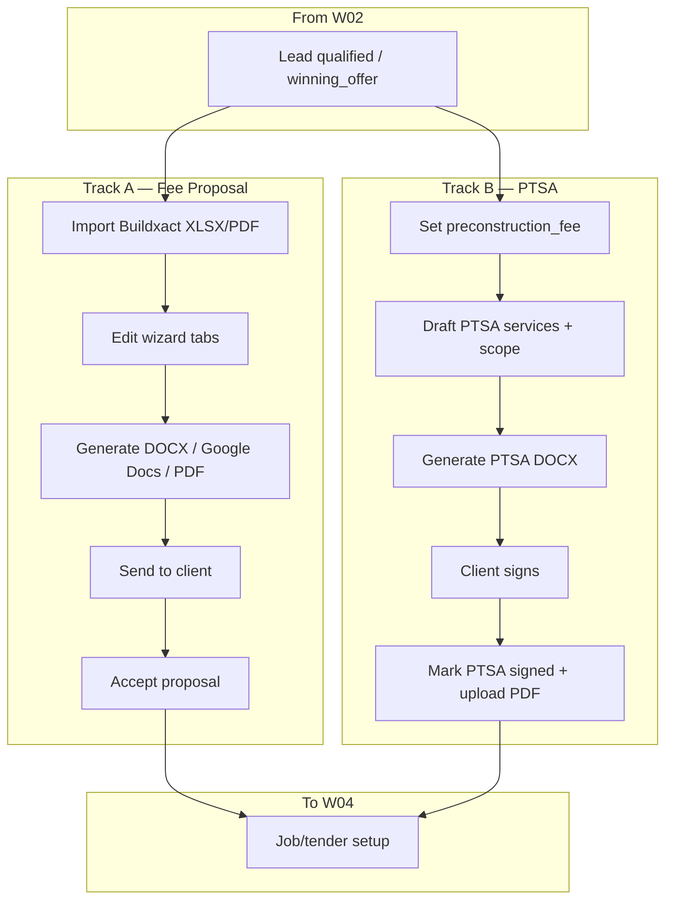

# Workflow 03 — Fee Proposal / PTSA

**Status:** Mapped (2026-06-24) — documentation only; no product code changes  
**Gate:** Accepted 2026-06-24 (direction + doc corrections) — proceed W04+  
**Related:** [02_LEAD_QUALIFICATION_DISCOVERY.md](./02_LEAD_QUALIFICATION_DISCOVERY.md), [WORKFLOW_TEST_MATRIX.md](../WORKFLOW_TEST_MATRIX.md), [BUG_REGISTER.md](../BUG_REGISTER.md), [SAM_DECISION_LOG.md](../SAM_DECISION_LOG.md)

**Hands off to:** [Workflow 04 — Estimate / Buildxact / Tender Job Setup](./04_ESTIMATE_BUILDXACT_TENDER_SETUP.md)

---

## Evidence standards (used in this document)

| Label | Meaning |
|-------|---------|
| **Verified from code** | Confirmed in repo file, route, table, or migration |
| **Verified from SOP/docs** | Stated in SOP or spec doc |
| **Inferred from behaviour** | Logical conclusion from code paths |
| **Unconfirmed / needs testing** | Plausible but not proven by read-only audit |
| **Open decision for Sam** | Business rule — [SAM_DECISION_LOG.md](../SAM_DECISION_LOG.md) |

---

## 1. Business intent

Turn a qualified lead into a formal paid preconstruction / tender process through **two related but separate tracks**:

- **Track A — Fee Proposal:** Buildxact estimate → branded construction **fee proposal** document (`fee_proposals` row).
- **Track B — PTSA / Preconstruction Agreement:** Pre-Tender Service Agreement on the **lead** (deposit, services scope, signed PDF).

**Verified from SOP/docs:** SOP 03-01 — fee proposal from Buildxact estimate; PTSA referenced in sales/tender flow but **no dedicated PTSA SOP file** in `docs/sops/` (**Unconfirmed:** AUDIT_SOP_2026-06-16 may reference 02-11 PTSA — not verified as standalone SOP).

**Inferred from behaviour:** Both tracks share `preconstruction_fee` on the lead as the PTSA dollar amount but use different templates, storage, and tables.

---

## 2. Start trigger

| Trigger | Track | Evidence |
|---------|-------|----------|
| Lead at `winning_offer` or later | A + B | **Verified from code:** `GATE_REQUIREMENTS.fee_proposal` needs `preconstruction_fee` (`LeadDetail.jsx:73`) |
| Staff opens Fee Proposal wizard | A | **Verified from code:** `/tender-manager/fee-proposal/new` (`App.jsx`) |
| Staff uses PTSA block on Lead Detail | B | **Verified from code:** `showPreTender` stages (`LeadDetail.jsx:1212`) |
| Lead at `fee_proposal` stage | A | **Verified from code:** focus panel CTA (`LeadDetail.jsx:1848`) |

Architect tender fast-track (`lead_type: architect_tender`) may skip W02/W03 gates — **Verified from code:** `isArchTender` hides PTSA/qualify blocks (`LeadDetail.jsx:1209`).

---

## 3. End / handoff

Workflow 03 ends when one or more of:

| End state | Track | Evidence |
|-----------|-------|----------|
| `fee_proposals.status = sent` | A | **Verified from code:** `POST /api/fee-proposal/send` (`module5Routes.mjs:626`) |
| `fee_proposals.status = accepted` | A | **Verified from code:** `POST /api/fee-proposal/:id/accept` (`buildexactIntegrationRoutes.mjs:140`) |
| `leads.ptsa_status = signed` | B | **Verified from code:** sole writer `POST .../ptsa/mark-signed` (`salesRoutes.mjs:609`) |
| Lead ready for W04 | Both | `site_address` + optional `job_id` for tender handoff |

**Hands off to W04** when PTSA signed and/or fee proposal accepted and staff can convert/link job for tender setup.

---

## 4. Main users

| User | Role | Evidence |
|------|------|----------|
| Sam / Josh | Directors — approve fees, sign-off | **Verified from SOP/docs** |
| Admin / tender coordinator | Fee proposal wizard, PTSA, send | **Verified from code:** `/sales/*` and `/tender-manager/*` admin routes |
| Client | Receives PDF/email (external) | **Inferred from behaviour** |

---

## 5. Blue Leaf business workflow

Plain-English:

**Track A (Fee Proposal):** Import estimate → link job → review inclusions/PC sums/schedule → save draft → generate original or APB DOCX → send PDF → mark accepted when client agrees.

**Track B (PTSA):** Set pre-construction fee → configure services checklist and project scope → download PTSA DOCX → client signs → upload signed PDF via Mark PTSA Signed → optional job folder provisioning.

Tracks can run in parallel; APB pipeline order is typically `winning_offer` → PTSA activity → `fee_proposal` stage → fee proposal document → `accepted`.

---

## 6. Hub workflow target

The Hub should:

1. Store PTSA state on `leads` (`ptsa_*`, signed PDF path, status).
2. Store fee proposal content/status on `fee_proposals` (versioned draft → sent → accepted).
3. Generate documents from controlled templates (not stale lead snapshots without warning).
4. Block `ptsa_status=signed` except via mark-signed orchestration.
5. On PTSA signed: persist PDF, stamp lead, non-fatally attempt job conversion + Dropbox mirror.
6. On fee proposal send: log correspondence, store output paths (Dropbox/Drive).
7. Link accepted proposal / signed PTSA clearly to W04 handoff readiness.
8. Use API layer for fee proposal CRUD (**Open decision:** SAM-W03-002).

---

## 7. SOP interpretation

| SOP / doc | What it says | Code alignment |
|-----------|--------------|----------------|
| [tendering_fee_proposal_create.md](../../sops/03_tendering/tendering_fee_proposal_create.md) | Import Buildxact, 8 tabs, original + APB templates, save draft, generate | **Verified from code:** wizard + `module5Routes.mjs` |
| [tendering_fee_proposal_send.md](../../sops/03_tendering/tendering_fee_proposal_send.md) | Send PDF to client, Dropbox path | **Verified from code:** `/api/fee-proposal/send` |
| [FEE_PROPOSAL_APB_TEMPLATE_SPEC.md](../../FEE_PROPOSAL_APB_TEMPLATE_SPEC.md) | APB template fields and sections | **Verified from code:** `feeProposalTransform.mjs`, APB template path |
| [AUDIT_SOP_2026-06-16.md](../../sops/AUDIT_SOP_2026-06-16.md) | May reference PTSA SOP 02-11 | **Unconfirmed:** no `02-11` file in `docs/sops/02_sales/` |

**SOP drift:** Fee proposal wizard saves via direct Supabase — SOPs imply in-app workflow but do not document bypass of API standards.

---

## 8. Code interpretation

### 8.1 Track A — Fee Proposal

**UI:** `FeeProposalWizard.jsx`, `FeeProposalList.jsx`, `FeeProposalTemplateGuide.jsx`.

**Verified from code — direct Supabase (consistency risk):**
- Load/save: `getSupabase().from("fee_proposals")` (`FeeProposalWizard.jsx:226`, `494`, `508`).
- List: `FeeProposalList.jsx` reads `fee_proposals` via Supabase client.

**Verified from code — API routes (`module5Routes.mjs`):**
- `POST /api/fee-proposal/parse-xlsx`, `parse-pdf` (~122, ~261)
- `POST /api/fee-proposal/inclusions` (~228)
- `POST /api/fee-proposal/generate-docx` (~479)
- `POST /api/fee-proposal/upload-to-drive`, `docx-to-pdf`, `send` (~528–626)
- Template: `GET/POST /api/settings/fee-proposal-template` (~378, ~414)

**Accept paths (dual):**
- Wizard: `POST /api/fee-proposal/:id/accept` — `buildexactIntegrationRoutes.mjs:140`
- Finance: `POST /api/finance/fee-proposals/:proposalId/accept` — `financeRoutes.mjs:1390` (**Unconfirmed / needs testing:** side-effect differences)

**Legacy/orphan:** `POST /api/fee-proposal/generate-pdf` in `jobsApiRoutes.mjs` — **Verified from code:** not used by wizard (**Inferred:** dead path).

### 8.2 Track B — PTSA / Preconstruction Agreement

**UI:** `LeadDetail.jsx` PTSA block — services (`ptsa_services`), scope (`ptsa_project_scope`), validity, credit-to-contract, special terms, status dropdown (`draft`/`sent`/`declined` only — not `signed`).

**Verified from code:**
- `PATCH /api/sales/leads/:id` rejects `ptsa_status: "signed"` (`salesRoutes.mjs:549–550`).
- Generate DOCX: `POST /api/sales/leads/:id/ptsa/generate-docx` (`salesRoutes.mjs:908+`) — uses embedded `PTSA_TEMPLATE_B64` (`salesRoutes.mjs:213`), maps `ptsa_project_scope` → `{scope_notes}` (`salesRoutes.mjs:952`).
- Mark signed: `POST .../ptsa/mark-signed` — uploads PDF to `lead-documents`, stamps lead, inserts `lead_documents`, non-fatal `convertLeadToJob` + Dropbox (`salesRoutes.mjs:656–711`).

**Verified from code:** If `convertLeadToJob` fails (e.g. missing `site_address`), signed stamp **still persists**; error logged only (`salesRoutes.mjs:708–710`) — W03-DRIFT-002.

**Verified from code:** `showPreTender` excludes `fee_proposal` stage (`LeadDetail.jsx:1212`) — PTSA block hidden when stage is `fee_proposal` despite focus panel referencing PTSA at that stage — **W03-DRIFT-009**.

### 8.3 Template sources

| Track | Sources | Evidence |
|-------|---------|----------|
| **A — Fee proposal (original)** | localStorage → Supabase `templates/` → bundled `public/BLB_TENDER_TEMPLATE.docx` | `feeProposalDefaults.js`, `module5Routes.mjs:414`, `FeeProposalWizard.jsx:192` |
| **A — Fee proposal (APB)** | localStorage APB key → Supabase APB template → `public/BLB_APB_TEMPLATE.docx` | `FeeProposalWizard.jsx:519`, `module5Routes.mjs:369`, `feeProposalTransform.mjs` |
| **B — PTSA** | Single base64 embedded template | `salesRoutes.mjs:213`, `templateCatalog.mjs:41` |

### 8.4 Signed date fields

| Field | Migration | Set by | UI |
|-------|-----------|--------|-----|
| `pretender_signed_date` | 024 | PATCH or mark-signed | Always editable (`LeadDetail.jsx:1750–1758`) |
| `ptsa_signed_at` | 101 | mark-signed only | **Not displayed** |
| `ptsa_sent_date` | 045 | Auto on status → sent | Not displayed |

**Open decision:** [SAM-W03-004](../SAM_DECISION_LOG.md).

### 8.5 Scope column drift

**Verified from code:**
- `ptsa_scope_notes` — migration `045_ptsa_fields.sql:8` — **no app reads/writes**
- `ptsa_project_scope` — migration `048_winning_offer.sql:3` — live field in UI + DOCX

### 8.6 Lead ↔ fee proposal link

**Verified from code:** `leads.fee_proposal_id` column exists (`016_sales_manager.sql:38`).

**Verified from code:** Lead Detail CTA checks `!lead.fee_proposal_id` (`LeadDetail.jsx:1848`).

**Verified from code:** `FeeProposalWizard` save does **not** write `leads.fee_proposal_id` — **Inferred:** link never established (contributes to W03-DRIFT-008).

### 8.7 Jobs as source of truth

**Verified from code:** Fee proposal drafting uses `fee_proposals` + optional `job_id` FK; `jobs` created at PTSA mark-signed (non-fatal) or W04 convert — **not** canonical during proposal drafting.

---

## 9. Entry points

| # | Entry | Track | Mechanism |
|---|-------|-------|-----------|
| E1 | Lead Detail PTSA block | B | PATCH lead, generate-docx, mark-signed |
| E2 | Lead Detail “Create Fee Proposal →” | A | Navigate to wizard when `stage=fee_proposal` |
| E3 | Tender Manager → Fee Proposals list | A | `/tender-manager/fee-proposal` |
| E4 | New fee proposal | A | `/tender-manager/fee-proposal/new` |
| E5 | Edit existing proposal | A | `/tender-manager/fee-proposal/:id` |
| E6 | Template guide | A | `FeeProposalTemplateGuide.jsx` |

---

## 10. Exit points

| Exit | Condition | Next |
|------|-----------|------|
| **W04 job setup** | PTSA signed and/or fee proposal accepted; `site_address` for convert | Estimate / job / Buildxact |
| **Blocked handoff** | PTSA signed without `site_address` / no `job_id` | W04 convert fails — show warning (**SAM-W03-001**) |
| **Stage advance** | `accepted` after fee path | W04 / W05 |

---

## 11. Screens involved

| Screen | Route | Track | Evidence |
|--------|-------|-------|----------|
| **LeadDetail** | `/sales/:leadId` | B (+ A CTA) | PTSA block, winning offer, fee_proposal CTA |
| **FeeProposalWizard** | `/tender-manager/fee-proposal/*` | A | 8-tab wizard |
| **FeeProposalList** | `/tender-manager/fee-proposal` | A | List + navigation |
| **FeeProposalTemplateGuide** | (linked from wizard) | A | Template help |

---

## 12. Routes involved

### Track A — `module5Routes.mjs` + integrations

| Method | Route | File |
|--------|-------|------|
| POST | `/api/fee-proposal/parse-xlsx` | module5Routes.mjs |
| POST | `/api/fee-proposal/parse-pdf` | module5Routes.mjs |
| POST | `/api/fee-proposal/inclusions` | module5Routes.mjs |
| POST | `/api/fee-proposal/generate-docx` | module5Routes.mjs |
| POST | `/api/fee-proposal/send` | module5Routes.mjs |
| POST | `/api/fee-proposal/:id/accept` | buildexactIntegrationRoutes.mjs |
| POST | `/api/finance/fee-proposals/:id/accept` | financeRoutes.mjs |
| GET/POST | `/api/settings/fee-proposal-template` | module5Routes.mjs |

### Track B — `salesRoutes.mjs`

| Method | Route | Auth | Writes |
|--------|-------|------|--------|
| PATCH | `/api/sales/leads/:id` | requireAuth | `leads` (blocks `ptsa_status=signed`) |
| POST | `/api/sales/leads/:id/ptsa/generate-docx` | requireAuth | — (download) |
| POST | `/api/sales/leads/:id/ptsa/mark-signed` | requireAuth | `leads`, storage, `lead_documents`, optional `jobs` |

### Direct Supabase (browser)

| Operation | Table | File |
|-----------|-------|------|
| SELECT/INSERT/UPDATE | `fee_proposals` | FeeProposalWizard.jsx, FeeProposalList.jsx |

---

## 13. Database ownership

### Source of truth (declared)

#### `fee_proposals` (Track A)

**Owns:** Proposal content JSON, status, client/job links, Buildxact sync fields, output paths (`007`, `008`, `015`).

**Does not own:** Lead stage (→ `leads.stage` updated separately if at all).

#### `leads` (Track B — PTSA)

**Owns:** `ptsa_status`, `ptsa_services`, `ptsa_project_scope`, `ptsa_validity_days`, `ptsa_special_terms`, `ptsa_credit_to_contract`, `ptsa_sent_date`, `ptsa_signed_document_path`, `ptsa_signed_at`, `pretender_signed_date`, `pretender_notes`, `preconstruction_fee`, winning-offer fields (`048`).

**Does not own:** Fee proposal document body (→ `fee_proposals`).

**Dead column:** `ptsa_scope_notes` (045) — W03-DRIFT-001.

#### `lead_documents`

**Owns:** Signed PTSA PDF metadata (`document_type: ptsa_signed`) — migration `101`, `060`.

#### Document storage

| Asset | Location | Evidence |
|-------|----------|----------|
| Signed PTSA PDF | Supabase `lead-documents` bucket | mark-signed |
| Fee proposal template | Supabase `templates` bucket + localStorage | module5Routes |
| Sent fee proposal PDF | Dropbox `INTERNAL/PRESALE DOCS/` | send route (**Verified from SOP**) |
| Google Docs | Drive via OAuth | upload-to-drive |

#### `jobs`

**Owns:** Operational spine **after** conversion — not during draft proposal editing.

---

## 14. External integrations

| Integration | Track | Role | Evidence |
|-------------|-------|------|----------|
| Buildxact | A | Parse XLSX/PDF; estimate pull; accept sync attempt | module5Routes, buildexactIntegrationRoutes |
| Google Drive | A | DOCX → Google Doc edit URL | googleDriveClient.mjs |
| Dropbox | A + B | PDF archive on fee send; job folders on PTSA sign | dropboxClient.mjs |
| Gmail | A | Send proposal email | gmailSend.mjs via send route |
| Anthropic | A | PDF parse fallback | module5Routes (**Unconfirmed** depth) |

---

## 15. Existing tests

| Test | Coverage | Evidence |
|------|----------|----------|
| Automated W03 suite | **Missing** | No dedicated fee-proposal or PTSA test scripts found |
| Admin readonly smoke | Tender routes may load | admin-readonly.spec.js — **Unconfirmed** fee proposal depth |
| `test-critical-paths.mjs` | Sales/leads only | Not W03 |

---

## 16. Drift risks

### W03-DRIFT-001 — `ptsa_scope_notes` unused

**Verified from code:** `045:8` vs live `ptsa_project_scope` in UI/API.

### W03-DRIFT-002 — PTSA signed without job when no `site_address`

**Verified from code:** mark-signed non-fatal convert skip (`salesRoutes.mjs:708–710`). **Decision:** SAM-W03-001.

### W03-DRIFT-003 — FeeProposalWizard direct Supabase writes

**Verified from code:** `FeeProposalWizard.jsx:494–508`. **Decision:** SAM-W03-002.

### W03-DRIFT-004 — Split template sources

**Verified from code:** PTSA embedded; fee proposal localStorage + Supabase + public files.

### W03-DRIFT-005 — PTSA template not editable like fee proposal

**Verified from code:** `PTSA_TEMPLATE_B64` constant; fee proposal has upload/settings API.

### W03-DRIFT-006 — Duplicate signed-date fields

**Verified from code:** `pretender_signed_date` + `ptsa_signed_at`; manual PATCH vs mark-signed. **Decision:** SAM-W03-004.

### W03-DRIFT-007 — Stale proposal if lead changes after generation

**Inferred from behaviour:** DOCX generated from request-time snapshot; no auto-regenerate on lead PATCH — **Unconfirmed / needs testing**.

### W03-DRIFT-008 — Weak W04 handoff signalling

**Verified from code:** `fee_proposal_id` never written; PTSA signed can exist without `job_id`; Lead Detail tender gate checks `job_id` not PTSA/fee status together.

### W03-DRIFT-009 — PTSA block hidden at `fee_proposal` stage

**Verified from code:** `showPreTender` excludes `fee_proposal` stage (`LeadDetail.jsx:1212`) while `fee_proposal` stage still has PTSA/proposal handoff work (focus panel CTA references fee proposal; PTSA may still be unsigned).

**Severity:** Medium. **Test:** W03-UI-03.

### Additional findings (document only)

| ID | Issue | Evidence |
|----|-------|----------|
| — | Dual fee-proposal accept endpoints | buildexactIntegrationRoutes vs financeRoutes |
| — | `fee_proposal_id` never linked | 016 + LeadDetail CTA |

---

## 17. Security / role risks

**Verified from code:** PTSA mark-signed and generate-docx use `requireAuth`.

**Verified from code:** Fee proposal API routes use `requireAuth`; template upload requires `requireRole("admin")` (`module5Routes.mjs:378`).

**Verified from code:** `/sales/*` and tender manager routes admin-gated in `App.jsx`.

**Risk — direct Supabase:** Fee proposal CRUD from browser uses anon key + RLS — **Unconfirmed / needs testing:** whether RLS fully enforces admin-only writes (W03-SEC-01).

**Risk — PATCH lead fields:** PTSA status `signed` blocked on PATCH; other PTSA fields editable pre-sign — **Verified from code**.

---

## 18. Required handoff data

### Before W04 (job / tender setup)

| Field / record | Track | Required? |
|----------------|-------|-------------|
| `lead_id` | Both | **Yes** |
| `site_address` | Both | **Yes** for `convertLeadToJob` |
| `jobs.id` / `leads.job_id` | Both | **Yes** for tender stage gate |
| `ptsa_status = signed` OR fee proposal accepted | B / A | **At least one** for business readiness |
| `preconstruction_fee` | B | **Recommended** (also gates `fee_proposal` stage) |
| Signed PTSA PDF path | B | **Recommended** (`ptsa_signed_document_path`) |
| `fee_proposals.status` accepted/sent | A | **Recommended** |
| Dropbox job folder | B (+ A on send) | **Optional** (non-fatal mirror) |

### Before Track A (Fee Proposal) — prerequisites

| Field | Required? |
|-------|-------------|
| `preconstruction_fee` | **Yes** for `fee_proposal` stage gate |
| Buildxact estimate file or linked job | **Business recommended / quality gate** — wizard can save/generate without import (**Verified from code:** parse/import optional in wizard flow; **Unconfirmed:** empty proposal quality) |

---

## 19. Handoff failure risks

| If missing / wrong | What breaks |
|--------------------|-------------|
| PTSA signed without `site_address` | `convertLeadToJob` skipped; no `job_id`; W04/W05 blocked (**Verified:** W03-DRIFT-002) |
| Fee proposal accepted but no job link | W04 Buildxact pull may lack job context |
| `fee_proposal_id` never set on lead | Lead Detail always shows “Create Fee Proposal” CTA |
| Lead stage `accepted` without either track complete | **Inferred:** pipeline advance without document trail |
| Stale DOCX sent after lead field changes | Client receives outdated scope/pricing (**Unconfirmed:** W03-DRIFT-007) |

---

## 20. Workflow acceptance criteria

W03 mapping complete when:

1. Track A and Track B documented separately ✓
2. Source-of-truth tables declared ✓
3. Template and signed-date drift registered ✓
4. Handoff to W04 requirements declared ✓
5. Tests planned ✓

**Stable enough for fixes (post-review):** W03-API-05/07 document PTSA-without-address behaviour; SAM-W03-001 decided.

---

## 21. Required tests

See [WORKFLOW_TEST_MATRIX.md](../WORKFLOW_TEST_MATRIX.md) — planned only.

| ID | Scenario |
|----|----------|
| W03-API-01 | Parse XLSX/PDF estimate |
| W03-API-02 | Generate fee proposal DOCX |
| W03-API-03 | Send fee proposal; status + path |
| W03-API-04 | Generate PTSA DOCX |
| W03-API-05 | Mark PTSA signed; job link behaviour |
| W03-API-06 | Accept fee proposal; status update |
| W03-API-07 | PTSA signed without site_address → blocked/warned handoff |
| W03-UI-01 | Wizard create/display consistency |
| W03-UI-02 | LeadDetail PTSA signed/handoff state |
| W03-UI-03 | LeadDetail PTSA block visibility matches documented stage rules |
| W03-SEC-01 | Non-admin cannot send/accept/mark signed |

---

## 22. Open decisions for Sam

| ID | Topic |
|----|-------|
| SAM-W03-001 | PTSA signed without job |
| SAM-W03-002 | API-only fee proposal CRUD |
| SAM-W03-003 | Unified template system |
| SAM-W03-004 | Canonical signed date |

---

## 23. Smallest safe fix plan

**No implementation until Batch A review.**

### P1 (post-review)

| Fix | Track | Tests |
|-----|-------|-------|
| Hard warning when PTSA signed but no `job_id` / `site_address` | B | W03-API-07, W03-UI-02 |
| Block tender handoff until address (align SAM-W03-001) | B → W04 | W03-API-07 |
| Write `leads.fee_proposal_id` on wizard save | A | W03-UI-01 |
| Show `ptsa_signed_at` or unify dates per SAM-W03-004 | B | W03-UI-02 |

### P2

| Fix | Notes |
|-----|-------|
| Fee proposal CRUD via API | SAM-W03-002 |
| Show PTSA block at `fee_proposal` stage | B — UI visibility | W03-UI-03 |
| SOP 02-11 PTSA or update audit refs | Docs |
| Deprecate `ptsa_scope_notes` in dictionary | W03-DRIFT-001 |

### Deferred

- Template consolidation (SAM-W03-003)
- Merge dual accept endpoints
- Replace embedded PTSA template with editable storage

---

## Document history

| Date | Change |
|------|--------|
| 2026-06-24 | Track A/B naming aligned to Batch A plan; W03-DRIFT-009; Buildxact handoff quality-gate wording |
| 2026-06-24 | Workflow 03 initial map — Batch A |
