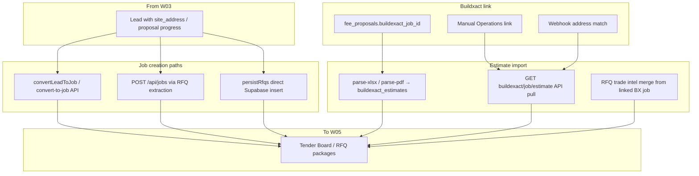

# Workflow 04 — Estimate / Buildxact Import / Tender Job Setup

**Status:** Mapped (2026-06-24) — documentation only; no product code changes  
**Gate:** Accepted 2026-06-24 (cross-check + W04-DRIFT-007) — proceed W05+  
**Related:** [03_FEE_PROPOSAL_PTSA.md](./03_FEE_PROPOSAL_PTSA.md), [WORKFLOW_TEST_MATRIX.md](../WORKFLOW_TEST_MATRIX.md), [BUG_REGISTER.md](../BUG_REGISTER.md), [SAM_DECISION_LOG.md](../SAM_DECISION_LOG.md), [30_DAY_HARDENING_TRACKER.md](../30_DAY_HARDENING_TRACKER.md)

**Starts after:** W03 — fee proposal and/or PTSA progress; lead at `accepted` / `tender` or staff entering tender workflow  
**Hands off to:** [Workflow 05 — Tender Board / Tender Lifecycle](./05_TENDER_BOARD_LIFECYCLE.md)

---

## Evidence standards (used in this document)

| Label | Meaning |
|-------|---------|
| **Verified from code** | Confirmed in repo file, route, table, or migration |
| **Verified from SOP/docs** | Stated in SOP or agent knowledge doc |
| **Inferred from behaviour** | Logical conclusion from code paths |
| **Unconfirmed / needs testing** | Plausible but not proven by read-only audit |
| **Open decision for Sam** | Business rule — [SAM_DECISION_LOG.md](../SAM_DECISION_LOG.md) |

---

## 1. Business intent

Before RFQ packages and tender board work (W05), Blue Leaf needs a **canonical Hub job** on the tender spine: real site address, client identity, optional Buildxact estimate baseline, and (where applicable) `leads.job_id` linkage.

Buildxact is the **financial estimate system of record**; the Hub **mirrors** estimate rows into `buildexact_estimates` and links jobs via `buildexact_job_id` — it does **not** auto-create Hub jobs from Buildxact alone.

**Verified from SOP/docs:** SOP 05-04 — linking is verify/pull after Hub project exists; SOP 03-01 — fee proposal imports Buildxact XLSX (W03 Track A overlap).

**Verified from agent knowledge:** [SOURCE_OF_TRUTH.md](../../agent_knowledge/SOURCE_OF_TRUTH.md) — `jobs` owns address and `buildexact_job_id`; `buildexact_estimates` stores imported estimate snapshots.

---

## 2. Start trigger

| Trigger | Path | Evidence |
|---------|------|----------|
| Lead reaches `tender` stage | Lead Detail → Create job / Open RFQ Engine | **Verified from code:** `GATE_REQUIREMENTS.tender` requires `job_id` (`LeadDetail.jsx:75`) |
| Staff clicks Create job on Lead Detail | `POST .../convert-to-job` | **Verified from code:** `LeadDetail.jsx:1096–1102` |
| PTSA marked signed | Non-fatal `convertLeadToJob` inside mark-signed | **Verified from code:** `salesRoutes.mjs:704–710` (W03 handoff) |
| RFQ Engine PDF extraction completes | `persistJobFromExtraction` | **Verified from code:** `RfqEngine.jsx:1583` |
| RFQ send persistence (no prior job id) | `persistRfqs` insert branch | **Verified from code:** `RfqEngine.jsx:1664–1682` |
| Fee proposal wizard imports XLSX/PDF | Parse routes persist estimate | **Verified from code:** `module5Routes.mjs:122+` (W03 overlap) |
| Staff pulls Buildxact estimate by job id | `GET /api/buildexact/job/:id/estimate` | **Verified from code:** `buildexactIntegrationRoutes.mjs:65` |
| Buildxact webhook job event | Address match → link `projects` + propagate `jobs` | **Verified from code:** `buildexactWebhook.mjs:230–249` |

---

## 3. End / handoff

W04 ends when a **`jobs` row** exists that W05 can treat as the tender job:

| End state | Minimum for W05 | Evidence |
|-----------|-----------------|----------|
| Job created with real address | `jobs.address` ≠ `"Address pending"` | **Open decision for Sam:** SAM-W04-001 recommends block |
| Lead linked (lead-sourced path) | `leads.job_id` set | **Verified from code:** `convertLeadToJob` step 6 |
| Estimate baseline (optional) | Row in `buildexact_estimates` and/or `buildexact_job_id` | **Business recommended / quality gate** |
| Dropbox folders (optional) | `dropbox_shared_link` or ensured at RFQ compose | **Verified from code:** deferred for lead-sourced POST `/api/jobs` (`jobsApiRoutes.mjs:98–99`) |

**Hands off to W05:** Tender Board lists `jobs` with `status` tendering/won/lost; RFQ Engine expects `jobId` query param or extraction-created job.

---

## 4. Main users

| User | Role | Evidence |
|------|------|----------|
| Sam / Josh | Directors — approve tender entry, link Buildxact | **Verified from SOP/docs** |
| Admin / tender staff | Create job, run RFQ extraction, import estimates | **Verified from code:** `/tender-manager/*`, `/sales/*` admin-gated |
| Buildxact (external) | Estimate SoR; webhook/link source | **Verified from code:** API + webhook handlers |

---

## 5. Blue Leaf business workflow

1. Complete W03 tracks (PTSA and/or fee proposal) as business requires.
2. Ensure **site address** on lead before job conversion (**Verified from code:** `convertLeadToJob` throws without `site_address`).
3. Create or match **Hub job** (convert-to-job, RFQ extraction, or manual POST `/api/jobs`).
4. Import or pull **Buildxact estimate** (XLSX in fee proposal wizard, API pull, or RFQ trade-intel merge) — quality gate for RFQ baseline.
5. Optionally **link Buildxact job id** (manual Operations link, webhook, or fee proposal wizard field).
6. Advance lead to **`tender`** and open RFQ Engine / Tender Board (W05).

---

## 6. Hub workflow

**Plain English:** Multiple code paths can create or update the same logical job. Only `convertLeadToJob` stamps facts with provenance. Buildxact never creates the Hub job — it enriches and links after the job exists.

---

## 7. SOP interpretation

| SOP | W04 relevance | Evidence |
|-----|---------------|----------|
| [tendering_fee_proposal_create.md](../../sops/03_tendering/tendering_fee_proposal_create.md) | XLSX import seeds estimate row | **Verified from SOP/docs** — overlaps W03 Track A |
| [operations_link_buildexact.md](../../sops/05_operations/operations_link_buildexact.md) | Link after Hub project exists; pull estimate | **Verified from SOP/docs** |
| [settings_buildexact.md](../../sops/12_admin_settings/settings_buildexact.md) | Credentials + webhook URL | **Verified from SOP/docs** |
| Dedicated “create tender job from lead” SOP | **Missing** | **Unconfirmed / needs testing** — behaviour inferred from Lead Detail + code comments |

---

## 8. Code interpretation

### 8.1 Job creation — `convertLeadToJob` (canonical lead path)

**File:** `server/lib/salesRoutes.mjs:231+`

**Verified from code:**
- Idempotent if `lead.job_id` already set.
- **Requires** `lead.site_address` or throws 400.
- Dedup: `address_normalised` then raw `ilike` on `jobs`.
- Inserts job with `lead_id`, client fields, `status` = `won` if lead stage `won` else `tendering`.
- Stamps carried facts via `setFact(..., reason: "lead_conversion")` — address, client_*, project_type, architect_name, estimated_value.
- Updates `leads.job_id`, links CRM contact, referral rollup.
- **No Dropbox** at creation.

**Callers:**
- `POST /api/sales/leads/:id/convert-to-job` (`salesRoutes.mjs:578`)
- `POST .../ptsa/mark-signed` non-fatal block (`salesRoutes.mjs:704`)
- Lead Detail create job + tender CTA (`LeadDetail.jsx:1096–1128`)

### 8.2 Job creation — `POST /api/jobs`

**File:** `server/lib/jobsApiRoutes.mjs:45+`

**Verified from code:**
- Requires `address`; normalises via `normaliseAddress`.
- Dedup **skipped** when address is `"Address pending"` (`PLACEHOLDER_ADDRESS`).
- **No `setFact` loop** — columns written directly on insert.
- Dropbox provisioning: only when **not** placeholder and **no** `lead_id` (`jobsApiRoutes.mjs:102`).
- Used by `persistJobFromExtraction` (`RfqEngine.jsx:1399–1413`).

### 8.3 Job creation — `persistRfqs` fallback (direct Supabase)

**File:** `RfqEngine.jsx:1664–1682`

**Verified from code:** When `extractionJobIdRef.current` is empty, inserts into `jobs` via **browser Supabase client**, not `POST /api/jobs`.

**Inferred:** Bypasses server dedup, address normalisation consistency, and `setFact` provenance — **W04-DRIFT-001**.

### 8.4 Estimate import — XLSX/PDF parse (W03 overlap)

**File:** `module5Routes.mjs:122+`, `271+`

**Verified from code:**
- Parses file → `resolveJobIdByAddress(parsed.address)` → inserts `buildexact_estimates` with `source` xlsx/pdf, optional `source_hash` cache (migration 056).
- May seed `job_budgets` from categories (non-fatal).
- **Does not create job** if address unmatched — `job_id` null on estimate row.

### 8.5 Estimate pull — Buildxact API

**File:** `buildexactIntegrationRoutes.mjs:65+`

**Verified from code:**
- `pullBuildexactEstimate` → `persistPulledEstimate` → `buildexact_estimates` with `source: "buildexact_api"`.
- Resolves Hub `job_id` by `jobs.buildexact_job_id` or `projects.buildexact_job_id`.

### 8.6 Buildxact job link (not job create)

**Verified from code:**
- **Webhook** (`buildexactWebhook.mjs`): matches `projects` by address → sets `projects.buildexact_job_id`; propagates to `jobs.buildexact_job_id` if `match.job_id` set (BUG-N4 fix).
- **Manual** (`OperationsProjectDetail.jsx:403`): updates project row with `buildexact_link_source: "manual"`.
- **Sync mirror** (`buildexactSync.mjs`): upserts `buildexact_job_sync`; links by `buildexact_job_id` or address.
- **Reconcile** (`buildexactReconcile.mjs`): reads `jobs.buildexact_job_id` first, legacy `projects` fallback.

**Verified from code:** Buildxact does **not** insert into `jobs` on webhook — only links existing project/job by address match.

### 8.7 Address placeholder

**Verified from code:** `"Address pending"` sentinel in `jobsApiRoutes.mjs:18`, `extractionJobFields.mjs:17`, `RfqEngine.jsx:1400`.

**Inferred:** Allows RFQ extraction to proceed before site address known — **W04-DRIFT-005** / SAM-W04-001.

---

## 9. Entry points

| ID | Entry | Creates/updates | API / file |
|----|-------|-----------------|------------|
| E1 | Lead Detail — Create job | Job + `leads.job_id` | `POST /api/sales/leads/:id/convert-to-job` |
| E2 | Lead Detail — Tender → RFQ Engine | Job if missing, then navigate | convert-to-job + `/tender-manager/rfq-engine?leadId&jobId` |
| E3 | RFQ Engine — Extract PDFs | Job via POST/PATCH `/api/jobs` | `persistJobFromExtraction` |
| E4 | RFQ Engine — Send/persist RFQs | Job insert/update | `persistRfqs` |
| E5 | Fee Proposal wizard — Import XLSX | `buildexact_estimates` (+ optional job match) | `POST /api/fee-proposal/parse-xlsx` |
| E6 | Fee Proposal wizard — Pull BX estimate | `buildexact_estimates` | `GET /api/buildexact/job/:id/estimate` |
| E7 | Operations — Link Buildxact | `projects.buildexact_job_id` | Direct Supabase update |
| E8 | Buildxact webhook | Link only | `POST /api/webhooks/buildexact` |

---

## 10. Exit points

| Exit | Condition | Next |
|------|-----------|------|
| Tender Board visible job | `jobs` row exists | W05 list/detail |
| RFQ Engine with jobId | Query param or extraction ref | W05/W06 RFQ package |
| Lead stage `tender` + `job_id` | Gate satisfied | W05 |
| Estimate row without job | `buildexact_estimates.job_id` null | **Unconfirmed:** manual job match later |

---

## 11. Screens

| Screen | Route | W04 role |
|--------|-------|----------|
| **LeadDetail** | `/sales/:leadId` | Create job, tender CTA, gate checks |
| **RfqEngine** | `/tender-manager/rfq-engine` | Extraction job create, trade intel from BX |
| **FeeProposalWizard** | `/tender-manager/fee-proposal/*` | Import estimate, pick job, set `buildexact_job_id` |
| **TenderBoard** | `/tender-manager/board` | Read-only list of tender jobs (W05 entry) |
| **OperationsProjectDetail** | `/operations/projects/:id` | Manual Buildxact link |
| **Settings** | `/settings` | Buildxact status, webhook events |

---

## 12. Routes

### Job spine

| Method | Route | Owner | Notes |
|--------|-------|-------|-------|
| POST | `/api/sales/leads/:id/convert-to-job` | salesRoutes.mjs | setFact + dedup |
| POST | `/api/jobs` | jobsApiRoutes.mjs | RFQ extraction create |
| PATCH | `/api/jobs/:id` | jobsApiRoutes.mjs | RFQ field apply; allowlisted columns |

### Estimate import

| Method | Route | Owner |
|--------|-------|-------|
| POST | `/api/fee-proposal/parse-xlsx` | module5Routes.mjs |
| POST | `/api/fee-proposal/parse-pdf` | module5Routes.mjs |
| GET | `/api/buildexact/job/:buildexactJobId/estimate` | buildexactIntegrationRoutes.mjs |
| POST | `/api/buildexact/sync/:buildexactJobId` | buildexactIntegrationRoutes.mjs |

### Link / webhook

| Method | Route | Owner |
|--------|-------|-------|
| POST | `/api/webhooks/buildexact` | buildexactWebhook.mjs |
| GET | `/api/buildexact/webhook-events` | module4Routes.mjs |

---

## 13. Database ownership

### `jobs` (primary tender spine — **Verified from SOURCE_OF_TRUTH.md**)

**Owns:** `address`, `address_normalised`, client identity, `status`, `lead_id`, `buildexact_job_id`, Dropbox paths, extracted RFQ fields.

**Created by:** convertLeadToJob, POST `/api/jobs`, persistRfqs direct insert, **not** Buildxact webhook alone.

### `leads`

**Owns:** `job_id` FK link back to job after conversion.

**Does not own:** Job address after conversion (read via join; facts on job).

### `buildexact_estimates`

**Owns:** Parsed/pulled estimate snapshots (categories, totals, schedule_hints, cost_metrics, `source`, `source_hash`).

**Does not own:** Live Buildxact estimate (external SoR).

### `buildexact_job_sync`

**Owns:** Financial mirror snapshot per Buildxact job id.

### `projects`

**Owns:** Operations project row; **redundant** `buildexact_job_id` with link provenance fields — **Verified from SOURCE_OF_TRUTH.md** drift risk.

---

## 14. External integrations

| Integration | W04 role | Evidence |
|-------------|----------|----------|
| **Buildxact API** | Pull estimate; sync job financials; catalogues | buildexactClient.mjs, buildexactIntegrationRoutes.mjs |
| **Buildxact webhook** | Auto-link by address to existing project/job | buildexactWebhook.mjs |
| **Dropbox** | Job folder tree (deferred for lead-sourced create) | jobsApiRoutes.mjs, PTSA mark-signed |
| **Anthropic** | RFQ PDF extraction (job field seed) | module4Routes.mjs — **Unconfirmed** depth for W04 |

---

## 15. Existing tests

| Test | Coverage | Evidence |
|------|----------|----------|
| W04 automated suite | **Missing** | No dedicated convert-to-job or estimate-import test scripts found |
| `scripts/reconcile-buildxact.mjs` | BX ↔ Hub reconcile | Manual ops script |
| RFQ matcher scripts | Quote matching, not job create | Batch B |
| Admin readonly smoke | May load tender routes | **Unconfirmed** W04 depth |

---

## 16. Drift risks

### W04-DRIFT-001 — `persistRfqs` direct Supabase job insert bypasses server create path

**Verified from code:** `RfqEngine.jsx:1678` — insert when no `jid`; skips POST `/api/jobs` dedup/normalisation.

**Severity:** High.

### W04-DRIFT-002 — Fact provenance gap between job creation paths

**Verified from code:** `convertLeadToJob` calls `setFact`; POST `/api/jobs` and `persistRfqs` do not.

**Severity:** Medium — Canonical Data Law compliance.

### W04-DRIFT-003 — Address dedup asymmetry

**Verified from code:** POST `/api/jobs` skips dedup for `"Address pending"`; `convertLeadToJob` never creates with placeholder; `persistRfqs` insert may not normalise address the same way.

**Severity:** Medium.

### W04-DRIFT-004 — `buildexact_job_id` not set at lead conversion

**Verified from code:** `convertLeadToJob` insert payload has no `buildexact_job_id`; linking is manual/webhook/fee proposal later.

**Severity:** Low — **Business recommended / quality gate** for estimate pull.

### W04-DRIFT-005 — `"Address pending"` jobs allowed into RFQ workflow

**Verified from code:** Extraction creates placeholder address; no server block before RFQ package.

**Decision:** SAM-W04-001 — recommended block before RFQ package.

**Severity:** High (handoff to W05/W06).

### W04-DRIFT-006 — Dual `buildexact_job_id` on `jobs` vs `projects`

**Verified from SOURCE_OF_TRUTH.md + code:** Webhook writes both; manual link may write project only; consumers read `jobs` first.

**Severity:** Medium — **Unconfirmed / needs testing** whether all paths propagate.

### W04-DRIFT-007 — RFQ extraction-created job may not link back to lead until later RFQ persistence

**Verified from code:** `persistJobFromExtraction` creates/updates a job via `POST /api/jobs` / `PATCH /api/jobs` without passing `lead_id` (`RfqEngine.jsx:1399–1413`). `prefillLeadRef` stores lead identity from `/api/tender/prefill` (`RfqEngine.jsx:725–730`). `persistRfqs` can patch/insert `lead_id` and heal client fields (`RfqEngine.jsx:1660–1672`) — **only if that path runs**.

**Impact:** If staff enter RFQ Engine from a lead, extraction creates a job, then stop before RFQ persistence/send, the job may exist without `jobs.lead_id` / `leads.job_id` traceability — weakening W04→W05 handoff, Tender Board CRM continuity, and lead-sourced reporting.

**Severity:** Medium. **Tests:** W04-API-06, W04-UI-02.

---

## 17. Security / role risks

**Verified from code:** `convert-to-job`, POST/PATCH `/api/jobs`, fee-proposal parse, buildexact pull routes use `requireAuth`.

**Verified from code:** Webhook uses optional HMAC secret; fail-open when secret unset (`buildexactWebhook.mjs:139–141`).

**Risk — persistRfqs direct Supabase:** Browser anon client + RLS — **Unconfirmed / needs testing** (W04-SEC-01).

**Risk — placeholder jobs:** No role distinction; any admin can create draft-address jobs via RFQ Engine.

---

## 18. Required handoff data

### Before W05 (Tender Board / RFQ packages)

| Field / record | Required? | Evidence |
|----------------|-----------|----------|
| `jobs.id` | **Yes** | Tender Board queries `jobs` |
| `jobs.address` (real, not placeholder) | **Yes** per SAM-W04-001 | **Open decision for Sam** |
| `leads.job_id` (lead-sourced tenders) | **Recommended** | Lead Detail gates, CRM continuity |
| `buildexact_estimates` row or API pull | **Business recommended / quality gate** | RFQ trade intel, fee proposal |
| `jobs.buildexact_job_id` | **Business recommended / quality gate** | Pull/sync/reconcile paths |
| Dropbox folder | **Optional** | Non-fatal; re-ensured at RFQ compose |

### From W03

| Field | Required? |
|-------|-----------|
| `site_address` on lead | **Yes** for convertLeadToJob |
| PTSA signed and/or fee proposal accepted | **Business recommended** — not enforced at job create |

---

## 19. Handoff failure risks

| If missing / wrong | What breaks |
|--------------------|-------------|
| No `site_address` on lead | convert-to-job fails; PTSA sign may skip job (**W03-DRIFT-002**) |
| Job with `"Address pending"` | Tender/RFQ on wrong spine; dedup collisions; SAM-W04-001 |
| Duplicate jobs from path mismatch | RFQ vs convert dedup diverge (**W04-DRIFT-001/003**) |
| Estimate import without job match | `buildexact_estimates.job_id` null; RFQ baseline weak |
| `buildexact_job_id` only on `projects` | Finance/workforce readers miss link (**W04-DRIFT-006**) |
| No `leads.job_id` after job exists | Lead Detail gates, tender CTA confusion |
| Extraction job without `lead_id` before persistRfqs | Orphan tender job from lead entry (**W04-DRIFT-007**) |

---

## 20. Workflow acceptance criteria

W04 mapping complete when:

1. All job creation paths documented with dedup/fact differences ✓
2. Buildxact import vs link vs create distinguished ✓
3. Source-of-truth for `jobs` vs `buildexact_estimates` declared ✓
4. Handoff to W05 requirements declared ✓
5. Drift IDs registered; tests planned ✓

**Stable enough for fixes (post-review):** SAM-W04-001 decided; W04-API-05 documents placeholder behaviour.

---

## 21. Required tests

See [WORKFLOW_TEST_MATRIX.md](../WORKFLOW_TEST_MATRIX.md) — planned only.

| ID | Scenario |
|----|----------|
| W04-API-01 | convert-to-job creates job, stamps facts, sets `leads.job_id`, dedups by address |
| W04-API-02 | POST `/api/jobs` dedup + placeholder skips dedup |
| W04-API-03 | parse-xlsx inserts `buildexact_estimates`, resolves `job_id` by address |
| W04-API-04 | Buildxact API pull persists estimate row + optional job knowledge |
| W04-API-05 | Address-pending job blocked or warned before RFQ package (SAM-W04-001) |
| W04-UI-01 | LeadDetail tender CTA creates job when missing then navigates |
| W04-UI-02 | RFQ Engine from LeadDetail preserves lead/job linkage before RFQ send |
| W04-API-06 | RFQ extraction with lead context links `jobs.lead_id` + `leads.job_id`, or documents gap |
| W04-SEC-01 | Non-admin cannot create/patch jobs or pull estimates |

---

## 22. Open decisions for Sam

| ID | Topic |
|----|-------|
| SAM-W04-001 | Block `"Address pending"` jobs before RFQ package creation |

---

## 23. Smallest safe fix plan

**No implementation until Batch A review.**

### P1 (post-review)

| Fix | Drift | Tests |
|-----|-------|-------|
| Route `persistRfqs` job create through POST `/api/jobs` | W04-DRIFT-001 | W04-API-02 |
| Pass `lead_id` + update `leads.job_id` at extraction job create when prefill context exists | W04-DRIFT-007 | W04-API-06, W04-UI-02 |
| Block or hard-warn RFQ package when address is placeholder | W04-DRIFT-005 | W04-API-05 |
| Propagate `buildexact_job_id` from projects → jobs on manual link | W04-DRIFT-006 | W04-API-04 |

### P2

| Fix | Notes |
|-----|-------|
| Align POST `/api/jobs` with setFact for lead-linked creates | W04-DRIFT-002 |
| Set `buildexact_job_id` hint from fee proposal on convert | W04-DRIFT-004 |
| Document single canonical job-create path in SOP | Docs gap §7 |

### Deferred

- Buildxact webhook creating Hub jobs (not current design)
- Merge `projects` / `jobs` buildexact columns
- Full facts-service migration for all create paths

---

## Document history

| Date | Change |
|------|--------|
| 2026-06-24 | W04-DRIFT-007 (extraction lead link gap); stop summary accepted |
| 2026-06-24 | Workflow 04 initial map — Batch A |
