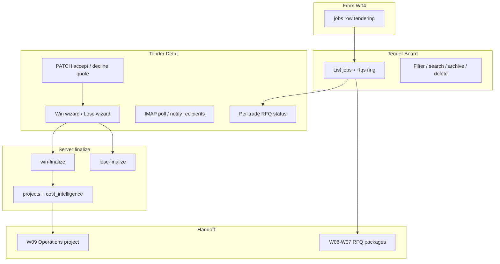

# Workflow 05 — Tender Board / Tender Lifecycle

**Status:** Mapped (2026-06-24) — documentation only; no product code changes  
**Gate:** Accepted 2026-06-24 (direction + W05-DRIFT-008/009 cleanup) — Batch A summary complete  
**Related:** [04_ESTIMATE_BUILDXACT_TENDER_SETUP.md](./04_ESTIMATE_BUILDXACT_TENDER_SETUP.md), [WORKFLOW_TEST_MATRIX.md](../WORKFLOW_TEST_MATRIX.md), [BUG_REGISTER.md](../BUG_REGISTER.md), [SAM_DECISION_LOG.md](../SAM_DECISION_LOG.md), [RFQ_TENDER_WORKFLOW_SOURCE_OF_TRUTH.md](../RFQ_TENDER_WORKFLOW_SOURCE_OF_TRUTH.md)

**Starts after:** W04 — `jobs` row exists (ideally real address, optional `lead_id` / estimate baseline)  
**Hands off to:** W09 Tender Win / Operations Handoff (project activation); Batch B W06–W08 for package/engine RFQ depth

---

## Evidence standards (used in this document)

| Label | Meaning |
|-------|---------|
| **Verified from code** | Confirmed in repo file, route, table, or migration |
| **Verified from SOP/docs** | Stated in SOP or agent knowledge doc |
| **Inferred from behaviour** | Logical conclusion from code paths |
| **Unconfirmed / needs testing** | Plausible but not proven by read-only audit |
| **Open decision for Sam** | Business rule — [SAM_DECISION_LOG.md](../SAM_DECISION_LOG.md) |

---

## 1. Business intent

Once a tender job exists (W04), Blue Leaf coordinates the **tender lifecycle**: see all active tenders, track quote progress per trade, accept/decline subcontractor quotes, mark the tender **won** or **lost**, archive finished tenders, and (on win) create/enrich the Operations **project** spine.

The Tender Board is the **director/coordinator cockpit**; detailed RFQ send/match lives in RFQ Engine (legacy `rfqs` path) and Quote Tracker / RFQ packages (Batch B).

**Verified from SOP/docs:** SOP 03-03 — board lists jobs by status with RFQ progress ring; SOP 03-04 — archive vs delete.

---

## 2. Start trigger

| Trigger | Evidence |
|---------|----------|
| Job in `tendering` status with RFQs sent or queued | **Verified from code:** Tender Board filters `jobs.status` |
| Staff opens Tender Board | `/tender-manager/board` |
| Staff clicks tender card | Navigates to Tender Detail |
| Lead at `tender` stage with `job_id` | **Verified from code:** LeadDetail tender CTA → RFQ Engine prefill (W04 overlap) |
| Staff clicks **New tender** on board | Links to RFQ Engine (creates/sends outside W05 UI) |

---

## 3. End / handoff

| End state | `jobs.status` | Next workflow |
|-----------|---------------|---------------|
| Tender won | `won` + `won_at` | **W09** — project active in Operations; portal/client notify |
| Tender lost | `lost` + `lost_at` | Terminal for tender; lead may stay at `tender` (**W05-DRIFT-004**) |
| Archived | `archived` | Hidden from default board; reversible |
| Deleted | row removed | Cascade per job-delete API |
| Still tendering | `tendering` | Continue RFQ Engine / Quote Tracker (W06–W07) |

**Verified from code:** `win-finalize` sets `jobs.status = won`, enriches/creates `projects` (`module4Routes.mjs:301–355`).

---

## 4. Main users

| User | Role | Evidence |
|------|------|----------|
| Sam / Josh | Directors — win/lose decisions, quote review | **Verified from SOP/docs** |
| Admin / supervisor | Board navigation, archive, RFQ detail actions | **Verified from code:** `/tender-manager/*` admin-gated |
| Subcontractors (external) | Quote via email — not board users | RFQ/IMAP path (Batch B) |

---

## 5. Blue Leaf business workflow

1. Open **Tender Board** — scan tendering jobs and quote progress.
2. Open **Tender Detail** for a job — review per-trade RFQ status, correspondence, engagement strip.
3. Accept/decline individual quotes or run **Mark Won** wizard (select accepted trades, cost intel, outcome emails).
4. On win — finalize project, carry contract value, seed cost intelligence, optional batch PO issue.
5. On loss — notify subs, decline RFQs, stamp job lost.
6. **Archive** completed tenders or **delete** mistaken duplicates (rare).

---

## 6. Hub workflow



**Plain English:** Board/detail are mostly **read + lightweight writes** on `jobs`/`rfqs` via Supabase client; **win/lose** are server-orchestrated in `module4Routes.mjs`.

---

## 7. SOP interpretation

| SOP | W05 coverage | Evidence |
|-----|--------------|----------|
| [tendering_tender_board.md](../../sops/03_tendering/tendering_tender_board.md) | Board tabs, search, RFQ ring, card navigation | **Verified from SOP/docs** — matches `TenderBoard.jsx` |
| [tendering_archive_tender.md](../../sops/03_tendering/tendering_archive_tender.md) | Archive + delete cascade | **Verified from SOP/docs** — archive frontend; delete API |
| Win/lose wizard SOP | **Missing dedicated SOP** | **Inferred** from TenderDetail UI + module4Routes |

---

## 8. Code interpretation

### 8.1 Tender Board (`TenderBoard.jsx`)

**Verified from code:**
- Loads `jobs` with nested `rfqs` via **direct Supabase** (`getSupabase().from("jobs").select(...)` — lines 47–53).
- RFQ progress ring: count `rfqs` with status `received` or `accepted` vs total (`quotesRingPct`).
- Status tabs: `all`, `tendering`, `won`, `lost`, `archived`.
- **Archive:** frontend `jobs.update({ status: 'archived' })` — no API (`archiveJobBoard`).
- **Delete:** `POST /api/tender/job-delete` via `authFetch` (not `apiFetch`).
- Card click → `/tender-manager/board/:jobId`.
- **Does not read** `rfq_packages` / `rfq_recipients` — **SAM-W05-001**.

### 8.2 Tender Detail (`TenderDetail.jsx`)

**Verified from code:**
- Load job + `rfqs (*, subcontractors (*))` + `correspondence` via Supabase client (`load` callback ~265).
- **PATCH quote:** `PATCH /api/rfq/:id` via `authFetch` (`patchRfq` ~441).
- **IMAP poll:** `POST /api/imap/quote-poll` button on detail.
- **Notify recipients:** `POST /api/rfq/notify-recipients`.
- **Win wizard:** builds payload → `POST /api/tender/win-finalize` with `emails: []`, then optional `POST /api/tender/outcome-mails` separately (`executeWin` ~604–628).
- **Lose wizard:** `POST /api/tender/outcome-mails` then `POST /api/tender/lose-finalize`.
- **Batch PO:** after win, `GET /api/tender/batch-po-check/:jobId` → `POST /api/po/issue` per trade (`issueBatchPos` ~725).
- **Resume RFQ Engine:** navigate `?jobId=&resume=4`.
- Archive on detail: direct Supabase update (same as board).

### 8.3 Win finalize (`module4Routes.mjs:232+`)

**Verified from code:**
- Updates `rfqs` statuses/amounts; syncs accepted quotes to Buildxact (non-fatal).
- Copies quote PDFs in Dropbox (ACCEPTED/DECLINED folders).
- Sets `jobs.status = won`, `won_at`.
- Idempotent **project** enrich/create (`projects` row via migration 096 trigger + patch).
- Carries `original_contract_value` from `fee_proposals` via `setFact` when unset.
- Inserts `cost_intelligence` rows for accepted trades.
- Sends outcome emails if provided in body (TenderDetail passes empty — uses separate outcome-mails call).
- **Does not update** `leads.stage` or `leads` row — **W05-DRIFT-004**.

### 8.4 Lose finalize (`module4Routes.mjs:517+`)

**Verified from code:** Sets `jobs.status = lost`, `lost_at`; bulk `rfqs.status = declined`; optional outcome emails. **No lead sync.**

### 8.5 Job delete (`jobsApiRoutes.mjs:181+`)

**Verified from code:** `POST /api/tender/job-delete` **explicitly** deletes, in order: `purchase_orders` (by linked project ids) → `projects` → `fee_proposals` → `cost_intelligence` → `unmatched_quote_emails` (by `matched_job_id`) → `jobs`.

**Verified from code:** **`rfqs` and `correspondence` are not explicitly deleted** in the handler — they may cascade via FKs (`rfqs.job_id` → `jobs` ON DELETE CASCADE in `001`; `correspondence.job_id` → ON DELETE CASCADE in `006`).

**Verified from schema — `rfq_packages` gap:**
- `030_rfq_packages.sql`: `rfq_packages.job_id` REFERENCES `jobs(id)` **ON DELETE SET NULL**
- `039_rfq_packages_job_required.sql`: `job_id` **NOT NULL** (constraint unchanged from SET NULL)

**Inferred:** Deleting a job with linked `rfq_packages` may **fail** (NOT NULL blocks SET NULL) or leave package inconsistency — **not** a documented delete/archive rule. **W05-DRIFT-008**.

### 8.6 Tender prefill (W04/W05 boundary)

**Verified from code:** `GET /api/tender/prefill` (`rfqPackageRoutes.mjs:151`) — seeds RFQ Engine from lead/job; not used by Tender Board itself.

---

## 9. Entry points

| ID | Entry | Action |
|----|-------|--------|
| E1 | Tender Board | List/filter tenders |
| E2 | Tender card | Open Tender Detail |
| E3 | New tender button | → RFQ Engine |
| E4 | Tender Detail — Mark Won | Win wizard → win-finalize |
| E5 | Tender Detail — Mark Lost | Lose wizard → lose-finalize |
| E6 | Board/Detail ⋯ menu | Archive or delete |
| E7 | Tender Detail — Resume RFQ Engine | RFQ session rehydrate |
| E8 | Lead Detail tender CTA | → RFQ Engine with prefill (W04) |

---

## 10. Exit points

| Exit | Writes | Next |
|------|--------|------|
| Win finalized | `jobs`, `rfqs`, `projects`, `cost_intelligence`, optional POs | Operations / W09 |
| Lose finalized | `jobs`, `rfqs` | Reporting; lead may be stale |
| Archived | `jobs.status` | Hidden from board |
| Deleted | explicit deletes + FK cascades; **rfq_packages not handled** | See W05-DRIFT-008 |

---

## 11. Screens

| Screen | Route | W05 role |
|--------|-------|----------|
| **TenderBoard** | `/tender-manager/board` | List, filter, archive, delete |
| **TenderDetail** | `/tender-manager/board/:jobId` | RFQ review, win/lose, PO batch, IMAP poll |
| **RfqEngine** | `/tender-manager/rfq-engine` | Entry for new tender / resume (linked, not board UI) |
| **QuoteTracker** | `/tender-manager/rfq-packages` | Package path (Batch B — not board aggregate) |

---

## 12. Routes

| Method | Route | Owner | W05 use |
|--------|-------|-------|---------|
| — | Supabase `jobs`/`rfqs` read | Frontend client | Board + Detail load |
| POST | `/api/tender/win-finalize` | module4Routes.mjs | Mark won |
| POST | `/api/tender/lose-finalize` | module4Routes.mjs | Mark lost |
| POST | `/api/tender/outcome-mails` | module4Routes.mjs | Win/lose emails |
| POST | `/api/tender/query-draft` | module4Routes.mjs | AI query draft to sub |
| GET | `/api/tender/batch-po-check/:jobId` | module4Routes.mjs | Post-win PO banner |
| POST | `/api/tender/job-delete` | jobsApiRoutes.mjs | Permanent delete |
| PATCH | `/api/rfq/:rfqId` | buildexactIntegrationRoutes.mjs | Accept/decline quote |
| POST | `/api/rfq/notify-recipients` | rfq routes | Bulk notify |
| POST | `/api/imap/quote-poll` | IMAP handler | Manual poll from detail |
| POST | `/api/po/issue` | PO routes | Batch PO after win |
| GET | `/api/tender/prefill` | rfqPackageRoutes.mjs | RFQ Engine entry (W04 boundary) |

---

## 13. Database ownership

### `jobs` (tender lifecycle status — **Verified from SOURCE_OF_TRUTH.md**)

**Owns:** `status` (`tendering`|`won`|`lost`|`archived`), `won_at`, `lost_at`, address, client, Dropbox links, `lead_id`.

**W05 writes:** status timestamps via win/lose-finalize; archive via frontend Supabase.

### `rfqs` (quote transaction layer for board ring)

**Owns:** Per-trade quote state (`sent`→`received`→`accepted`), `quote_amount`, engagement columns, correspondence link.

**Does not own:** Package-level rollup (`rfq_packages` — Batch B).

### `projects`

**Created/enriched on win** — Operations spine; portal client fields stamped at win-finalize.

### `leads`

**Read for prefill only** — **not updated on win/lose** (**W05-DRIFT-004**).

### `correspondence`, `cost_intelligence`, `purchase_orders`

**Written** from detail (log reply), win-finalize (cost intel), batch PO flow.

---

## 14. External integrations

| Integration | W05 role | Evidence |
|-------------|----------|----------|
| Gmail / mail transport | Outcome emails, notify recipients | outcome-mails, notify-recipients |
| Dropbox | Win quote PDF copy, query email archive | win-finalize, dropboxClient |
| Buildxact | Accepted quote sync on win | syncAcceptedQuoteToBuildexact |
| IMAP | Manual quote poll from detail | imap quote-poll |
| Resend webhooks | RFQ engagement columns on detail strip | rfqs email_* columns |
| Anthropic | Query draft | query-draft |

---

## 15. Existing tests

| Test | Coverage | Evidence |
|------|----------|----------|
| W05 automated suite | **Missing** | No dedicated tender-board spec |
| RFQ matcher scripts | Inbound quotes | Batch B — not board UI |
| SOP 03-03 / 03-04 TC scripts | Manual troubleshoot | SOP Section 14 — `test_status: static_pass` |
| Admin readonly smoke | May hit tender routes | **Unconfirmed** win/lose depth |

---

## 16. Drift risks

### W05-DRIFT-001 — Board/Detail use direct Supabase instead of API layer

**Verified from code:** `TenderBoard.jsx`, `TenderDetail.jsx` load and some writes bypass `apiFetch`.

**Severity:** Medium — RLS/consistency risk (extends W03/W04 direct-client pattern).

### W05-DRIFT-002 — Archive tender has no server API

**Verified from code:** `archiveJobBoard` / detail archive use frontend Supabase update only.

**Severity:** Low — no audit trail; reversible.

### W05-DRIFT-003 — Board aggregates `rfqs` only, not `rfq_packages`

**Verified from code:** Board select joins `rfqs` only; package path invisible on ring.

**Decision:** SAM-W05-001.

**Severity:** High for jobs that only use Quote Tracker packages.

### W05-DRIFT-004 — Win/lose does not sync `leads` pipeline

**Verified from code:** `win-finalize` / `lose-finalize` do not PATCH `leads.stage` or stamp `won_at`/`lost_at` on lead.

**Severity:** Medium — Sales pipeline and tender board can diverge.

### W05-DRIFT-005 — Batch PO issue passes empty `projectId`

**Verified from code:** `issueBatchPos` uses `rfqs.find(...)?.project_id` but `rfqs` has no `project_id` column (`001_blue_leaf_schema.sql:37`) — always `""`.

**Severity:** Medium — **Unconfirmed / needs testing** whether `/api/po/issue` resolves project from `jobId`.

### W05-DRIFT-006 — Win email split across two API calls

**Verified from code:** `executeWin` calls win-finalize with `emails: []`, then outcome-mails separately.

**Severity:** Low — document pattern; partial failure could win job without emails sent.

### W05-DRIFT-007 — Cross-cutting DRIFT-014 may affect accept on detail

**Verified from BUG_REGISTER:** Accept PATCH expects `quote_amount` — **Unconfirmed** on TenderDetail accept UI vs IMAP-ingested field names.

**Related:** DRIFT-014 (RFQ cross-cutting).

### W05-DRIFT-008 — job-delete does not explicitly handle rfq_packages

**Verified from code:** [jobsApiRoutes.mjs:181–200](../../server/lib/jobsApiRoutes.mjs) deletes projects, fee_proposals, cost_intelligence, unmatched_quote_emails, then jobs — **no** `rfq_packages` handling.

**Verified from schema:** [030_rfq_packages.sql:7](../../supabase/migrations/030_rfq_packages.sql) `ON DELETE SET NULL`; [039_rfq_packages_job_required.sql:20–21](../../supabase/migrations/039_rfq_packages_job_required.sql) `job_id NOT NULL`.

**Impact:** Tender deletion with RFQ packages may fail, or package audit/history may not follow a documented delete/archive rule.

**Severity:** High. **Test:** W05-API-05.

### W05-DRIFT-009 — Won tender operations handoff not fully proven beyond project row

**Verified from code:** `win-finalize` creates/enriches `projects`, seeds `cost_intelligence`, carries contract value — procurement, schedule, portal, WHS readiness **not** validated in W05 (W09/W10/W12/W14/W18 unmapped).

**Severity:** Medium — do **not** treat win as full operations handoff yet.

### W05-STRUCTURAL-001 — Tender Board workflow model may be too blunt for real tender operations

**Severity:** High — workflow design risk (structural, not a single code bug).

**Problem:** Tender Board currently behaves as a **`jobs` + `rfqs` cockpit**, but the real tender workflow has more phases than `jobs.status` can represent. The board does **not** clearly separate: tender setup, RFQ package preparation, RFQs sent, quote receipt, quote review, price finalisation, submitted/waiting, won/lost, and operations handoff.

**Evidence — Verified from code:**
- `TenderBoard.jsx` reads `jobs` + nested `rfqs` only.
- RFQ package progress lives in `rfq_packages` / `rfq_trade_scopes` / `rfq_recipients` and is **not** shown in the board progress ring.
- `jobs.status` only represents broad lifecycle states: `tendering`, `won`, `lost`, `archived`.
- Related drift already registered: rfqs-only progress (W05-DRIFT-003), lead sync (W05-DRIFT-004), archive/delete (W05-DRIFT-002/008), partial ops handoff (W05-DRIFT-009).

**Expected future model (document only — do not redesign during Batch A / 30-day hardening):**

| Surface | Role |
|---------|------|
| **Tender Board** | High-level tender pipeline and risk view |
| **Tender Detail** | Single-tender control room |
| **RFQ Package Detail** | Trade package / quote workbench |
| **Win / Handoff** | Operations readiness checklist |

**Hardening stance:** Map and test **current** behaviour; **avoid building more workflow logic into the wrong surface** until SAM-W05-006 is decided. **Open decision:** SAM-W05-006.

### Proposed tender phases (future workflow model — not implementation)

**Verified from SOP/docs + mapping inference:** Blue Leaf tender work spans more steps than `jobs.status`. A future `tender_phase` (or equivalent) might include:

```text
lead_accepted
tender_setup
documents_ready
rfq_packages_preparing
rfqs_sent
quotes_receiving
quote_review
price_finalisation
submitted_waiting
won
lost
archived
```

**Not implemented.** No schema, UI, or API changes in Batch A. For review before major Tender Board UI investment.

---

**Verified from code:** Win/lose/delete/query/batch-po routes use `requireAuth`.

**Verified from code:** `/tender-manager/*` admin-gated in `App.jsx`.

**Risk — direct Supabase archive/delete visibility:** Delete goes through API; archive relies on RLS — **Unconfirmed** (W05-SEC-01).

**Risk — job-delete cascade:** Irreversible; no soft-delete — SOP warns admin only.

---

## 18. Required handoff data

### Before W05 (from W04)

| Field | Required? |
|-------|-----------|
| `jobs.id` | **Yes** |
| `jobs.address` (real) | **Yes** per SAM-W04-001 |
| `jobs.status = tendering` | **Typical** |
| `rfqs` rows (for progress ring) | **Optional** — ring shows 0 until sent |
| `jobs.lead_id` / `leads.job_id` | **Recommended** — traceability (**W04-DRIFT-007**) |

### Before W09 (Operations handoff on win)

| Field | Required? |
|-------|-----------|
| `jobs.status = won` | **Yes** |
| `projects` row for `job_id` | **Yes** — win-finalize creates/enriches |
| Accepted trades with `quote_amount` | **Recommended** for cost_intelligence |
| `original_contract_value` or fee proposal | **Business recommended** — win-finalize carry |
| Client email on job/project | **Recommended** for portal notify |

---

## 19. Handoff failure risks

| If missing / wrong | What breaks |
|--------------------|-------------|
| Job only in `rfq_packages`, no `rfqs` | Board shows 0% quote progress (**W05-DRIFT-003**) |
| Win without fee proposal value | Contract value $0 until manual fix |
| Lead still at `tender` after job won | Pipeline reporting wrong (**W05-DRIFT-004**) |
| Orphan job (no `lead_id`) | CRM can't navigate lead ↔ tender (**W04-DRIFT-007**) |
| Delete instead of archive | Irreversible; **rfq_packages may block or orphan** (**W05-DRIFT-008**) |
| Batch PO with empty projectId | PO issue may fail (**W05-DRIFT-005**) |
| Win treated as full ops ready | Schedule/procurement/portal/WHS unmapped (**W05-DRIFT-009**) |

---

## 20. Workflow acceptance criteria

W05 mapping complete when:

1. Board vs Detail vs win/lose API responsibilities documented ✓
2. `jobs` vs `rfqs` vs `projects` ownership at tender lifecycle declared ✓
3. rfqs-only board limitation registered (SAM-W05-001) ✓
4. Handoff to W09 and Batch B RFQ declared ✓
5. Tests planned ✓
6. Structural under-modelling documented (W05-STRUCTURAL-001) ✓

---

## 21. Required tests

See [WORKFLOW_TEST_MATRIX.md](../WORKFLOW_TEST_MATRIX.md) — planned only.

| ID | Scenario |
|----|----------|
| W05-UI-01 | Board loads, status tabs filter, search by address |
| W05-UI-02 | RFQ progress ring matches rfqs received/accepted counts |
| W05-UI-03 | Win wizard → job won + project row exists |
| W05-API-01 | win-finalize updates rfqs, jobs, projects, cost_intelligence |
| W05-API-02 | lose-finalize declines rfqs, stamps lost_at |
| W05-API-03 | job-delete explicit deletes + FK cascades (not full clean cascade) |
| W05-API-04 | batch-po-check returns accepted trades without PO |
| W05-API-05 | job-delete with linked rfqs/rfq_packages/correspondence follows documented rule |
| W05-API-06 | Archive audited or documents frontend-only gap |
| W05-API-07 | Won/lost updates or documents no linked lead stage change |
| W05-API-08 | Package-only RFQ progress shown on board or documented as drift |
| W05-E2E-01 | Tender Board → Detail → win → Operations list smoke |
| W05-SEC-01 | Non-admin cannot win/lose/delete; RLS on board reads |

---

## 22. Open decisions for Sam

| ID | Topic |
|----|-------|
| SAM-W05-001 | Tender Board aggregate from `rfqs` only vs merge `rfq_packages` |
| SAM-W05-002 | Archive reversible and audited? |
| SAM-W05-003 | Delete allowed for jobs with RFQs/packages? |
| SAM-W05-004 | Auto-update linked lead on win/lose? |
| SAM-W05-005 | Minimum operations handoff after win? |
| SAM-W05-006 | Simple jobs.status board vs true tender phase board? |

---

## 23. Smallest safe fix plan

**No implementation until Batch A review.**

### P1 (post-review)

| Fix | Drift | Tests |
|-----|-------|-------|
| Document rfqs-only board; add package progress when SAM-W05-001 decided | W05-DRIFT-003 | W05-UI-02 |
| On win/lose, PATCH linked lead stage + outcome timestamps | W05-DRIFT-004 | W05-API-01/02 |
| Block or document job-delete when rfq_packages linked | W05-DRIFT-008 | W05-API-05 |
| Document win ≠ full ops handoff; map W09 before claiming ready | W05-DRIFT-009 | W05-E2E-01 |

### P2

| Fix | Notes |
|-----|-------|
| Pass resolved `projectId` to batch PO from win-finalize project id | W05-DRIFT-005 | W05-API-04 |
| Archive via API with audit | W05-DRIFT-002 | W05-API-06 |
| Board/detail reads via API + camelCase | W05-DRIFT-001 |
| Single win-finalize call including emails | W05-DRIFT-006 |

### Deferred

- Merge Tender Board with Quote Tracker UI
- Full package-first board (SAM-W05-001 option C)
- **Tender Board phase model redesign** (W05-STRUCTURAL-001 / SAM-W05-006) — review before major UI fixes

---

## Source-of-truth check

**Expected:** `jobs` owns tender lifecycle status; `rfqs` owns per-trade quote transactions for board progress; `projects` owns Operations record after win; Buildxact remains external SoR for accepted quote sync.

**Confirmed:** TenderBoard reads `jobs` + nested `rfqs`; win-finalize writes `jobs.won_at`, enriches `projects`, inserts `cost_intelligence`; lose-finalize writes `jobs.lost_at`; job-delete explicitly removes projects/fee_proposals/cost_intelligence/unmatched_quote_emails then jobs — `rfqs`/`correspondence` may FK-cascade; **`rfq_packages` not explicitly handled**.

**Mismatch:**
- Board ignores `rfq_packages`
- Win/lose do not update `leads`
- Archive bypasses API
- Batch PO may lack `projectId`
- RFQ Engine lead link may be late (W04-DRIFT-007)
- `job-delete` does not explicitly handle `rfq_packages` and needs delete/archive rule (W05-DRIFT-008)
- `win-finalize` is project creation/enrichment, not full operations readiness (W05-DRIFT-009)
- **Tender Board structurally under-models real tender phases** — `jobs.status` too coarse (W05-STRUCTURAL-001)

---

## Document history

| Date | Change |
|------|--------|
| 2026-06-24 | W05-STRUCTURAL-001 + proposed tender phases; SAM-W05-006 |
| 2026-06-24 | W05-DRIFT-008/009; job-delete cascade corrected; stop summary accepted |
| 2026-06-24 | Workflow 05 initial map — Batch A complete |
