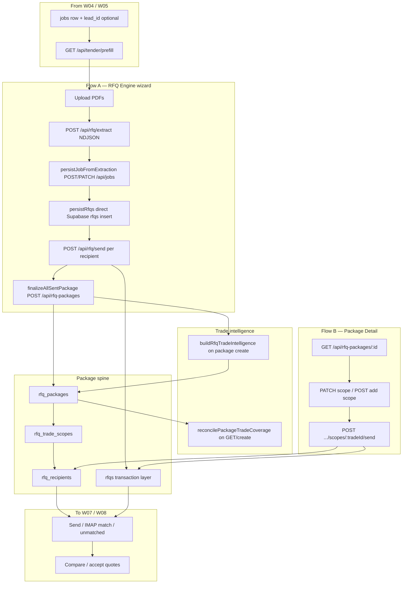

# Workflow 06 — RFQ Package / Scope Extraction

**Status:** Mapped (2026-06-25) — documentation only; no product code changes  
**Gate:** Pending Batch B review — proceed W07 after W06 acceptance  
**Related:** [04_ESTIMATE_BUILDXACT_TENDER_SETUP.md](./04_ESTIMATE_BUILDXACT_TENDER_SETUP.md), [05_TENDER_BOARD_LIFECYCLE.md](./05_TENDER_BOARD_LIFECYCLE.md), [RFQ_TENDER_WORKFLOW_SOURCE_OF_TRUTH.md](../RFQ_TENDER_WORKFLOW_SOURCE_OF_TRUTH.md), [WORKFLOW_TEST_MATRIX.md](../WORKFLOW_TEST_MATRIX.md), [BUG_REGISTER.md](../BUG_REGISTER.md), [SAM_DECISION_LOG.md](../SAM_DECISION_LOG.md), [30_DAY_HARDENING_TRACKER.md](../30_DAY_HARDENING_TRACKER.md)

**Starts after:** W04/W05 — `jobs` row exists with real address (SAM-W04-001), optional `lead_id` / estimate baseline  
**Hands off to:** W07 RFQ Send / Quote Matching; W08 Quote Compare / Accept

---

## Evidence standards (used in this document)

| Label | Meaning |
|-------|---------|
| **Verified from code** | Confirmed in repo file, route, table, or migration |
| **Verified from SOP/docs** | Stated in SOP or agent knowledge doc |
| **Inferred from behaviour** | Logical conclusion from code paths |
| **Unconfirmed / needs testing** | Plausible but not proven by read-only audit |
| **Open decision for Sam** | Business rule — [SAM_DECISION_LOG.md](../SAM_DECISION_LOG.md) |

---

## 1. Business intent

Before subcontractors can quote, Blue Leaf must turn tender documents into **structured trade scopes** and an **RFQ package** linked to the Hub job: per-trade bullet points, exclusions, questions, estimate baseline, and recipient slots.

W06 is the **prepare-and-structure** phase — AI scope extraction, trade intelligence merge (Buildxact + library), scope editing, and package record creation. Outbound email and inbound quote matching are primarily W07; quote comparison/acceptance is W08.

Blue Leaf currently has **two live UI paths** that both write package tables but enter differently:

| Path | UI | Typical use |
|------|-----|-------------|
| **Flow A — RFQ Engine wizard** | `/tender-manager/rfq-engine` | Upload PDFs → extract → select trades/recipients → compose → send → auto-snapshot package |
| **Flow B — Package Detail** | `/tender-manager/rfq-packages/:id` | Edit scopes on an existing package; add trades; send additional recipients per trade |

**Verified from SOP/docs:** SOP 04-02/04-03 describe package creation and AI extraction; [AUDIT_SOP_2026-06-16 Decision 1](../../sops/AUDIT_SOP_2026-06-16.md) — SOPs label "RFQ Packages" but navigation text says "Engine"; wizard path undocumented in 04-xx.

**Verified from agent knowledge:** [RFQ_TENDER_WORKFLOW_SOURCE_OF_TRUTH.md](../RFQ_TENDER_WORKFLOW_SOURCE_OF_TRUTH.md) — `rfq_packages` (+ scopes + recipients) is the **main workflow** layer; `rfqs` is the email/quote transaction layer.

---

## 2. Start trigger

| Trigger | Path | Evidence |
|---------|------|----------|
| Staff opens RFQ Engine from Lead Detail tender CTA | `/tender-manager/rfq-engine?leadId&jobId` | **Verified from code:** `LeadDetail.jsx` → prefill |
| Staff opens RFQ Engine from Tender Board "New tender" / Resume | `?jobId=&resume=4` | **Verified from code:** `TenderDetail.jsx`, `RfqEngine.jsx:700–714` |
| Staff navigates to Quote Tracker / RFQ Packages | `/tender-manager/rfq-packages` | **Verified from code:** `App.jsx:207`, `Home.jsx:143` |
| Staff uploads tender PDF and runs extraction | `POST /api/rfq/extract` | **Verified from code:** `dev-api.mjs:1243` |
| Engine send completes all rows | `finalizeAllSentPackage` → `POST /api/rfq-packages` | **Verified from code:** `RfqEngine.jsx:1962–2017` |
| Staff opens existing package to edit scope | `GET /api/rfq-packages/:id` | **Verified from code:** `RfqPackageDetail.jsx:779` |
| Staff adds missing trade scope on package | `POST /api/rfq-packages/:packageId/scopes` | **Verified from code:** `rfqPackageRoutes.mjs:598` |

**Precondition (P0-A3):** `assertJobReadyForRfqHandoff` blocks package create and package send when `jobs.address` is `"Address pending"` — **Verified from code:** `jobGuards.mjs:13–33`, called at `rfqPackageRoutes.mjs:429`, `661` and `dev-api.mjs:1996`.

---

## 3. End / handoff

W06 ends when an **`rfq_packages` row** exists (or is ready) with populated **`rfq_trade_scopes`** for the trades being tendered:

| End state | Minimum for W07/W08 | Evidence |
|-----------|---------------------|----------|
| Package created, scopes drafted or sent | `rfq_packages.id`, `job_id` NOT NULL | **Verified from schema:** `039_rfq_packages_job_required.sql` |
| Trade scopes with bullet points | `rfq_trade_scopes.scope_bullets` populated | **Verified from code:** extraction → scope insert |
| Recipients assigned (at least one path) | `rfq_recipients` and/or `rfqs` rows | **Verified from code:** engine send + package send |
| Trade intelligence baseline | `estimate_baseline`, `trade_coverage` on package | **Verified from code:** `buildRfqTradeIntelligence` on create |
| Real job address | Not `"Address pending"` | **Verified from code:** P0-A3 guard |

**Hands off to W07:** Outbound sends (additional recipients, follow-ups, IMAP poll, unmatched queue), threading metadata, inbound propagation.  
**Hands off to W08:** Per-recipient quote amounts, comparison, accept/decline on Tender Detail or Package Detail.

**Partial end (Flow A failure mode):** All engine sends succeed but `finalizeAllSentPackage` fails → `rfqs` exist, **no package** — tracking splits across Direct RFQs tab vs Packages tab (**W06-DRIFT-006**).

---

## 4. Main users

| User | Role | Evidence |
|------|------|----------|
| Sam / Josh | Directors — approve tender scope, review trade coverage | **Verified from SOP/docs** |
| Admin / tender staff | Run extraction, edit scopes, create/send packages | **Verified from code:** `/tender-manager/*` admin-gated |
| Anthropic (external) | PDF scope extraction model | **Verified from code:** `dev-api.mjs:1243`, `MODEL` constant |
| Buildxact (external) | Estimate baseline for trade intelligence | **Verified from code:** `rfqTradeIntelligence.mjs:206–225` |
| Subcontractors (external) | Receive RFQ email — not W06 users | W07 |

---

## 5. Blue Leaf business workflow

1. Confirm W04 job exists with **real site address** and (where applicable) lead link.
2. Open **RFQ Engine** (from lead, board, or home) — prefill loads lead/job context via `GET /api/tender/prefill`.
3. Upload tender PDFs (plans, specs, engineering).
4. Run **AI scope extraction** — one PDF per request; review trade notes and scope bullets.
5. Select trades, assign subcontractors, set tender deadline.
6. **Flow A:** Compose and send RFQs from engine → package auto-created on success.
7. **Flow B:** Open package in Quote Tracker → edit scopes, add missing trades, send additional recipients per trade.
8. Review **trade coverage** bar and suggested missing trades before handing to quote chase (W07).

---

## 6. Hub workflow

**Plain English:** Flow A is a four-step wizard that extracts scope, persists job + queued `rfqs`, sends via legacy `/api/rfq/send`, then snapshots a package. Flow B assumes a package already exists and focuses on scope edits and additional sends. Both paths share `rfq_packages` / scopes / recipients; `rfqs` is the email-transaction mirror used by Tender Board and IMAP.

---

## 7. SOP interpretation

| SOP | W06 relevance | Evidence |
|-----|---------------|----------|
| [04-01_rfq_overview.md](../../sops/04_rfq_engine/04-01_rfq_overview.md) | Package = top-level tender record | **Verified from SOP/docs** |
| [04-02_create_rfq_package.md](../../sops/04_rfq_engine/04-02_create_rfq_package.md) | Describes "+ New package" on RFQ Engine — **UI mismatch** with actual wizard | **Verified from SOP/docs** — see Decision 1 |
| [04-03_scope_extraction.md](../../sops/04_rfq_engine/04-03_scope_extraction.md) | AI extraction steps; references `rfqScopePipeline.mjs` — **code uses** `dev-api.mjs` + Claude direct | **Unconfirmed / needs testing** pipeline name |
| [04-04_trade_packages.md](../../sops/04_rfq_engine/04-04_trade_packages.md) | Scope edit, add trade | **Verified from SOP/docs** — matches Package Detail PATCH/POST |
| [04-05_send_rfq.md](../../sops/04_rfq_engine/04-05_send_rfq.md) | Send emails — overlaps W07 | **Verified from SOP/docs** |
| [AUDIT_SOP_2026-06-16 Decision 1](../../sops/AUDIT_SOP_2026-06-16.md) | Engine wizard vs Packages — **canonical path undecided** | **Open decision for Sam:** SAM-W06-001 |

**SOP gap:** No dedicated SOP for the four-step RFQ Engine wizard (`upload → extract → trades → dispatch`). Existing 04-xx assume Package Detail-first workflow.

---

## 8. Code interpretation

### 8.1 Flow A — RFQ Engine (`RfqEngine.jsx`)

**Verified from code:**

| Step | Function / route | Notes |
|------|------------------|-------|
| Prefill | `GET /api/tender/prefill` | `rfqPackageRoutes.mjs:152`; seeds lead/job, `existingRfqs`, Buildxact categories |
| Extract | `POST /api/rfq/extract` | One PDF per request; NDJSON stream (`event: warning`, `rate_limit`, `result`) |
| Job persist | `persistJobFromExtraction` | **P0-A4:** `apiPost("/api/jobs")` / `apiPatch("/api/jobs/:id")` with `lead_id` stamp (`RfqEngine.jsx:1375–1443`) |
| RFQ queue | `persistRfqs` | Direct Supabase `jobs` update/insert + `rfqs` insert with `status: "queued"` (`1639–1747`) — **W06-DRIFT-001** |
| Send | `POST /api/rfq/send` | Message-ID, `sent_message_id`, correspondence (`dev-api.mjs:1917`) |
| Package snapshot | `finalizeAllSentPackage` | `POST /api/rfq-packages` with `trade_scopes` + recipients (`1962–2028`) |

**Extract API constraints (`dev-api.mjs:1238–1263`):**
- Exactly **one PDF** per request (`RFQ_EXTRACT_MAX_FILES = 1`).
- Max **100 pages**; warn above **8 MB**.
- Client runs **sequential** extracts for multi-PDF uploads.

### 8.2 Flow B — Package Detail (`RfqPackageDetail.jsx`)

**Verified from code:**
- Load: `GET /api/rfq-packages/:id` → `setPkg(j.package)` (`779–783`).
- Scope edit: `PATCH /api/rfq-packages/:packageId/scopes/:tradeId` (`803–809`).
- Add trade: `POST /api/rfq-packages/:packageId/scopes` (`827–839`).
- Additional send: `POST .../scopes/:tradeId/send` with Message-ID + conditional `rfqs` insert (`247–274`, server `643–759`).
- UI reads **`pkg.rfq_trade_scopes`** (snake_case nested key) — **W06-DRIFT-008**.

### 8.3 Package create API (`rfqPackageRoutes.mjs:417–508`)

**Verified from code:**
1. Requires `job_id`, `project_address`.
2. **`assertJobReadyForRfqHandoff`** — 409 if address pending.
3. **`buildRfqTradeIntelligence`** — merges AI extraction, Buildxact estimate, trade library → `estimate_baseline`, `missing_trade_analysis`, `trade_coverage`.
4. Inserts `rfq_packages`, then loops `trade_scopes` → `rfq_trade_scopes` + `rfq_recipients`.
5. **`reconcilePackageTradeCoverage`** on success.

### 8.4 Package send API (`rfqPackageRoutes.mjs:643–759`)

**Verified from code (post DRIFT-001 fix):**
- `generateOutboundMessageId()` + `sendPlainMail` with `Message-ID` header.
- Inserts `rfq_recipients`.
- If `subcontractor_id`: inserts `rfqs` with `sent_message_id`, links `rfq_recipients.rfq_id`, logs `correspondence`.
- Email-only recipients: **`rfq_recipients` only** — no `rfqs` row (**W06-DRIFT-004**).
- **`assertJobReadyForRfqHandoff`** before send.

### 8.5 Trade intelligence (`rfqTradeIntelligence.mjs`)

**Verified from code:**
- `buildRfqTradeIntelligence({ db, extraction, jobId })` — pulls estimate via `pullJobEstimateForCostIntelligence`, merges AI `trade_notes` with estimate categories and trade master library.
- `reconcilePackageTradeCoverage` — updates package coverage on GET and after create/send.
- `recomputePackageCoverage` — alternate count/32 formula used after send-scope (**W06-DRIFT-007**).

### 8.6 Job guard (P0-A3)

**File:** `server/lib/jobGuards.mjs`

**Verified from code:** Blocks RFQ package create, engine send (`/api/rfq/send`), and package send when address is placeholder. Returns 409 `JOB_ADDRESS_PENDING`.

### 8.7 Quote Tracker list (`RfqPackageList.jsx`)

**Verified from code:**
- Tabs: **Packages**, **Direct RFQs**, **Unmatched** (`637–639`).
- Packages: `GET /api/rfq-packages`.
- Direct RFQs: Supabase `jobs` + nested `rfqs` (legacy engine-only sends without package).
- Unmatched: `GET /api/quote-tracker/unmatched` (W07 overlap).

---

## 9. Entry points

| ID | Entry | Action | API / file |
|----|-------|--------|------------|
| E1 | Lead Detail — Proceed to RFQ Engine | Prefill + navigate | `GET /api/tender/prefill`, `/tender-manager/rfq-engine` |
| E2 | Tender Board — New tender / Resume | Engine with jobId | `RfqEngine.jsx` resume effect |
| E3 | Home — New RFQ Package | Package list | `/tender-manager/rfq-packages` |
| E4 | RFQ Engine — Upload + Extract | AI scope extraction | `POST /api/rfq/extract` |
| E5 | RFQ Engine — Trades step continue | Job + rfqs persist | `persistJobFromExtraction`, `persistRfqs` |
| E6 | RFQ Engine — Send all | Legacy send + package snapshot | `POST /api/rfq/send`, `POST /api/rfq-packages` |
| E7 | Package Detail — Edit scope | PATCH scope bullets | `PATCH .../scopes/:tradeId` |
| E8 | Package Detail — Add suggested trade | New scope row | `POST .../scopes` |
| E9 | Package Detail — Send additional | Per-trade send modal | `POST .../scopes/:tradeId/send` |

---

## 10. Exit points

| Exit | Condition | Next |
|------|-----------|------|
| Package created with scopes | `rfq_packages` + `rfq_trade_scopes` rows | W07 quote chase / W08 compare |
| Engine send without package | `finalizeAllSentPackage` failed | Direct RFQs tab only — **W06-DRIFT-006** |
| Scope drafts only (no send yet) | `rfq_trade_scopes.status = draft` | W07 send when ready |
| Archived package | `rfq_packages.status = archived` | Terminal for package UI |
| Address pending blocked | 409 from handoff guard | Return to W04 — fix job address |

---

## 11. Screens

| Screen | Route | W06 role |
|--------|-------|----------|
| **RfqEngine** | `/tender-manager/rfq-engine` | PDF upload, extraction, trade selection, initial send, package auto-create |
| **RfqPackageList** | `/tender-manager/rfq-packages` | Packages / Direct RFQs / Unmatched tabs |
| **RfqPackageDetail** | `/tender-manager/rfq-packages/:packageId` | Scope edit, add trade, additional send, coverage, suggested trades |
| **LeadDetail** | `/sales/:leadId` | Tender CTA → engine prefill (W04/W05 boundary) |
| **TenderBoard** | `/tender-manager/board` | Entry to engine; **does not show package progress** (W05-DRIFT-003) |
| **TenderDetail** | `/tender-manager/board/:jobId` | Resume engine link |

---

## 12. Routes

### Extraction & prefill

| Method | Route | Owner | W06 use |
|--------|-------|-------|---------|
| GET | `/api/tender/prefill` | rfqPackageRoutes.mjs | Engine entry from lead/job |
| POST | `/api/rfq/extract` | dev-api.mjs | Claude PDF extraction (NDJSON) |

### Job spine (extraction path)

| Method | Route | Owner | W06 use |
|--------|-------|-------|---------|
| POST | `/api/jobs` | jobsApiRoutes.mjs | `persistJobFromExtraction` create |
| PATCH | `/api/jobs/:id` | jobsApiRoutes.mjs | `persistJobFromExtraction` update |

### Package CRUD & scopes

| Method | Route | Owner | W06 use |
|--------|-------|-------|---------|
| GET | `/api/rfq-packages` | rfqPackageRoutes.mjs | List packages |
| POST | `/api/rfq-packages` | rfqPackageRoutes.mjs | Create (engine finalize or manual) |
| GET | `/api/rfq-packages/:id` | rfqPackageRoutes.mjs | Package detail + reconcile |
| PATCH | `/api/rfq-packages/:id` | rfqPackageRoutes.mjs | Metadata / archive |
| PATCH | `/api/rfq-packages/:packageId/scopes/:tradeId` | rfqPackageRoutes.mjs | Scope edit |
| POST | `/api/rfq-packages/:packageId/scopes` | rfqPackageRoutes.mjs | Add trade scope |
| POST | `/api/rfq-packages/:packageId/scopes/:tradeId/send` | rfqPackageRoutes.mjs | Additional send (W07 overlap) |
| DELETE | `/api/rfq-packages/:id` | rfqPackageRoutes.mjs | Delete package |

### Legacy engine send

| Method | Route | Owner | W06 use |
|--------|-------|-------|---------|
| POST | `/api/rfq/send` | dev-api.mjs | Engine bulk send; sets `sent_message_id` |

**Verified from code:** All `rfqPackageRoutes.mjs` handlers use **`requireAuth`** (CRIT-001 fixed per [AUDIT_TIER1_2026-05-30.md](../../sops/AUDIT_TIER1_2026-05-30.md)).

---

## 13. Database ownership

### `rfq_packages` (main workflow spine — **Verified from RFQ_TENDER_WORKFLOW_SOURCE_OF_TRUTH.md**)

**Owns:** Project tender metadata (`project_address`, `tender_deadline`, `architect_client`, `dropbox_url`), raw `extraction_data`, `pdf_meta`, trade intelligence fields (`estimate_baseline`, `missing_trade_analysis`, `trade_coverage`, `coverage_score`, `suggested_trades`), `status`.

**Created by:** `POST /api/rfq-packages` (engine finalize or API).

**Links:** `job_id` NOT NULL (migration 039).

### `rfq_trade_scopes`

**Owns:** Per-trade scope content — `scope_bullets`, `exclusions`, `questions`, `contractor_notes`, `due_date`, `attachments`, `status`, `estimate_category`, `source`, `ai_enrichment`, `estimate_line_refs`.

**Does not own:** Quote amounts (on `rfq_recipients` / `rfqs`).

### `rfq_recipients`

**Owns:** Per-recipient send state — `business_name`, `email`, `status`, `sent_at`, `email_subject`, `email_body`, `quote_amount`, `rfq_id` link.

**Does not own:** Inbound PDF storage (Dropbox / `rfqs` quote fields — W07).

### `rfqs` (email/quote transaction layer)

**Owns:** Outbound `sent_message_id`, quote lifecycle (`queued`→`sent`→`received`→`accepted`), amounts, correspondence link.

**Created by:** `persistRfqs` (engine), `/api/rfq/send` update, package send when `subcontractor_id` present.

**Does not own:** Structured scope bullets (package tables).

### `jobs`

**Read/written during W06:** Address, client, `extracted_data`, Dropbox paths, `lead_id`. Extraction applies fields via POST/PATCH `/api/jobs`.

---

## 14. External integrations

| Integration | W06 role | Evidence |
|-------------|----------|----------|
| **Anthropic** | PDF scope extraction via Claude | `dev-api.mjs:1243`, `callAI`, `parseExtractionFromCompletion` |
| **Buildxact** | Estimate baseline for trade intelligence | `rfqTradeIntelligence.mjs:206–225`, prefill estimate categories |
| **Gmail / SMTP / Resend** | Outbound RFQ email (engine + package send) | `notifyMail.mjs`, `sendPlainMail` |
| **Dropbox** | Job folder ensure at engine persist; plans link in emails | `persistRfqs` → `/api/dropbox/ensure-job-folders` |
| **Trade master library** | Canonical trade list + quote-required flags | `tradeMasterLibrary.mjs`, `GET /api/trade-master` |

---

## 15. Existing tests

| Test | Coverage | Evidence |
|------|----------|----------|
| W06 dedicated suite | **Missing** | No `w06-*.mjs` or e2e spec yet |
| RFQ-01 (package create after engine) | **Missing** | [WORKFLOW_TEST_MATRIX.md](../WORKFLOW_TEST_MATRIX.md) |
| RFQ-05 / RFQ-19 (package send threading) | **Pass** | DRIFT-001 fixed |
| `scripts/test-critical-paths.mjs` | `GET /api/rfq-packages` smoke | Manual |
| `scripts/batch-a/w04-job-setup.mjs` | 409 on package create with Address pending | P0-A3 guard |
| `e2e/tests/smoke/api-rfq-unmatched.spec.js` | Package fixture for resolve propagation | W07 overlap |
| SOP 04-02 / 04-03 Section 14 | Manual troubleshoot scripts | `test_status: static_pass` / untested |

---

## 16. Drift risks

### W06-DRIFT-001 — `persistRfqs` bypasses server job create path

**Verified from code:** When no `extractionJobIdRef`, `persistRfqs` inserts `jobs` via browser Supabase client (`RfqEngine.jsx:1678–1697`) — skips POST `/api/jobs` dedup, normalisation, and handoff guard.

**Severity:** High — extends W04-DRIFT-001.

**Tests:** W06-API-03, W04-API-02.

---

### W06-DRIFT-002 — Dual canonical paths (Engine wizard vs Package Detail)

**Verified from code + SOP audit:** Flow A creates package **after** send; Flow B assumes package exists for scope edit. SOP 04-xx document Package-first UI but call it "Engine."

**Decision:** SAM-W06-001.

**Severity:** High — staff training, test matrix, and fixes depend on chosen path.

---

### W06-DRIFT-003 — SOP / UI naming mismatch (Engine vs Packages)

**Verified from SOP/docs:** [AUDIT_SOP_2026-06-16 Decision 1](../../sops/AUDIT_SOP_2026-06-16.md) — 04-xx SOPs mislabel Package screens as Engine; wizard undocumented.

**Severity:** Medium — training and troubleshoot agent confusion.

---

### W06-DRIFT-004 — Email-only recipients have no `rfqs` row

**Verified from code:** Package send skips `rfqs` insert when `subcontractor_id` is null (`rfqPackageRoutes.mjs:696–732`). IMAP candidate query reads `rfqs` only.

**Severity:** High — ad-hoc email invites invisible to auto-match (DRIFT-004 in BUG_REGISTER).

**Tests:** W06-API-08, RFQ-20.

---

### W06-DRIFT-005 — Dual outbound send paths (partially unified)

**Verified from code:** RfqEngine → `/api/rfq/send`; Package Detail → `send-scope`. Both now set `Message-ID` + `sent_message_id` (DRIFT-001 **fixed**). Still separate code paths — idempotency, attachments, and error handling differ.

**Severity:** Medium.

**Tests:** W06-API-05 vs W06-API-06.

---

### W06-DRIFT-006 — Package snapshot can fail after emails sent

**Verified from code:** `finalizeAllSentPackage` catches errors, calls `resetRfqSession()`, shows success banner without package (`RfqEngine.jsx:2019–2027`). RFQs visible in Direct tab; Packages tab empty.

**Severity:** High.

**Tests:** W06-API-07, RFQ-01.

---

### W06-DRIFT-007 — Dual coverage calculators

**Verified from code:** `recomputePackageCoverage` (count/32) after send-scope vs `reconcilePackageTradeCoverage` (intel-based) on GET/create (`rfqPackageRoutes.mjs`, `rfqTradeIntelligence.mjs`).

**Severity:** Low — coverage % may jump between actions.

---

### W06-DRIFT-008 — API camelCase vs UI snake_case on nested keys

**Verified from code:** Server returns `rowToCamel(pkg)` but UI reads `pkg.rfq_trade_scopes`, `s.rfq_recipients` (`RfqPackageList.jsx:197`, `RfqPackageDetail.jsx:862`).

**Severity:** Medium — package stats may silently empty if camelCase keys not aliased.

**Tests:** W06-UI-02 — **Unconfirmed / needs testing** at runtime.

---

### Cross-reference — W05-DRIFT-003 (board ignores packages)

**Verified from code:** Tender Board progress ring aggregates `rfqs` only; package-only jobs show 0% ([05_TENDER_BOARD_LIFECYCLE.md](./05_TENDER_BOARD_LIFECYCLE.md)).

**W06 impact:** Staff may complete W06 package work but see no progress on board until W07 creates/links `rfqs` rows.

---

## 17. Security / role risks

**Verified from code:** All `rfqPackageRoutes.mjs` routes use `requireAuth` (CRIT-001 **fixed**). `POST /api/rfq/extract` and `POST /api/rfq/send` use `requireAuth`.

**Verified from code:** `/tender-manager/*` admin-gated in `App.jsx`.

**Risk — `persistRfqs` direct Supabase:** Browser anon client + RLS for `jobs`/`rfqs` insert — **Unconfirmed / needs testing** (W06-SEC-01).

**Risk — extraction cost:** Any authenticated admin can invoke Claude extraction — no per-job rate limit beyond Anthropic 429 retry in stream.

**Risk — package delete:** `DELETE /api/rfq-packages/:id` — irreversible cascade to scopes/recipients; no soft-delete.

---

## 18. Required handoff data

### Before W06 (from W04/W05)

| Field / record | Required? | Evidence |
|----------------|-----------|----------|
| `jobs.id` | **Yes** | Package create requires `job_id` |
| `jobs.address` (real, not placeholder) | **Yes** | P0-A3 / SAM-W04-001 |
| `jobs.lead_id` / `leads.job_id` | **Recommended** | Prefill + CRM traceability (W04-DRIFT-007 improved via P0-A4) |
| `buildexact_estimates` or linked BX job | **Business recommended** | Trade intelligence quality |
| Tender PDFs | **Yes** for AI extraction path | Engine upload |

### Before W07 (send / match)

| Field | Required? |
|-------|-----------|
| `rfq_packages.id` + scopes | **Yes** for package-centric tracking |
| `rfq_recipients` or `rfqs` per send | **Yes** for at least one recipient per trade being chased |
| `sent_message_id` on `rfqs` | **Yes** for thread match (fixed on both send paths) |
| Real subcontractor_id (not email-only) | **Recommended** for IMAP auto-match |

### Before W08 (compare / accept)

| Field | Required? |
|-------|-----------|
| `quote_amount` on recipient or `rfqs` | **Yes** for comparison |
| Linked `rfq_id` on recipient | **Recommended** for cross-screen consistency |

---

## 19. Handoff failure risks

| If missing / wrong | What breaks |
|--------------------|-------------|
| Address pending | Package create/send 409; staff blocked at handoff guard |
| Extraction without job persist | No spine for package `job_id` |
| Engine send OK, package create fails | RFQs in Direct tab only; no scope workbench (**W06-DRIFT-006**) |
| Email-only recipients | No `rfqs` row; IMAP never auto-matches (**W06-DRIFT-004**) |
| Package-only, no `rfqs` | Tender Board 0% progress (**W05-DRIFT-003**) |
| SOP-trained staff use wrong path | Skipped extraction or duplicate sends (**W06-DRIFT-002/003**) |
| camelCase mismatch | Empty coverage UI (**W06-DRIFT-008**) |
| `persistRfqs` fallback insert | Duplicate/orphan jobs (**W06-DRIFT-001**) |

---

## 20. Workflow acceptance criteria

W06 mapping complete when:

1. Flow A (Engine) and Flow B (Package Detail) documented with shared tables ✓
2. Extraction API constraints and job persist paths declared ✓
3. Package create + trade intelligence + scope edit routes declared ✓
4. P0-A3 address guard and P0-A4 job API path referenced ✓
5. Drift IDs W06-DRIFT-001–008 registered; cross-ref W05-DRIFT-003 ✓
6. Handoff to W07/W08 requirements declared ✓
7. SAM-W06-001 **decided** — Option A (Engine primary) ✓

**Stable enough for fixes (post-review):** DRIFT-001 fixed on package send; P0-A3 guard live; engine job create via API (P0-A4).

---

## 21. Required tests

See [WORKFLOW_TEST_MATRIX.md](../WORKFLOW_TEST_MATRIX.md) — planned only unless noted.

| ID | Scenario |
|----|----------|
| W06-API-01 | `POST /api/rfq/extract` — one PDF, NDJSON result with `extraction.trade_notes` |
| W06-API-02 | `POST /api/rfq-packages` — creates package + scopes + intel; 409 if address pending |
| W06-API-03 | `persistRfqs` routes job create through POST `/api/jobs` when no jid (W06-DRIFT-001 fix) |
| W06-API-04 | `GET /api/tender/prefill` — returns lead/job, existingRfqs, estimate categories |
| W06-API-05 | Engine path: `POST /api/rfq/send` sets `sent_message_id` + correspondence |
| W06-API-06 | Package path: `POST .../send` sets Message-ID + `rfqs.sent_message_id` (RFQ-05 pass) |
| W06-API-07 | Engine finalize: package created after all sends; documents failure mode (W06-DRIFT-006) |
| W06-API-08 | Email-only recipient: no `rfqs` row; documented gap (W06-DRIFT-004) |
| W06-UI-01 | RFQ Engine: upload PDF → extract → trades populated from extraction |
| W06-UI-02 | Package list/detail: scopes and coverage render (camelCase vs snake_case — W06-DRIFT-008) |
| W06-UI-03 | Package Detail: PATCH scope bullets persist; POST add trade appears in list |
| W06-E2E-01 | Lead → Engine prefill → extract → send → lands on Package Detail |
| W06-SEC-01 | Non-admin cannot extract, create package, or send |

**Existing RFQ matrix overlap:** RFQ-01 (package create), RFQ-02 (add scope), RFQ-04/05 (send paths).

---

## 22. Open decisions for Sam

| ID | Topic | Status |
|----|-------|--------|
| ~~SAM-W06-001~~ | **Canonical RFQ path:** (A) RFQ Engine wizard as primary — package is post-send snapshot · (B) Package Detail as primary · (C) Merge into single flow | **Decided 2026-06-27 — Option A** |

### Operating model (SAM-W06-001 Option A — **Verified from Sam decision**)

During hardening and staff training:

1. **RFQ Engine wizard** (`/tender-manager/rfq-engine`) is the **primary creation and send path** — upload PDF → extract → select trades → send.
2. **Package Detail** (`/tender-manager/rfq-packages/:id`) is **review and control only** — scope edits, recipient status, resend, comparison prep after Engine send creates the package snapshot.
3. **Do not** treat both paths as equal canonical workflows. Do **not** unify or redesign during this hardening phase.
4. SOP alignment (retitle 04-xx, wizard SOP) is **post-hardening** — W06-DRIFT-003 remains open for docs.

**Related (not W06-owned but affects handoff):**

| ID | Topic |
|----|-------|
| SAM-W04-001 | Block Address pending before RFQ (implemented as P0-A3 guard) |
| SAM-W05-001 | Board aggregate `rfqs` vs `rfq_packages` (W05-DRIFT-003) |
| DRIFT-004 decision | Email-only recipients: extend matcher to `rfq_recipients` vs stub subcontractor |

---

## 23. Smallest safe fix plan

**No implementation until Batch B review.**

### P1 (post-review)

| Fix | Drift | Tests |
|-----|-------|-------|
| Route `persistRfqs` job create through POST `/api/jobs` | W06-DRIFT-001 | W06-API-03 |
| Retry or surface error when `finalizeAllSentPackage` fails; do not reset session silently | W06-DRIFT-006 | W06-API-07, RFQ-01 |
| Verify/fix UI reads camelCase nested keys (`rfqTradeScopes`) | W06-DRIFT-008 | W06-UI-02 |
| Document canonical path per SAM-W06-001; add wizard SOP or retitle 04-xx | W06-DRIFT-002/003 | — | **Operating model documented 2026-06-27; SOP edit deferred** |

### P2

| Fix | Notes |
|-----|-------|
| Unify send helper (engine + package) | W06-DRIFT-005 |
| Single coverage calculator (`reconcilePackageTradeCoverage` only) | W06-DRIFT-007 |
| Email-only recipient matcher decision | W06-DRIFT-004 |
| Board shows package progress when package-only | W05-DRIFT-003 / SAM-W05-001 |

### Deferred

- Create package **before** send (large Flow A redesign — only if SAM-W06-001 picks Package-first)
- Full extraction pipeline SOP alignment (`rfqScopePipeline.mjs` vs direct Claude)
- Rate-limit / cost guard on `/api/rfq/extract`

---

## Source-of-truth check

**Expected:** `rfq_packages` owns tender package structure and scope content; `rfq_trade_scopes` owns per-trade bullets; `rfq_recipients` owns per-recipient send/quote state; `rfqs` owns email-transaction metadata for IMAP and Tender Board; `jobs` owns site address and extraction field seed.

**Confirmed:** Engine extract → job via POST/PATCH `/api/jobs`; package create calls `buildRfqTradeIntelligence`; P0-A3 blocks placeholder address; package send sets Message-ID (DRIFT-001 fixed); Quote Tracker has Packages / Direct / Unmatched tabs.

**Mismatch:**
- Two parallel UIs (Engine vs Package Detail) with different create timing — **accepted operating model (SAM-W06-001 Option A)**; Package = review/control only
- `persistRfqs` still direct Supabase for job/rfq insert (**W06-DRIFT-001**)
- Package finalize can fail after send (**W06-DRIFT-006**)
- Email-only recipients skip `rfqs` (**W06-DRIFT-004**)
- SOPs misname Engine vs Packages (**W06-DRIFT-003**)
- UI snake_case vs API camelCase (**W06-DRIFT-008**)
- Tender Board ignores package tables (**W05-DRIFT-003**)

---

## Document history

| Date | Change |
|------|--------|
| 2026-06-25 | Workflow 06 initial map — Batch B W06 |
