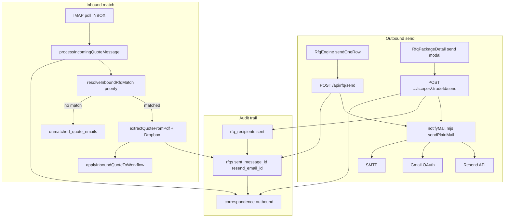

# Workflow 07 — RFQ Send / Quote Matching

**Status:** Mapped (2026-06-25) — documentation only; no product code changes  
**Gate:** W07 accepted (2026-06-25) — proceed W09 after W08 acceptance  
**Related:** [06_RFQ_PACKAGE_SCOPE_EXTRACTION.md](./06_RFQ_PACKAGE_SCOPE_EXTRACTION.md), [RFQ_TENDER_WORKFLOW_SOURCE_OF_TRUTH.md](../RFQ_TENDER_WORKFLOW_SOURCE_OF_TRUTH.md), [TENDER_EMAIL_TEST_PLAN.md](../TENDER_EMAIL_TEST_PLAN.md), [WORKFLOW_TEST_MATRIX.md](../WORKFLOW_TEST_MATRIX.md), [BUG_REGISTER.md](../BUG_REGISTER.md), [SAM_DECISION_LOG.md](../SAM_DECISION_LOG.md), [30_DAY_HARDENING_TRACKER.md](../30_DAY_HARDENING_TRACKER.md)

**Starts after:** W06 — `rfq_packages` + scopes exist (or engine sends created `rfqs` rows); real job address (P0-A3)  
**Hands off to:** W08 Quote Compare / Accept; W09 Win / Handoff

---

## Evidence standards (used in this document)

| Label | Meaning |
|-------|---------|
| **Verified from code** | Confirmed in repo file, route, table, or migration |
| **Verified from SOP/docs** | Stated in SOP or agent knowledge doc |
| **Verified from runtime** | Observed via local API without reading secrets |
| **Inferred from behaviour** | Logical conclusion from code paths |
| **Unconfirmed / needs testing** | Plausible but not proven by read-only audit |
| **Open decision for Sam** | Business rule — [SAM_DECISION_LOG.md](../SAM_DECISION_LOG.md) |

---

## 1. Business intent

W07 covers **outbound RFQ email dispatch** and **inbound quote detection**: staff send tender invitations to subcontractors, Hub logs every send, IMAP polls the shared inbox for replies, matches them to the correct RFQ/job, extracts quote amounts from PDFs or email text, and rolls status up to package tables.

Blue Leaf has **two live send paths** (not merged — SAM-W06-001):

| Path | UI | Send API | Typical use |
|------|-----|----------|-------------|
| **Flow A — RFQ Engine** | `/tender-manager/rfq-engine` | `POST /api/rfq/send` | Wizard dispatch after scope/trade selection; package snapshot after all sends |
| **Flow B — Package Detail** | `/tender-manager/rfq-packages/:id` | `POST .../scopes/:tradeId/send` | Additional recipients per trade on an existing package |

**Verified from SOP/docs:** [04-05_send_rfq.md](../../sops/04_rfq_engine/04-05_send_rfq.md) describes send steps; IMAP matching is operational knowledge, not fully SOP'd.

**Verified from agent knowledge:** Hub `correspondence` is the outbound/inbound audit trail during hardening; mailbox Sent is **not** guaranteed when Resend is active (SAM-W07-001).

---

## 2. Start trigger

| Trigger | Path | Evidence |
|---------|------|----------|
| Staff sends one RFQ row from Engine compose step | Flow A | **Verified from code:** `RfqEngine.jsx` `sendOneRow` → `persistRfqs` → `POST /api/rfq/send` |
| Staff sends batch / "Send all" from Engine | Flow A | Same per-row loop; `finalizeAllSentPackage` after all sent |
| Staff opens Package Detail send modal for a trade | Flow B | **Verified from code:** `RfqPackageDetail.jsx` → `POST .../scopes/:tradeId/send` |
| IMAP poll timer fires (default 15 min) | Inbound | **Verified from code:** `dev-api.mjs:2372` `IMAP_POLL_ENABLED` |
| Manual `POST /api/imap/quote-poll` | Inbound | **Verified from code:** dev-api route |
| Staff resolves unmatched quote in Quote Tracker | Manual match | **Verified from code:** `POST /api/unmatched-quotes/resolve` |
| Resend webhook delivery/open/bounce | Engagement only | **Verified from code:** `crmRoutes.mjs` `/api/webhooks/resend` → `rfqEngagement.mjs` |

**Precondition:** P0-A3 `assertJobReadyForRfqHandoff` on both send paths when `job_id` known.

---

## 3. End / handoff

| End state | Minimum for W08 | Evidence |
|-----------|-----------------|----------|
| Outbound logged | `correspondence` outbound row + `rfqs.status = sent` | Engine + package paths |
| Inbound matched | `rfqs.status = received`, `quoted_amount` optional, PDF in Dropbox | `processIncomingQuoteMessage` |
| Package rollup | `rfq_recipients` / `rfq_trade_scopes` / `rfq_packages` updated | `applyInboundQuoteToWorkflow` when `rfq_recipients.rfq_id` linked |
| Unmatched handled | Row in `unmatched_quote_emails` or manual resolve | Matcher returns null |
| Engagement tracked (Resend) | `rfqs.resend_email_id` + optional `rfq_events` | `captureResendId`, webhook |

**Hands off to W08:** Per-recipient `quote_amount`, comparison UI, accept/decline on Tender Detail or Package Detail.

**Partial end:** Quote on `rfqs` only (no package link) — Package Detail still shows pending (**W07-DRIFT-003**).

---

## 4. Main users

| User | Role | Evidence |
|------|------|----------|
| Admin / tender staff | Send RFQs, chase quotes, resolve unmatched | **Verified from code:** `/tender-manager/*` admin-gated |
| Subcontractors (external) | Reply with quote email/PDF | IMAP inbound |
| IMAP poller (system) | Background quote matcher | `pollImapForQuoteReplies` |
| Resend webhook (system) | Delivery/open/bounce events | `recordRfqEvent` — not quote matching |

---

## 5. Blue Leaf business workflow

1. Confirm W06 package/scopes ready (or Engine trades selected).
2. Compose RFQ email (subject pattern `RFQ - {address} - {trade}` helps fallback matching).
3. Send via Engine or Package Detail — Hub logs send in `correspondence`.
4. Subcontractor replies to `admin@blueleafbuilding.com.au` (Resend From) or configured mailbox.
5. IMAP poll ingests reply → auto-match or unmatched queue.
6. Staff review Quote Tracker **Unmatched** tab; manually assign if needed.
7. Verify quote amount and PDF on Package Detail / Tender Detail before W08 accept.

---

## 6. Hub workflow

### 6.1 — How are RFQs sent from RFQ Engine?

**Verified from code:** `RfqEngine.jsx`

1. **`persistRfqs([message])`** — client Supabase: upsert `jobs`, insert `rfqs` with `status: "queued"`.
2. **`POST /api/rfq/send`** — body `{ messages: [{ to, subject, body, html, jobId, rfqId, subcontractor_id, attachments? }] }`.
3. Server: `generateOutboundMessageId()` → `sendPlainMail({ headers: { "Message-ID": msgId } })`.
4. Server updates `rfqs`: `sent_message_id`, `status: sent`, `sent_at`; `captureResendId` if Resend; inserts `correspondence` (`logged_by: "rfq-send"`).
5. Client fallback: if `!serverLogged`, client inserts correspondence; optional Dropbox email copy via `/api/dropbox/save-rfq-email-copy`.
6. After all rows sent: **`finalizeAllSentPackage`** → `POST /api/rfq-packages` with recipients including `rfq_id` per row.

**Idempotency:** Server skips re-send when `(job_id, subcontractor_id)` already has `status: sent` unless `force: true` (`dev-api.mjs:2001–2016`).

### 6.2 — How are RFQs sent from Package Detail?

**Verified from code:** `rfqPackageRoutes.mjs:643–759`

1. `POST /api/rfq-packages/:packageId/scopes/:tradeId/send` with `{ recipients[], email_subject, email_body, due_date }`.
2. Per recipient: `sendPlainMail` with custom `Message-ID`.
3. Inserts **`rfq_recipients`** (always).
4. If **`subcontractor_id`** and `job_id`: inserts **`rfqs`** with `sent_message_id`, links `rfq_recipients.rfq_id`, `captureResendId`, inserts **`correspondence`** (`logged_by: "rfq-package-send"`).
5. Email-only recipients: **`rfq_recipients` only** — no `rfqs`, no correspondence (**W07-DRIFT-002**).
6. Updates `rfq_trade_scopes.status = sent` only when **all** recipients in batch succeed.

### 6.3 — Which transport is active: Resend, Gmail OAuth, or SMTP?

**Verified from code:** `notifyMail.mjs` — priority **Resend → Gmail OAuth → SMTP**; first configured wins; Resend failure falls through to Gmail then SMTP.

**Verified from runtime (2026-06-25, no secrets read):** `GET /api/integrations/status` → `mail.transport: "resend"`, `resend.configured: true`, `gmail.configured: true`, `smtp.configured: true`.

**Note:** `resendSendConfigured()` requires `RESEND_API_KEY` + `resendFromAddress()` (defaults to `admin@blueleafbuilding.com.au` when `RESEND_FROM` unset — `resendSend.mjs:26–34`).

### 6.4 — What appears in Hub correspondence?

| Direction | `logged_by` | When | Key fields |
|-----------|-------------|------|------------|
| Outbound | `rfq-send` | Engine `/api/rfq/send` | `job_id`, `rfq_id`, `message_id` (bare, no brackets) |
| Outbound | `rfq-package-send` | Package send (subcontractor_id path) | same |
| Inbound matched | `imap-bot` | IMAP auto-match | `attachments` jsonb if PDF uploaded to Dropbox |
| Inbound unmatched | `imap-unmatched` | No RFQ match | `job_id` null, `rfq_id` null |
| Inbound manual | `manual-match` | `POST /api/unmatched-quotes/resolve` | body from `body_preview` only |

**Verified from code:** Engine path always writes correspondence when `rfqId` present. Package path skips correspondence for email-only recipients.

### 6.5 — What appears, or does not appear, in mailbox Sent?

| Transport | Mailbox Sent folder | Evidence |
|-----------|---------------------|----------|
| **Resend** | **Does not appear** in Apple Mail / Gmail Sent of staff mailbox | HTTPS API send; no IMAP append (`resendSend.mjs`) — **W07-DRIFT-004** |
| **Gmail OAuth** | **Should appear** in connected Gmail account Sent | `gmailSend.mjs` `users.messages.send` |
| **SMTP** | **Should appear** in connected account Sent | `smtpSend.mjs` |

**Operational SoT during hardening:** Hub `correspondence` (+ `rfqs` row). SAM-W07-001 recommends **A — correspondence SoT**.

### 6.6 — Message-ID, sent_message_id, resend_email_id and provider IDs

| Field | Stored where | Purpose | Evidence |
|-------|--------------|---------|----------|
| Outbound Message-ID (intended) | `rfqs.sent_message_id` | IMAP thread match via In-Reply-To/References | `generateOutboundMessageId()` → `<uuid@blueleafbuilding.com.au>` |
| Correspondence copy | `correspondence.message_id` | Dedup inbound; audit | Brackets stripped on insert |
| Resend API id | `rfqs.resend_email_id` | Webhook engagement match — **not** mailbox Sent | `captureResendId` after send |
| Inbound Message-ID | `correspondence.message_id` | Idempotent skip if duplicate | `processIncomingQuoteMessage` |
| Resend webhook `source_event_id` | `rfq_events` | Delivery/open/bounce idempotency | `rfqEngagement.mjs` |

**Resend path nuance:** Hub stores **intended** Message-ID in `sent_message_id`; Resend assigns a **different** provider Message-ID on the wire (**W07-DRIFT-005**). `resend_email_id` is for engagement webhooks, not IMAP threading.

**Client/server nuance (Engine):** Server stores `sent_message_id` with angle brackets; client may re-update with stripped id (`RfqEngine.jsx:2176–2183`). Matcher normalizes both (`imapQuoteMatch.mjs:33–37`).

### 6.7 — How does IMAP match replies?

**Verified from code:** `imapQuoteMatch.mjs` + `processIncomingQuoteMessage` in `dev-api.mjs`

**Candidate pool:** `fetchOpenRfqCandidates` — `rfqs` where `status IN (sent, reminded, received, accepted)`, join `jobs(address)`, `subcontractors(email)`, limit 1200, order `created_at DESC`.

**Match priority (`resolveInboundRfqMatch`):**

1. **Thread** — `In-Reply-To` / `References` vs `rfqs.sent_message_id` (`matchBySentMessageId`)
2. **Subject + address** — `RFQ - {address} -` pattern + fuzzy token match on `jobs.address` + trade hint in subject/body (`matchBySubjectAddress`)
3. **Sender email** — from address equals `subcontractors.email` on an open RFQ (`matchBySenderSubcontractor`) — **first row wins** in candidate order (**W07-DRIFT-006**)

**Poll scope:** UID range `{lastUid + 1}:*`, max `IMAP_POLL_MAX_PER_RUN` (default 80).

**Trace:** `RFQ_MATCH_DEBUG=true` → `rfqMatchTrace.mjs` structured logs.

### 6.8 — What happens when Resend strips/overrides Message-ID?

**Verified from code:** `resendSend.mjs:49–57` explicitly **strips** `Message-ID` header before Resend API call; comment states matcher falls back to subject + sender.

**Impact:**
- Thread match (priority 1) **often fails** for Resend-sent RFQs.
- Fallback subject/address or sender match may still succeed.
- Valid quotes may land in **`unmatched_quote_emails`** if fallbacks fail.

**Required test:** W07-API-04 — reply matched when provider Message-ID ≠ stored `sent_message_id`.

### 6.9 — Inbound quote PDFs and amount extraction

**Verified from code:** `processIncomingQuoteMessage` (`dev-api.mjs:378–428`)

1. Collect PDF attachments (content-type pdf or `.pdf` filename).
2. If Dropbox configured + job address: upload to job QUOTES folder via `uploadImapReplyQuotePdfToSharedQuotes`.
3. **Claude extraction:** `extractQuoteFromPdf` on first PDF (max 100 pages, needs `ANTHROPIC_API_KEY`).
4. **Amount chain:** `total_ex_gst` → else `total_inc_gst / 1.1` → else `extractAmountFromEmailText` on plain body.
5. Updates `rfqs`: `quoted_amount`, `quote_extraction` jsonb, `quote_pdf_path`, `dropbox_pdf_url`, `status: received`.

**Manual resolve path does NOT re-run PDF extraction** (**W07-DRIFT-008**).

### 6.10 — Inbound propagation to rfqs, rfq_recipients, rfq_trade_scopes, rfq_packages

**Verified from code:** After `rfqs` update, `applyInboundQuoteToWorkflow(sb, rfqId, payload)` (`rfqQuotePropagation.mjs`)

1. Finds `rfq_recipients` where **`rfq_id = rfqId`**.
2. Updates recipients: `status: received`, `quote_received_at`, optional `quote_amount`, `quote_pdf_path`.
3. Sets linked `rfq_trade_scopes.status = received`.
4. Calls `reconcilePackageTradeCoverage` per affected package.

**Gaps:**
- No `rfq_recipients.rfq_id` link → propagation no-op (**W07-DRIFT-003**) — e.g. email-only sends, engine sends before package finalize, finalize failure (**W06-DRIFT-006**).
- Manual resolve: propagation runs but **no amount/PDF** passed (**W07-DRIFT-008**).

### 6.11 — Email-only recipients

**Verified from code:**
- Package send: `rfqs.subcontractor_id` NOT NULL constraint — email-only tracked in `rfq_recipients` only (`rfqPackageRoutes.mjs:696–700`).
- IMAP candidates from **`rfqs` only** — email-only never auto-matches (**W07-DRIFT-002**).
- Documented rule: reply → **unmatched queue** unless staff manually resolves to an existing `rfqs` row (W07-API-05).

### 6.12 — Ambiguous sender/address matches

**Verified from code:**
- **`matchBySenderSubcontractor`:** iterates `rfqRows` in query order (`created_at DESC`); **first email match wins** — no disambiguation when same sub has multiple open RFQs on different jobs (**W07-DRIFT-006**).
- **`matchBySubjectAddress`:** scores address+trade hints; picks highest score ≥ 4 — can still collide on similar addresses (**MATCH-09** gap in `test-imap-quote-match.mjs`).

**Mitigation today:** Staff manual resolve; unmatched queue.

### 6.13 — First IMAP poll / backlog behaviour

**Verified from code:** `pollImapForQuoteReplies` (`dev-api.mjs:2205–2209`)

When **`imap_last_uid` cursor is null** (first run):
1. Sets cursor to current mailbox `exists` count.
2. Returns `{ initialized: true, checked: 0 }`.
3. **Does not process any existing INBOX messages.**

**Impact:** Pre-existing inbox backlog before first deploy/poll is **skipped** (**W07-DRIFT-007**). Only messages arriving **after** initialization are polled.

Cursor stored via `loadImapLastUid` / `saveImapLastUid` (service Supabase settings or dedicated table — see dev-api helpers).

### 6.14 — Unmatched quote emails and manual resolve

**Auto unmatched:** `upsertUnmatchedQuoteEmail` when matcher returns null; dedupe by `external_id` (inbound Message-ID).

**Admin queue:** `GET /api/quote-tracker/unmatched` — **`requireAuth` + `requireRole("admin")`** (`dev-api.mjs:1895`).

**Manual resolve:** `POST /api/unmatched-quotes/resolve` (`jobsApiRoutes.mjs:235–295`)
- Body: `{ unmatchedId, rfqId }`.
- Inserts correspondence (`manual-match`), sets `rfqs.status = received`, calls `applyInboundQuoteToWorkflow`.
- Soft-resolves unmatched row (`resolved_at`, `matched_rfq_id`) — **does not delete** (DRIFT-009 pre-tracker claim updated).
- **Does not:** re-fetch IMAP source, parse PDF attachments, or extract `quoted_amount` from `body_preview` (**W07-DRIFT-008**).

**Existing tests:** `scripts/test-rfq-unmatched-resolve.mjs` (pass), `e2e/tests/smoke/api-rfq-unmatched.spec.js` (pass).

---

## 7. SOP interpretation

| SOP | W07 relevance | Evidence |
|-----|---------------|----------|
| [04-05_send_rfq.md](../../sops/04_rfq_engine/04-05_send_rfq.md) | Send from Package Detail; mentions correspondence | **Verified from SOP/docs** |
| [04-01_rfq_overview.md](../../sops/04_rfq_engine/04-01_rfq_overview.md) | Quote chase lifecycle | **Verified from SOP/docs** |
| IMAP / unmatched workflow | Operational — partial in TENDER_EMAIL_TEST_PLAN | **Verified from docs** |

**SOP gap:** Resend-first transport, mailbox Sent not showing RFQs, and Message-ID fallback matching are **not** documented for staff training.

---

## 8. Code interpretation

### 8.1 Mail transport stack

| File | Role |
|------|------|
| `notifyMail.mjs` | `mailTransportName()`, `sendPlainMail()` — Resend → Gmail → SMTP |
| `resendSend.mjs` | Resend API; strips Message-ID; returns Resend message id |
| `gmailSend.mjs` | Gmail OAuth raw message; preserves custom headers |
| `smtpSend.mjs` | Nodemailer fallback |

### 8.2 Outbound send handlers

| Route | File | Key behaviour |
|-------|------|---------------|
| `POST /api/rfq/send` | `dev-api.mjs:1917` | Engine bulk; idempotency; correspondence |
| `POST .../scopes/:tradeId/send` | `rfqPackageRoutes.mjs:643` | Package additional send |
| `POST /api/tender/outcome-mails` | `module4Routes.mjs:173` | Win/lose emails — W07 adjacent, sets `sent_message_id` when `rfq_id` provided |

### 8.3 Inbound pipeline

| Function | File | Role |
|----------|------|------|
| `pollImapForQuoteReplies` | `dev-api.mjs:2186` | Scheduled poll |
| `processIncomingQuoteMessage` | `dev-api.mjs:317` | Parse, match, extract, propagate |
| `resolveInboundRfqMatch` | `imapQuoteMatch.mjs:135` | Three-tier matcher |
| `resolveInboundRfqMatchWithTrace` | `rfqMatchTrace.mjs` | Debug trace wrapper |
| `applyInboundQuoteToWorkflow` | `rfqQuotePropagation.mjs:17` | Package table rollup |
| `extractQuoteFromPdf` | `dev-api.mjs:225` | Claude PDF amount extraction |

### 8.4 Engagement (not matching)

| Function | File | Role |
|----------|------|------|
| `captureResendId` | `rfqEngagement.mjs:30` | Persist `resend_email_id` post-send |
| `recordRfqEvent` | `rfqEngagement.mjs:48` | Webhook delivery/open/bounce → `rfq_events` |
| `POST /api/webhooks/resend` | `crmRoutes.mjs:1244` | Resend signed webhook |

### 8.5 Frontend send entry points

| Screen | Send mechanism |
|--------|----------------|
| `RfqEngine.jsx` | `authFetch("/api/rfq/send")` after `persistRfqs` |
| `RfqPackageDetail.jsx` | `apiPost(.../scopes/:tradeId/send)` |
| `RfqPackageList.jsx` | Unmatched tab → resolve only |
| `TenderDetail.jsx` | Reads `rfqs` + correspondence; PATCH accept — W08 |
| `QuoteTracker.jsx` | Redirect/alias to package list unmatched |

---

## 9. Entry points

| ID | Entry | Action |
|----|-------|--------|
| E1 | Engine — Send one / Send all | `POST /api/rfq/send` |
| E2 | Package Detail — Send modal | `POST .../scopes/:tradeId/send` |
| E3 | IMAP timer / manual poll | `pollImapForQuoteReplies` |
| E4 | Quote Tracker — Unmatched tab | List + resolve |
| E5 | Resend webhook | Engagement timestamps on `rfqs` |

---

## 10. Exit points

| Exit | Condition | Next |
|------|-----------|------|
| Quote received on `rfqs` | IMAP match or manual resolve | W08 compare |
| Package recipients updated | `rfq_id` link exists | Package Detail shows received |
| Unmatched queued | No confident match | Staff manual resolve |
| Send failed mid-batch | Partial engine send | Staff fix + retry; idempotency may skip duplicates |
| Poll initialized, backlog skipped | First IMAP run | Historical quotes stay unmatched unless manual |

---

## 11. Screens

| Screen | Route | W07 role |
|--------|-------|----------|
| **RfqEngine** | `/tender-manager/rfq-engine` | Initial outbound send (Flow A) |
| **RfqPackageDetail** | `/tender-manager/rfq-packages/:id` | Additional outbound (Flow B) |
| **RfqPackageList** | `/tender-manager/rfq-packages` | Direct RFQs tab; **Unmatched** tab + resolve |
| **TenderDetail** | `/tender-manager/board/:jobId` | Quote status read; accept — W08 |
| **TenderBoard** | `/tender-manager/board` | Aggregate from `rfqs` only (W05-DRIFT-003) — **not redesigned in W07** |

---

## 12. Routes

### Outbound

| Method | Route | Auth | Owner |
|--------|-------|------|-------|
| POST | `/api/rfq/send` | `requireAuth` | dev-api.mjs |
| POST | `/api/rfq-packages/:packageId/scopes/:tradeId/send` | `requireAuth` | rfqPackageRoutes.mjs |
| POST | `/api/tender/outcome-mails` | `requireAuth` | module4Routes.mjs |

### Inbound / unmatched

| Method | Route | Auth | Owner |
|--------|-------|------|-------|
| POST | `/api/imap/quote-poll` | varies | dev-api.mjs |
| GET | `/api/quote-tracker/unmatched` | `requireAuth` + admin | dev-api.mjs |
| POST | `/api/unmatched-quotes/resolve` | `requireAuth` | jobsApiRoutes.mjs |
| GET | `/api/mail/inbox` | unauthenticated today | dev-api.mjs — **SEC gap** |

### Status / webhooks

| Method | Route | Owner |
|--------|-------|-------|
| GET | `/api/integrations/status` | dev-api.mjs — exposes `mail.transport` |
| POST | `/api/webhooks/resend` | crmRoutes.mjs |

---

## 13. Database ownership

### Source-of-truth model (verified)

| Artifact | Role |
|----------|------|
| **`correspondence`** | App outbound/inbound communication audit trail (SoT during hardening) |
| **`rfqs`** | Canonical email transaction row for known subcontractor sends |
| **`rfqs.sent_message_id`** | Intended thread match key (Gmail/SMTP reliable; Resend weakened) |
| **`rfqs.resend_email_id`** | Resend API/event ID — engagement webhooks, **not** mailbox Sent |
| **`rfq_recipients`** | Package recipient/invitation + quote state |
| **`rfq_trade_scopes`** | Trade-level quote status rollup |
| **`rfq_packages`** | Package-level quote/status/coverage rollup |
| **`unmatched_quote_emails`** | Safety queue when no confident match |
| **Mailbox Sent** | **Not guaranteed** when Resend is active |

### `rfqs` (W07 writes)

**Outbound:** `sent_message_id`, `status`, `sent_at`, `resend_email_id`, `email_body`  
**Inbound:** `status: received`, `received_at`, `quoted_amount`, `quote_extraction`, `quote_pdf_path`, `dropbox_pdf_url`

### `unmatched_quote_emails`

**Owns:** `source`, `external_id`, `from_email`, `subject`, `body_preview`, `matched_job_id`, `matched_rfq_id`, `resolved_at`  
**Does not own:** Full MIME/PDF — only preview text at insert time

---

## 14. External integrations

| Service | Env / config | W07 role | Status |
|---------|--------------|----------|--------|
| **Resend** | `RESEND_API_KEY`, optional `RESEND_FROM` | Primary outbound transport | **Active in runtime** |
| **Gmail OAuth** | `GMAIL_*` | Fallback outbound; Sent folder when used | Configured |
| **SMTP** | `SMTP_*` | Last-resort outbound | Configured |
| **IMAP** | `IMAP_*`, `IMAP_POLL_ENABLED` | Inbound quote poll | **Verified from code** — required for auto-match |
| **Anthropic** | `ANTHROPIC_API_KEY` | PDF quote extraction | Optional — amount fallback to regex |
| **Dropbox** | `DROPBOX_*` | Store inbound quote PDFs | Optional |
| **Resend webhooks** | Signing secret in crmRoutes | Engagement only | Separate from IMAP match |

---

## 15. Existing tests

| Test | File | Status | W07 coverage |
|------|------|--------|--------------|
| Matcher unit (16 pass, 2 gaps) | `scripts/test-imap-quote-match.mjs` | pass | MATCH-01–12; gaps MATCH-09 multi-RFQ |
| Manual resolve + propagation | `scripts/test-rfq-unmatched-resolve.mjs` | pass | U1–U8; no amount/PDF assert |
| E2E unmatched auth + resolve | `e2e/tests/smoke/api-rfq-unmatched.spec.js` | pass | W07-SEC-01 partial |
| Package send threading | RFQ-05 / W06-API-06 | pass | `sent_message_id` on package path |
| W06 shape (not W07) | `scripts/batch-a/w06-package-shape.mjs` | pass | — |

**Gaps (W07-DRIFT-009):** MATCH-14 duplicate message_id, MATCH-15 poll idempotency, W07-API-04 Resend thread gap — **planned, not implemented**.

---

## 16. Drift risks

| ID | Severity | Summary | Status |
|----|----------|---------|--------|
| **W07-DRIFT-001** | High | Package `sent_message_id` stored when `subcontractor_id`; Resend + email-only gaps remain | **partially fixed** |
| **W07-DRIFT-002** | High | Email-only recipients not in IMAP candidate pool | **confirmed** |
| **W07-DRIFT-003** | High | Propagation only when `rfq_recipients.rfq_id` linked | **partially fixed** |
| **W07-DRIFT-004** | Medium | Resend sends do not appear in mailbox Sent | **confirmed** |
| **W07-DRIFT-005** | High | Resend strips custom Message-ID; thread match weakened | **confirmed** |
| **W07-DRIFT-006** | High | Ambiguous sender — first open RFQ wins | **confirmed** |
| **W07-DRIFT-007** | Medium | First IMAP poll initializes cursor; skips backlog | **confirmed** |
| **W07-DRIFT-008** | Medium | Manual resolve: no PDF re-parse / amount extraction | **confirmed** |
| **W07-DRIFT-009** | Medium | Matcher idempotency baseline tests incomplete | **confirmed** |

**Cross-ref pre-tracker:** DRIFT-001 (package send) → superseded by W07-DRIFT-001; DRIFT-002 (propagation) → W07-DRIFT-003; DRIFT-008 (camelCase UI) → fixed via W06-DRIFT-008.

---

## 17. Security / role risks

**Verified from code:**
- `POST /api/rfq/send`, package send, unmatched resolve: **`requireAuth`**
- `GET /api/quote-tracker/unmatched`: **`requireAuth` + `requireRole("admin")`** (DRIFT-012 fixed)
- `GET /api/mail/inbox`: **no auth** — PII exposure risk (adversarial audit C6)
- IMAP poll: server-internal; no public trigger without cron secret on some deployments

**W07-SEC-01:** Quote matching/unmatched endpoints require auth/admin — **partial pass** (unmatched list yes; mail/inbox no).

---

## 18. Required handoff data

### Before W07 send

| Field | Required? |
|-------|-----------|
| `jobs.address` (real) | **Yes** — P0-A3 |
| Recipient email | **Yes** |
| `subcontractor_id` | **Recommended** for auto-match + `rfqs` row |
| Package + `rfq_recipients` | **Recommended** for propagation |

### Before W07 inbound match

| Field | Required? |
|-------|-----------|
| `rfqs.sent_message_id` or distinctive subject | **Recommended** |
| `rfqs.status` in open set | **Yes** for candidate pool |
| IMAP cursor initialized | **Yes** — first run skips backlog |

### Before W08 accept

| Field | Required? |
|-------|-----------|
| `quoted_amount` on `rfqs` or recipient | **Yes** for comparison |
| Linked `rfq_id` on recipient | **Recommended** for package UI |

---

## 19. Handoff failure risks

| If missing / wrong | What breaks |
|--------------------|-------------|
| Resend active + staff checks Apple Mail Sent | Thinks RFQ never sent (**W07-DRIFT-004**) |
| Resend strips Message-ID | Thread match fails; unmatched or wrong fallback (**W07-DRIFT-005**) |
| Email-only recipient | No auto-match ever (**W07-DRIFT-002**) |
| Engine finalize fails | `rfqs` exist, no `rfq_recipients.rfq_id` → no propagation (**W06-DRIFT-006** + **W07-DRIFT-003**) |
| Same sub, multiple open RFQs | Wrong job match (**W07-DRIFT-006**) |
| First poll after deploy | Inbox backlog ignored (**W07-DRIFT-007**) |
| Manual resolve only | Package shows received but no amount (**W07-DRIFT-008**) |
| IMAP not configured | No auto-match; all replies manual |

---

## 20. Workflow acceptance criteria

W07 mapping complete when:

1. Both send paths documented with transport order ✓
2. Correspondence vs mailbox Sent clarified ✓
3. Message-ID / Resend / `resend_email_id` model documented ✓
4. IMAP match priority + candidate pool documented ✓
5. Propagation path + gaps documented ✓
6. W07-DRIFT-001–009 registered ✓
7. W07-API-01–08 + W07-SEC-01 test plan added ✓
8. SAM-W07-001 recorded ✓

**Stable enough for fixes (post-review):** Matcher unit tests pass; manual resolve propagation pass; package send sets `sent_message_id`; Resend runtime confirmed.

---

## 21. Required tests

See [WORKFLOW_TEST_MATRIX.md](../WORKFLOW_TEST_MATRIX.md) — **planned only** unless noted.

| ID | Scenario | Drift / notes |
|----|----------|---------------|
| **W07-API-01** | Legacy RFQ Engine send stores `sent_message_id` + correspondence | Engine path |
| **W07-API-02** | Package send with known subcontractor stores `sent_message_id`, `rfq_id` link + correspondence | W07-DRIFT-001 |
| **W07-API-03** | Matched inbound quote updates `rfqs` + linked package recipient/scope/package | W07-DRIFT-003 |
| **W07-API-04** | Resend-sent RFQ reply matches when provider Message-ID ≠ stored `sent_message_id` | W07-DRIFT-005 |
| **W07-API-05** | Email-only recipient reply → unmatched or documented recipient rule | W07-DRIFT-002 |
| **W07-API-06** | Ambiguous sender across multiple open RFQs does not auto-match wrong job | W07-DRIFT-006 |
| **W07-API-07** | First IMAP poll/backlog behaviour documented + assert cursor init | W07-DRIFT-007 |
| **W07-API-08** | Manual unmatched resolve preserves audit + updates package when linked | W07-DRIFT-008 |
| **W07-SEC-01** | Quote matching/unmatched endpoints require auth/admin | extends SEC-02 |

**Existing overlap:** RFQ-04–13, MATCH-01–13, `test-rfq-unmatched-resolve.mjs`, `test-imap-quote-match.mjs`.

---

## 22. Open decisions for Sam

| ID | Topic | Options | Recommendation |
|----|-------|---------|----------------|
| **SAM-W07-001** | Outbound audit SoT | A) Hub correspondence only · B) Force Gmail/SMTP for Sent visibility · C) Resend + BCC/archive | **A during hardening** — documented in W07 map |
| **SAM-W06-001** | Canonical RFQ path (Engine vs Package) | A/B/C | Open — affects when `rfq_id` links exist |
| **SAM-W07-002** | Email-only recipients | A) Extend matcher to `rfq_recipients.email` · B) Require stub subcontractor · C) Manual only | **Needs decision** before W07-DRIFT-002 fix |
| **SAM-W07-003** | First IMAP poll backlog | A) Accept skip · B) One-time backlog import script · C) Cursor starts at 0 | **Needs decision** before W07-DRIFT-007 fix |
| **SAM-W07-004** | Resend Message-ID strategy | A) Document fallbacks only · B) Custom `X-BlueLeaf-RFQ-ID` header · C) Gmail for RFQs only | **A for mapping**; B/C are fix options |

---

## 23. Smallest safe fix plan

**No implementation until Batch B review.** **Do not change mail transport or matcher logic without explicit approval.**

### P1 (post-review)

| Fix | Drift | Tests |
|-----|-------|-------|
| Document Resend/Sent folder for staff (SOP 04-05 addendum) | W07-DRIFT-004 | — |
| W07-API-04 prove fallback match under Resend | W07-DRIFT-005 | W07-API-04 |
| Manual resolve: parse amount from `body_preview` regex | W07-DRIFT-008 | W07-API-08 |
| Matcher baseline: duplicate + poll idempotency | W07-DRIFT-009 | MATCH-14/15 |

### P2

| Fix | Drift | Notes |
|-----|-------|-------|
| Extend candidates to `rfq_recipients` email-only | W07-DRIFT-002 | SAM-W07-002 |
| Disambiguate multi-RFQ same sender (job+trade score) | W07-DRIFT-006 | Do not auto-match on sender alone |
| Backlog import or cursor policy | W07-DRIFT-007 | SAM-W07-003 |
| Store Resend provider Message-ID if API returns it | W07-DRIFT-005 | SAM-W07-004 |
| Engine finalize: always link `rfq_id` on recipients | W07-DRIFT-003 | W06-DRIFT-006 |

### Deferred (explicitly out of scope for W07 map)

- Merge RFQ Engine and Package Detail send paths (SAM-W06-001)
- Tender Board redesign / package progress on board (W05-DRIFT-003)
- Switch transport to Gmail for mailbox Sent (SAM-W07-001 option B)
- W08 accept flows / W09 win handoff

---

## Source-of-truth check

**Expected:** `correspondence` = audit trail; `rfqs` = email transaction; package tables updated via `rfq_recipients.rfq_id`; Resend = no mailbox Sent; IMAP match from `rfqs` candidates.

**Confirmed:** Transport order Resend-first; runtime `transport: resend`; both send paths set `sent_message_id` for subcontractor sends; propagation helper exists; unmatched + manual resolve paths tested.

**Mismatch:**
- Resend strips Message-ID (**W07-DRIFT-005**)
- Email-only not matchable (**W07-DRIFT-002**)
- Propagation requires link (**W07-DRIFT-003**)
- First poll skips backlog (**W07-DRIFT-007**)
- Manual resolve no PDF/amount (**W07-DRIFT-008**)
- Ambiguous sender first-wins (**W07-DRIFT-006**)

---

## Document history

| Date | Change |
|------|--------|
| 2026-06-25 | W07 mapped — `/harden map W07`; runtime transport verified Resend active |
| 2026-06-25 | W07-DRIFT-001–009 reconciled; W07-API-01–08 + W07-SEC-01 planned |
