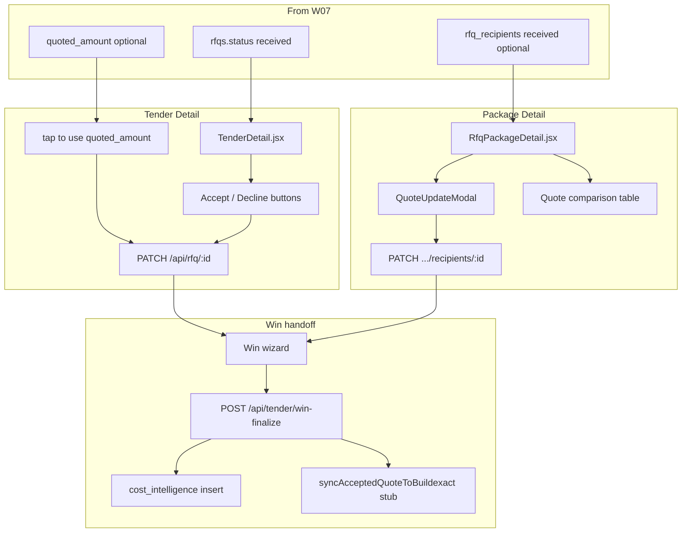

# Workflow 08 — Quote Comparison / Accept Quote

**Status:** Mapped (2026-06-25) — **accepted** 2026-06-25 (SAM-W08-001–003 decided); documentation only; no product code changes  
**Related:** [07_RFQ_SEND_QUOTE_MATCHING.md](./07_RFQ_SEND_QUOTE_MATCHING.md), [05_TENDER_BOARD_LIFECYCLE.md](./05_TENDER_BOARD_LIFECYCLE.md), [06_RFQ_PACKAGE_SCOPE_EXTRACTION.md](./06_RFQ_PACKAGE_SCOPE_EXTRACTION.md), [RFQ_TENDER_WORKFLOW_SOURCE_OF_TRUTH.md](../RFQ_TENDER_WORKFLOW_SOURCE_OF_TRUTH.md), [WORKFLOW_TEST_MATRIX.md](../WORKFLOW_TEST_MATRIX.md), [BUG_REGISTER.md](../BUG_REGISTER.md), [SAM_DECISION_LOG.md](../SAM_DECISION_LOG.md)

**Starts after:** W07 — inbound quote matched or manually resolved; `rfqs.status = received` (or package recipient `received`) with optional amounts/PDFs  
**Hands off to:** W09 Tender Win / Project Handoff (`POST /api/tender/win-finalize`)

---

## Evidence standards (used in this document)

| Label | Meaning |
|-------|---------|
| **Verified from code** | Confirmed in repo file, route, table, or migration |
| **Verified from SOP/docs** | Stated in SOP or agent knowledge doc |
| **Inferred from behaviour** | Logical conclusion from code paths |
| **Unconfirmed / needs testing** | Plausible but not proven by read-only audit |
| **Open decision for Sam** | Business rule — [SAM_DECISION_LOG.md](../SAM_DECISION_LOG.md) |

---

## 1. Business intent

W08 is where staff **review received subcontractor quotes**, compare amounts across recipients/trades, and **accept or decline** quotes before marking the tender won.

Blue Leaf has **three UI surfaces** for quote review — they do not share identical rules:

| Surface | Route | Primary table | Accept UX |
|---------|-------|---------------|-----------|
| **Tender Detail** | `/tender-manager/board/:jobId` | `rfqs` | Accept / Decline buttons + win wizard |
| **Package Detail** | `/tender-manager/rfq-packages/:id` | `rfq_recipients` (+ linked `rfqs`) | Quote Update modal (status dropdown) + comparison table |
| **Quote Tracker — Direct RFQs** | `/tender-manager/rfq-packages` (Direct tab) | `rfqs` via Supabase | Manual amount edit only — **no Accept button** |

**Verified from agent knowledge:** Accept on Tender Detail is the canonical path into **win-finalize** and **cost_intelligence**. Package Detail accept updates package recipient state and mirrors to linked `rfqs` when `rfq_id` present.

**Not in W08 scope:** Tender Board redesign (SAM-W05-006), RFQ Engine/Package merge (SAM-W06-001), mail/matcher changes.

---

## 2. Start trigger

| Trigger | Surface | Evidence |
|---------|---------|----------|
| IMAP auto-match sets `rfqs.status = received` + `quoted_amount` | Tender Detail | **Verified from code:** `dev-api.mjs` `processIncomingQuoteMessage` |
| Manual unmatched resolve sets `received` | Tender Detail / Package (if linked) | **Verified from code:** `jobsApiRoutes.mjs` resolve + `applyInboundQuoteToWorkflow` |
| Staff opens Package Detail after inbound propagation | Package Detail | **Verified from code:** recipient `status = received` |
| Staff edits quote in Quote Update modal | Package Detail | **Verified from code:** `QuoteUpdateModal` |
| Staff taps "Extracted: $X — tap to use" | Tender Detail | **Verified from code:** `TenderDetail.jsx:1299–1314` |
| Staff opens Mark Won wizard | Tender Detail | **Verified from code:** `openWin()` → `executeWin()` |

---

## 3. End / handoff

| End state | Minimum for W09 | Evidence |
|-----------|-----------------|----------|
| Per-trade accept/decline decided | `rfqs.status` in `accepted` / `declined` / `not_required` (win wizard) | Win step 1 |
| Staff-confirmed amount on accepted rows | `rfqs.quote_amount > 0` for win `cost_intelligence` insert | `module4Routes.mjs:467–478` |
| Package recipients aligned (where linked) | `rfq_recipients.status = accepted` + `quote_amount` | Package PATCH mirror |
| Job still `tendering` until win | `jobs.status` unchanged by accept alone | Accept ≠ win |

**Hands off to W09:** `POST /api/tender/win-finalize` with `rfqUpdates`, `acceptedTrades`, `quoteCopies`, `costIntel`.

**Partial end:** Quote accepted on `rfqs` only — Package Detail may still show `received` if Tender path used and no `rfq_recipients.rfq_id` link (**W08-DRIFT-004**).

---

## 4. Main users

| User | Role | Evidence |
|------|------|----------|
| Sam / Josh | Accept quotes, run win wizard | **Verified from code:** TenderDetail admin-gated |
| Tender staff | Compare package quotes, update recipient status | **Verified from code:** RfqPackageDetail |
| Buildxact (external) | Intended accept sync target | **Stub only** — see W08-DRIFT-007 |

---

## 5. Blue Leaf business workflow

1. Subcontractor quote arrives (W07) — RFQ row shows **received** with optional extracted amount/PDF.
2. Staff reviews quote on **Tender Detail** and/or **Package Detail**.
3. If only `quoted_amount` (auto-extracted): staff must **confirm amount** (`quote_amount`) before Accept enables on Tender Detail.
4. Staff **Accept** or **Decline** per trade/subcontractor.
5. On Package Detail: use **Update** modal to set status `accepted` / `declined` and enter amount.
6. Compare multiple quotes per trade on Package Detail comparison table (lowest highlight).
7. When all trades decided: **Mark Won** wizard → win-finalize → W09 handoff.

---

## 6. Hub workflow



### 6.1 — Where are received quotes displayed?

| Location | What staff sees | Data source |
|----------|-----------------|-------------|
| **Tender Detail** — RFQ cards | Trade, sub, status badge, `quote_amount` input, extracted amount chip, PDF link, Accept/Decline | Supabase `rfqs` + nested `subcontractors` |
| **Package Detail** — Trade card recipients | Recipient name, status badge, `quote_amount` if set | `GET /api/rfq-packages/:id` → `rfq_recipients` |
| **Package Detail** — Quote comparison | Sortable table when 2+ received/accepted on a trade | Same — `quote_amount` only |
| **Quote Tracker — Direct tab** | Per-RFQ row: status, manual quote input, PDF link | Supabase `jobs` + nested `rfqs` — **no accept UI** |
| **Tender Board** | Aggregate quote % from `rfqs` only | W05-DRIFT-003 — not package recipients |

### 6.2 — `quoted_amount` vs `quote_amount`

| Field | Table | Writer | Meaning |
|-------|-------|--------|---------|
| **`quoted_amount`** | `rfqs` | IMAP inbound (`processIncomingQuoteMessage`), `POST /api/rfq/:id/reextract-amount` | **Auto-extracted** ex-GST total from PDF/email — machine suggestion |
| **`quote_amount`** | `rfqs` | Staff blur/edit on Tender Detail, win wizard, Direct tab; PATCH `/api/rfq/:id` | **Staff-confirmed** ex-GST amount used for accept + cost intel |
| **`quote_amount`** | `rfq_recipients` | Inbound propagation (`applyInboundQuoteToWorkflow`), Package PATCH | Per-recipient confirmed amount on package path |
| **`quoted_amount`** | `rfq_recipients` | **Not written** by inbound propagation today | Package UI does **not** surface linked `rfqs.quoted_amount` on recipients |

**Verified from code:** IMAP writes `rfqs.quoted_amount` only (`dev-api.mjs:454–457`). Re-extract updates `quoted_amount` only (`dev-api.mjs:2327–2331`). Propagation passes `quotedAmount` → `rfq_recipients.quote_amount` when inbound match succeeds (`rfqQuotePropagation.mjs:41`).

**Cross-ref:** Pre-tracker **DRIFT-014** = **W08-DRIFT-001**.

### 6.3 — Which amount controls the Accept button?

**Tender Detail — Verified from code:** `TenderDetail.jsx:1265`

```js
const canToggle = !readOnly && r.quote_amount != null && Number(r.quote_amount) > 0;
```

Accept and Decline buttons are **`disabled` unless `quote_amount > 0`**. `quoted_amount` alone does **not** enable Accept.

**Mitigation in UI:** "Extracted: $X — tap to use" copies `quoted_amount` → `quote_amount` via PATCH (`1304`).

**Package Detail:** No dedicated Accept button. Staff sets status to `accepted` in Quote Update modal — **no guard** requiring `quote_amount > 0` before save (**W08-DRIFT-003**).

### 6.4 — Received vs accepted

| Status | Meaning | Typical writer |
|--------|---------|----------------|
| **`received`** | Quote inbound detected; amount may be extracted but not staff-confirmed for accept | IMAP, manual resolve, Package PATCH |
| **`accepted`** | Staff chose this quote for the trade | Tender Detail Accept, Package modal, win-finalize bulk update |
| **`declined`** | Staff rejected quote | Tender Detail Decline, Package modal, win wizard |
| **`not_required`** | Win wizard only — trade not needed for this tender | Win step 1 |

**Verified from code:** Accept toggles `received` ↔ `accepted` on Tender Detail (`1350`). Package PATCH mirrors `accepted` to linked `rfqs` (`rfqPackageRoutes.mjs:793`).

### 6.5 — TenderDetail accept/decline flow

**Verified from code:** `TenderDetail.jsx`

1. Load job + `rfqs` from Supabase.
2. Staff edits `quote_amount` on blur → `PATCH /api/rfq/:rfqId` (`updateRfq`).
3. Optional: tap extracted chip → sets `quote_amount` from `quoted_amount`.
4. Optional: `POST /api/rfq/:id/reextract-amount` → updates `quoted_amount` only.
5. **Accept:** `updateRfq(id, { status: "accepted" })` when `canToggle`.
6. **Decline:** `updateRfq(id, { status: "declined" })` when `canToggle`.
7. **Un-accept:** toggles back to `received`.

**API:** `PATCH /api/rfq/:rfqId` (`buildexactIntegrationRoutes.mjs:108–138`) — fields: `status`, `quote_amount`, `manually_entered`. On `status === "accepted"`, fires `syncAcceptedQuoteToBuildexact` (stub).

**Does not:** Update `rfq_recipients`, `rfq_trade_scopes`, or `rfq_packages` (**W08-DRIFT-004** one direction).

### 6.6 — PackageDetail accept/decline flow

**Verified from code:** `RfqPackageDetail.jsx`

1. Trade card shows recipients with status + `quote_amount`.
2. **Update** opens `QuoteUpdateModal` — dropdown: `sent`, `followed_up`, `received`, `accepted`, `declined`, `no_quote`.
3. Save → `PATCH /api/rfq-packages/:packageId/recipients/:recipientId`.

**Server mirror** (`rfqPackageRoutes.mjs:788–799`): when `rec.rfq_id` linked, copies `status` + `quote_amount` to `rfqs`.

**Scope rollup on accept:** **No** — only `received` propagates to `rfq_trade_scopes.status` (`802–814`). Accepted does not change scope/package rollup (**W08-DRIFT-005**).

**Comparison UI:** When 2+ recipients in `received`/`accepted`, shows sorted comparison by `quote_amount` (`716–733`). Does not read `rfqs.quoted_amount` for unlinked extraction gap.

### 6.7 — Accepted state sync between `rfqs` and `rfq_recipients`

| Direction | Sync? | Evidence |
|-----------|-------|----------|
| Package PATCH → `rfqs` | **Yes** (when `rfq_id` linked) | `rfqPackageRoutes.mjs:788–799` — includes `accepted` (CRIT-002 fix) |
| Tender PATCH → `rfq_recipients` | **No** | `buildexactIntegrationRoutes.mjs` updates `rfqs` only |
| Inbound propagation → both | **Partial** | Sets `received` on both when linked; not accept |
| Win-finalize → `rfqs` only | **Yes** | Bulk `rfqUpdates`; no package table writes |

**W08-DRIFT-004 confirmed** — bidirectional gap when staff accept on Tender Detail but package exists.

### 6.8 — Roll up to `rfq_trade_scopes` / `rfq_packages`

| Event | `rfq_trade_scopes` | `rfq_packages` |
|-------|-------------------|----------------|
| Inbound `received` (IMAP) | `status = received` | `reconcilePackageTradeCoverage` |
| Package recipient PATCH `received` | `status = received` | — |
| Package recipient PATCH `accepted` | **No change** | **No change** |
| Tender Detail Accept | **No change** | **No change** |
| Win-finalize | **No change** | **No change** |

**Verified from code:** `reconcilePackageTradeCoverage` tracks scope **sent** coverage vs estimate baseline — not accept state (`rfqTradeIntelligence.mjs:310–314`).

**W08-DRIFT-005 confirmed.**

### 6.9 — Accepted quote → win-finalize

**Verified from code:** `TenderDetail.jsx` `executeWin()` → `POST /api/tender/win-finalize`

Payload includes:
- `rfqUpdates[]` — `{ id, status, quote_amount }` per win row
- `acceptedTrades[]` — accepted rows with trade, sub, `quote_amount`, `rfq_id`
- `quoteCopies[]` — Dropbox PDF copy to ACCEPTED/DECLINED folders
- `costIntel` — building facts for `cost_intelligence` row template

**Win row builder** (`buildWinRowsFromRfqs`): pre-checks received/accepted as `received: true`; defaults non-received rows to `declined` in wizard step 1.

**Requires:** `quote_amount` on accepted trades for `cost_intelligence` insert (`module4Routes.mjs:467–468` skips null/zero).

**Does not require:** Prior Tender Detail Accept click — win-finalize can set `status: accepted` directly via `rfqUpdates`.

### 6.10 — Buildxact / PO / cost intelligence handoff

| Target | On accept (PATCH rfq) | On win-finalize | Status |
|--------|----------------------|-----------------|--------|
| **`cost_intelligence`** | No | **Yes** — insert per accepted trade with `quote_amount` | **Verified from code** |
| **`projects.accepted_trades`** | No | **Yes** — jsonb from `acceptedTrades` | **Verified from code** |
| **Buildxact accept sync** | Called | Called | **Stub — always skipped** |
| **Purchase orders** | No | No — separate batch PO flow post-win | **Verified from code:** `operationsRoutes.mjs` |

**Buildxact stub — Verified from code:** `buildexactDeepIntegration.mjs:81–84`

```js
return { skipped: true, reason: "unsupported_by_api: estimate items are read-only in Buildxact v3" };
```

Both `PATCH /api/rfq/:id` accept and win-finalize call this **fire-and-forget** — no user-visible error (**W08-DRIFT-007**).

### 6.11 — Quote amount extraction failed

| Scenario | `rfqs` state | Accept path |
|----------|--------------|-------------|
| No PDF / no Anthropic key | `received`, no amounts | Staff must type `quote_amount` manually |
| PDF too large (>100 pages) | `received`, PDF maybe stored, no extraction | Manual entry or reextract fails |
| Claude returns no JSON | `received`, no `quoted_amount` | Manual entry; "Extract amount" button if PDF URL exists |
| Email text regex only | `quoted_amount` from body patterns | Tap-to-use or manual confirm |

**Verified from code:** `extractQuoteFromPdf` failures are non-fatal in IMAP path; Accept remains disabled until staff sets `quote_amount`.

### 6.12 — Manual unmatched resolve without amount/PDF

**Verified from code:** `jobsApiRoutes.mjs` resolve sets `rfqs.status = received`, propagates to package tables **without** `quotedAmount` or PDF (**W07-DRIFT-008**).

**W08 impact:**
- Tender Detail: Accept disabled (`quote_amount` null).
- Package Detail: Recipient shows `received` with empty amount — staff must Update modal.
- Win wizard: Row may show `received: true` but empty `quote_amount` — **cost_intelligence skip** for that trade.

**W08-DRIFT-008 confirmed** — weak accept path unless staff enters amount.

### 6.13 — Minimum safe acceptance rule before W09 tender win

**Decided rule (SAM-W08-001 — decided 2026-06-25):**

Before running win-finalize for a trade:

1. **`rfqs.quote_amount > 0`** (ex-GST, staff-confirmed) on every **accepted** row in win wizard.
2. **PDF present** when amount was auto-extracted — **recommended**, not enforced in code.
3. **Cross-screen check:** If package exists, confirm linked `rfq_recipients.quote_amount` and `status` match intent — **manual cross-check during hardening** (SAM-W08-003).
4. **Do not** rely on `quoted_amount` alone for win — win-finalize uses `quote_amount` for cost intel.
5. **Buildxact sync** — treat as **non-operational** until API supports it.

**Canonical surfaces (SAM-W08-002 — decided):** Tender Detail = win acceptance path; Package Detail = comparison/workbench only. Do not merge during hardening.

---

## 7. SOP interpretation

| SOP | W08 relevance | Gap |
|-----|---------------|-----|
| [04-05_send_rfq.md](../../sops/04_rfq_engine/04-05_send_rfq.md) | Chase quotes | No accept/compare SOP |
| Tender win SOP | Win wizard | Partially in W05 map |

**SOP gap:** No staff doc explaining `quoted_amount` vs `quote_amount` or two accept surfaces.

---

## 8. Code interpretation

### 8.1 Amount fields summary

| Field | Where | Accept gate |
|-------|-------|-------------|
| `rfqs.quoted_amount` | Auto extraction | Tender: display only until copied |
| `rfqs.quote_amount` | Staff confirmed | **Tender Accept gate**; win-finalize cost intel |
| `rfq_recipients.quote_amount` | Package path | Comparison table; optional on accept |

### 8.2 TenderDetail key functions

| Function | Role |
|----------|------|
| `updateRfq` | PATCH `/api/rfq/:id` |
| `reextractAmount` | POST reextract → `quoted_amount` |
| `buildWinRowsFromRfqs` | Win wizard seed |
| `executeWin` | win-finalize + optional outcome-mails |

### 8.3 PackageDetail key functions

| Function | Role |
|----------|------|
| `handleUpdateRecipient` | PATCH recipient |
| `QuoteUpdateModal` | Status + amount + exclusions |
| Trade card comparison | Sort by `quote_amount` |

### 8.4 Server routes

| Route | Owner | W08 role |
|-------|-------|----------|
| `PATCH /api/rfq/:rfqId` | buildexactIntegrationRoutes.mjs | Tender accept/decline/amount |
| `POST /api/rfq/:rfqId/reextract-amount` | dev-api.mjs | Re-run extraction → `quoted_amount` |
| `PATCH .../recipients/:recipientId` | rfqPackageRoutes.mjs | Package accept/decline |
| `POST /api/tender/win-finalize` | module4Routes.mjs | Bulk accept + cost intel + project |

---

## 9. Entry points

| ID | Entry | Surface |
|----|-------|---------|
| E1 | Open Tender Detail for job | Compare + Accept on `rfqs` |
| E2 | Open Package Detail | Recipient Update + comparison |
| E3 | Direct RFQs tab | Manual amount only |
| E4 | Mark Won wizard | Bulk accept/decline + win-finalize |

---

## 10. Exit points

| Exit | Condition | Next |
|------|-----------|------|
| Quotes accepted on `rfqs` | Per-trade decision | Win wizard / W09 |
| Package recipients updated | Package path accept | Visible on Package Detail only |
| Win-finalize complete | `jobs.status = won` | W09 operations handoff |
| Declined all / partial | `declined` statuses | Lose path or re-RFQ (W07) |

---

## 11. Screens

| Screen | W08 role |
|--------|----------|
| **TenderDetail** | Primary accept/decline; extracted vs confirmed amount; win wizard |
| **RfqPackageDetail** | Per-recipient quote update; multi-quote comparison |
| **RfqPackageList** (Direct) | Amount edit; reminders — no accept |
| **TenderBoard** | Progress ring from `rfqs` — not accept |

---

## 12. Routes

| Method | Route | Auth | W08 use |
|--------|-------|------|---------|
| PATCH | `/api/rfq/:rfqId` | requireAuth | Accept/decline/amount |
| POST | `/api/rfq/:rfqId/reextract-amount` | **none today** | Re-extract (SEC gap QA-001) |
| PATCH | `/api/rfq-packages/:id/recipients/:recipientId` | requireAuth | Package accept |
| POST | `/api/tender/win-finalize` | requireAuth | Win + cost intel |
| POST | `/api/tender/outcome-mails` | requireAuth | Post-win emails (separate call) |

---

## 13. Database ownership

| Table | W08 owns |
|-------|----------|
| **`rfqs`** | `status`, `quote_amount`, `quoted_amount`, `quote_extraction`, PDF URLs, `manually_entered` |
| **`rfq_recipients`** | `status`, `quote_amount`, `quote_exclusions`, `quote_received_at` |
| **`rfq_trade_scopes`** | `status` — **received** rollup only, not accept |
| **`rfq_packages`** | Coverage intel — not accept state |
| **`cost_intelligence`** | Written on **win-finalize**, not on accept |
| **`projects.accepted_trades`** | Written on win-finalize |

---

## 14. External integrations

| Integration | W08 touchpoint | Status |
|-------------|----------------|--------|
| **Anthropic** | reextract + inbound extraction | Optional |
| **Dropbox** | Quote PDF view; win quote copy | Optional |
| **Buildxact** | `syncAcceptedQuoteToBuildexact` | **Stub — no-op** |
| **Gmail/Resend** | Outcome mails post-win | W09 adjacent |

---

## 15. Existing tests

| Test | Coverage | W08 gap |
|------|----------|---------|
| `test-rfq-unmatched-resolve.mjs` | Propagation to `received` | No accept/amount assert |
| `api-rfq-unmatched.spec.js` | Manual resolve API | Same |
| RFQ-15 (matrix) | Accept quote | **missing** |
| DRIFT-014 | Accept vs quoted_amount | **open — documents W08-DRIFT-001** |

---

## 16. Drift risks

| ID | Severity | Summary | Status |
|----|----------|---------|--------|
| **W08-DRIFT-001** | High | Accept requires `quote_amount`; IMAP writes `quoted_amount` | **confirmed** (= DRIFT-014) |
| **W08-DRIFT-002** | Medium | `quoted_amount` ≠ accepted amount until staff copies | **confirmed** |
| **W08-DRIFT-003** | Medium | Tender vs Package accept rules differ (amount guard) | **confirmed** |
| **W08-DRIFT-004** | High | Tender accept does not sync `rfq_recipients` | **confirmed** |
| **W08-DRIFT-005** | Medium | Accept does not roll up scope/package status | **confirmed** |
| **W08-DRIFT-006** | High | Win/cost intel uses `quote_amount`; empty blocks insert | **confirmed** |
| **W08-DRIFT-007** | Medium | Buildxact accept sync is silent stub | **confirmed** |
| **W08-DRIFT-008** | Medium | Manual resolve without amount → weak accept path | **confirmed** (= W07-DRIFT-008) |

---

## 17. Security / role risks

- Accept routes require auth except **`POST /api/rfq/:id/reextract-amount`** (unauthenticated — QA-001).
- Tender/Package pages admin-gated via App routes.
- Direct tab uses client Supabase — RLS applies.

---

## 18. Required handoff data

### Before accept (W08)

| Field | Required? |
|-------|-----------|
| `rfqs.status = received` (or package equivalent) | **Yes** for meaningful accept |
| `quote_amount > 0` on Tender path | **Yes** for Accept button |
| PDF URL | **Recommended** for audit |

### Before W09 win-finalize

| Field | Required? |
|-------|-----------|
| `quote_amount` on each accepted trade | **Yes** for cost_intelligence |
| Win wizard step 1 complete | All rows accepted/declined/not_required |
| Real job address | **Yes** (P0-A3) |

---

## 19. Handoff failure risks

| Risk | Impact |
|------|--------|
| Accept with only `quoted_amount` | Button disabled — staff confusion (**W08-DRIFT-001**) |
| Tender accept, package open | Package still shows `received` (**W08-DRIFT-004**) |
| Package accept without amount | Status accepted but comparison empty |
| Win with empty `quote_amount` | No cost_intelligence row (**W08-DRIFT-006**) |
| Manual resolve no amount | Stuck until staff enters (**W08-DRIFT-008**) |
| Buildxact assumed synced | Silent skip (**W08-DRIFT-007**) |

---

## 20. Workflow acceptance criteria

W08 mapping complete when:

1. Three UI surfaces documented ✓
2. `quoted_amount` vs `quote_amount` documented ✓
3. Accept button rule documented ✓
4. Tender + Package flows documented ✓
5. Sync gaps documented ✓
6. Win-finalize / cost intel / Buildxact documented ✓
7. W08-DRIFT-001–008 registered ✓
8. W08 test plan added ✓

---

## 21. Required tests

**Planned only** — see [WORKFLOW_TEST_MATRIX.md](../WORKFLOW_TEST_MATRIX.md).

| ID | Scenario |
|----|----------|
| W08-API-01 | Accept via PATCH updates `rfqs.status = accepted` + `quote_amount` |
| W08-API-02 | Accept enabled/working when staff copies `quoted_amount` → `quote_amount` |
| W08-API-03 | Package recipient accept mirrors linked `rfqs` |
| W08-API-04 | Document gap: accept does not roll up scope/package |
| W08-API-05 | Win-finalize reads accepted trades + inserts cost_intelligence |
| W08-UI-01 | TenderDetail shows extracted vs confirmed amount distinctly |
| W08-UI-02 | PackageDetail received vs accepted visible in comparison |
| W08-SEC-01 | Accept/decline routes require auth; reextract flagged |

---

## 22. Open decisions for Sam

| ID | Topic | Status |
|----|-------|--------|
| **SAM-W08-001** | Minimum accept before win | **Decided** — `quote_amount > 0` on every accepted trade; cross-check package if linked; PDF recommended |
| **SAM-W08-002** | Canonical accept surface | **Decided** — Tender Detail for win path; Package Detail for comparison/workbench; no merge during hardening |
| **SAM-W08-003** | Sync Tender accept → package recipients | **Decided** — fix deferred; manual cross-check during hardening |

---

## 23. Smallest safe fix plan

**No implementation until Batch B review.**

### P1 (post-review)

| Fix | Drift | Tests |
|-----|-------|-------|
| Accept when `quote_amount \|\| quoted_amount > 0` | W08-DRIFT-001 | W08-API-02 |
| Tender accept propagates to linked `rfq_recipients` | W08-DRIFT-004 | W08-API-03 |
| Manual resolve: regex amount from `body_preview` | W08-DRIFT-008 | W08-API-02 |
| Auth on reextract-amount | W08-SEC-01 | SEC-01 |

### P2

| Fix | Drift |
|-----|-------|
| Package accept requires amount when status=accepted | W08-DRIFT-003 |
| Scope/package rollup on accept | W08-DRIFT-005 |
| Surface `rfqs.quoted_amount` on package recipients | W08-DRIFT-002 |
| Buildxact sync or remove stub calls | W08-DRIFT-007 |

### Deferred

- Merge Tender/Package accept UX (SAM-W06-001)
- Tender Board package-aware progress (W05-DRIFT-003)
- Direct RFQs tab Accept button

---

## Source-of-truth check

**Expected:** Staff-confirmed `quote_amount` drives accept + win; auto extraction is `quoted_amount`; package and rfqs sync on package PATCH only.

**Confirmed:** Tender Accept gate, win-finalize cost intel, Buildxact stub, propagation gaps.

**Mismatch:** Dual accept surfaces; one-way sync; no accept rollup on package scopes.

---

## Document history

| Date | Change |
|------|--------|
| 2026-06-25 | W08 accepted — SAM-W08-001–003 decided |
| 2026-06-25 | W08 mapped — `/harden map W08` after W07 acceptance |
