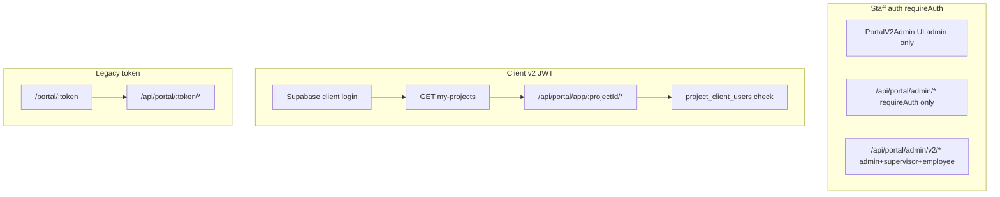

# Workflow 18 — Client Portal / Client Actions / Communications

**Status:** Mapped (2026-06-22) — documentation only  
**Related:** [13_SITE_OPERATIONS_DIARY_MEDIA.md](./13_SITE_OPERATIONS_DIARY_MEDIA.md), [09_TENDER_WIN_OPERATIONS_HANDOFF.md](./09_TENDER_WIN_OPERATIONS_HANDOFF.md), [QA_001_SECURITY_ROUTE_BASELINE_PLAN.md](../QA_001_SECURITY_ROUTE_BASELINE_PLAN.md), [docs/portal_audit/PORTAL_ECOSYSTEM_COHESION_AUDIT.md](../../portal_audit/PORTAL_ECOSYSTEM_COHESION_AUDIT.md)

**Starts after:** W09 — active `projects` row (usually post win-finalize)  
**Hands off from:** W13 (diary/photos), Finance Command Centre (variations/claims), W12 (schedule → milestones)

---

## 1. Business purpose

Give clients a **controlled, project-scoped view** of their build: actions (variations, claims, selections), journey/progress, documents, messages, and notifications — without exposing internal cost, margin, or staff-only data.

Two access models coexist:

| Model | User experience | Auth |
|-------|-----------------|------|
| **Portal v2 (primary)** | Logged-in client at `/client-portal/*` | Supabase JWT + `project_client_users` membership |
| **Legacy token (read-only share)** | Anonymous link `/portal/:token/*` | `projects.portal_token` in URL |

**Verified from code:** `requirePortalAuth.mjs`, `clientPortalApi.js` header comments.

---

## 2. Start triggers

| Trigger | Who | Result |
|---------|-----|--------|
| Tender win / project created | Ops | `projects` row exists; portal **not** auto-enabled — **Verified from code** (W09-DRIFT-007) |
| Admin enables portal + generates token | Admin | `portal_token`, `portal_enabled` — `portalRoutes.mjs` generate-token |
| Client invite accepted | Admin → client | `project_client_users` row, `portal_v2_enabled` — `authRoutes.mjs` accept-invite |
| Repeat client linked to second project | Admin invite with existing email | Upsert `project_client_users` — **Verified from code** (authRoutes ~116–126) |
| Finance issues variation/claim | Finance CC | `portalIntegration.mjs` sync hooks → `client_actions`, `portal_decisions`, `portal_claims` |
| Admin publishes update/photo/selection | Portal admin UI | `portalV2AdminRoutes.mjs`, legacy `portalRoutes.mjs` admin |
| Nightly portal sync | Cron `POST /api/cron/portal-sync` | `portalSync.mjs` — schedule milestones, selections overdue |

---

## 3. End states

| End state | Store / surface |
|-----------|-----------------|
| Client completes contractual action | `portal_decisions` / `portal_claims` + `client_actions.status` |
| Client signs document | `portal_documents` signed state — v2 route |
| Client notifies payment | `client_payment_notified_at` on claim |
| Selection approved | `portal_selections` + procurement unblock (W10 handoff) |
| Portal disabled | `portal_enabled=false` → 403 on v2 JWT routes |
| Practical completion / past client | **Unconfirmed / needs testing** — audit notes unbuilt |

---

## 4. Primary users

| User | Surfaces |
|------|----------|
| **Client (primary/secondary)** | `/client-portal/*` — approve variations, pay claims, selections, messages |
| **Client (architect/accountant invitee)** | v2 read + limited write — blocked from contractual writes by `requirePortalWrite` |
| **Admin** | `/portal-admin/*`, `/portal-admin/:id/v2` — content + finance exposure |
| **Supervisor / employee** | v2 admin API (`/api/portal/admin/v2/*`) — **role gap on legacy admin** |
| **Anonymous visitor** | Legacy `/portal/:token/*` — read-mostly; some POST endpoints on token routes |

---

## 5. Current UI surfaces

| Screen | Route | File | Auth |
|--------|-------|------|------|
| Client portal shell | `/client-portal/*` | `ClientPortalLayout.jsx` | `role === "client"` |
| Home | `/client-portal` | `ClientHome.jsx` | JWT |
| Actions | `/client-portal/actions` | `ClientActions.jsx` | JWT |
| Journey | `/client-portal/journey` | `ClientJourney.jsx` | JWT |
| Selections | `/client-portal/selections` | `ClientSelections.jsx` | JWT |
| Documents | `/client-portal/documents` | `ClientDocuments.jsx` | JWT |
| Messages | `/client-portal/messages` | `ClientMessages.jsx` | JWT |
| My Home (post-handover) | `/client-portal/my-home` | `ClientMyHome.jsx` | JWT |
| Notification bell | (layout) | `NotificationBell.jsx` | JWT |
| Legacy portal app | `/portal/:token/*` | `portal/PortalApp.jsx` | Token URL |
| My projects picker | `/my-portal` | `MyPortal.jsx` | Client role |
| Portal admin v1 | `/portal-admin/:projectId` | `PortalAdmin.jsx` | Admin only (UI) |
| Portal admin v2 | `/portal-admin/:projectId/v2` | `PortalV2Admin.jsx` | Admin only (UI) |

**Verified from code:** `src/App.jsx` route table.

---

## 6. Backend routes / APIs

### Registration order (critical)

**Verified from code:** `dev-api.mjs` registers `portalV2Routes` **before** `portalRoutes` so `/api/portal/my-projects` and `/api/portal/app/*` win over legacy `/:token` catch-all.

### Client v2 (JWT + project scope)

| Prefix | Middleware | File |
|--------|------------|------|
| `GET /api/portal/my-projects` | Inline JWT + `project_client_users` | `portalV2Routes.mjs` |
| `GET /api/portal/app/:projectId/media/:photoId` | JWT + membership + photo project match | same |
| `/api/portal/app/:projectId/*` | `requirePortalAuth` on namespace | same |

Key client routes: `session`, `home`, `actions`, `variations/:id` (respond), `claims`, `selections`, `documents`, `journey`, `messages`, `notifications`, `meetings/*`.

Contractual writes use `requirePortalWrite` (JWT + primary/secondary only) — **Verified from code.**

### Legacy token (anonymous)

| Prefix | Middleware | File |
|--------|------------|------|
| `GET/POST /api/portal/:token/*` | Token lookup on `projects.portal_token` | `portalRoutes.mjs` |

Includes read endpoints (home, timeline, budget, documents) and **some POST** (conversations, decisions respond, warranty, sitewalk) — **security review candidate**.

### Staff admin

| Prefix | Middleware | File |
|--------|------------|------|
| `/api/portal/admin/*` | `requireAuth` only (legacy) | `portalRoutes.mjs` |
| `/api/portal/admin/v2/*` | `requireAuth` + `requireRole(admin,supervisor,employee)` | `portalV2AdminRoutes.mjs` |

### Cross-cutting

| Route | Purpose | File |
|-------|---------|------|
| `POST /api/cron/portal-sync` | Nightly reconcile | `dev-api.mjs` → `portalSync.mjs` |
| Finance write hooks | Variation/claim → portal shadow tables | `portalIntegration.mjs` |
| Client invite | `/api/auth/invite`, `/api/auth/accept-invite` | `authRoutes.mjs` |

---

## 7. Database tables / migrations

| Table | Role | Key migrations |
|-------|------|----------------|
| `projects` | Portal flags, token, client identity | 027+, 103 |
| `project_client_users` | JWT access boundary | 103 |
| `portal_decisions` | Variations client view | 027, **108** (withdrawn status) |
| `portal_claims` | Progress claims | 027, **108** (partial/void), **110** (disputed) |
| `client_actions` | My Actions queue | 103 |
| `portal_documents` | Client-visible docs | 027 |
| `portal_selections` | Selections | 027 |
| `portal_updates` | Journey updates | 027 |
| `portal_milestones` | Journey milestones | 027 |
| `project_photos` | Journey photos | 027, **110** (`client_visible`) |
| `portal_notifications` | In-app notifications | 103, **110** (new types) |
| `portal_messages` | Client ↔ builder messages | 027 |

**Migration risk:** 108 and 110 marked **Manual-apply** — pre-apply CHECK constraints cause silent sync failures — **Verified from audit + migration headers**.

---

## 8. Auth model



- **Staff JWT** must not be `role === "client"` on `requireAuth` routes — blocks client from CRM/finance — **Verified** (`requireAuth.mjs`).
- **Portal client JWT** never uses `requireAuth`; uses `requirePortalAuth` with per-project membership — **Verified**.
- **Service role** used for all portal DB reads/writes; **RLS is not the client boundary** — middleware is — **Verified from `requirePortalAuth.mjs` comment**.

---

## 9. Portal token model

| Mechanism | Field | Generation | Scope |
|-----------|-------|------------|-------|
| Legacy share token | `projects.portal_token` | `POST /api/portal/admin/generate-token` — 24-byte base64url | Read-mostly anonymous access to one project |
| v2 client access | Supabase `user_id` + `project_client_users` | Client invite / accept-invite | Full v2 app for linked projects |
| Media img token | `?t=` query on photo URL | Client JWT passed to `` | Single photo, project-scoped |

**Token generation auth today:**

- Unauthenticated → **401** — **Verified** (QA-001 baseline).
- Employee/supervisor JWT → **403** — **Verified** (W18-P0-04, 2026-06-22).
- Admin JWT → **200** (or 404/500 if project missing) — **Verified**.
- UI `PortalAdmin` / `PortalV2Admin` → **admin RoleRoute only** — **Verified from App.jsx**.

---

## 10. Client-visible data boundaries

**Strong allowlists (verified from audit):**

- Variation/decision payloads exclude `cost_delta`, `cost_to_builder`, internal notes — `portalV2Routes.mjs` field lists.
- Selections API strips supplier cost / internal notes — E2E `client-isolation.spec.js`.
- Financial snapshot returns inc-GST client-facing amounts only.

**Boundaries at risk:**

- Legacy token routes may expose budget/timeline without login — **by design** but URL secrecy is the only gate.
- `project_photos.client_visible` defaults **false** (migration 110) but pre-110 / without migration all milestone-matched photos may show — **Verified from migration 110 header**.
- Internal site diary / worker photos **not** wired to portal automatically — W13 handoff gap.

---

## 11. Project / job linkage

| Link | Path |
|------|------|
| Portal spine | `projects.id` |
| Job spine | `projects.job_id` → `jobs` |
| Finance variations/claims | `job_id` on finance tables → portal sync by `project_id` |
| Schedule milestones | Nightly sync from `schedule_tasks` → `portal_milestones` |

Client never receives raw `job_id` in v2 home session beyond opaque project context — **Unconfirmed / needs testing** for all sub-routes.

---

## 12. Documents / photos / selections / variations visibility

| Asset | Client source table | Auto-populated? |
|-------|---------------------|-----------------|
| Variations | `portal_decisions` + `client_actions` | **Yes** — finance sync hooks |
| Progress claims | `portal_claims` + `client_actions` | **Yes** — finance sync |
| Documents PDFs | `portal_documents` | **Mostly manual** — admin *expose-document*; finance PDF → `job_documents` not auto-exposed — **Verified from portal audit Lane 3** |
| Selections | `portal_selections` | Admin + sync |
| Journey photos | `project_photos` | Admin upload; `client_visible` flag (110) |
| Site diary photos | `site-media` / worker photos | **Not wired** to Journey — W13→W18 gap |

Variation respond guard checks `portal_decisions.status === 'pending'`; void safety depends on migration **108** applying `withdrawn` status — **Verified from audit**.

---

## 13. Notifications / email flows

| Channel | Source | Notes |
|---------|--------|-------|
| In-app | `portal_notifications` | v2 `GET/PATCH .../notifications` |
| Email | `portalNotify.mjs` | Triggered from finance/portal hooks — **partial** |
| Client invite | `authRoutes.mjs` | Gmail/SMTP invite link |

**Gaps (verified from audit):** `claim_paid` and `variation_approved` notification types need migration **110**; some admin notify paths skip v2 gate.

---

## 14. Admin portal actions

| Action | v1 API | v2 API | UI |
|--------|--------|--------|-----|
| Generate token | `POST .../generate-token` | — | PortalAdmin |
| Enable test portal | `POST .../enable-test/:id` | — | Dev/test |
| Publish update | `POST .../updates` | `POST/PATCH v2/updates` | PortalV2Admin |
| Upload/publish photo | `POST .../photos` | `POST/PATCH v2/photos` | PortalV2Admin |
| Expose document | — | `POST v2/expose-document` | PortalV2Admin |
| Manage selections/meetings | legacy decisions | v2 selections/meetings | PortalV2Admin |
| Client user active toggle | — | `PATCH v2/client-users/:id/active` | PortalV2Admin |

**UI gate:** v2 admin pages are **admin-only** in React Router. **API gate:** v2 admin routes allow **employee** — mismatch with UI — **Inferred**.

---

## 15. Client portal actions

| Action | Route | Guard |
|--------|-------|-------|
| View home / financial snapshot | `GET .../home` | `requirePortalAuth` |
| Approve/decline variation | `POST .../variations/:id/respond` | `requirePortalWrite` |
| Notify claim payment | `POST .../claims/:id/notify-payment` | `requirePortalWrite` |
| Approve selection | `POST .../selections/:id/respond` | `requirePortalWrite` |
| Sign document | `POST .../documents/:id/sign` | `requirePortalWrite` |
| Send message | `POST .../messages` | `requirePortalLogin` |
| Mark notification read | `PATCH .../notifications/:id/read` | `requirePortalLogin` |

Legacy token callers can POST on some routes without login — **W18-SEC risk** (see §17).

---

## 16. Known gaps and drift risks

| ID | Risk | Evidence |
|----|------|----------|
| W18-DRIFT-001 | Documents tab hollow — no auto PDF exposure | Portal audit Lane 3 |
| W18-DRIFT-002 | Migrations 108/110 manual-apply — void/dispute/photo visibility unsafe | Migration headers + audit |
| W18-DRIFT-003 | Diary → portal_updates draft orphaned | Portal audit Lane 9 |
| W18-DRIFT-004 | Legacy + v2 admin API role mismatch (employee API vs admin UI) | portalV2AdminRoutes vs App.jsx |
| W18-DRIFT-005 | Portal not auto-enabled on win | W09-DRIFT-007 |
| W18-DRIFT-006 | Partial claim re-notify blocked after first notify | audit Lane 2 |
| W18-DRIFT-007 | Legacy token POST endpoints without JWT | **partially closed** — D 403; B/C 404 on v2; non-v2 P1 |

---

## 17. Security concerns

| Concern | Status | Test ID |
|---------|--------|---------|
| Unauthenticated portal admin | **401** on generate-token | W18-SEC-01 — **pass** |
| Employee/supervisor mints portal token | **403** — W18-P0-04 closed | W18-SEC-02 — **pass** |
| Cross-project JWT access | **403** — E2E exists | W18-SEC-03 |
| Invalid/expired JWT | **401** (malformed pass; expired gap) | W18-SEC-04 — **partial-pass** |
| Client blocked from staff APIs | **401/403** — E2E exists | W18-SEC-03 |
| Legacy token URL leakage | Read + B/C POST on non-v2 only | **Verified** — v2 gate 404; D-class 403 |
| Architect/accountant contractual write | Blocked by `requirePortalWrite` | **Verified from code** |
| Internal cost leak | E2E leakScan pass | W18-API-03 |

**QA-001 Tier-0 closed** — mail/dropbox/cron guarded. **QA-001-GAP-10 / W18-P0-04 closed** 2026-06-22.

---

## 18. Test plan

| ID | Description | Type | File / status |
|----|-------------|------|-------------|
| W18-SEC-01 | Unauthenticated portal admin routes → 401 | security | `e2e/tests/security/unauthenticated-routes.spec.js` QA-SEC-05 — **pass** |
| W18-SEC-02 | Employee cannot mint portal token (admin-only policy) | security | `unauthenticated-routes.spec.js` — **pass** |
| W18-SEC-03 | Portal JWT only accesses own project | security | `e2e/tests/security/client-isolation.spec.js` — **pass** |
| W18-SEC-04 | Invalid/expired JWT rejected | api | `scripts/batch-a/w18-portal-sec04-legacy-jwt.mjs` — **accepted partial-pass** |
| W18-API-01 | Admin generate-token + invite → client linked | api | `scripts/batch-a/w18-portal-api01-invite.mjs` — **pass** (30/30) |
| W18-API-02 | Portal home/actions load scoped data | api | partial — API-01 post-invite + E2E navigation |
| W18-API-03 | Documents/selections field allowlist | api | **pass** — client-isolation |
| W18-API-04 | Notification created on finance event | integration | **pass** — `test:w18-portal-finance-notify:write` 34/34 |
| W18-UI-01 | PortalV2Admin overview | e2e | `e2e/tests/portal/portal-v2-admin-overview.spec.js` — **closed / pass** (11/11) |
| W18-UAT-01 | Client portal manual UAT smoke (pilot) | manual | [W18_CLIENT_PORTAL_UAT_SMOKE_CHECKLIST.md](../W18_CLIENT_PORTAL_UAT_SMOKE_CHECKLIST.md) | **planned** |
| W18-UI-02 | Client shell loads project | e2e | `e2e/tests/client-portal/navigation.spec.js` — **pass** |

**Existing E2E:** `navigation.spec.js`, `client-isolation.spec.js`, `visual/client-portal-mobile.spec.js`.

---

## 19. P0 / P1 recommended hardening items

### P0 (before client-facing release)

| # | Item | Smallest-safe fix | Blocked by |
|---|------|-------------------|------------|
| P0-W18-01 | Apply migrations **108 + 110** to live DB | **verified applied 2026-06-22** — skip apply; CHECK probes pass | — |
| P0-W18-02 | Confirm void variation cannot be approved post-void | **verified** — `test:w18-portal-void-guard:write` 14/14 | — |
| P0-W18-03 | `client_visible` enforced on Journey/home/media photos | **verified** — `test:w18-portal-photo-visibility:write` 15/15; DRIFT-008/009 fixed | — |
| P0-W18-04 | Legacy admin `requireRole("admin")` on generate-token | **shipped** 2026-06-22 | — |

### P1 (cohesion / ops)

| # | Item |
|---|------|
| P1-W18-01 | Auto-expose finance PDFs to `portal_documents` (or document manual SOP) |
| P1-W18-02 | Wire site diary draft → publish path (W13 handoff) |
| P1-W18-03 | Align v2 admin API roles with UI (employee vs admin) |
| P1-W18-04 | Audit legacy token POST endpoints — require login or deprecate |
| P1-W18-05 | Portal enable checklist on win-finalize (W09 ops readiness extension) |

---

## 20. Exact next prompt

```
Run [W18_CLIENT_PORTAL_UAT_SMOKE_CHECKLIST.md](../W18_CLIENT_PORTAL_UAT_SMOKE_CHECKLIST.md) on one pilot project.
```

---

## 21. Release readiness (2026-06-22)

**Review:** [W18_CLIENT_PORTAL_RELEASE_READINESS_REVIEW.md](../W18_CLIENT_PORTAL_RELEASE_READINESS_REVIEW.md)

| Gate | Verdict |
|------|---------|
| Internal UAT | **GO** |
| Client UAT | **CONDITIONAL GO** |
| Production | **NO-GO** (non-v2 legacy POST SOP + API-01/UI-01) |

---

## Source-of-truth check

| Fact | Owner |
|------|-------|
| Contractual variation/claim state (canonical) | Finance CC tables (`job_variations`, finance claims) |
| Client-facing shadow | `portal_decisions`, `portal_claims`, `client_actions` via `portalIntegration.mjs` |
| Client membership | `project_client_users` |
| Portal content (updates, photos, selections) | `portal_*` tables + admin APIs |
| Legacy share link | `projects.portal_token` |

---

## Document history

| Date | Change |
|------|--------|
| 2026-06-22 | W18 UAT smoke checklist — supervised pilot execution next |
| 2026-06-22 | W18-SEC-04 accepted partial-pass; DRIFT-007 D-class closed |
| 2026-06-22 | W18-API-04 pass — finance notify regression 34/34 |
| 2026-06-22 | W18-DRIFT-008/009 fixed — home recentPhotos + media route client_visible |
| 2026-06-22 | W18-P0-03 pass — Journey client_visible filter; home/media gaps W18-DRIFT-008/009 |
| 2026-06-22 | W18-P0-02 pass — void approval guard; W18-P0-01 closed |
| 2026-06-22 | W18-P0-01 verified applied — migrations 108/110 CHECK probe |
| 2026-06-22 | W18 mapped — Batch D; QA-001 Tier-0 closed |
